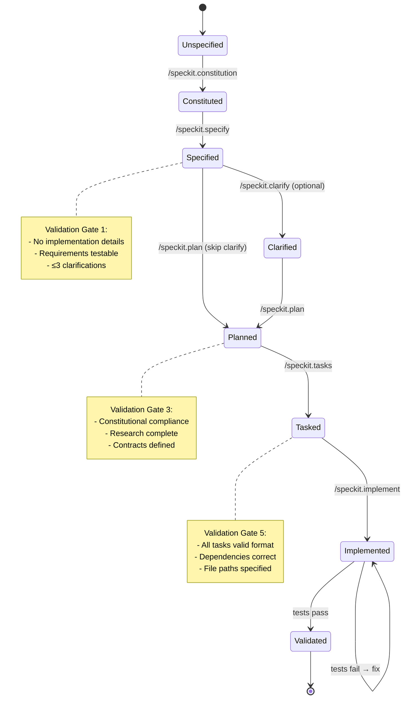
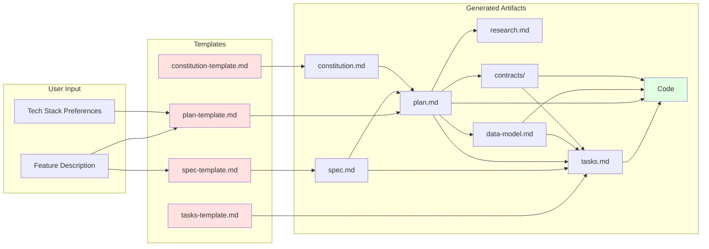
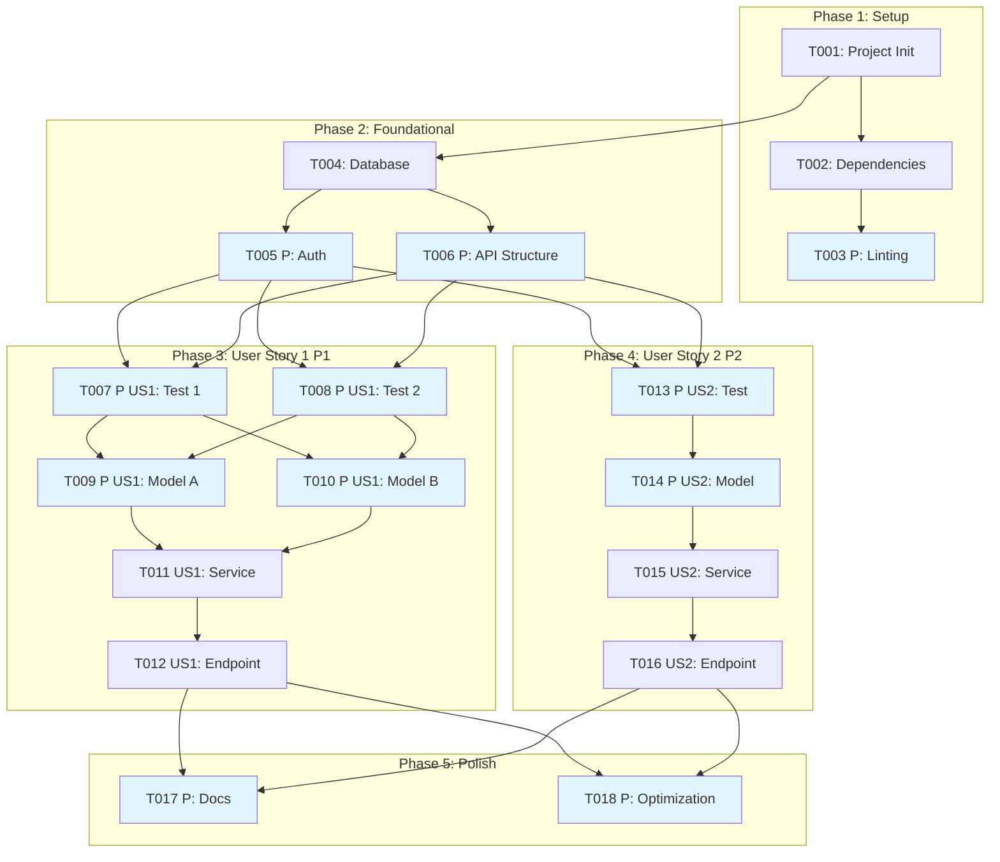
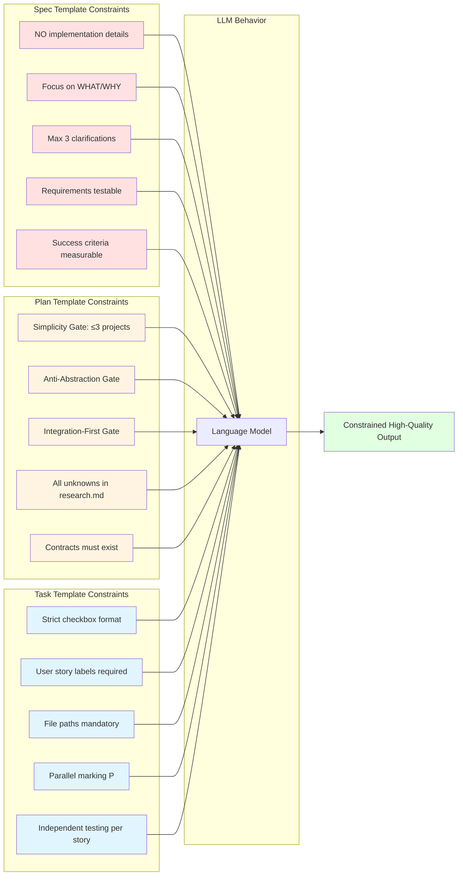
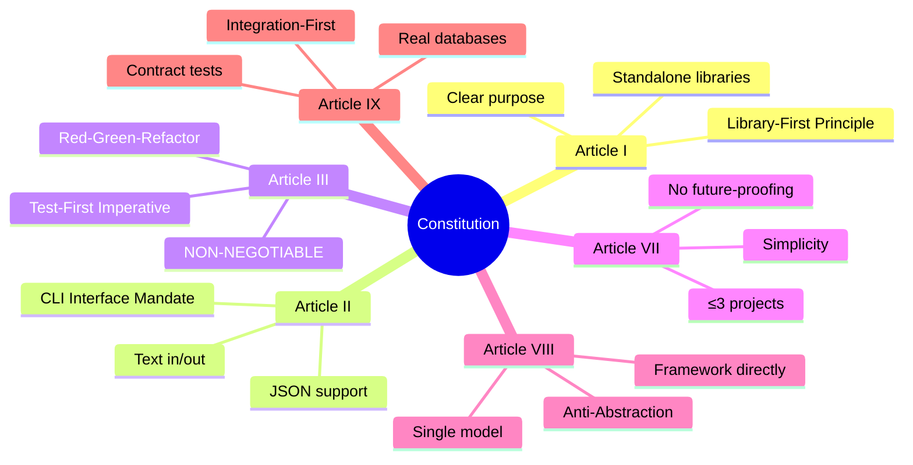
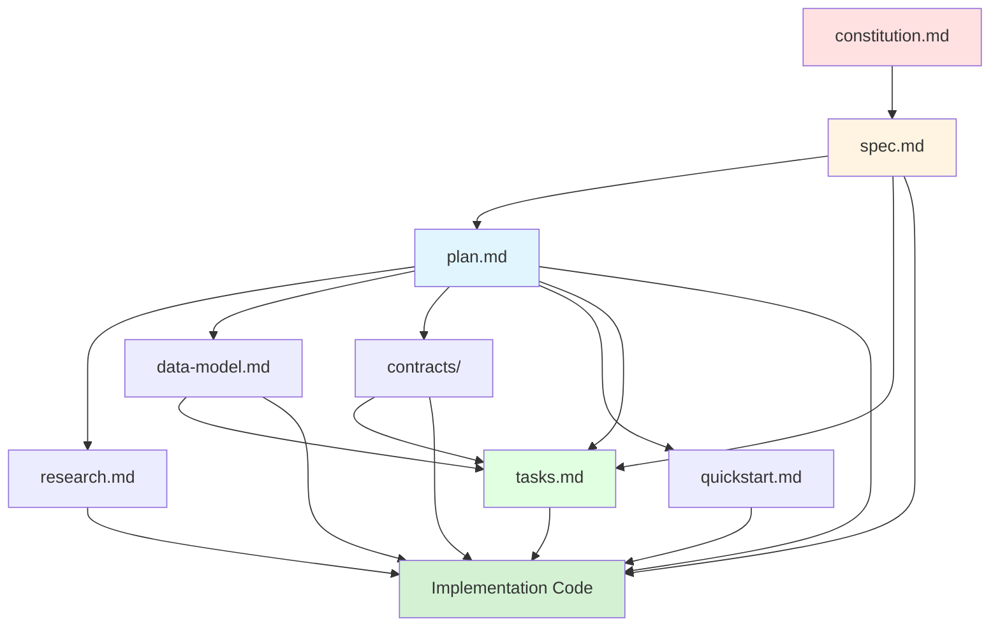

# Spec-Kit Visual Guide

**Project**: GitHub spec-kit Visual Reference
**Created**: 2026-01-11

## Quick Reference Diagrams

### 1. Complete Workflow Diagram

```mermaid
graph TD
    A[User Description] --> B[/speckit.constitution]
    B --> C[constitution.md]
    C --> D[/speckit.specify]
    A --> D
    D --> E[spec.md]
    E --> F{Needs Clarification?}
    F -->|Yes| G[/speckit.clarify]
    G --> E
    F -->|No| H[/speckit.plan]
    E --> H
    C --> H
    H --> I[plan.md]
    H --> J[research.md]
    H --> K[data-model.md]
    H --> L[contracts/]
    H --> M[quickstart.md]
    I --> N[/speckit.tasks]
    E --> N
    K --> N
    L --> N
    N --> O[tasks.md]
    O --> P[/speckit.implement]
    I --> P
    E --> P
    K --> P
    L --> P
    J --> P
    M --> P
    P --> Q[Code]
    Q --> R{Tests Pass?}
    R -->|No| S[Fix Issues]
    S --> Q
    R -->|Yes| T[Feature Complete]

    style B fill:#e1f5ff
    style D fill:#e1f5ff
    style G fill:#fff4e1
    style H fill:#e1f5ff
    style N fill:#e1f5ff
    style P fill:#e1f5ff
    style T fill:#e1ffe1
```

### 2. State Machine Diagram



### 3. Information Flow Graph



### 4. Validation Gates Flowchart

```mermaid
flowchart TD
    Start[Start Workflow] --> Gate1{Gate 1:<br/>Spec Quality}
    Gate1 -->|Pass| Gate2{Gate 2:<br/>Clarifications<br/>Resolved?}
    Gate1 -->|Fail| Fix1[Update Spec]
    Fix1 --> Gate1
    Gate2 -->|Yes| Gate3{Gate 3:<br/>Constitutional<br/>Compliance}
    Gate2 -->|No| Clarify[/speckit.clarify]
    Clarify --> Gate2
    Gate3 -->|Pass| Gate4{Gate 4:<br/>Research<br/>Complete}
    Gate3 -->|Fail| Justify[Justify Violations<br/>in Complexity Tracking]
    Justify --> Gate4
    Gate4 -->|Pass| Gate5{Gate 5:<br/>Tasks Valid<br/>Format}
    Gate4 -->|Fail| Research[Continue Research]
    Research --> Gate4
    Gate5 -->|Pass| Gate6{Gate 6:<br/>Checklists<br/>Complete}
    Gate5 -->|Fail| FixTasks[Regenerate tasks.md]
    FixTasks --> Gate5
    Gate6 -->|Pass| Gate7{Gate 7:<br/>Tests Pass}
    Gate6 -->|User Confirms| Gate7
    Gate7 -->|Pass| Complete[Feature Complete]
    Gate7 -->|Fail| FixCode[Fix Issues]
    FixCode --> Gate7

    style Gate1 fill:#fff4e1
    style Gate2 fill:#fff4e1
    style Gate3 fill:#fff4e1
    style Gate4 fill:#fff4e1
    style Gate5 fill:#fff4e1
    style Gate6 fill:#fff4e1
    style Gate7 fill:#fff4e1
    style Complete fill:#e1ffe1
```

### 5. Task Execution Graph



### 6. Template Constraint System



### 7. Constitutional Articles Structure



### 8. Parallel Execution Opportunities

```mermaid
gantt
    title Task Execution Timeline (with parallelization)
    dateFormat X
    axisFormat %s

    section Setup
    T001 Project Init       :0, 5
    T002 Dependencies       :5, 10
    T003 Linting [P]        :5, 8

    section Foundation
    T004 Database           :10, 20
    T005 Auth [P]           :20, 30
    T006 API Structure [P]  :20, 30

    section US1 Tests
    T007 Test 1 [P]         :30, 35
    T008 Test 2 [P]         :30, 35

    section US1 Models
    T009 Model A [P]        :35, 45
    T010 Model B [P]        :35, 45

    section US1 Services
    T011 Service            :45, 60
    T012 Endpoint           :60, 70

    section US2
    T013 Test [P]           :30, 35
    T014 Model [P]          :35, 45
    T015 Service            :45, 60
    T016 Endpoint           :60, 70

    section Polish
    T017 Docs [P]           :70, 75
    T018 Optimization [P]   :70, 75
```



## Quick Command Reference

### Command Flow

```
1. /speckit.constitution → Establish principles
   ↓
2. /speckit.specify → Create specification
   ↓
3. /speckit.clarify → Resolve ambiguities (optional)
   ↓
4. /speckit.plan → Generate technical plan
   ↓
5. /speckit.tasks → Break down into tasks
   ↓
6. /speckit.implement → Execute implementation
```

### Command I/O Summary

| Command | Input | Output | Script Called |
|---------|-------|--------|---------------|
| /speckit.constitution | User principles | constitution.md | None |
| /speckit.specify | Feature description | spec.md, checklists/requirements.md | create-new-feature.sh |
| /speckit.clarify | spec.md with [NEEDS CLARIFICATION] | Updated spec.md | None |
| /speckit.plan | spec.md + Tech stack | plan.md, research.md, data-model.md, contracts/, quickstart.md | setup-plan.sh, update-agent-context.sh |
| /speckit.tasks | plan.md + spec.md | tasks.md | check-prerequisites.sh |
| /speckit.implement | tasks.md + all design docs | Code | check-prerequisites.sh (with flags) |

## Artifact Dependency Graph



## Template Structure Overview

### Spec Template
```
┌─────────────────────────────────────┐
│ Feature Specification               │
├─────────────────────────────────────┤
│ • User Scenarios (with priorities)  │
│ • Acceptance Scenarios (Given/When) │
│ • Requirements (FR-001, FR-002)     │
│ • Key Entities (data involved)      │
│ • Success Criteria (measurable)     │
│ • Edge Cases                        │
│ • Assumptions                       │
│                                     │
│ Constraints:                        │
│ ✗ NO tech stack                     │
│ ✗ NO implementation details         │
│ ✓ Focus on WHAT and WHY             │
│ ✓ Max 3 [NEEDS CLARIFICATION]       │
└─────────────────────────────────────┘
```

### Plan Template
```
┌─────────────────────────────────────┐
│ Implementation Plan                 │
├─────────────────────────────────────┤
│ • Technical Context                 │
│ • Constitution Check                │
│ • Project Structure                 │
│ • Complexity Tracking               │
│                                     │
│ Phase 0: Research                   │
│ • Resolve all unknowns              │
│                                     │
│ Phase 1: Design                     │
│ • data-model.md                     │
│ • contracts/                        │
│ • quickstart.md                     │
│                                     │
│ Validation Gates:                   │
│ ✓ Simplicity (≤3 projects)          │
│ ✓ Anti-Abstraction (framework)      │
│ ✓ Integration-First (contracts)     │
└─────────────────────────────────────┘
```

### Tasks Template
```
┌─────────────────────────────────────┐
│ Task Breakdown                      │
├─────────────────────────────────────┤
│ Phase 1: Setup                      │
│ - [ ] T001 ...                      │
│ - [ ] T002 [P] ...                  │
│                                     │
│ Phase 2: Foundational (BLOCKS ALL)  │
│ - [ ] T003 ...                      │
│                                     │
│ Phase 3: User Story 1 (P1) MVP      │
│ - [ ] T004 [P] [US1] Test ...       │
│ - [ ] T005 [P] [US1] Model ...      │
│ - [ ] T006 [US1] Service ...        │
│                                     │
│ Phase 4: User Story 2 (P2)          │
│ - [ ] T007 [P] [US2] ...            │
│                                     │
│ Final Phase: Polish                 │
│ - [ ] T008 [P] Docs ...             │
│                                     │
│ Format: - [ ] [ID] [P?] [Story?]    │
│         Description with file path  │
└─────────────────────────────────────┘
```

## File Organization

```
project-root/
├── .specify/
│   ├── memory/
│   │   └── constitution.md
│   ├── scripts/
│   │   ├── bash/
│   │   │   ├── common.sh
│   │   │   ├── create-new-feature.sh
│   │   │   ├── setup-plan.sh
│   │   │   ├── check-prerequisites.sh
│   │   │   └── update-agent-context.sh
│   │   └── powershell/
│   │       └── (equivalent .ps1 files)
│   └── templates/
│       ├── spec-template.md
│       ├── plan-template.md
│       ├── tasks-template.md
│       └── commands/
│           ├── specify.md
│           ├── plan.md
│           ├── tasks.md
│           ├── implement.md
│           └── ...
├── specs/
│   ├── 001-feature-name/
│   │   ├── spec.md
│   │   ├── plan.md
│   │   ├── research.md
│   │   ├── data-model.md
│   │   ├── quickstart.md
│   │   ├── tasks.md
│   │   ├── contracts/
│   │   │   └── api-spec.json
│   │   └── checklists/
│   │       └── requirements.md
│   └── 002-another-feature/
│       └── ...
├── src/
│   └── (implementation code)
└── tests/
    └── (test code)
```

## Success Criteria Checklist

### For Specifications
- [ ] No implementation details (languages, frameworks, APIs)
- [ ] Focused on user value and business needs
- [ ] Requirements are testable and unambiguous
- [ ] Success criteria are measurable
- [ ] All acceptance scenarios defined
- [ ] Edge cases identified
- [ ] Maximum 3 [NEEDS CLARIFICATION] markers

### For Plans
- [ ] Technical context complete
- [ ] Constitution gates passed or justified
- [ ] All unknowns resolved in research.md
- [ ] Data model covers all entities
- [ ] Contracts generated for all requirements
- [ ] Quickstart scenarios defined

### For Tasks
- [ ] All tasks follow format: - [ ] [ID] [P?] [Story?] Description with file path
- [ ] Each user story has complete task set
- [ ] Dependencies are correct
- [ ] File paths are absolute and specified
- [ ] Parallel opportunities marked with [P]

### For Implementation
- [ ] All tasks marked complete [X]
- [ ] Tests pass (if TDD approach)
- [ ] Features match spec.md requirements
- [ ] Quickstart scenarios validated

## Formula Quick Reference

### Quality Score
```
specQuality = 0.3*clarity + 0.3*completeness + 0.2*testability + 0.2*measurability
where clarity = 1 - (clarifications/3)
```

### Parallelization
```
speedup = sequential_time / parallel_time
parallel_time = Σ max(time(group)) for each parallel group
```

### Critical Path
```
CP = max{Σ time(task) for task in path}
```

### Constitutional Compliance
```
compliant = ∀ gate : passes(gate) ∨ justified(violation(gate))
```

## Color Legend

In the diagrams above:
- **Red** (#ffe1e1): Templates (immutable structure)
- **Orange** (#fff4e1): Validation gates
- **Blue** (#e1f5ff): Commands and activities
- **Light Green** (#e1ffe1): Generated artifacts
- **Green** (#e1ffe1): Final outputs and success states

## Best Practices Summary

1. **Always start with constitution** - Establish principles first
2. **Keep specs technology-agnostic** - Focus on WHAT, not HOW
3. **Limit clarifications to 3** - Make informed guesses for the rest
4. **Validate at each gate** - Don't proceed with failures
5. **Organize by user story** - Enable incremental delivery
6. **Mark parallel tasks** - Optimize execution time
7. **Test-first always** - Non-negotiable for quality
8. **Justify complexity** - Track violations in Complexity Tracking table
9. **Update agent context** - Keep AI tools informed of tech choices
10. **Validate quickstart** - Manual testing scenarios are crucial

## Common Pitfalls to Avoid

1. ❌ Including tech stack in specifications
2. ❌ Skipping constitutional compliance checks
3. ❌ More than 3 [NEEDS CLARIFICATION] markers
4. ❌ Organizing tasks by technical layer instead of user story
5. ❌ Forgetting to mark parallel tasks with [P]
6. ❌ Omitting file paths in task descriptions
7. ❌ Writing implementation before tests
8. ❌ Violating constitution without justification
9. ❌ Proceeding with incomplete checklists
10. ❌ Skipping validation gates

---

**Visual Guide Complete**

This visual guide complements the detailed analysis documents and provides quick-reference diagrams for understanding spec-kit's workflow, structure, and patterns.
