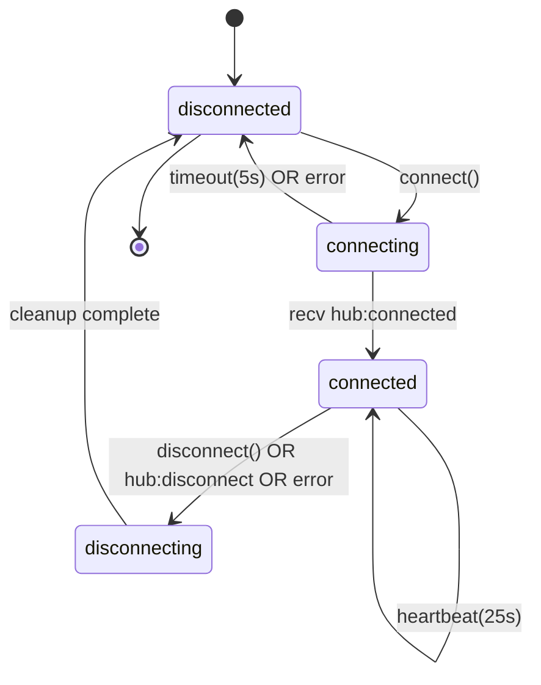
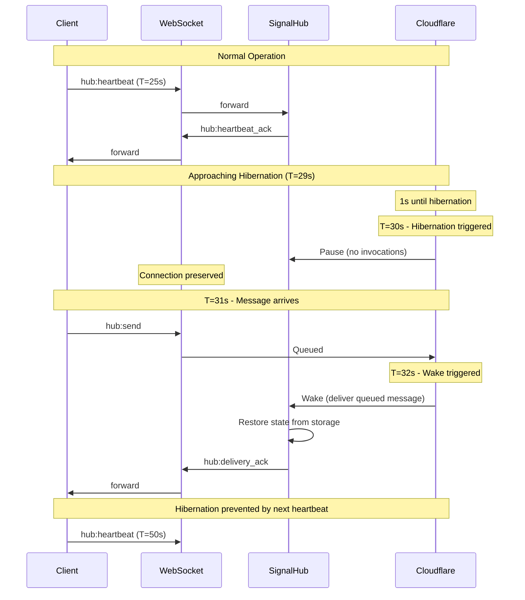
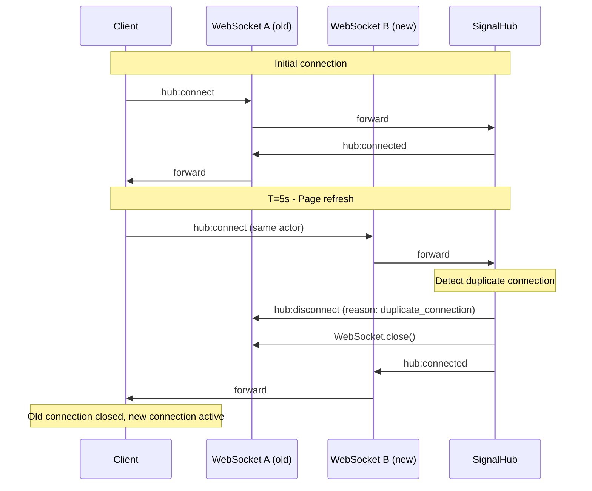

# Signal Hub Connection Lifecycle

**Status:** Design Phase
**Last Updated:** 2026-02-16
**Protocol Version:** 0.1.0
**Phase:** 4 of 8

---

## Overview

This document defines the complete connection lifecycle for Signal Hub, including state machine semantics, transition rules, Cloudflare Durable Object hibernation handling, timeout specifications, and edge case behavior.

**Key Design Constraints:**
- Uses existing `ConnectionState` enum from domain schema (no new states)
- Handles Cloudflare hibernation (30s idle → WebSocket pause)
- Manages duplicate connections (same actor connects twice)
- Specifies timeouts for all operations
- Addresses edge cases (hibernation during send, concurrent connects, etc.)

---

## 1. State Machine

Signal Hub connections use the `ConnectionState` enum from `/packages/protocols/schema/domain.schema.json`:

```typescript
type ConnectionState = 'disconnected' | 'connecting' | 'connected' | 'disconnecting';
```

### 1.1 State Definitions

| State | Description | Client Behavior | Server Behavior |
|-------|-------------|-----------------|-----------------|
| **disconnected** | No connection exists | Cannot send messages | No actor registration active |
| **connecting** | Connection handshake in progress | Wait for `hub:connected` | Validate auth token, negotiate version |
| **connected** | Active session established | Can send/receive messages | Routes messages, maintains registration |
| **disconnecting** | Graceful shutdown in progress | Flush pending messages | Cleanup resources, close WebSocket |

### 1.2 State Properties

**disconnected**
- WebSocket: Closed or null
- Actor registration: None
- Message queue: Empty
- Heartbeat timer: Stopped

**connecting**
- WebSocket: Open, waiting for handshake
- Actor registration: Pending
- Message queue: Buffered (queued locally, not sent)
- Heartbeat timer: Not started
- Timeout: 5s (if no `hub:connected` received → transition to `disconnected`)

**connected**
- WebSocket: Open, authenticated
- Actor registration: Active (actor discoverable)
- Message queue: Active (sending/receiving)
- Heartbeat timer: Running (sends `hub:heartbeat` every 25s)

**disconnecting**
- WebSocket: Closing
- Actor registration: Being removed
- Message queue: Flushing (complete in-flight messages)
- Heartbeat timer: Stopped

---

## 2. State Transitions

### 2.1 Transition Table

| From State | To State | Trigger | Conditions | Actions |
|------------|----------|---------|------------|---------|
| `disconnected` | `connecting` | Client calls `connect()` | None | Open WebSocket, send `hub:connect` |
| `connecting` | `connected` | Server sends `hub:connected` | Auth valid, version compatible | Start heartbeat timer, activate queue |
| `connecting` | `disconnected` | Timeout (5s) OR `hub:error` | No `hub:connected` received | Close WebSocket, notify client |
| `connected` | `disconnecting` | Client calls `disconnect()` OR Server sends `hub:disconnect` | None | Send `hub:disconnect`, flush queue |
| `connected` | `disconnected` | WebSocket error OR heartbeat timeout (10s) | Unexpected disconnect | Notify client, attempt reconnect |
| `disconnecting` | `disconnected` | Cleanup complete | Queue flushed, resources released | Close WebSocket, clear state |
| `disconnected` | `disconnected` | Client calls `disconnect()` | Already disconnected | No-op |
| `connecting` | `connecting` | Retry attempt | Previous connect failed | Close old WebSocket, open new one |

### 2.2 Transition Diagram (ASCII)

```
                      ┌─────────────────────┐
                      │                     │
                      │   disconnected      │
                      │                     │
                      └─────────┬───────────┘
                                │
                                │ connect() → send hub:connect
                                ▼
                      ┌─────────────────────┐
                      │                     │
         timeout(5s)  │    connecting       │
              ┌───────┤                     │
              │       └─────────┬───────────┘
              │                 │
              │                 │ recv hub:connected
              │                 ▼
              │       ┌─────────────────────┐
              │       │                     │◄──────┐
              │       │     connected       │       │ heartbeat (25s)
              │       │                     │───────┘
              │       └─────────┬───────────┘
              │                 │
              │                 │ disconnect() OR hub:disconnect OR error
              │                 ▼
              │       ┌─────────────────────┐
              │       │                     │
              │       │   disconnecting     │
              │       │                     │
              │       └─────────┬───────────┘
              │                 │
              │                 │ cleanup complete
              ▼                 ▼
        ┌─────────────────────┐
        │                     │
        │   disconnected      │
        │                     │
        └─────────────────────┘
```

### 2.3 Invalid Transitions

The following transitions are **NOT ALLOWED**:

❌ `disconnected` → `connected` (must pass through `connecting`)
❌ `connecting` → `disconnecting` (must either succeed to `connected` or fail to `disconnected`)
❌ `disconnecting` → `connected` (must complete disconnect first)
❌ `disconnecting` → `connecting` (must reach `disconnected` first)

**Rationale:** These constraints ensure clean connection lifecycle, prevent race conditions, and make state machine behavior deterministic.

---

## 3. Cloudflare Hibernation Handling

### 3.1 Hibernation Mechanics

**Cloudflare Constraint:** Durable Object WebSockets hibernate after **30 seconds of inactivity** (no messages sent/received).

**Hibernation Behavior:**
- WebSocket is "paused" by Cloudflare runtime (connection preserved)
- Durable Object is NOT invoked for incoming messages (queued by platform)
- On first message after hibernation → Durable Object "wakes", processes queue
- **No disconnect/reconnect needed** (transparent to client)

**Critical Issue:** Messages sent DURING hibernation transition MAY BE LOST.

### 3.2 Heartbeat Strategy

**Requirement:** Prevent hibernation by maintaining message activity.

**Implementation:**

```typescript
// Client-side heartbeat
setInterval(() => {
  if (connectionState === 'connected') {
    send({
      type: 'hub:heartbeat',
      pattern: 'tell',
      payload: { timestamp: Date.now() }
    });
  }
}, 25000);  // 25s interval (< 30s threshold)
```

**Server-side response:**

```typescript
// Server responds immediately to keep WebSocket active
function handleHeartbeat(msg: SharedMessage) {
  send({
    type: 'hub:heartbeat_ack',
    pattern: 'tell',
    correlationId: msg.id,
    payload: {
      timestamp: msg.payload.timestamp,
      serverTime: Date.now()
    }
  });
}
```

**Timing Rationale:**
- 25s interval provides 5s buffer before 30s hibernation
- Accounts for network latency, clock skew, processing delays
- Server responds within 1s → ensures activity within window

### 3.3 Heartbeat Timeout Detection

**Client monitors heartbeat acks:**

```typescript
let lastHeartbeatAck = Date.now();

setInterval(() => {
  const elapsed = Date.now() - lastHeartbeatAck;
  if (elapsed > 10000) {  // 10s timeout
    console.warn('Heartbeat ack timeout - connection may be dead');
    // Transition: connected → disconnected
    handleConnectionLost();
  }
}, 1000);  // Check every 1s
```

**Timeout Behavior:**
- No heartbeat ack for 10s → consider connection dead
- Client transitions to `disconnected` state
- Client attempts reconnect (exponential backoff)

### 3.4 Wake Behavior

**On wake from hibernation:**

1. Durable Object receives first message (from queue)
2. Actor registration is restored from durable storage
3. Connection state is restored (`connectionState === 'connected'`)
4. Queued messages are processed in order
5. Outbound messages resume

**Client sees:**
- Brief delay in message delivery (1-3s typical)
- No error, no reconnect needed
- Messages arrive in order

**Server implementation:**

```typescript
class SignalHubDO {
  async webSocketMessage(ws: WebSocket, message: ArrayBuffer) {
    // Restore state on first message after hibernation
    if (this.isHibernated) {
      await this.restoreFromStorage();
      this.isHibernated = false;
    }

    // Process message normally
    await this.handleMessage(message);
  }
}
```

### 3.5 Hibernation During Message Send (Edge Case)

**Scenario:** Client sends message at T=29.5s (right before hibernation at T=30s).

**Possible Outcomes:**

1. **Message arrives before hibernation** (T<30s) → processed normally ✅
2. **Message arrives during hibernation** (T≈30s) → queued by Cloudflare ✅
3. **WebSocket closes during hibernation transition** → message LOST ❌

**Mitigation:** Use `pattern: 'ask'` for critical messages.

```typescript
// Critical message with acknowledgment
const result = await sendWithAck({
  type: 'hub:send',
  pattern: 'ask',  // Require ack
  payload: { targetAddress, message },
  ttl: 30000  // 30s timeout
});

if (!result.ack) {
  // No ack received → retry
  console.warn('Message delivery failed, retrying...');
  await sendWithAck(/* same message */);
}
```

**Client retry logic:**

```typescript
async function sendWithRetry(message: SharedMessage, maxRetries = 3): Promise<void> {
  for (let i = 0; i < maxRetries; i++) {
    try {
      const ack = await sendWithAck(message);
      if (ack) return;  // Success
    } catch (err) {
      console.warn(`Retry ${i + 1}/${maxRetries} failed:`, err);
      await sleep(1000 * Math.pow(2, i));  // Exponential backoff
    }
  }
  throw new Error('Message delivery failed after retries');
}
```

---

## 4. Duplicate Connection Handling

### 4.1 Scenario

**Problem:** Same actor connects twice (e.g., user refreshes browser page, or network glitch causes reconnect while old connection still active).

**Example:**

```
T=0:  Actor @(browser/widget-123) connects → WebSocket A
T=1:  Actor registers, state = 'connected'
T=5:  User refreshes page
T=5:  Actor @(browser/widget-123) connects → WebSocket B
```

**Question:** What happens to WebSocket A?

### 4.2 Resolution Strategy

**Server policy:** **Last connection wins**

**Implementation:**

```typescript
class SignalHubDO {
  private connections = new Map<string, WebSocket>();  // actorAddress → WebSocket

  async handleConnect(ws: WebSocket, connectMsg: SharedMessage) {
    const actorAddress = connectMsg.metadata.actorIdentity;

    // Check for existing connection
    const existingWs = this.connections.get(actorAddress);
    if (existingWs) {
      // Close old connection with reason
      const disconnectMsg: SharedMessage = {
        type: 'hub:disconnect',
        pattern: 'tell',
        payload: { reason: 'duplicate_connection' },
        from: '@(cloudflare/signal-hub)',
        to: actorAddress,
        timestamp: Date.now()
      };

      existingWs.send(JSON.stringify(disconnectMsg));
      existingWs.close(1000, 'duplicate_connection');

      console.info(`Closed duplicate connection for ${actorAddress}`);
    }

    // Accept new connection
    this.connections.set(actorAddress, ws);
    await this.sendConnectedResponse(ws, connectMsg);
  }
}
```

**Client behavior (on receiving `hub:disconnect` with reason='duplicate_connection'):**

```typescript
function handleDisconnect(msg: SharedMessage) {
  if (msg.payload.reason === 'duplicate_connection') {
    console.warn('Disconnected due to duplicate connection (likely page refresh)');
    // DO NOT reconnect - new connection is already active
    this.connectionState = 'disconnected';
  } else {
    // Other disconnect reasons → attempt reconnect
    console.warn(`Disconnected: ${msg.payload.reason}, reconnecting...`);
    this.reconnect();
  }
}
```

### 4.3 Actor Registry Update

**On duplicate connection:**

1. Old WebSocket closed
2. Actor registration updated with new `connectionId`
3. Registration `version` incremented (for conflict resolution)
4. Registration `expiresAt` extended (TTL reset)

**Registry structure:**

```typescript
interface ActorRegistration {
  actorAddress: CanonicalAddress;
  connectionId: string;        // Updated to new WebSocket ID
  registeredAt: number;
  expiresAt: number;           // Reset to now + TTL
  version: number;             // Incremented
  capabilities: string[];
  metadata: Record<string, unknown>;
}
```

### 4.4 Message Routing After Duplicate

**Scenario:** Actor A sends message to Actor B, but Actor B reconnects mid-flight.

**Timeline:**

```
T=0:  Actor B connected (WebSocket A)
T=1:  Actor A sends message to B → queued for delivery
T=2:  Actor B reconnects (WebSocket B) → WebSocket A closed
T=3:  Message delivered via WebSocket B ✅
```

**Server implementation:**

```typescript
async function deliverMessage(targetAddress: string, message: SharedMessage) {
  const registration = this.registry.get(targetAddress);
  if (!registration) {
    throw new Error('unknown_actor');
  }

  // Get current connection (updated after duplicate)
  const ws = this.connections.get(targetAddress);
  if (!ws) {
    throw new Error('actor_offline');
  }

  // Deliver via current WebSocket
  ws.send(JSON.stringify(message));
}
```

**Key insight:** Message routing uses `actorAddress` → lookup latest `connectionId` → ensures delivery to active WebSocket.

---

## 5. Timeout Handling

### 5.1 Timeout Specifications

| Operation | Timeout | Action on Timeout | Retryable |
|-----------|---------|-------------------|-----------|
| **Connect response** | 5s | Close WebSocket, transition to `disconnected` | Yes (with backoff) |
| **Heartbeat ack** | 10s | Consider connection dead, transition to `disconnected` | Yes (reconnect) |
| **Message delivery (ask)** | 30s | Return `hub:error` with code='timeout' | Yes (client retry) |
| **Actor registration** | 5s | Return `hub:error` with code='timeout' | Yes (client retry) |
| **Actor discovery** | 5s | Return `hub:error` with code='timeout' | Yes |
| **Disconnect (cleanup)** | 2s | Force close WebSocket, cleanup incomplete | No |

### 5.2 Connect Timeout

**Client implementation:**

```typescript
async function connect(): Promise<void> {
  this.connectionState = 'connecting';
  const ws = new WebSocket(hubUrl);

  const connectMsg: SharedMessage = {
    type: 'hub:connect',
    pattern: 'ask',
    metadata: { protocolVersion: '0.1.0', authToken: token },
    ttl: 5000
  };

  ws.onopen = () => ws.send(JSON.stringify(connectMsg));

  // Wait for hub:connected with 5s timeout
  const timeout = setTimeout(() => {
    if (this.connectionState === 'connecting') {
      console.error('Connect timeout (no hub:connected received)');
      ws.close();
      this.connectionState = 'disconnected';
      this.scheduleReconnect();  // Exponential backoff
    }
  }, 5000);

  ws.onmessage = (event) => {
    const msg = JSON.parse(event.data);
    if (msg.type === 'hub:connected') {
      clearTimeout(timeout);
      this.connectionState = 'connected';
      this.startHeartbeat();
    }
  };
}
```

### 5.3 Heartbeat Ack Timeout

**See section 3.3 above** - 10s timeout for heartbeat ack.

### 5.4 Message Delivery Timeout (Ask Pattern)

**Client implementation:**

```typescript
async function sendWithAck(message: SharedMessage): Promise<SharedMessage | null> {
  const requestId = message.id;

  return new Promise((resolve, reject) => {
    // Set 30s timeout
    const timeout = setTimeout(() => {
      this.pendingRequests.delete(requestId);
      reject(new Error('Message delivery timeout (30s)'));
    }, 30000);

    // Register pending request
    this.pendingRequests.set(requestId, (ack: SharedMessage) => {
      clearTimeout(timeout);
      resolve(ack);
    });

    // Send message
    this.ws.send(JSON.stringify(message));
  });
}
```

**Server behavior:**

- If target actor offline → queue message (up to TTL)
- If TTL expires before delivery → send `hub:error` with code='message_expired'
- If delivery takes >30s → client times out (client-side timeout)

### 5.5 Actor Registration Timeout

**Client implementation:**

```typescript
async function register(actorAddress: string, capabilities: string[]): Promise<void> {
  const registerMsg: SharedMessage = {
    type: 'hub:register',
    pattern: 'ask',
    payload: { actorAddress, capabilities, ttlSeconds: 300 },
    ttl: 5000  // 5s timeout
  };

  try {
    const response = await this.sendWithTimeout(registerMsg, 5000);
    if (response.type === 'hub:registered') {
      console.info('Registration successful');
    }
  } catch (err) {
    console.error('Registration timeout, retrying...');
    await sleep(1000);
    await this.register(actorAddress, capabilities);  // Retry
  }
}
```

### 5.6 Disconnect Timeout

**Client implementation:**

```typescript
async function disconnect(): Promise<void> {
  if (this.connectionState === 'disconnected') return;  // Already disconnected

  this.connectionState = 'disconnecting';

  // Send hub:disconnect
  this.ws.send(JSON.stringify({
    type: 'hub:disconnect',
    pattern: 'tell',
    payload: { reason: 'client_requested' }
  }));

  // Wait up to 2s for graceful close
  const timeout = setTimeout(() => {
    console.warn('Disconnect timeout, forcing close');
    this.ws.close();
  }, 2000);

  this.ws.onclose = () => {
    clearTimeout(timeout);
    this.connectionState = 'disconnected';
    this.cleanup();
  };
}
```

---

## 6. Edge Cases

### 6.1 Hibernation During Message Send

**See section 3.5 above.**

**Summary:** Message may be lost during hibernation transition. Mitigation: use `pattern: 'ask'` with retry.

### 6.2 Connection Lost During Registration

**Scenario:** Client sends `hub:register`, but WebSocket drops before `hub:registered` received.

**Timeline:**

```
T=0:  Client sends hub:register (pattern='ask')
T=1:  WebSocket closes unexpectedly
T=2:  Client reconnects
T=3:  Client retries hub:register
```

**Client behavior:**

```typescript
async function registerWithRetry(): Promise<void> {
  for (let attempt = 0; attempt < 3; attempt++) {
    try {
      await this.ensureConnected();  // Wait for 'connected' state
      await this.register(actorAddress, capabilities);
      return;  // Success
    } catch (err) {
      console.warn(`Registration attempt ${attempt + 1} failed:`, err);
      if (this.connectionState !== 'connected') {
        await this.reconnect();  // Reconnect if disconnected
      }
      await sleep(1000 * Math.pow(2, attempt));  // Exponential backoff
    }
  }
  throw new Error('Registration failed after retries');
}
```

**Server behavior:**

- If registration partially completed → use `version` field for idempotency
- Client can safely retry (last-write-wins)

### 6.3 Concurrent Connects (Race Condition)

**Scenario:** Client opens two WebSockets simultaneously (e.g., network glitch triggers retry while first connect still pending).

**Timeline:**

```
T=0:  Client sends hub:connect (WebSocket A)
T=1:  Network slow, no response
T=2:  Client retries → hub:connect (WebSocket B)
T=3:  Server receives hub:connect from WebSocket A
T=4:  Server receives hub:connect from WebSocket B
```

**Server resolution:**

```typescript
async handleConnect(ws: WebSocket, connectMsg: SharedMessage) {
  const actorAddress = connectMsg.metadata.actorIdentity;

  // Lock to prevent race condition
  const lock = await this.acquireLock(actorAddress);

  try {
    const existingWs = this.connections.get(actorAddress);
    if (existingWs && existingWs !== ws) {
      // Close older connection
      existingWs.close(1000, 'duplicate_connection');
    }

    // Accept this connection
    this.connections.set(actorAddress, ws);
    await this.sendConnectedResponse(ws, connectMsg);
  } finally {
    lock.release();
  }
}
```

**Result:** Last connection wins (consistent with duplicate connection policy).

### 6.4 Heartbeat During High Message Volume

**Scenario:** Client sending/receiving messages at high rate (e.g., 100 msgs/sec). Is heartbeat still needed?

**Answer:** **No, heartbeat is redundant during high activity.**

**Optimization:**

```typescript
let lastActivity = Date.now();

function onMessageSent() {
  lastActivity = Date.now();
}

function onMessageReceived() {
  lastActivity = Date.now();
}

setInterval(() => {
  const idle = Date.now() - lastActivity;
  if (idle > 20000 && this.connectionState === 'connected') {
    // Idle for 20s → send heartbeat
    this.sendHeartbeat();
  }
}, 5000);  // Check every 5s
```

**Rationale:**
- Any message activity prevents hibernation
- Only send heartbeat if idle >20s
- Reduces unnecessary traffic during high activity

### 6.5 Disconnect During Broadcast

**Scenario:** Server broadcasting to 1000 actors, one actor disconnects mid-broadcast.

**Timeline:**

```
T=0:  Server starts broadcast (actors 1-1000)
T=1:  Actor 500 disconnects
T=2:  Broadcast continues (actors 501-1000)
```

**Server behavior:**

```typescript
async function broadcast(message: SharedMessage) {
  const actors = await this.getRegisteredActors();
  const results = { delivered: 0, failed: 0 };

  for (const actor of actors) {
    try {
      await this.deliverMessage(actor.actorAddress, message);
      results.delivered++;
    } catch (err) {
      console.warn(`Broadcast failed for ${actor.actorAddress}:`, err);
      results.failed++;
    }
  }

  return results;
}
```

**Result:**
- Failed deliveries logged
- Broadcast continues to other actors
- No partial rollback

### 6.6 WebSocket Close During Disconnecting State

**Scenario:** Client calls `disconnect()`, server sends `hub:disconnect`, but WebSocket closes before client receives message.

**Timeline:**

```
T=0:  Client state = 'connected'
T=1:  Client calls disconnect() → state = 'disconnecting'
T=2:  Server sends hub:disconnect
T=3:  WebSocket closes (before client receives hub:disconnect)
T=4:  Client onclose handler fires → state = 'disconnected'
```

**Client behavior:**

```typescript
ws.onclose = (event) => {
  if (this.connectionState === 'disconnecting') {
    // Expected close during disconnect
    console.info('Disconnect complete');
  } else {
    // Unexpected close
    console.warn('Unexpected WebSocket close:', event.reason);
  }

  this.connectionState = 'disconnected';
  this.cleanup();
};
```

**Result:** Client reaches `disconnected` state regardless of whether `hub:disconnect` was received. State machine is consistent.

---

## 7. State Diagrams

### 7.1 Connection State Machine (Mermaid)



### 7.2 Hibernation Flow (Mermaid)



### 7.3 Duplicate Connection Resolution (Mermaid)



### 7.4 Timeout Handling (ASCII)

```
Client                          Server
  │                               │
  ├─ hub:connect ────────────────>│
  │                               │
  │  (waiting for hub:connected) │
  │                               │
  │ ...4s elapsed...              │
  │                               │
  │ ...5s elapsed... TIMEOUT!    │
  │                               │
  ├─ close WebSocket ─────────X  │
  │                               │
  │ state = disconnected          │
  │                               │
  │ (exponential backoff: 2s)     │
  │                               │
  ├─ retry: hub:connect ─────────>│
  │                               │
  │<──────────── hub:connected ──┤
  │                               │
  │ state = connected ✅          │
```

---

## 8. Reconnection Strategy

### 8.1 Exponential Backoff

**Client implementation:**

```typescript
class ReconnectManager {
  private attempt = 0;
  private maxAttempts = 10;
  private baseDelay = 1000;  // 1s
  private maxDelay = 60000;  // 60s

  async scheduleReconnect(): Promise<void> {
    if (this.attempt >= this.maxAttempts) {
      console.error('Max reconnect attempts reached, giving up');
      return;
    }

    // Exponential backoff: 1s, 2s, 4s, 8s, 16s, 32s, 60s (capped)
    const delay = Math.min(
      this.baseDelay * Math.pow(2, this.attempt),
      this.maxDelay
    );

    // Add jitter (±20%)
    const jitter = delay * (0.8 + Math.random() * 0.4);

    console.info(`Reconnecting in ${Math.round(jitter)}ms (attempt ${this.attempt + 1})`);

    await sleep(jitter);

    this.attempt++;
    await this.connect();
  }

  onConnected(): void {
    this.attempt = 0;  // Reset on successful connect
  }
}
```

### 8.2 Reconnect Triggers

**Automatic reconnect on:**

1. Connect timeout (5s)
2. Heartbeat ack timeout (10s)
3. Unexpected WebSocket close (not `duplicate_connection`)
4. `hub:error` with `retryable: true`

**No reconnect on:**

1. Client calls `disconnect()` (graceful shutdown)
2. `hub:disconnect` with reason='duplicate_connection' (new connection exists)
3. `hub:unauthorized` (auth failure, requires token refresh)
4. `hub:version_mismatch` (client must upgrade)

### 8.3 Connection Health Monitoring

**Client tracks connection health:**

```typescript
interface ConnectionHealth {
  state: ConnectionState;
  lastHeartbeatAck: number;      // Epoch ms
  lastMessageReceived: number;   // Epoch ms
  reconnectAttempts: number;
  status: 'healthy' | 'degraded' | 'unhealthy';
}

function computeHealth(health: ConnectionHealth): void {
  const now = Date.now();
  const heartbeatAge = now - health.lastHeartbeatAck;
  const messageAge = now - health.lastMessageReceived;

  if (health.state !== 'connected') {
    health.status = 'unhealthy';
  } else if (heartbeatAge > 15000) {
    health.status = 'degraded';  // No ack for 15s
  } else if (messageAge > 60000) {
    health.status = 'degraded';  // No messages for 60s (suspicious)
  } else {
    health.status = 'healthy';
  }
}
```

**Health status exposed to application:**

```typescript
client.on('health-change', (status: 'healthy' | 'degraded' | 'unhealthy') => {
  console.info(`Connection health: ${status}`);
  updateUI({ connectionStatus: status });
});
```

---

## 9. Implementation Checklist

### 9.1 Client Implementation

- [ ] State machine with 4 states (`disconnected`, `connecting`, `connected`, `disconnecting`)
- [ ] Heartbeat timer (25s interval)
- [ ] Heartbeat ack timeout detector (10s)
- [ ] Connect timeout (5s)
- [ ] Message delivery timeout (30s for ask pattern)
- [ ] Exponential backoff reconnect (1s → 60s)
- [ ] Duplicate connection handler (ignore `duplicate_connection` disconnect)
- [ ] Connection health monitoring
- [ ] Retry logic for critical operations (register, send)

### 9.2 Server Implementation

- [ ] WebSocket hibernation support (restore state on wake)
- [ ] Heartbeat handler (respond with `hub:heartbeat_ack`)
- [ ] Duplicate connection detector (close old WebSocket)
- [ ] Actor registry with `connectionId` tracking
- [ ] Message routing via latest `connectionId`
- [ ] Timeout enforcement (registration, discovery)
- [ ] Graceful disconnect (flush queue, cleanup resources)

### 9.3 Testing

- [ ] Test state transitions (all valid paths)
- [ ] Test invalid transitions (reject with error)
- [ ] Test hibernation (simulate 30s idle, send message, verify wake)
- [ ] Test heartbeat timeout (no ack → disconnect)
- [ ] Test duplicate connection (verify old connection closed)
- [ ] Test concurrent connects (verify race condition handled)
- [ ] Test reconnect with exponential backoff
- [ ] Test message delivery during hibernation transition
- [ ] Test connection lost during registration

---

## 10. Summary

**Key Takeaways:**

1. **State Machine:** Uses existing 4-state `ConnectionState` enum (no new states)
2. **Hibernation Strategy:** 25s heartbeat interval prevents 30s Cloudflare hibernation
3. **Duplicate Connections:** Last connection wins, old WebSocket closed
4. **Timeouts:** Connect (5s), heartbeat ack (10s), message delivery (30s), registration (5s)
5. **Edge Cases:** Hibernation during send (use ask+retry), concurrent connects (lock-based resolution)
6. **Reconnection:** Exponential backoff (1s → 60s), automatic on unexpected disconnect

**Next Steps:**

✅ **Phase 4 Complete** - Connection lifecycle fully specified
⏳ **Phase 5** - Message delivery guarantees (at-most-once, at-least-once)
⏳ **Phase 6** - Broadcast & scalability (queue-based fan-out, sharding)

**Ready for implementation:** Yes - state machine, timeouts, and hibernation handling fully defined.
