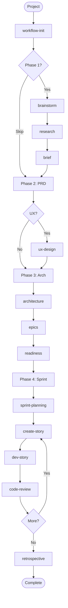
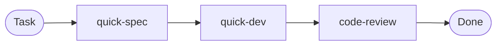
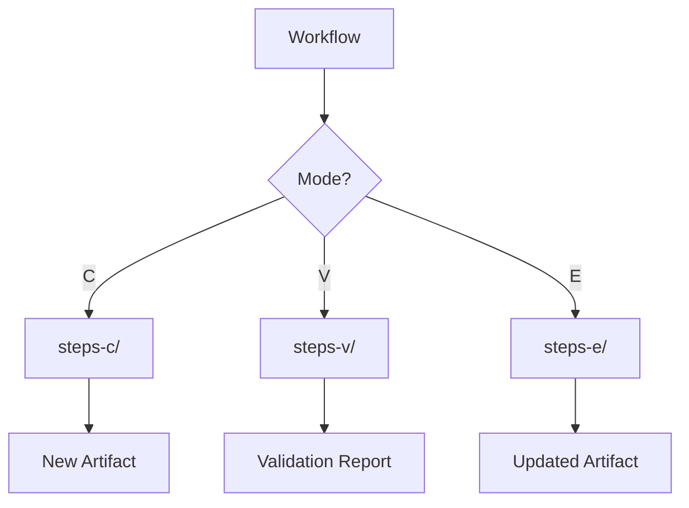
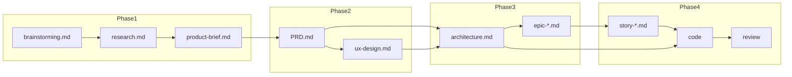
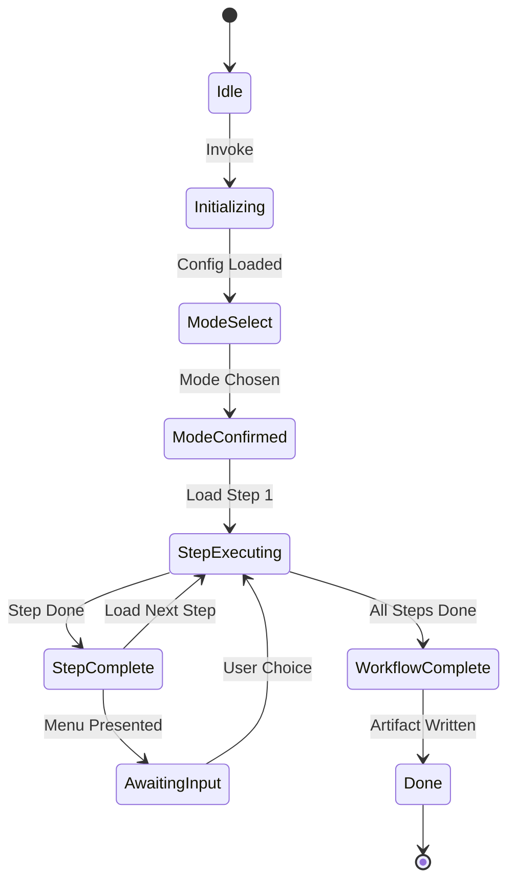
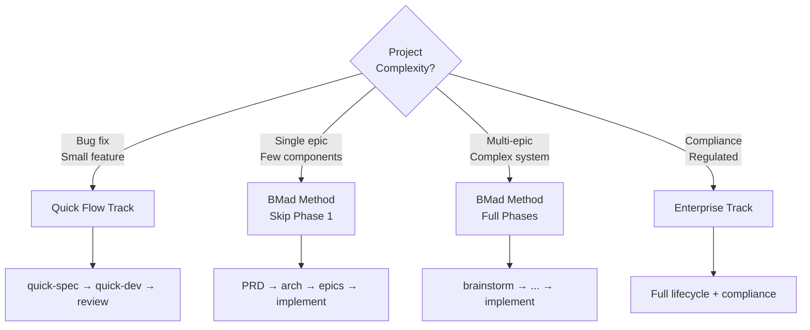

# BMAD-METHOD Visual Guide

**Project**: BMAD-METHOD Analysis
**Date**: 2026-01-11 (Sunday, January 11, 2026, 9:15 AM EST)
**Repository**: https://github.com/bmad-code-org/BMAD-METHOD

## Overview

Visual reference guide for BMAD-METHOD with Mermaid diagrams, flowcharts, quick references, and best practices.

## 1. Complete Four-Phase Workflow

### BMad Method Track



### Quick Flow Track



## 2. Tri-Modal Pattern (Create/Validate/Edit)



## 3. Agent Collaboration Matrix

| Phase | Primary Agent | Supporting Agents | Workflows |
|-------|---------------|-------------------|-----------|
| **Phase 1** | Analyst | - | brainstorm, research, brief, document-project |
| **Phase 2** | PM | UX Designer | prd, create-ux-design |
| **Phase 3** | Architect | TEA | create-architecture, create-epics, impl-readiness |
| **Phase 4** | SM → DEV | TEA | sprint-planning, create-story, dev-story, code-review |
| **Quick Flow** | Quick-Flow-Solo-Dev | - | quick-spec, quick-dev, code-review |

## 4. Quick Command Reference

### Core Workflows (BMM Module)

| Command | Agent | Input | Output | Time |
|---------|-------|-------|--------|------|
| `*workflow-init` | bmad-master | Project | Workflow status | 1-2 min |
| `*brainstorm-project` | analyst | Idea | Brainstorming doc | 10-20 min |
| `*research` | analyst | Questions | Research doc | 15-30 min |
| `*product-brief` | analyst | Research | Product brief | 10-15 min |
| `*create-prd` | pm | Brief | PRD | 10-20 min |
| `*validate-prd` | pm | PRD | Validation report | 5-10 min |
| `*create-ux-design` | ux-designer | PRD | UX design | 15-25 min |
| `*create-architecture` | architect | PRD, UX | Architecture + ADRs | 15-30 min |
| `*create-epics-and-stories` | pm | Arch, PRD | Epic files | 10-20 min |
| `*sprint-planning` | sm | Epics | Sprint status | 5-10 min |
| `*create-story` | sm | Epic | Story file | 5-10 min |
| `*dev-story` | dev | Story | Code + tests | 20-60 min |
| `*code-review` | dev | PR | Review | 10-20 min |
| `*retrospective` | sm | Sprint | Retrospective | 10-15 min |
| `*quick-spec` | quick-solo | Feature | Tech spec | 3-5 min |
| `*quick-dev` | quick-solo | Spec | Code + tests | 10-30 min |

### Test Architecture Workflows

| Command | Agent | Purpose | Time |
|---------|-------|---------|------|
| `*framework` | tea | Setup test framework | 10-20 min |
| `*test-design` | tea | Design test strategy | 15-25 min |
| `*atdd` | tea | ATDD specifications | 15-25 min |
| `*automate` | tea | Automated tests | 20-40 min |
| `*ci` | tea | CI/CD setup | 15-25 min |

## 5. Artifact Flow Diagram



## 6. Scale-Adaptive Levels

| Level | Complexity | Track | Planning Artifacts | Time |
|-------|-----------|-------|-------------------|------|
| **0** | Minimal | Quick Flow | Tech spec only | ~5 min |
| **1** | Simple | Quick Flow | Tech spec + basic plan | ~10 min |
| **2** | Moderate | BMad Method | PRD + arch outline | ~15 min |
| **3** | Complex | BMad Method | Full PRD + detailed arch | ~30 min |
| **4** | Enterprise | Enterprise | PRD + arch + compliance | ~60 min |

## 7. Workflow State Machine



## 8. Validation Gates

### Phase 2: PRD Validation Checklist

- ✓ Functional requirements complete (≥3 FRs)
- ✓ Non-functional requirements specified
- ✓ Testable acceptance criteria
- ✓ No implementation leakage
- ✓ Measurable success criteria
- ✓ Adequate density (≥200 words/section)
- ✓ Brief coverage (if brief exists)
- ✓ Completeness check passes

### Phase 3: Architecture Validation Checklist

- ✓ System design complete
- ✓ ADRs documented (≥5 decisions)
- ✓ Patterns consistent
- ✓ PRD coverage complete
- ✓ Implementation guidance clear
- ✓ Dependencies identified
- ✓ Technology choices justified

### Phase 4: Story Readiness Checklist

- ✓ Acceptance criteria clear
- ✓ Tasks defined and estimated
- ✓ Dependencies resolved
- ✓ Architecture alignment verified
- ✓ Test criteria specified

## 9. Formula Quick Reference

### Workflow Sequence

```
BMAD = workflow_init → phase1? → phase2 → phase3? → phase4
QuickFlow = workflow_init → quick_spec → quick_dev → code_review
```

### Scale-Adaptive Scoring

```
complexity_score(project) =
  0.3 * num_epics +
  0.25 * num_components +
  0.2 * num_dependencies +
  0.15 * num_integrations +
  0.1 * regulatory_requirements

level = threshold(complexity_score)
```

### Quality Metrics

```
prd_quality = 0.2*clarity + 0.2*completeness + 0.15*testability +
              0.15*measurability + 0.1*density + 0.1*no_impl + 0.1*coverage

architecture_quality = 0.25*completeness + 0.25*adr_quality +
                      0.2*consistency + 0.15*prd_coverage + 0.15*guidance
```

## 10. Progressive Disclosure Rules

### Critical Constraints

1. **Single Step Load**: Only one step file in memory at any time
2. **Sequential Execution**: Steps must execute in order (no skipping)
3. **Complete Before Next**: Finish current step before loading next
4. **No Future Knowledge**: AI cannot see future steps
5. **State Tracking**: Update frontmatter after each step
6. **Menu Halting**: Always halt at menus and wait for user input

### Step File Architecture

```
workflow.md (entry point)
    ↓
steps-c/ (create mode)
    ├── step-01-init.md
    ├── step-02-context.md
    ├── ...
    └── step-N-finalize.md

steps-v/ (validate mode)
    ├── step-v-01-discovery.md
    ├── step-v-02-check1.md
    ├── ...
    └── step-v-N-report.md

steps-e/ (edit mode)
    ├── step-e-01-discovery.md
    ├── step-e-02-select.md
    ├── ...
    └── step-e-N-finalize.md
```

## 11. Best Practices

### Do's

- ✓ Use workflow-init to determine appropriate track
- ✓ Follow phase sequence (1→2→3→4)
- ✓ Validate artifacts before using in next phase
- ✓ Use tri-modal pattern for critical artifacts (PRD, architecture)
- ✓ Let progressive disclosure guide you (don't skip steps)
- ✓ Assign agents to appropriate phases
- ✓ Track workflow completion in frontmatter
- ✓ Use Quick Flow for simple tasks
- ✓ Use BMad Method for complex projects
- ✓ Leverage parallel workflows when possible

### Don'ts

- ✗ Skip validation gates
- ✗ Load multiple steps simultaneously
- ✗ Jump ahead in step sequence
- ✗ Use wrong agent for phase
- ✗ Skip solutioning phase on multi-epic projects
- ✗ Mix Quick Flow and BMad Method patterns
- ✗ Implement before architecture complete
- ✗ Create PRD with implementation details
- ✗ Start Phase 4 without readiness check

## 12. Common Pitfalls

| Pitfall | Impact | Solution |
|---------|--------|----------|
| Skipping Phase 3 on complex project | Agent conflicts, inconsistent implementation | Always use architecture for multi-epic projects |
| Implementation leakage in PRD | Limits solution exploration | Focus on WHAT and WHY, not HOW |
| Not validating artifacts | Quality issues discovered late | Use validate mode before next phase |
| Loading multiple steps | Cognitive overload, shortcuts | Trust progressive disclosure |
| Wrong track for complexity | Overhead or insufficient planning | Use workflow-init recommendation |
| Skipping story preparation | Dev blocked, unclear requirements | Always use create-story before dev-story |

## 13. Optimization Patterns

### Parallel Execution Opportunities

**Phase 1**:
- brainstorm ∥ research (market) ∥ research (technical)

**Phase 2**:
- create-ux-design ∥ test-design (after PRD)

**Phase 4**:
- Multiple stories can be implemented in parallel if no dependencies

### Critical Path Reduction

1. **Skip Optional Phases**: Use Quick Flow for simple tasks
2. **Incremental Validation**: Validate during creation, not just at end
3. **Reusable ADRs**: Template common architectural decisions
4. **Pre-prepared Stories**: SM prepares multiple stories ahead

## 14. Track Selection Guide



## 15. Agent Persona Summary

| Agent | Persona Name | Icon | Personality | Communication Style |
|-------|--------------|------|-------------|---------------------|
| analyst | Mary | 📊 | Curious researcher | Inquisitive, thorough |
| pm | John | 📋 | Organized planner | Structured, clear |
| ux-designer | Sally | 🎨 | Creative designer | Visual, user-focused |
| architect | Winston | 🏛️ | Systems thinker | Technical, principled |
| sm | Bob | 🗓️ | Agile facilitator | Organized, supportive |
| dev | Amelia | 💻 | Quality-focused coder | Precise, detail-oriented |
| tea | Murat | ☕ | Quality advocate | Methodical, thorough |
| quick-solo | Barry | ⚡ | Fast pragmatist | Direct, efficient |

## Summary

BMAD-METHOD provides:
- **Four-phase structure** with optional/required phases
- **Three tracks** (Quick Flow, BMad Method, Enterprise)
- **29 specialized agents** for different roles
- **34+ workflows** covering full lifecycle
- **Tri-modal pattern** (Create/Validate/Edit) for quality
- **Progressive disclosure** for focused execution
- **Scale-adaptive planning** (Level 0-4)
- **Multiple validation gates** ensuring quality

Use this visual guide as a quick reference for navigation, decision-making, and understanding BMAD workflow patterns.

---

**Document**: BMAD-METHOD Visual Guide
**Date**: 2026-01-11, 9:15 AM EST
**Repository**: https://github.com/bmad-code-org/BMAD-METHOD
