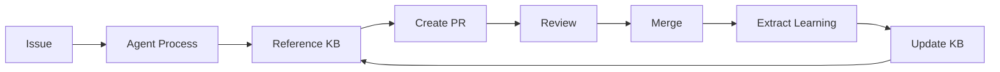

# Project Name

[Your existing project description goes here]

---

## Issue-Driven Development Workflow

This repository uses an AI-powered issue-driven development system that enables autonomous agents like @copilot to process tasks and create pull requests automatically.

### Quick Start

1. **Create an Issue**: Use the [AI Agent Task template](.github/ISSUE_TEMPLATE/task.yml)
2. **Assign to @copilot**: The system will automatically process it
3. **Review PR**: Check the auto-generated pull request
4. **Merge**: Knowledge base updates automatically on merge

### Workflow Diagram

```
Create Issue → Assign @copilot → Auto-generate PR → Code Review → Merge → Update Knowledge Base
     ↓              ↓                   ↓               ↓           ↓              ↓
  Web UI      GitHub UI         GitHub Actions    Web UI     Web UI      Automatic
```

### Web UI Access

All interactions happen through GitHub's web interface - **no local setup required**.

- **Create issues**: GitHub Issues tab → New Issue → AI Agent Task
- **Review PRs**: GitHub Pull Requests tab
- **View workflows**: GitHub Actions tab
- **Browse knowledge base**: `docs/knowledge/` directory

## Features

### 🤖 Autonomous AI Agents

- **@copilot Integration**: Assign issues directly to GitHub Copilot coding agent
- **Multi-Model Support**: Works with Opus, Sonnet, and Haiku
- **Context-Aware**: Agents reference knowledge base for informed decisions
- **Self-Improving**: System learns from each merged PR

### 📋 Structured Issue Templates

Issues use structured templates with:
- Clear task descriptions
- Acceptance criteria checklists
- Priority and complexity indicators
- Context and constraints
- Agent preferences

### ✅ Automated Validation

Every PR automatically checks:
- YAML syntax validation
- Shell script validation (shellcheck)
- Markdown linting
- Security scanning
- Test execution
- Integration tests

### 📚 Knowledge Base

Persistent learning system that captures:
- **Patterns**: Reusable solutions to common problems
- **Decisions**: Architecture choices and rationale (ADRs)
- **Insights**: Learnings from merged PRs and reviews

### 🔄 Continuous Learning



## Getting Started

### Prerequisites

- Git repository with GitHub remote
- Admin access to repository settings
- GitHub Actions enabled

### Bootstrap (One-Time Setup)

Run the bootstrap script to set up the complete system:

```bash
./scripts/bootstrap.sh
```

This creates:
- Issue templates
- GitHub Actions workflows
- Knowledge base structure
- CODEOWNERS file
- Validation scripts
- Documentation

### Verify Installation

```bash
./scripts/test-issue-flow.sh
```

Expected output:
```
✓ All tests passed! System is ready for use.
```

## Usage Guide

### For Developers

#### 1. Creating a Task

1. Go to **Issues** → **New Issue**
2. Select **AI Agent Task** template
3. Fill in all required fields:
   - Task description
   - Acceptance criteria
   - Context/constraints
   - Priority level
4. Click **Submit new issue**

#### 2. Assigning to AI Agent

1. On the issue page, click **Assignees**
2. Select **@copilot** (or another configured AI agent)
3. System automatically triggers processing workflow

#### 3. Monitoring Progress

- **Actions tab**: Watch workflow execution in real-time
- **Issue comments**: Copilot posts status updates
- **Pull Requests**: PR created automatically when ready

#### 4. Reviewing PRs

AI-generated PRs include:
- Implementation details
- How acceptance criteria are met
- Links to relevant knowledge base entries
- Automated validation results

Review checklist:
- [ ] Code meets acceptance criteria
- [ ] All automated checks passed
- [ ] Implementation follows patterns
- [ ] Tests are comprehensive
- [ ] Documentation updated

#### 5. After Merge

- Knowledge base automatically extracts learnings
- Insights document created
- Patterns identified
- Available for future agents

### For AI Agents

#### Processing an Issue

1. **Search knowledge base** for relevant context:
   ```bash
   grep -r "relevant-keyword" docs/knowledge/
   ```

2. **Review patterns** for similar problems:
   ```bash
   ls docs/knowledge/patterns/
   ```

3. **Check decisions** for architectural guidance:
   ```bash
   grep "topic" docs/knowledge/decisions/*.md
   ```

4. **Implement solution** following established patterns

5. **Reference knowledge** in PR description:
   ```markdown
   ## Implementation Approach

   Following patterns:
   - [API Error Handling](docs/knowledge/patterns/api-error-handling.md)

   Aligned with decisions:
   - [ADR-002: Use REST API](docs/knowledge/decisions/002-use-rest.md)
   ```

#### Self-Reflection

After creating PR, agents should:
- Document assumptions made
- Note information gaps
- Suggest knowledge base additions
- Identify potential improvements

## Directory Structure

```
.
├── .github/
│   ├── ISSUE_TEMPLATE/
│   │   └── task.yml              # AI agent task template
│   ├── workflows/
│   │   ├── copilot-assign.yml    # Auto-process assigned issues
│   │   ├── validate-pr.yml        # PR validation checks
│   │   └── knowledge-base-update.yml  # Extract learnings
│   ├── CODEOWNERS                 # Auto-assign reviewers
│   └── dependabot.yml             # Dependency updates
│
├── docs/
│   └── knowledge/                 # Knowledge base
│       ├── README.md              # KB overview
│       ├── patterns/              # Reusable solutions
│       ├── decisions/             # Architecture decisions (ADRs)
│       └── insights/              # Learnings from PRs
│
├── scripts/
│   ├── bootstrap.sh               # One-time setup
│   ├── validate-syntax.sh         # Syntax validation
│   ├── test-issue-flow.sh         # Integration tests
│   └── extract-learnings.sh       # Manual learning extraction
│
└── README.md                      # This file
```

## Success Criteria

The system is working correctly when:

1. ✅ **Functional**: Test issues process end-to-end without errors
2. ✅ **Valid**: All files pass syntax validation
3. ✅ **Observable**: Workflows trigger on issue assignment
4. ✅ **Reliable**: 90%+ success rate across test runs
5. ✅ **Multi-Agent**: Works with multiple AI models
6. ✅ **Automated**: Bootstrap works on fresh repos
7. ✅ **Self-Improving**: System creates improvement PRs from logs

## Validation

### Syntax Validation

```bash
./scripts/validate-syntax.sh
```

Checks:
- YAML files (yamllint)
- Shell scripts (shellcheck)
- Markdown files (markdownlint)

Auto-fix mode:
```bash
./scripts/validate-syntax.sh --fix
```

### Integration Testing

```bash
./scripts/test-issue-flow.sh
```

Tests:
- Directory structure
- Required files exist
- Scripts are executable
- YAML syntax is valid
- Workflows are configured
- Knowledge base structure

## Knowledge Base

### Structure

- **patterns/**: Reusable code patterns
  - API design patterns
  - Testing strategies
  - Performance optimizations

- **decisions/**: Architecture Decision Records (ADRs)
  - Technology choices
  - Design decisions
  - Trade-off documentation

- **insights/**: Learnings from experience
  - PR learnings (auto-extracted)
  - Bug fix insights
  - Performance improvements

### Searching Knowledge Base

```bash
# Search all knowledge
grep -r "search-term" docs/knowledge/

# Search specific category
grep -r "api" docs/knowledge/patterns/

# Recent insights (last 30 days)
find docs/knowledge/insights/ -mtime -30 -name "*.md"
```

### Contributing to Knowledge Base

- **Patterns**: Submit PR when pattern used 3+ times
- **Decisions**: Create ADR before major architectural changes
- **Insights**: Auto-generated from merged PRs (manual rarely needed)

## Troubleshooting

### Issue Not Processing

1. Check workflow triggered: Actions tab
2. Verify assignee is exactly `@copilot`
3. Review workflow logs for errors
4. Ensure issue template was used

### PR Validation Failing

1. Run local validation: `./scripts/validate-syntax.sh`
2. Fix reported errors
3. Push fixes (validation reruns automatically)

### Knowledge Base Not Updating

1. Check `knowledge-base-update` workflow logs
2. Verify PR was merged (not closed)
3. Ensure PR had changes (not empty)

## Configuration

### Environment Variables

Set in repository Settings → Secrets and variables → Actions:

- `GITHUB_TOKEN`: Automatically provided (no setup needed)
- `COPILOT_MODEL`: (Optional) Specify model: opus/sonnet/haiku

### Workflow Customization

Edit workflow files in `.github/workflows/`:

- Validation rules: `validate-pr.yml`
- Agent behavior: `copilot-assign.yml`
- Learning extraction: `knowledge-base-update.yml`

### Issue Template Customization

Edit `.github/ISSUE_TEMPLATE/task.yml` to:
- Add custom fields
- Change validation rules
- Modify agent preferences

## Metrics & Monitoring

### Success Metrics

Track in GitHub Insights:

- Issue processing success rate
- Average time to PR creation
- Validation pass rate
- Knowledge base growth
- Pattern reuse frequency

### Quality Metrics

- Test coverage (from validation workflow)
- Code review iterations (lower is better)
- Knowledge base references per PR
- Agent self-improvement PRs created

## Advanced Usage

### Multi-Agent Coordination

For complex tasks spanning multiple agents:

1. Create parent epic issue
2. Break into sub-issues
3. Assign different agents to each
4. Coordinate via issue dependencies

### Custom Agents

To add custom AI agent support:

1. Create workflow: `.github/workflows/[agent-name]-assign.yml`
2. Copy from `copilot-assign.yml` template
3. Customize API calls for your agent
4. Update issue template agent preferences

### Batch Operations

Process multiple issues:

```bash
# Using GitHub CLI
gh issue list --label "ai-task" --state open | \
  while read -r issue; do
    gh issue edit "$issue" --add-assignee copilot
  done
```

## Contributing

### For Humans

1. Follow issue-driven workflow
2. Reference knowledge base in PRs
3. Review AI-generated PRs thoroughly
4. Add manual insights when appropriate

### For AI Agents

1. Always search knowledge base first
2. Reference patterns and decisions
3. Document assumptions in PRs
4. Suggest knowledge base improvements

## Support

### Resources

- **Knowledge Base**: `docs/knowledge/README.md`
- **Workflow Guide**: This README
- **Issue Templates**: `.github/ISSUE_TEMPLATE/`
- **Scripts**: `scripts/` directory

### Getting Help

1. Search knowledge base for similar issues
2. Check workflow logs in Actions tab
3. Open issue with label `help-wanted`
4. Reference relevant logs and context

## License

[Your license here]

## Acknowledgments

This system incorporates best practices from:
- GitHub Copilot coding agent patterns (2026)
- Enterprise AI code review systems (Qodo AI, CodeRabbit)
- Architecture Decision Records (ADR) methodology
- Knowledge management patterns for AI systems

---

**System Status**: ✅ Operational
**Last Bootstrap**: [Run `./scripts/bootstrap.sh` to set up]
**Knowledge Base Entries**: [Auto-updated on each PR merge]

For questions or issues, create an issue with the appropriate label.
