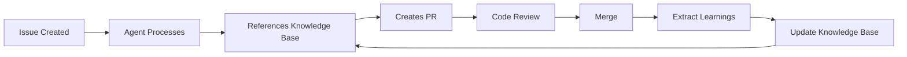

# Knowledge Base

This directory contains accumulated learnings from AI agent executions, code reviews, and merged pull requests. It serves as institutional memory for the repository, enabling AI agents to make better decisions based on past experiences.

## Purpose

The knowledge base enables:
- **Context-Aware Decisions**: AI agents learn from past solutions
- **Pattern Reuse**: Common solutions are documented and reusable
- **Consistency**: Architecture decisions are preserved and referenced
- **Self-Improvement**: System learns from each PR and improves over time

## Structure

### 📐 patterns/
Reusable code patterns and solutions that have proven effective.

**Contents:**
- Common algorithms and data structures
- API design patterns
- Error handling strategies
- Testing patterns
- Performance optimization techniques

**When to add:**
- A solution is used successfully in multiple places
- A pattern solves a recurring problem
- Code review reveals a best practice worth preserving

**Example:** `patterns/api-error-handling.md` documenting standard error response format

### 🏗️ decisions/
Architecture decisions and their rationale (ADRs - Architecture Decision Records).

**Contents:**
- Technology choices (frameworks, libraries, tools)
- Design patterns and architectural styles
- Trade-offs and alternatives considered
- Migration strategies

**Format:**
- Context: What problem are we solving?
- Decision: What did we choose?
- Rationale: Why did we choose it?
- Consequences: What are the implications?

**Example:** `decisions/001-use-github-actions-for-ci.md`

### 💡 insights/
Learnings extracted from merged PRs, agent execution logs, and code reviews.

**Contents:**
- Bug fixes and their root causes
- Performance improvements and metrics
- Code review feedback patterns
- Common mistakes and how to avoid them
- Successful implementation approaches

**Automatically Generated:**
- From merged PRs via `knowledge-base-update` workflow
- From agent execution logs
- From code review comments

**Example:** `insights/pr-123-20260106.md` documenting learnings from PR #123

## Usage

### For AI Agents

When processing a new issue, agents should:

1. **Search for relevant patterns**
   ```bash
   grep -r "authentication" docs/knowledge/patterns/
   ```

2. **Review related decisions**
   ```bash
   ls docs/knowledge/decisions/ | grep api
   ```

3. **Learn from similar issues**
   ```bash
   grep -r "similar-keyword" docs/knowledge/insights/
   ```

4. **Reference in PR descriptions**
   ```markdown
   This implementation follows the pattern documented in:
   - [API Error Handling](../docs/knowledge/patterns/api-error-handling.md)
   - [Decision: REST vs GraphQL](../docs/knowledge/decisions/002-rest-vs-graphql.md)
   ```

### For Human Developers

- **Before starting work**: Search knowledge base for related patterns
- **During code review**: Reference decisions to explain choices
- **After merging**: Knowledge base auto-updates with learnings

### Search Tips

```bash
# Search all knowledge base files
grep -r "search-term" docs/knowledge/

# Search specific category
grep -r "search-term" docs/knowledge/patterns/

# Find recent insights (last 30 days)
find docs/knowledge/insights/ -mtime -30 -name "*.md"

# List all decisions
ls docs/knowledge/decisions/
```

## Maintenance

### Automatic Updates

The `knowledge-base-update` workflow automatically:
- Extracts learnings from merged PRs
- Categorizes insights by topic
- Updates indices
- Commits changes to main branch

### Manual Additions

To add a pattern manually:

1. Create file in appropriate category
2. Follow the template for that category
3. Update the category's README.md
4. Submit PR for review

### Archiving

Insights older than 1 year may be:
- Archived to `archive/` directory
- Consolidated into patterns or decisions
- Summarized in quarterly retrospectives

## Metrics

<!-- Auto-updated by knowledge-base-update workflow -->

**Current Statistics:**
- Total Entries: <!-- auto-populated -->
- Patterns: <!-- auto-populated -->
- Decisions: <!-- auto-populated -->
- Insights: <!-- auto-populated -->

Last updated: <!-- auto-populated -->

## Recent Updates

<!-- New entries are automatically added here by workflows -->

## Contributing

### Pattern Template

```markdown
# Pattern: [Name]

**Category**: [API Design / Testing / Performance / etc.]
**Confidence**: [High / Medium / Low]

## Problem

[What problem does this pattern solve?]

## Solution

[The pattern itself with code examples]

## When to Use

[Situations where this pattern applies]

## When NOT to Use

[Cases where this pattern is inappropriate]

## Examples

[Real examples from the codebase]

## Related

- [Link to related patterns]
- [Link to decisions]
```

### Decision Template

```markdown
# ADR [Number]: [Title]

**Date**: YYYY-MM-DD
**Status**: [Proposed / Accepted / Deprecated / Superseded]

## Context

[What is the issue we're facing?]

## Decision

[What did we decide to do?]

## Rationale

[Why did we make this decision?]

## Alternatives Considered

1. [Alternative 1] - [Why not chosen]
2. [Alternative 2] - [Why not chosen]

## Consequences

**Positive:**
- [Benefit 1]
- [Benefit 2]

**Negative:**
- [Trade-off 1]
- [Trade-off 2]

## References

- [External docs]
- [Related PRs]
```

### Insight Template

```markdown
# Learning from [Source]

**Date**: YYYY-MM-DD
**Category**: [bug-fix / feature / refactor / etc.]
**Source**: [PR #123 / Agent Log / Code Review]

## Summary

[One-paragraph summary of what was learned]

## Context

[Background and situation]

## What Happened

[Description of the work done]

## Key Takeaways

- [Learning 1]
- [Learning 2]

## Patterns Identified

- [Pattern that emerged]

## Reusability

[How can this be applied to future work?]

## Related

- [Links to PRs, issues, or other knowledge base entries]
```

## FAQ

**Q: How is this different from documentation?**
A: Documentation describes *how things work now*. Knowledge base captures *why decisions were made* and *what we learned*.

**Q: Should I add to knowledge base for every PR?**
A: No. The workflow auto-extracts insights. Manual additions are for significant patterns or decisions.

**Q: How do I find relevant knowledge for my issue?**
A: Use `grep -r "keyword" docs/knowledge/` or browse category READMEs.

**Q: Can AI agents edit the knowledge base?**
A: Yes! The `knowledge-base-update` workflow automatically adds insights from merged PRs.

**Q: What if knowledge becomes outdated?**
A: Mark decisions as "Superseded" and create new ADRs. Archive old insights.

## Integration with Workflows



The knowledge base creates a continuous improvement loop where each PR makes future work better.

---

**Maintained by**: Automated workflows + manual curation
**Questions?**: Open an issue with label `knowledge-base`
