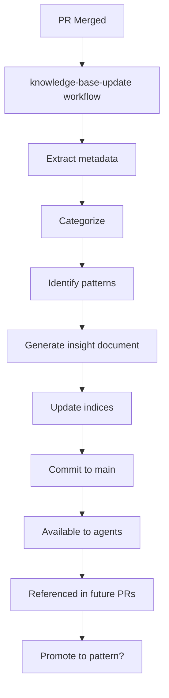

# Insights

This directory contains learnings extracted from merged pull requests, agent execution logs, and code reviews. Unlike patterns (which are reusable solutions) and decisions (which are architectural choices), insights are **observations and lessons learned** from actual development work.

## What are Insights?

Insights are:
- ✅ **Observed learnings** from real work
- ✅ **Context-specific** to particular situations
- ✅ **Evolving knowledge** that may become patterns
- ✅ **Failure lessons** - what didn't work and why
- ✅ **Success stories** - what worked well and why

Insights are NOT:
- ❌ Generic best practices (those go in patterns)
- ❌ Architectural decisions (those go in decisions)
- ❌ Code documentation (that goes with the code)
- ❌ Theoretical knowledge (must be from actual experience)

## Purpose

Insights help:
- **Avoid repeating mistakes**: Document what didn't work
- **Replicate success**: Share what worked well
- **Improve over time**: System learns from each PR
- **Context for AI agents**: Provide real-world examples
- **Knowledge transfer**: Share tacit knowledge across team

## How Insights are Generated

### Automatic Extraction (Primary Method)

The `knowledge-base-update` GitHub Actions workflow automatically extracts insights when PRs are merged:

```yaml
Trigger: PR merged to main
→ Analyze PR: files changed, review comments, labels
→ Categorize: bug-fix, feature, refactor, etc.
→ Extract patterns: common changes, review feedback
→ Generate insight document
→ Update index
→ Commit to knowledge base
```

**What gets extracted:**
- Files changed and their categories
- Review comments and discussion
- Test coverage changes
- Performance impacts
- Common review feedback themes

### Manual Addition

For significant learnings not captured by automation:

1. Create insight using template (below)
2. Place in `docs/knowledge/insights/`
3. Update this index
4. Submit PR with label `knowledge-base`

## Insight Categories

Insights are categorized by type:

### Bug Fixes
Learnings from debugging and fixing issues.

**Example topics:**
- Root cause analysis
- Common bug patterns
- Prevention strategies
- Testing gaps that allowed bugs

### Features
Learnings from implementing new functionality.

**Example topics:**
- Implementation approaches that worked
- Integration challenges
- User feedback and iterations
- Performance considerations

### Refactoring
Learnings from code improvements.

**Example topics:**
- Refactoring strategies that worked
- Migration approaches
- Breaking change management
- Technical debt insights

### Performance
Learnings from optimization work.

**Example topics:**
- Bottleneck discoveries
- Optimization techniques
- Measurement approaches
- Trade-offs between performance and maintainability

### Testing
Learnings about testing strategies.

**Example topics:**
- Test effectiveness
- Coverage gaps discovered
- Flaky test fixes
- Testing tool evaluations

### AI-Generated
Learnings from AI agent executions.

**Example topics:**
- What agents did well
- Where agents struggled
- Prompt improvements
- Agent tool usage patterns

### Infrastructure
Learnings from DevOps and deployment.

**Example topics:**
- CI/CD improvements
- Deployment issues and fixes
- Monitoring insights
- Infrastructure changes

## File Naming Convention

```
pr-[NUMBER]-[DATE]-[optional-slug].md
```

Examples:
- `pr-123-20260106-auth-bug-fix.md`
- `pr-124-20260106.md` (auto-generated)
- `agent-execution-20260106-haiku-test.md` (manual)

**Components:**
- **Source**: `pr-123`, `agent-execution`, `review-session`
- **Date**: `YYYYMMDD`
- **Slug**: (optional) short description

## Insight Template

```markdown
# Learning from [Source]

**Date**: YYYY-MM-DD
**Category**: [bug-fix / feature / refactor / performance / testing / ai-generated / infrastructure]
**Source**: [PR #123 / Agent Log / Code Review Session]
**Confidence**: [High / Medium / Low]
**Reusability**: [High / Medium / Low]

## Summary

[2-3 sentence summary of what was learned]

## Context

**Problem/Goal**: [What were we trying to achieve?]

**Constraints**: [What limitations did we face?]

**Environment**: [Relevant technical context]

## What Happened

[Detailed description of the work done]

### Approach Taken

1. [Step 1]
2. [Step 2]
3. [Step 3]

### Challenges Encountered

- **Challenge 1**: [Description]
  - **Solution**: [How we overcame it]

- **Challenge 2**: [Description]
  - **Solution**: [How we overcame it]

## Key Takeaways

### What Worked Well

- ✅ [Success 1]
- ✅ [Success 2]

### What Didn't Work

- ❌ [Failure 1] - [Why it failed]
- ❌ [Failure 2] - [Why it failed]

### What We'd Do Differently

- 🔄 [Change 1]
- 🔄 [Change 2]

## Patterns Identified

- [Emerging pattern 1 - may become a formal pattern]
- [Emerging pattern 2]

## Metrics

**Before:**
- [Metric 1]: [Value]
- [Metric 2]: [Value]

**After:**
- [Metric 1]: [Value] ([+/- % change])
- [Metric 2]: [Value] ([+/- % change])

## Reusability

**Applicable to:**
- [Type of problem 1]
- [Type of problem 2]

**Not applicable to:**
- [Situation 1]
- [Situation 2]

## Follow-up Actions

- [ ] [Action item 1]
- [ ] [Action item 2]
- [ ] Consider promoting to pattern if reused 3+ times

## Related

- **PRs**: #123, #456
- **Issues**: #789
- **Patterns**: [link if applicable]
- **Decisions**: [link if applicable]
- **Similar Insights**: [link to related learnings]

## Code Examples

```language
// Example code showing the learning
```

## Review Feedback

[Notable feedback from code review that led to learnings]

## Agent Notes

[If generated by or for AI agents, specific observations about agent behavior]

---

**Confidence Level**: [How certain are we about this learning?]
**Last Updated**: [Date]
**Times Referenced**: [Auto-tracked - how often this insight was referenced in PRs]
```

## Using Insights

### For Developers

**Before starting work:**
```bash
# Search for related insights
grep -r "authentication" docs/knowledge/insights/

# Find recent insights in your area
find docs/knowledge/insights/ -name "*auth*" -mtime -60
```

**During code review:**
- Reference relevant insights in review comments
- Suggest creating insight if significant learning occurs

**After merging:**
- Knowledge base auto-updates (no action needed)
- Consider manual insight if automation missed something

### For AI Agents

**When processing issues:**
1. Search insights for similar past work
2. Learn from what worked and what didn't
3. Reference insights in implementation approach
4. Add observations to PR for future extraction

**Example agent workflow:**
```
Agent: Assigned issue #456 - implement login rate limiting
Agent: Searching insights for "rate limiting"...
Agent: Found pr-234-20250215-api-rate-limit.md
Agent: Learning: Previous implementation used token bucket, worked well
Agent: Will follow similar approach, referencing insight in PR
```

## Insight Lifecycle

```
PR Merged → Auto-Extract → Create Insight → Index Update
                ↓
         Referenced in future PRs
                ↓
    Reused 3+ times? → Promote to Pattern
                ↓
         No longer relevant? → Archive
```

### Promotion to Pattern

When an insight is referenced/reused 3+ times:
1. Evaluate if it's truly a general pattern
2. Create formal pattern document
3. Update insight to reference the pattern
4. Keep insight for historical record

### Archiving

Insights older than 1 year may be archived if:
- Technology has changed significantly
- Approach is no longer relevant
- Superseded by better learnings

Archive location: `docs/knowledge/insights/archive/YYYY/`

## Metrics & Analytics

**Auto-calculated metrics:**

- **Total Insights**: [Count]
- **By Category**:
  - Bug Fixes: [Count]
  - Features: [Count]
  - Refactoring: [Count]
  - Performance: [Count]
  - Testing: [Count]
  - AI-Generated: [Count]
  - Infrastructure: [Count]

- **Reusability Score**: [Average confidence × reusability]
- **Most Referenced**: [Top 5 insights by reference count]
- **Trend Analysis**: [Insights per month]

Last updated: [Auto-populated]

## Index

### Recent Insights (Last 30 Days)

<!-- Auto-updated by knowledge-base-update workflow -->
(None yet - will auto-populate as PRs are merged)

### By Category

#### Bug Fixes
(None yet)

#### Features
(None yet)

#### Refactoring
(None yet)

#### Performance
(None yet)

#### Testing
(None yet)

#### AI-Generated
(None yet)

#### Infrastructure
(None yet)

### High-Impact Insights

<!-- Insights with high reusability scores -->
(Will be auto-populated based on reference counts)

## Search Examples

```bash
# Find all insights about a technology
grep -r "react" docs/knowledge/insights/

# Find insights from last 2 weeks
find docs/knowledge/insights/ -name "*.md" -mtime -14

# Find high-confidence insights
grep "Confidence: High" docs/knowledge/insights/*.md

# Find insights with metrics
grep -l "Metrics" docs/knowledge/insights/*.md

# Search by category
grep "Category: bug-fix" docs/knowledge/insights/*.md
```

## Quality Guidelines

**Good insights:**
- ✅ Specific to a real situation
- ✅ Include concrete examples
- ✅ Honest about failures
- ✅ Provide actionable takeaways
- ✅ Include metrics when available
- ✅ Link to source material

**Poor insights:**
- ❌ Generic advice copied from internet
- ❌ Theoretical rather than experiential
- ❌ Missing context
- ❌ Vague learnings
- ❌ No supporting evidence

## Contributing

### Automatic (Preferred)

Just merge your PR! The workflow handles the rest.

### Manual (When Needed)

1. Use template above
2. Be specific and honest
3. Include code examples
4. Link to source (PR, issue, etc.)
5. Submit PR with label `knowledge-base`

## Integration with Workflows



## FAQs

**Q: Do I need to manually create insights?**
A: No. The workflow auto-generates them from merged PRs.

**Q: When should I manually add an insight?**
A: When you have significant learning that won't be captured in a PR (code review sessions, debugging sessions, experiments).

**Q: How long should insights be kept?**
A: At least 1 year. After that, archive if no longer relevant or promote to pattern if widely applicable.

**Q: Can insights become patterns?**
A: Yes! When an insight is reused 3+ times, consider promoting it to a formal pattern.

**Q: What if an insight becomes outdated?**
A: Add a note at the top explaining why it's outdated and link to newer insights or patterns.

---

**Maintained by**: Automated workflows + manual curation
**Format**: Markdown (structured template)
**Questions?**: Open issue with label `knowledge-base`
