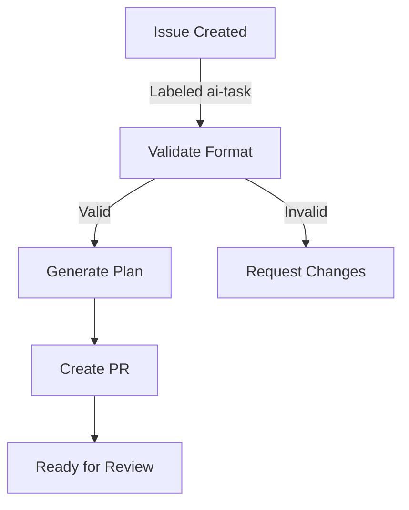
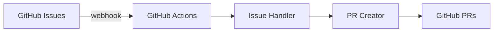

# Documentation Patterns for @copilot

## File Header Documentation

### JavaScript/TypeScript

```javascript
/**
 * Issue Processing Module
 *
 * This module handles autonomous processing of GitHub issues.
 * It validates issues, determines their type, generates
 * implementation plans, and creates pull requests.
 *
 * @module issue-processor
 * @version 1.0.0
 * @author GitHub Copilot
 *
 * @example
 * const processor = new IssueProcessor(config);
 * await processor.process(issue);
 */

const IssueProcessor = class {
  // Implementation
};

module.exports = IssueProcessor;
```

### Python

```python
"""
Issue Processing Module.

This module handles autonomous processing of GitHub issues.
It validates issues, determines their type, generates
implementation plans, and creates pull requests.

Classes:
    IssueProcessor: Main processor for issue handling

Functions:
    validate_issue: Validate issue format
    determine_type: Determine issue type
    generate_plan: Generate implementation plan

Example:
    processor = IssueProcessor(config)
    processor.process(issue)
"""

class IssueProcessor:
    """Process GitHub issues autonomously."""
    pass
```

### Bash/Shell

```bash
#!/bin/bash

################################################################################
# Issue Processing Script
#
# Description:
#   Handles autonomous processing of GitHub issues by validating format,
#   determining type, generating implementation plans, and creating PRs.
#
# Usage:
#   ./process-issue.sh <issue-number> <issue-title> <issue-body>
#
# Environment Variables:
#   GITHUB_TOKEN    - GitHub API token (required)
#   REPO            - Repository name (optional, uses git config)
#   DEBUG           - Enable debug output (optional)
#
# Author: GitHub Copilot
# Version: 1.0.0
################################################################################

set -euo pipefail

# Script implementation
```

## Function/Method Documentation

### JavaScript with JSDoc

```javascript
/**
 * Validates the format and content of a GitHub issue.
 *
 * Checks that the issue meets minimum requirements:
 * - Title is at least 5 characters
 * - Body is at least 10 characters
 * - Issue has at least one label
 * - Author has valid GitHub username
 *
 * @async
 * @function validateIssue
 * @param {Object} issue - The issue to validate
 * @param {number} issue.number - GitHub issue number
 * @param {string} issue.title - Issue title (min 5 chars)
 * @param {string} issue.body - Issue description (min 10 chars)
 * @param {string[]} issue.labels - Issue labels (required)
 * @param {string} issue.author - GitHub username
 * @returns {Promise<boolean>} True if valid, rejects if invalid
 * @throws {ValidationError} If validation fails
 *
 * @example
 * try {
 *   const valid = await validateIssue({
 *     number: 123,
 *     title: "Add feature X",
 *     body: "Detailed description",
 *     labels: ["enhancement"],
 *     author: "user"
 *   });
 *   console.log("Valid:", valid);
 * } catch (error) {
 *   console.error("Validation failed:", error);
 * }
 */
async function validateIssue(issue) {
  if (!issue.title || issue.title.length < 5) {
    throw new ValidationError('Title must be at least 5 characters');
  }
  if (!issue.body || issue.body.length < 10) {
    throw new ValidationError('Body must be at least 10 characters');
  }
  if (!issue.labels || issue.labels.length === 0) {
    throw new ValidationError('At least one label is required');
  }
  return true;
}
```

### Python with Docstring

```python
def validate_issue(issue: dict) -> bool:
    """
    Validate the format and content of a GitHub issue.

    Checks that the issue meets minimum requirements:
    - Title is at least 5 characters
    - Body is at least 10 characters
    - Issue has at least one label
    - Author has valid GitHub username

    Args:
        issue: The issue to validate with keys:
            - number (int): GitHub issue number
            - title (str): Issue title (min 5 chars)
            - body (str): Issue description (min 10 chars)
            - labels (list[str]): Issue labels (required)
            - author (str): GitHub username

    Returns:
        bool: True if valid

    Raises:
        ValidationError: If validation fails

    Example:
        >>> validate_issue({
        ...     'number': 123,
        ...     'title': 'Add feature X',
        ...     'body': 'Detailed description',
        ...     'labels': ['enhancement'],
        ...     'author': 'user'
        ... })
        True
    """
    if not issue.get('title') or len(issue['title']) < 5:
        raise ValidationError('Title must be at least 5 characters')
    if not issue.get('body') or len(issue['body']) < 10:
        raise ValidationError('Body must be at least 10 characters')
    if not issue.get('labels') or len(issue['labels']) == 0:
        raise ValidationError('At least one label is required')
    return True
```

## README Structure

### Typical README Layout

```markdown
# Project Name

Brief one-liner description of what this is.

## Features

- Feature 1 with details
- Feature 2 with details
- Feature 3 with details

## Quick Start

### Installation

```bash
npm install package-name
# or
pip install package-name
```

### Basic Usage

```javascript
const example = require('package-name');
example.doSomething();
```

## Documentation

- [API Reference](docs/API.md)
- [Configuration Guide](docs/CONFIGURATION.md)
- [Examples](examples/)

## Contributing

See [CONTRIBUTING.md](CONTRIBUTING.md)

## License

MIT
```

## API Documentation

### Documenting REST Endpoints

```markdown
## API Reference

### Create Issue

**Endpoint**: `POST /api/issues`

**Description**: Create a new GitHub issue and trigger processing

**Request Body**:
```json
{
  "title": "string (required, min 5 chars)",
  "body": "string (required, min 10 chars)",
  "labels": ["string"]
}
```

**Response** (201):
```json
{
  "id": "number",
  "title": "string",
  "status": "processing",
  "created_at": "ISO8601"
}
```

**Error Responses**:
- **400**: Invalid request body
- **401**: Unauthorized
- **422**: Validation failed

**Example**:
```bash
curl -X POST http://localhost:3000/api/issues \
  -H "Content-Type: application/json" \
  -d '{
    "title": "Add feature X",
    "body": "Detailed description",
    "labels": ["enhancement"]
  }'
```
```

## Configuration Documentation

### Document Configuration Options

```markdown
# Configuration Reference

## Environment Variables

### Required
- `GITHUB_TOKEN`: GitHub API token for authentication
- `REPO`: Repository identifier (owner/repo)

### Optional
- `DEBUG`: Enable debug logging (default: false)
- `LOG_LEVEL`: Logging level (default: info)
- `TIMEOUT`: API timeout in seconds (default: 30)

## Configuration File

Create `.copilot-config.json`:

```json
{
  "issue_handling": {
    "auto_assign": true,
    "auto_label": true,
    "processing_labels": ["ai-task"]
  },
  "testing": {
    "framework": "auto-detect",
    "timeout": 300
  }
}
```
```

## Changelog Format

```markdown
# Changelog

All notable changes to this project will be documented in this file.

## [1.1.0] - 2026-01-06

### Added
- New feature description
- Another new feature

### Changed
- Modified behavior description
- Updated configuration option

### Fixed
- Bug fix description
- Another bug fix

### Deprecated
- Deprecated feature description

### Removed
- Removed feature description

### Security
- Security issue fix description

## [1.0.0] - 2026-01-01

### Added
- Initial release with core features
```

## Inline Code Comments

### When to Comment

```javascript
// GOOD: Explains WHY, not WHAT
// Use exponential backoff to handle transient failures gracefully
const delay = Math.min(1000 * Math.pow(2, attempt), MAX_DELAY);
await sleep(delay);

// GOOD: Complex algorithm explanation
// Fisher-Yates shuffle: O(n) time, O(1) space
for (let i = array.length - 1; i > 0; i--) {
  const j = Math.floor(Math.random() * (i + 1));
  [array[i], array[j]] = [array[j], array[i]];
}

// AVOID: Obvious comment
// Increment counter
count++;
```

### Comment Dangerous or Non-Obvious Code

```javascript
// HACK: GitHub API returns null for empty arrays.
// Filter them out before processing.
const labels = response.labels?.filter(Boolean) || [];

// FIXME: This has O(n²) complexity. Refactor when time permits.
// Consider using a Set for O(n) lookup after sorting.
for (const item of items) {
  for (const other of items) {
    // Compare items
  }
}

// NOTE: Order matters here. Must validate before transforming
// because transform expects valid data structure.
validate(data);
transform(data);
```

## Error Message Documentation

### Write Clear Error Messages

```javascript
// BAD: Unclear error
throw new Error('Error');

// GOOD: Specific and actionable
throw new ValidationError(
  'Issue title must be between 5-100 characters. ' +
  'Current title: "' + title + '" (' + title.length + ' chars)'
);

// GOOD: Suggests solution
throw new ConfigError(
  'Missing required config: GITHUB_TOKEN. ' +
  'Set it with: export GITHUB_TOKEN=your_token'
);
```

## Diagram Documentation

### Using Mermaid Diagrams

````markdown
## Processing Flow



## Architecture


````

## Migration/Breaking Changes Documentation

```markdown
## Migration Guide: v1.0 to v2.0

### Breaking Changes

#### 1. Config File Location
- **Old**: `.github/copilot-config.json`
- **New**: `.copilot/config.json`

**Action Required**: Move your config file
```bash
mv .github/copilot-config.json .copilot/config.json
```

#### 2. API Endpoint Changes
- **Old**: `POST /api/issues`
- **New**: `POST /api/v2/issues`

**Action Required**: Update API calls

### Deprecations

- `COPILOT_LEGACY` environment variable (removed in v2.1)
- Old issue label format (will be auto-migrated)

### New Features

- Automatic label migration
- Performance improvements (2x faster)
```

## Troubleshooting Documentation

```markdown
## Troubleshooting

### Issues Not Processing

**Symptom**: Issue created but PR not generated

**Solution**:
1. Check issue has required label (`ai-task`, `enhancement`, `bug`)
2. Verify issue meets minimum requirements
3. Check GitHub Actions logs:
   ```bash
   gh run list --repo owner/repo
   gh run view RUN_ID --repo owner/repo --log
   ```
4. Ensure GITHUB_TOKEN has correct permissions

### Tests Failing

**Symptom**: "Tests failed" error in PR validation

**Solution**:
1. Run tests locally:
   ```bash
   npm test
   # or
   pytest
   ```
2. Review test output for specific failures
3. Fix the code or update tests
4. Push changes to PR
```

## Keep Documentation Current

### Documentation Checklist
- [ ] Update when API changes
- [ ] Update when new features added
- [ ] Update examples if they become stale
- [ ] Keep troubleshooting guide current
- [ ] Review spelling and grammar
- [ ] Verify all links work
- [ ] Test all code examples
