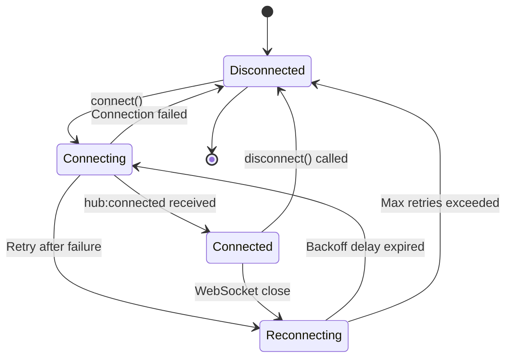

# Specification: Signal Hub Client Implementation

**Generated:** 2026-02-18T00:28:30Z
**Current Date Verified:** true

## 1. Core Principles

### 1.1 Client Types

Signal Hub supports two client implementations:

1. **SEAG Client (Node.js/Bun)**
   - Location: `/ugs/src/messaging/signal-hub/`
   - Runtime: Server-side (Node.js/Bun)
   - WebSocket library: `ws` (Node.js) or native WebSocket (Bun)
   - Use case: Backend actors, AI agents, service workers

2. **Browser Client**
   - Location: `/packages/signal-hub-client/`
   - Runtime: Browser (Chrome, Firefox, Safari, Edge)
   - WebSocket: Native `WebSocket` API
   - Use case: Frontend UI, interactive applications

### 1.2 Shared Responsibilities

All clients must:
- Manage connection lifecycle (connect, disconnect, reconnect)
- Implement exponential backoff for reconnection
- Handle message serialization/deserialization
- Track connection state
- Implement heartbeat keep-alive
- Re-register after reconnection
- Handle rate limiting errors

### 1.3 At-Most-Once Delivery Model

Clients must understand:
- Messages may be lost on connection failure
- No automatic retries by server
- No delivery acknowledgments for `hub:send`
- Client responsible for implementing retry logic if needed

## 2. Client State Machine

### 2.1 Connection States

```typescript
type ConnectionState = 'disconnected' | 'connecting' | 'connected' | 'reconnecting';
```

### 2.2 State Diagram



### 2.3 State Transitions

| From | Event | To | Action |
|------|-------|-----|--------|
| `disconnected` | `connect()` | `connecting` | Open WebSocket |
| `connecting` | `hub:connected` | `connected` | Start heartbeat timer |
| `connecting` | Error | `reconnecting` | Schedule retry with backoff |
| `connected` | `disconnect()` | `disconnected` | Send `hub:disconnect`, close WebSocket |
| `connected` | WebSocket close | `reconnecting` | Schedule reconnect |
| `reconnecting` | Delay expired | `connecting` | Retry connection |
| `reconnecting` | Max retries | `disconnected` | Give up, emit error |

## 3. Client Class Structure

### 3.1 Core Interface

```typescript
interface SignalHubClient {
  // Connection management
  connect(): Promise<void>;
  disconnect(): Promise<void>;
  isConnected(): boolean;

  // Actor registration
  register(params: RegisterParams): Promise<RegisterResponse>;
  unregister(actorAddress: CanonicalAddress): Promise<void>;
  renew(actorAddress: CanonicalAddress): Promise<RenewResponse>;

  // Discovery
  discover(query: DiscoveryQuery): Promise<DiscoveryResult>;
  listActors(): Promise<DiscoveryResult>;

  // Messaging
  send(params: SendParams): Promise<void>;
  broadcast(params: BroadcastParams): Promise<BroadcastAck>;

  // Pub/Sub
  subscribe(topic: string): Promise<void>;
  publish(topic: string, message: unknown): Promise<DeliveryAck>;
  unsubscribe(topic: string): Promise<void>;

  // Event handlers
  on(event: string, handler: (...args: any[]) => void): void;
  off(event: string, handler: (...args: any[]) => void): void;
}
```

### 3.2 Configuration

```typescript
interface SignalHubClientConfig {
  url: string;                        // WebSocket URL (wss://...)
  actorAddress: CanonicalAddress;     // Client's canonical address
  capabilities: string[];             // Client capabilities
  metadata?: Record<string, unknown>; // Custom metadata

  // Connection
  jwt?: string;                       // JWT for authentication (if auth enabled)
  reconnect?: boolean;                // Enable auto-reconnect (default: true)
  maxReconnectAttempts?: number;      // Max reconnection attempts (default: 10)
  reconnectDelay?: number;            // Initial reconnect delay ms (default: 100)
  maxReconnectDelay?: number;         // Max reconnect delay ms (default: 30000)

  // Heartbeat
  heartbeatInterval?: number;         // Heartbeat interval ms (default: 30000)

  // Registration
  registrationTTL?: number;           // Actor TTL ms (default: 300000 = 5 min)
  autoRegister?: boolean;             // Auto-register on connect (default: true)
  autoResubscribe?: boolean;          // Auto-resubscribe after reconnect (default: true)
}
```

### 3.3 Example Implementation Skeleton

```typescript
class SignalHubClient {
  private ws: WebSocket | null = null;
  private connectionState: ConnectionState = 'disconnected';
  private config: SignalHubClientConfig;
  private heartbeatTimer: NodeJS.Timeout | null = null;
  private reconnectAttempt = 0;
  private eventHandlers = new Map<string, Set<Function>>();
  private subscribedTopics = new Set<string>();
  private renewalToken: string | null = null;

  constructor(config: SignalHubClientConfig) {
    this.config = {
      reconnect: true,
      maxReconnectAttempts: 10,
      reconnectDelay: 100,
      maxReconnectDelay: 30000,
      heartbeatInterval: 30000,
      registrationTTL: 300000,
      autoRegister: true,
      autoResubscribe: true,
      ...config
    };
  }

  async connect(): Promise<void> {
    if (this.connectionState !== 'disconnected') {
      throw new Error(`Cannot connect from state: ${this.connectionState}`);
    }

    this.connectionState = 'connecting';

    return new Promise((resolve, reject) => {
      this.ws = new WebSocket(this.config.url);

      this.ws.onopen = () => {
        console.log('[SignalHubClient] WebSocket opened');
        this.sendHubConnect().then(resolve).catch(reject);
      };

      this.ws.onmessage = (event) => {
        this.handleMessage(event.data);
      };

      this.ws.onclose = (event) => {
        this.handleClose(event.code, event.reason);
      };

      this.ws.onerror = (error) => {
        console.error('[SignalHubClient] WebSocket error:', error);
        reject(error);
      };
    });
  }

  private async sendHubConnect(): Promise<void> {
    const connectMsg: SharedMessage = {
      type: 'hub:connect',
      from: this.config.actorAddress,
      to: '@(cloudflare/signal-hub)' as CanonicalAddress,
      payload: {
        version: '1.0',
        jwt: this.config.jwt
      },
      timestamp: Date.now(),
      metadata: {}
    };

    this.send(connectMsg);

    // Wait for hub:connected response
    return new Promise((resolve, reject) => {
      const timeout = setTimeout(() => {
        reject(new Error('hub:connect timeout'));
      }, 5000);

      const onConnected = (msg: SharedMessage) => {
        if (msg.type === 'hub:connected') {
          clearTimeout(timeout);
          this.off('message', onConnected);
          this.onConnected(msg);
          resolve();
        }
      };

      this.on('message', onConnected);
    });
  }

  private onConnected(msg: SharedMessage): void {
    this.connectionState = 'connected';
    this.reconnectAttempt = 0;

    console.log('[SignalHubClient] Connected:', msg.payload);

    // Start heartbeat
    this.startHeartbeat();

    // Auto-register
    if (this.config.autoRegister) {
      this.register({
        actorAddress: this.config.actorAddress,
        capabilities: this.config.capabilities,
        metadata: this.config.metadata ?? {},
        ttl: this.config.registrationTTL!
      });
    }

    this.emit('connected', msg.payload);
  }

  private handleMessage(data: string): void {
    try {
      const msg = JSON.parse(data) as SharedMessage;

      console.log('[SignalHubClient] Received:', msg.type);

      // Emit raw message event
      this.emit('message', msg);

      // Route by type
      if (msg.type === 'hub:error') {
        this.emit('error', msg.payload);
      } else if (msg.type === 'hub:disconnect') {
        this.emit('server_disconnect', msg.payload);
        this.ws?.close();
      } else if (msg.type === 'hub:topic_message') {
        this.emit('topic_message', msg.payload);
      } else if (msg.type === 'hub:registered') {
        this.renewalToken = msg.payload.renewalToken;
        this.emit('registered', msg.payload);
      }
    } catch (err) {
      console.error('[SignalHubClient] Failed to parse message:', err);
    }
  }

  private handleClose(code: number, reason: string): void {
    console.log(`[SignalHubClient] WebSocket closed: code=${code}, reason=${reason}`);

    this.stopHeartbeat();
    this.connectionState = 'disconnected';
    this.ws = null;

    this.emit('disconnected', { code, reason });

    // Auto-reconnect
    if (this.config.reconnect && this.reconnectAttempt < this.config.maxReconnectAttempts!) {
      this.scheduleReconnect();
    }
  }

  private scheduleReconnect(): void {
    this.connectionState = 'reconnecting';
    this.reconnectAttempt++;

    const delay = this.getReconnectDelay();

    console.log(`[SignalHubClient] Reconnecting in ${delay}ms (attempt ${this.reconnectAttempt})`);

    setTimeout(() => {
      this.connect()
        .then(() => {
          // Re-subscribe to topics
          if (this.config.autoResubscribe) {
            for (const topic of this.subscribedTopics) {
              this.subscribe(topic);
            }
          }
        })
        .catch((err) => {
          console.error('[SignalHubClient] Reconnect failed:', err);
        });
    }, delay);
  }

  private getReconnectDelay(): number {
    const baseDelay = Math.min(
      this.config.reconnectDelay! * Math.pow(2, this.reconnectAttempt - 1),
      this.config.maxReconnectDelay!
    );

    // Add 25% jitter
    const jitter = baseDelay * 0.25 * (Math.random() - 0.5);

    return baseDelay + jitter;
  }

  private startHeartbeat(): void {
    this.heartbeatTimer = setInterval(() => {
      if (this.connectionState === 'connected') {
        this.send({
          type: 'hub:heartbeat',
          from: this.config.actorAddress,
          to: '@(cloudflare/signal-hub)' as CanonicalAddress,
          payload: { timestamp: Date.now() },
          timestamp: Date.now(),
          metadata: {}
        });
      }
    }, this.config.heartbeatInterval!);
  }

  private stopHeartbeat(): void {
    if (this.heartbeatTimer) {
      clearInterval(this.heartbeatTimer);
      this.heartbeatTimer = null;
    }
  }

  private send(msg: SharedMessage): void {
    if (!this.ws || this.ws.readyState !== WebSocket.OPEN) {
      throw new Error('WebSocket not connected');
    }

    this.ws.send(JSON.stringify(msg));
  }

  async disconnect(): Promise<void> {
    if (this.connectionState !== 'connected') {
      throw new Error('Not connected');
    }

    this.stopHeartbeat();

    const disconnectMsg: SharedMessage = {
      type: 'hub:disconnect',
      from: this.config.actorAddress,
      to: '@(cloudflare/signal-hub)' as CanonicalAddress,
      payload: { reason: 'Client requested disconnect' },
      timestamp: Date.now(),
      metadata: {}
    };

    this.send(disconnectMsg);

    // Wait for ack or timeout
    await new Promise<void>((resolve) => {
      const timeout = setTimeout(() => {
        resolve();
      }, 5000);

      const onAck = (msg: SharedMessage) => {
        if (msg.type === 'hub:disconnect_ack') {
          clearTimeout(timeout);
          this.off('message', onAck);
          resolve();
        }
      };

      this.on('message', onAck);
    });

    this.ws?.close(1000, 'Normal closure');
    this.connectionState = 'disconnected';
  }

  async register(params: RegisterParams): Promise<RegisterResponse> {
    const msg: SharedMessage = {
      type: 'hub:register',
      from: this.config.actorAddress,
      to: '@(cloudflare/signal-hub)' as CanonicalAddress,
      payload: params,
      timestamp: Date.now(),
      metadata: {}
    };

    this.send(msg);

    return new Promise((resolve, reject) => {
      const timeout = setTimeout(() => {
        reject(new Error('Registration timeout'));
      }, 5000);

      const onResponse = (msg: SharedMessage) => {
        if (msg.type === 'hub:registered') {
          clearTimeout(timeout);
          this.off('message', onResponse);
          resolve(msg.payload as RegisterResponse);
        } else if (msg.type === 'hub:error') {
          clearTimeout(timeout);
          this.off('message', onResponse);
          reject(new Error(msg.payload.message));
        }
      };

      this.on('message', onResponse);
    });
  }

  async subscribe(topic: string): Promise<void> {
    const msg: SharedMessage = {
      type: 'hub:subscribe',
      from: this.config.actorAddress,
      to: '@(cloudflare/signal-hub)' as CanonicalAddress,
      payload: {
        topic,
        actorAddress: this.config.actorAddress
      },
      timestamp: Date.now(),
      metadata: {}
    };

    this.send(msg);
    this.subscribedTopics.add(topic);

    return new Promise((resolve, reject) => {
      const timeout = setTimeout(() => {
        reject(new Error('Subscribe timeout'));
      }, 5000);

      const onResponse = (msg: SharedMessage) => {
        if (msg.type === 'hub:subscribed') {
          clearTimeout(timeout);
          this.off('message', onResponse);
          resolve();
        }
      };

      this.on('message', onResponse);
    });
  }

  on(event: string, handler: Function): void {
    if (!this.eventHandlers.has(event)) {
      this.eventHandlers.set(event, new Set());
    }
    this.eventHandlers.get(event)!.add(handler);
  }

  off(event: string, handler: Function): void {
    this.eventHandlers.get(event)?.delete(handler);
  }

  private emit(event: string, ...args: any[]): void {
    this.eventHandlers.get(event)?.forEach(handler => {
      try {
        handler(...args);
      } catch (err) {
        console.error(`[SignalHubClient] Event handler error (${event}):`, err);
      }
    });
  }

  isConnected(): boolean {
    return this.connectionState === 'connected';
  }
}
```

## 4. SEAG Client Implementation

### 4.1 Location and Dependencies

```
/ugs/src/messaging/signal-hub/
├── client.ts          # Main SEAG client
├── types.ts           # Type definitions
└── __tests__/
    └── client.test.ts # Unit tests
```

**Dependencies:**
```typescript
import { WebSocket } from 'ws'; // Node.js WebSocket library
import type { SharedMessage, CanonicalAddress } from '@agentic-primer/protocols/shared-message';
```

### 4.2 SEAG-Specific Patterns

```typescript
// SEAG client uses actor system integration
class SEAGSignalHubClient extends SignalHubClient {
  constructor(
    config: SignalHubClientConfig,
    private actorSystem: ActorSystem // SEAG actor system
  ) {
    super(config);

    // Forward incoming messages to actor system
    this.on('message', (msg: SharedMessage) => {
      if (msg.type.startsWith('hub:')) {
        // Hub protocol message - handle internally
        return;
      }

      // Application message - route to actor system
      this.actorSystem.routeMessage(msg);
    });
  }

  // Integration with SEAG actor system
  sendToActor(targetActor: CanonicalAddress, message: unknown): void {
    this.send({
      type: 'hub:send',
      from: this.config.actorAddress,
      to: targetActor,
      payload: message,
      timestamp: Date.now(),
      metadata: {}
    });
  }
}
```

## 5. Browser Client Implementation

### 5.1 Location and Dependencies

```
/packages/signal-hub-client/
├── src/
│   ├── client.ts      # Main browser client
│   ├── types.ts       # Type definitions
│   └── index.ts       # Exports
├── package.json
└── tsconfig.json
```

**Dependencies:**
```typescript
// Browser native WebSocket (no external library)
const ws = new WebSocket(url);
```

### 5.2 Browser-Specific Patterns

```typescript
// Browser client example
class BrowserSignalHubClient extends SignalHubClient {
  // Override for browser-specific WebSocket
  protected createWebSocket(url: string): WebSocket {
    return new WebSocket(url); // Browser native WebSocket
  }

  // Browser-specific: handle visibility API
  private handleVisibilityChange(): void {
    if (document.hidden) {
      // Page hidden - reduce heartbeat frequency
      this.config.heartbeatInterval = 60000; // 60s
    } else {
      // Page visible - normal heartbeat
      this.config.heartbeatInterval = 30000; // 30s
      this.startHeartbeat();
    }
  }

  constructor(config: SignalHubClientConfig) {
    super(config);

    // Handle browser visibility
    document.addEventListener('visibilitychange', () => {
      this.handleVisibilityChange();
    });

    // Handle page unload
    window.addEventListener('beforeunload', () => {
      if (this.isConnected()) {
        this.disconnect(); // Graceful disconnect
      }
    });
  }
}
```

## 6. Error Handling Patterns

### 6.1 Rate Limiting

```typescript
async sendWithRetry(msg: SharedMessage, maxRetries = 3): Promise<void> {
  for (let attempt = 0; attempt < maxRetries; attempt++) {
    try {
      this.send(msg);
      return; // Success
    } catch (err) {
      if (err.code === 'rate_limited') {
        const retryAfter = err.details?.retryAfter ?? 10;
        console.log(`Rate limited - waiting ${retryAfter}s`);
        await sleep(retryAfter * 1000);
      } else {
        throw err; // Non-rate-limit error
      }
    }
  }

  throw new Error('Max retries exceeded');
}
```

### 6.2 Unknown Actor Recovery

```typescript
async sendToActor(targetActor: CanonicalAddress, message: unknown): Promise<void> {
  try {
    await this.send({
      type: 'hub:send',
      to: targetActor,
      payload: message,
      ...
    });
  } catch (err) {
    if (err.code === 'unknown_actor') {
      // Re-discover actor
      const result = await this.discover({ pattern: targetActor });

      if (result.actors.length === 0) {
        throw new Error(`Actor ${targetActor} not found`);
      }

      // Retry send
      await this.send({
        type: 'hub:send',
        to: targetActor,
        payload: message,
        ...
      });
    } else {
      throw err;
    }
  }
}
```

### 6.3 Duplicate Connection Handling

```typescript
this.on('server_disconnect', (payload) => {
  if (payload.reason === 'duplicate_connection') {
    console.log('[SignalHubClient] Superseded by new connection - not reconnecting');
    this.config.reconnect = false; // Disable auto-reconnect
    this.emit('superseded');
  }
});
```

## 7. Testing Patterns

### 7.1 Mock WebSocket for Testing

```typescript
class MockWebSocket {
  public readyState = WebSocket.OPEN;
  public onopen: ((ev: Event) => void) | null = null;
  public onmessage: ((ev: MessageEvent) => void) | null = null;
  public onclose: ((ev: CloseEvent) => void) | null = null;

  send(data: string): void {
    // Simulate sending
  }

  close(code?: number, reason?: string): void {
    // Simulate close
    this.readyState = WebSocket.CLOSED;
    this.onclose?.(new CloseEvent('close', { code, reason }));
  }

  // Test helpers
  simulateMessage(msg: SharedMessage): void {
    this.onmessage?.(new MessageEvent('message', {
      data: JSON.stringify(msg)
    }));
  }
}
```

### 7.2 Integration Test Example

```typescript
describe('SignalHubClient', () => {
  let client: SignalHubClient;

  beforeEach(() => {
    client = new SignalHubClient({
      url: 'ws://localhost:8787',
      actorAddress: '@(test/client)' as CanonicalAddress,
      capabilities: ['send', 'receive']
    });
  });

  it('should connect and register', async () => {
    await client.connect();

    expect(client.isConnected()).toBe(true);

    const response = await client.register({
      actorAddress: '@(test/client)' as CanonicalAddress,
      capabilities: ['send', 'receive'],
      metadata: {},
      ttl: 300000
    });

    expect(response.renewalToken).toBeDefined();
  });

  it('should handle reconnection', async () => {
    await client.connect();

    // Simulate connection drop
    client['ws']?.close(1006, 'Connection lost');

    // Wait for reconnection
    await new Promise(resolve => {
      client.on('connected', resolve);
    });

    expect(client.isConnected()).toBe(true);
  });
});
```

## 8. Usage Examples

### 8.1 Basic Connection

```typescript
const client = new SignalHubClient({
  url: 'wss://signal-hub.example.com',
  actorAddress: '@(browser/my-app)' as CanonicalAddress,
  capabilities: ['send', 'receive', 'discover']
});

await client.connect();
console.log('Connected!');
```

### 8.2 Pub/Sub Pattern

```typescript
// Subscribe to topic
await client.subscribe('system/events');

// Listen for topic messages
client.on('topic_message', (payload) => {
  console.log('Topic message:', payload.topic, payload.message);
});

// Publish to topic
await client.publish('system/events', {
  type: 'user_action',
  action: 'clicked_button'
});
```

### 8.3 Actor Discovery and Messaging

```typescript
// Discover actors with capability
const result = await client.discover({
  capabilities: ['inference']
});

console.log('Found actors:', result.actors);

// Send message to discovered actor
const targetActor = result.actors[0].actorAddress;

await client.send({
  to: targetActor,
  payload: {
    type: 'inference_request',
    prompt: 'Hello, world!'
  }
});
```

## 9. Cross-Reference

See also:
- **PROTOCOL.spec.md** - Protocol message types
- **STATE_MACHINE.spec.md** - Server-side state machine
- **SCHEMAS.spec.md** - Type definitions
- **EDGE_CASES.spec.md** - Error handling scenarios
- **SERVER.spec.md** - Server implementation
