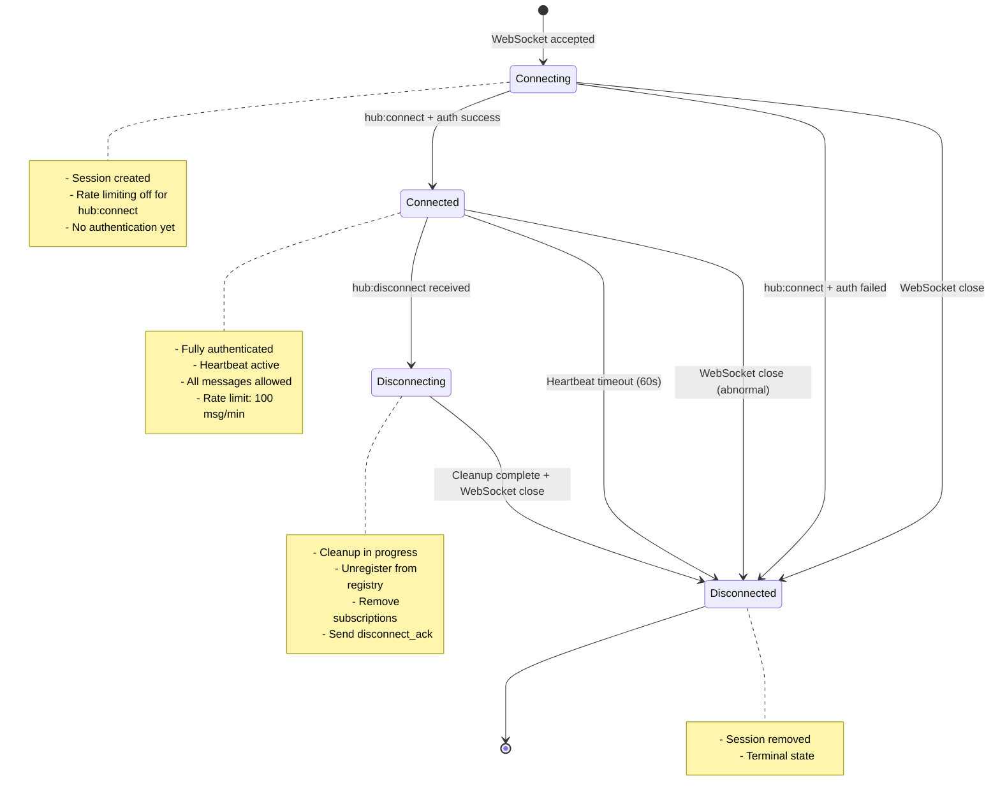

# Specification: Connection State Machine

## 1. Core Principle: Explicit State Tracking

Every WebSocket connection has an explicit `connectionState` field in its session that tracks the connection lifecycle. This enables proper cleanup, debugging, and graceful disconnection.

## 2. Connection States

```typescript
type ConnectionState = 'connecting' | 'connected' | 'disconnecting' | 'disconnected';
```

### State Definitions

#### `connecting`
- **Entry:** WebSocket accepted, session created
- **Characteristics:**
  - No authentication yet
  - Cannot send messages (except `hub:connect`)
  - Rate limiting disabled for `hub:connect`
- **Exit:** Successful `hub:connect` → `connected`

#### `connected`
- **Entry:** `hub:connect` acknowledged
- **Characteristics:**
  - Fully authenticated (if `AUTH_ENABLED=true`)
  - Can send/receive all message types
  - Rate limiting active (100 msg/min)
  - Heartbeat expected every 60 seconds
- **Exit:**
  - Graceful: `hub:disconnect` → `disconnecting`
  - Forced: WebSocket close → `disconnected`

#### `disconnecting`
- **Entry:** `hub:disconnect` received
- **Characteristics:**
  - Session cleanup in progress
  - `hub:disconnect_ack` sent
  - Registry cleanup (unregister actor)
  - Topic cleanup (remove subscriptions)
- **Exit:** WebSocket close → `disconnected`

#### `disconnected`
- **Entry:** WebSocket closed
- **Characteristics:**
  - Session removed from memory
  - No further message processing
  - Cleanup complete
- **Terminal state:** No transitions out

## 3. State Diagram



## 4. Transition Table

| From | Event | To | Conditions | Actions |
|------|-------|-----|-----------|---------|
| `[*]` | WebSocket accept | `connecting` | None | Create session, store in `sessions` map |
| `connecting` | `hub:connect` (success) | `connected` | Valid JWT (if auth enabled) | Set `actorIdentity`, `authenticated=true`, store in `connections` map |
| `connecting` | `hub:connect` (failure) | `disconnected` | Invalid JWT or version mismatch | Send `hub:error`, close WebSocket |
| `connecting` | WebSocket close | `disconnected` | Client disconnect before connect | Remove session |
| `connected` | `hub:disconnect` | `disconnecting` | None | Unregister actor, cleanup subscriptions |
| `connected` | WebSocket close | `disconnected` | Abnormal disconnect | Emergency cleanup (no ack sent) |
| `connected` | Heartbeat timeout | `disconnected` | No heartbeat for 60s | Close WebSocket, cleanup |
| `disconnecting` | WebSocket close | `disconnected` | After `hub:disconnect_ack` sent | Remove session |
| `disconnecting` | Timeout (30s) | `disconnected` | Cleanup took too long | Force close WebSocket |

## 5. Heartbeat Behavior

### Purpose
Heartbeats detect **dead connections**, not prevent hibernation.

### Configuration
```typescript
const HEARTBEAT_CONFIG = {
  clientInterval: 30_000,   // Client sends every 30s
  serverTimeout: 60_000,    // Server expects within 60s
  missedThreshold: 2        // 2 missed = disconnect
};
```

### Client Behavior
```typescript
// Client sends heartbeat every 30s
setInterval(() => {
  if (connectionState === 'connected') {
    send({
      type: 'hub:heartbeat',
      payload: { timestamp: Date.now() }
    });
  }
}, 30_000);
```

### Server Behavior
```typescript
// Update lastHeartbeat on ANY message received
session.lastHeartbeat = Date.now();

// Periodic cleanup (every 30s)
setInterval(() => {
  const now = Date.now();
  for (const [ws, session] of sessions) {
    if (session.connectionState === 'connected' &&
        now - session.lastHeartbeat > 60_000) {
      // Heartbeat timeout - force disconnect
      console.log(`Heartbeat timeout for session ${session.sessionId}`);
      ws.close(1000, 'Heartbeat timeout');
      handleSessionCleanup(ws, session);
    }
  }
}, 30_000);
```

### Critical Implementation Note
**Heartbeats DO NOT prevent hibernation.** Cloudflare automatically wakes hibernated WebSockets on incoming messages. The heartbeat's purpose is to:
1. Detect dead connections that can't wake up
2. Provide client with round-trip latency measurement
3. Keep session's `lastHeartbeat` timestamp fresh

## 6. Hibernation Behavior

### What Hibernation Means
- WebSocket enters low-power state after inactivity
- **Automatic wake on message arrival**
- In-memory state (registry, sessions) **persists**
- No explicit prevention mechanism exists

### State Preservation
All in-memory state survives hibernation:
```typescript
// These survive hibernation
private sessions: Map<WebSocket, Session>;        // ✅ Persists
private registry: Map<string, ActorRegistration>; // ✅ Persists
private subscriptions: Map<string, Set<...>>;     // ✅ Persists

// These do NOT survive Durable Object eviction (different from hibernation)
// Eviction = complete restart of the DO instance
```

### Reconnection After Eviction
If the Durable Object is evicted (not hibernated):
1. All WebSocket connections close (code 1001: "Going Away")
2. Clients detect close and reconnect
3. Clients re-authenticate via `hub:connect`
4. Clients re-register via `hub:register`
5. Clients re-subscribe to topics via `hub:subscribe`

## 7. Cleanup Protocol

### Graceful Disconnect (hub:disconnect)
```typescript
async handleDisconnect(msg: SharedMessage, session: Session, ws: WebSocket) {
  // 1. Transition to disconnecting
  session.connectionState = 'disconnecting';
  session.disconnectedAt = Date.now();

  // 2. Unregister from registry
  if (session.actorIdentity) {
    this.registry.delete(session.actorIdentity);
  }

  // 3. Cleanup subscriptions
  cleanupSubscriptions(session.actorIdentity, this.subscriptions);

  // 4. Send acknowledgment BEFORE closing
  const ack = {
    type: 'hub:disconnect_ack',
    from: SIGNAL_HUB_ADDRESS,
    to: msg.from,
    payload: {
      sessionId: session.sessionId,
      cleanedUp: true
    }
  };
  ws.send(JSON.stringify(ack));

  // 5. Close WebSocket
  ws.close(1000, 'Normal closure');

  // 6. Transition to disconnected
  session.connectionState = 'disconnected';

  // 7. Remove session
  this.sessions.delete(ws);
  this.connections.delete(session.sessionId);
}
```

### Abnormal Disconnect (WebSocket close without hub:disconnect)
```typescript
webSocketClose(ws: WebSocket, code: number, reason: string) {
  const session = this.sessions.get(ws);
  if (!session) return;

  console.log(`WebSocket closed abnormally: code=${code}, reason=${reason}`);

  // Emergency cleanup (no ack possible)
  if (session.actorIdentity) {
    this.registry.delete(session.actorIdentity);
  }

  cleanupSubscriptions(session.actorIdentity, this.subscriptions);

  session.connectionState = 'disconnected';
  session.disconnectedAt = Date.now();

  this.sessions.delete(ws);
  this.connections.delete(session.sessionId);
}
```

### Heartbeat Timeout Disconnect
```typescript
function heartbeatCleanup(ws: WebSocket, session: Session) {
  console.log(`Heartbeat timeout for session ${session.sessionId}`);

  // 1. Force close WebSocket
  ws.close(1000, 'Heartbeat timeout');

  // 2. Cleanup (same as abnormal disconnect)
  if (session.actorIdentity) {
    this.registry.delete(session.actorIdentity);
  }

  cleanupSubscriptions(session.actorIdentity, this.subscriptions);

  session.connectionState = 'disconnected';
  session.disconnectedAt = Date.now();

  this.sessions.delete(ws);
  this.connections.delete(session.sessionId);
}
```

## 8. Edge Cases

### Race Condition: Disconnect During Send
**Scenario:** Client sends message, server processes, connection closes before response sent.

**Handling:**
```typescript
try {
  const response = await routeMessage(msg, session, ws);
  if (response && session.connectionState === 'connected') {
    ws.send(JSON.stringify(response));
  }
} catch (err) {
  // Connection closed mid-send
  if (session.connectionState === 'disconnected') {
    console.log('Suppressing send to disconnected session');
  } else {
    throw err;
  }
}
```

### Duplicate hub:connect
**Scenario:** Client sends `hub:connect` twice on same connection.

**Handling:**
```typescript
if (session.connectionState === 'connected') {
  throw new HubError('internal_error', 'Already connected');
}
```

### hub:disconnect Without hub:connect
**Scenario:** Client sends `hub:disconnect` in `connecting` state.

**Handling:**
```typescript
if (session.connectionState !== 'connected') {
  // Allow disconnect from any state
  ws.close(1000, 'Disconnect before connect');
  return null;
}
```

### Heartbeat During Disconnecting
**Scenario:** `hub:heartbeat` arrives while in `disconnecting` state.

**Handling:**
```typescript
if (session.connectionState === 'disconnecting') {
  // Ignore heartbeats during cleanup
  return null;
}
```

## 9. Client State Management

Clients MUST track their own connection state independently:

```typescript
class SignalHubClient {
  private connectionState: ConnectionState = 'connecting';

  async connect() {
    this.connectionState = 'connecting';
    this.ws = new WebSocket(this.url);

    this.ws.onopen = () => {
      // Still 'connecting' until hub:connected received
      this.send({ type: 'hub:connect', ... });
    };

    this.ws.onmessage = (event) => {
      const msg = JSON.parse(event.data);

      if (msg.type === 'hub:connected') {
        this.connectionState = 'connected';
        this.emit('connected', msg.payload);
      }

      if (msg.type === 'hub:disconnect_ack') {
        this.connectionState = 'disconnected';
        this.ws.close();
      }
    };

    this.ws.onclose = () => {
      this.connectionState = 'disconnected';
      this.emit('disconnected');
    };
  }

  async disconnect() {
    if (this.connectionState !== 'connected') {
      throw new Error('Not connected');
    }

    this.connectionState = 'disconnecting';
    this.send({ type: 'hub:disconnect', ... });

    // Wait for hub:disconnect_ack (with timeout)
    await this.waitForAck('hub:disconnect_ack', 5000);
  }
}
```

## 10. Monitoring and Debugging

### State Transition Logging
Every state transition should be logged:

```typescript
function transitionState(
  session: Session,
  from: ConnectionState,
  to: ConnectionState,
  reason: string
) {
  console.log(JSON.stringify({
    event: 'state_transition',
    sessionId: session.sessionId,
    actorIdentity: session.actorIdentity,
    from,
    to,
    reason,
    timestamp: Date.now()
  }));

  session.connectionState = to;
}
```

### State Metrics
Track state distribution for monitoring:

```typescript
interface StateMetrics {
  connecting: number;
  connected: number;
  disconnecting: number;
  disconnected: number;
}

function getStateMetrics(sessions: Map<WebSocket, Session>): StateMetrics {
  const metrics = {
    connecting: 0,
    connected: 0,
    disconnecting: 0,
    disconnected: 0
  };

  for (const session of sessions.values()) {
    metrics[session.connectionState]++;
  }

  return metrics;
}
```

## 11. Cross-Reference

See also:
- **PROTOCOL.spec.md** - Message types and payloads
- **SCHEMAS.spec.md** - Session type definition
- **EDGE_CASES.spec.md** - Failure scenarios
- **CLIENT.spec.md** - Client-side state management
