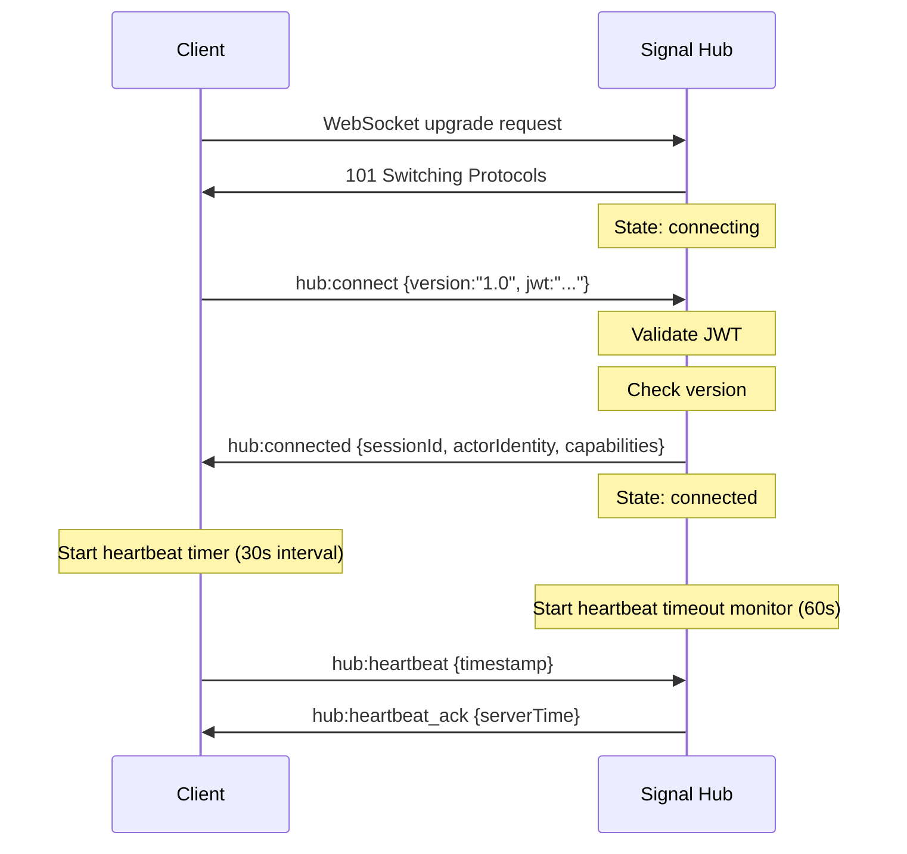

# Scenario: Initial Connection

Successful first-time connection to Signal Hub with authentication.

## Setup

- WebSocket connection established to `wss://signal-hub.example.com`
- Client has valid JWT token
- Client protocol version matches server (`1.0`)
- `AUTH_ENABLED=true`

## Flow



## Step-by-Step

1. **Client initiates WebSocket**
   ```
   WebSocket upgrade: wss://signal-hub.example.com
   ```

2. **Server accepts connection**
   - Creates session with state `connecting`
   - Generates `sessionId`
   - Initializes rate limit bucket (100 msg/min)

3. **Client sends hub:connect**
   ```json
   {
     "type": "hub:connect",
     "from": "browser/client-ui",
     "to": "cloudflare/signal-hub",
     "payload": {
       "version": "1.0",
       "jwt": "eyJhbGciOiJIUzI1NiIsInR5cCI6IkpXVCJ9..."
     }
   }
   ```

4. **Server validates**
   - Protocol version: `1.0` matches server version ✓
   - JWT signature: Valid ✓
   - JWT expiration: Not expired ✓
   - Extracts `actorId` and `capabilities` from JWT

5. **Server responds with hub:connected**
   ```json
   {
     "type": "hub:connected",
     "from": "cloudflare/signal-hub",
     "to": "browser/client-ui",
     "payload": {
       "sessionId": "sess_abc123",
       "actorIdentity": "browser/client-ui",
       "capabilities": ["send", "receive", "discover"],
       "serverTime": 1708272000000
     }
   }
   ```

6. **State transition**
   - Session state: `connecting` → `connected`
   - Session stored in `connections` map (sessionId → WebSocket)

7. **Client starts heartbeat**
   - Interval: Every 30 seconds
   - First heartbeat sent immediately

8. **Server monitors heartbeat**
   - Timeout: 60 seconds
   - Any message updates `session.lastHeartbeat`

## Expected Outcome

- ✅ Connection state: `connected`
- ✅ Session registered with valid `sessionId`
- ✅ Actor identity extracted from JWT
- ✅ Capabilities available for authorization checks
- ✅ Rate limiting active (100 msg/min)
- ✅ Heartbeat mechanism operational
- ✅ Ready to send `hub:register` for actor discovery

## Error Paths

### Version Mismatch

**Trigger:** Client sends `version: "0.9"` but server expects `"1.0"`

```json
{
  "type": "hub:error",
  "from": "cloudflare/signal-hub",
  "to": "browser/client-ui",
  "payload": {
    "code": "version_mismatch",
    "message": "Protocol version 1.0 required, got 0.9",
    "details": {
      "expected": "1.0",
      "received": "0.9"
    }
  }
}
```

**Result:** Connection closed, client must upgrade

### Invalid JWT

**Trigger:** JWT expired, invalid signature, or missing when `AUTH_ENABLED=true`

```json
{
  "type": "hub:error",
  "from": "cloudflare/signal-hub",
  "to": "browser/client-ui",
  "payload": {
    "code": "unauthorized",
    "message": "Invalid JWT: Token expired",
    "details": {
      "reason": "Token expired"
    }
  }
}
```

**Result:** Connection closed, client must re-authenticate

## Metrics

- **Time to connect:** < 100ms (local network)
- **Time to hub:connected:** < 200ms (including JWT validation)
- **Heartbeat latency:** Typically 50-100ms round-trip
- **Connection state:** Immediately transitions to `connected` on success

## See Also

- [reconnect.md](./reconnect.md) - Reconnection after disconnect
- [auth-failure.md](./auth-failure.md) - Authentication error handling
- [../protocol.json](../protocol.json) - Full protocol definition
- [../state-machine.json](../state-machine.json) - State machine specification
