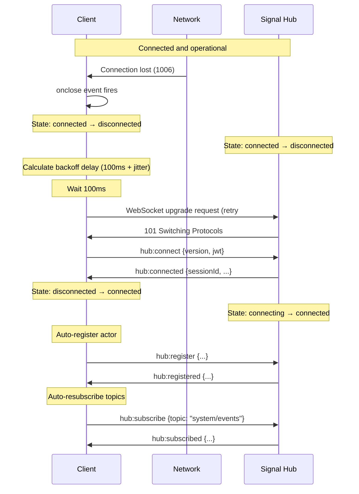

# Scenario: Reconnection After Disconnect

Automatic reconnection after connection loss with exponential backoff.

## Setup

- Client was previously connected (`connected` state)
- Network failure causes WebSocket close (code 1006)
- Client has `reconnect: true` configuration
- Original JWT is still valid

## Flow



## Step-by-Step

1. **Connection loss detected**
   ```javascript
   ws.onclose = (event) => {
     console.log('Connection closed:', event.code, event.reason);
     // event.code = 1006 (abnormal closure)
   }
   ```

2. **Client state cleanup**
   - Stop heartbeat timer
   - Set `connectionState = 'disconnected'`
   - Clear WebSocket reference
   - Emit `disconnected` event

3. **Server state cleanup** (automatic)
   - Session removed from `sessions` map
   - Actor unregistered from registry
   - Topic subscriptions removed
   - Connection removed from `connections` map

4. **Client schedules reconnect**
   ```javascript
   const delay = getReconnectDelay(attemptNumber);
   // Attempt 1: 100ms * 2^0 + jitter = ~100ms
   // Attempt 2: 100ms * 2^1 + jitter = ~200ms
   // Attempt 3: 100ms * 2^2 + jitter = ~400ms
   // ...max 30s
   ```

5. **Reconnect attempt**
   - Create new WebSocket
   - Send `hub:connect` with **same JWT** (if still valid)
   - Receive new `sessionId` (different from previous)

6. **Auto-register** (if `autoRegister: true`)
   ```javascript
   await client.register({
     actorAddress: 'browser/client-ui',
     capabilities: ['send', 'receive'],
     metadata: {},
     ttl: 300000
   });
   ```

7. **Auto-resubscribe** (if `autoResubscribe: true`)
   ```javascript
   for (const topic of subscribedTopics) {
     await client.subscribe(topic);
   }
   ```

## Expected Outcome

- ✅ Client reconnects with exponential backoff
- ✅ New `sessionId` obtained
- ✅ Actor re-registered in hub registry
- ✅ Topic subscriptions restored
- ✅ Application state consistent
- ✅ Reconnection transparent to application logic

## Backoff Strategy

### Exponential Backoff with Jitter

```javascript
function getReconnectDelay(attempt) {
  const baseDelay = Math.min(
    100 * Math.pow(2, attempt - 1),  // Exponential
    30000                             // Max 30 seconds
  );

  // Add 25% random jitter
  const jitter = baseDelay * 0.25 * (Math.random() - 0.5);

  return baseDelay + jitter;
}
```

### Delay Progression

| Attempt | Base Delay | With Jitter (approx) |
|---------|-----------|---------------------|
| 1       | 100ms     | 75-125ms            |
| 2       | 200ms     | 150-250ms           |
| 3       | 400ms     | 300-500ms           |
| 4       | 800ms     | 600-1000ms          |
| 5       | 1600ms    | 1200-2000ms         |
| 6       | 3200ms    | 2400-4000ms         |
| 7       | 6400ms    | 4800-8000ms         |
| 8       | 12800ms   | 9600-16000ms        |
| 9+      | 30000ms   | 22500-37500ms       |

## Error Paths

### JWT Expired During Reconnect

**Trigger:** JWT valid during initial connection, but expired by reconnect time

```json
{
  "type": "hub:error",
  "payload": {
    "code": "unauthorized",
    "message": "Invalid JWT: Token expired"
  }
}
```

**Recovery:**
1. Client detects `unauthorized` error
2. Triggers re-authentication flow
3. Obtains new JWT
4. Retries `hub:connect` with new JWT

### Max Retries Exceeded

**Trigger:** 10 consecutive reconnect failures

```javascript
if (reconnectAttempt >= config.maxReconnectAttempts) {
  console.error('Max reconnect attempts exceeded');
  connectionState = 'disconnected';
  emit('reconnect_failed');
  // Stop trying
}
```

**Result:** Client gives up, user intervention required

### Duplicate Connection During Reconnect

**Trigger:** Old connection still alive when new connection registers

**Server behavior:**
- Detects duplicate `actorIdentity` in registry
- Sends `hub:disconnect` to old connection
- Closes old WebSocket
- Accepts new connection

**Client behavior (old connection):**
```javascript
ws.onmessage = (msg) => {
  if (msg.type === 'hub:disconnect' &&
      msg.payload.reason === 'duplicate_connection') {
    // Don't auto-reconnect (superseded)
    config.reconnect = false;
    emit('superseded');
  }
}
```

## Metrics

- **Typical reconnect time:** < 200ms (first attempt)
- **Success rate:** > 95% within 3 attempts
- **Jitter reduces thundering herd:** ±25% spread
- **Max retry duration:** ~1 minute (10 attempts)

## Configuration

```typescript
const client = new SignalHubClient({
  url: 'wss://signal-hub.example.com',
  actorAddress: 'browser/client-ui',

  // Reconnection settings
  reconnect: true,              // Enable auto-reconnect
  maxReconnectAttempts: 10,     // Give up after 10 tries
  reconnectDelay: 100,          // Initial delay (ms)
  maxReconnectDelay: 30000,     // Cap at 30 seconds

  // Auto-recovery
  autoRegister: true,           // Re-register after reconnect
  autoResubscribe: true,        // Re-subscribe to topics
});
```

## See Also

- [initial-connect.md](./initial-connect.md) - First-time connection
- [hibernation-wake.md](./hibernation-wake.md) - Hibernation vs eviction
- [../../schemas/error-response.schema.json](../../schemas/error-response.schema.json) - Error format
