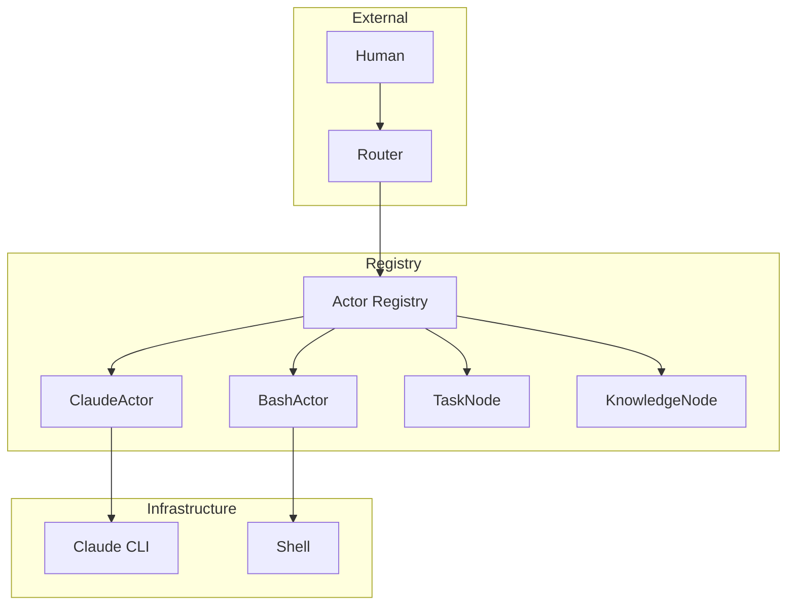
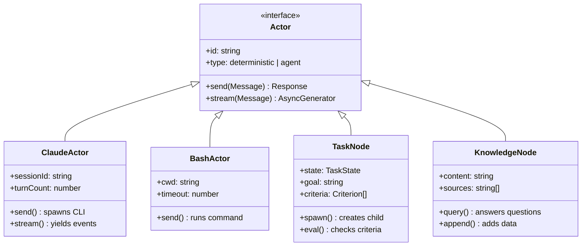
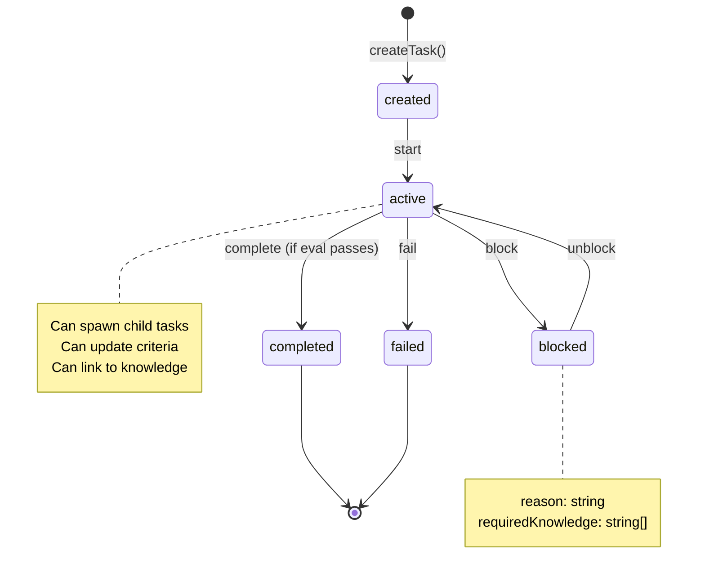
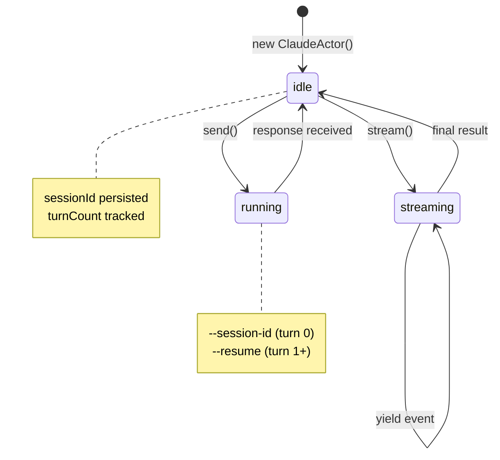
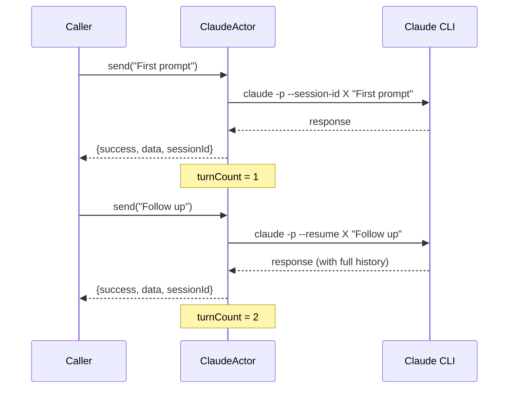
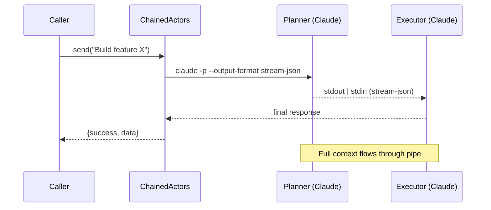
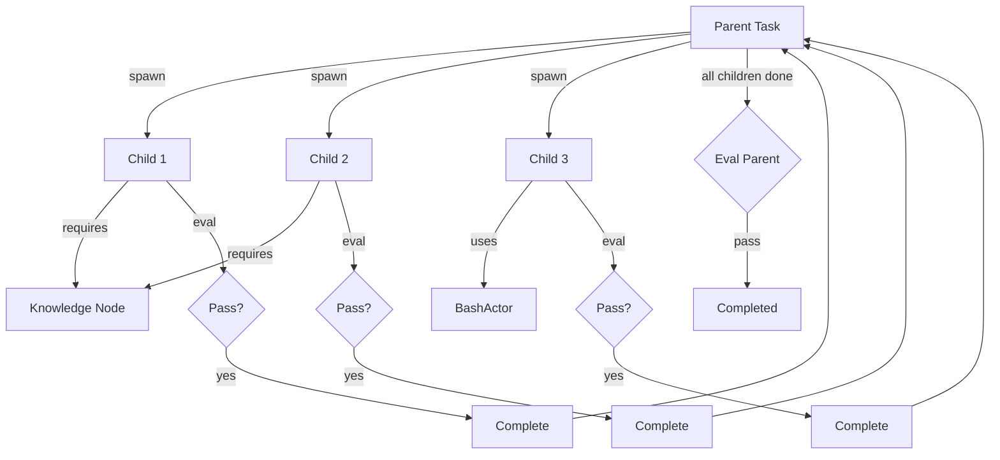

# tk-agents: Design & Architecture

## Overview

A unified actor-based system for task and knowledge management. All interactions happen through message passing (`SEND`). Actors can be deterministic (scripts, recipes) or non-deterministic (LLM agents).



---

## Core Concepts

### Everything is an Actor



### Actor Spectrum

```
Deterministic                                              Non-deterministic
     │                                                              │
     ▼                                                              ▼
BashActor ──── RecipeActor ──── TaskNode ──── KnowledgeNode ──── ClaudeActor
     │              │              │               │                  │
  "run it"     "follow it"    "manage it"    "query it"        "figure it out"
```

---

## State Machines

### Task Lifecycle



### Claude Session Lifecycle



---

## Message Protocol

### Standard Messages (All Actors)

| Message | Payload | Response | Description |
|---------|---------|----------|-------------|
| `get` | `{}` | `{id, type, properties, edges}` | Get actor state |
| `observe` | `{}` | `{state, observations, metadata}` | Get observations |
| `update` | `{properties}` | `{success, updatedProperties}` | Update properties |
| `link` | `{toId, edgeType}` | `{edgeId, success}` | Create edge |
| `unlink` | `{edgeId}` | `{success}` | Remove edge |
| `delete` | `{}` | `{success}` | Remove actor |

### Task Messages

| Message | Payload | Response | Description |
|---------|---------|----------|-------------|
| `start` | `{context?}` | `{success, state}` | Begin execution |
| `spawn` | `{goal, criteria, ...}` | `{childTaskId, success}` | Create child task |
| `eval` | `{}` | `{score, passed, criteria, observations}` | Evaluate criteria |
| `complete` | `{result, artifacts?}` | `{success, finalState}` | Mark complete |
| `block` | `{reason, requiredKnowledge?}` | `{success, state}` | Mark blocked |
| `query_status` | `{}` | `{state, progress, blockers, children}` | Get full status |

### Knowledge Messages

| Message | Payload | Response | Description |
|---------|---------|----------|-------------|
| `append` | `{data, source?}` | `{success, version}` | Add content |
| `query` | `{question, context?}` | `{answer, confidence, sources}` | Ask question |
| `synthesize` | `{fromNodes}` | `{synthesis, sources}` | Combine knowledge |

---

## Scenarios (BDD Style)

### Scenario: Task Delegation

```gherkin
Feature: Task delegation between actors

  Scenario: Coordinator delegates to worker
    Given a "coordinator" ClaudeActor with system prompt "You are a task coordinator"
    And a "worker" BashActor
    And the coordinator is registered in the registry
    And the worker is registered in the registry

    When I send "plan" message to coordinator with payload "deploy the app"
    Then the response should contain action "delegate"
    And the response should contain target actor "worker"

    When I send the delegated task to the worker
    Then the worker should execute the command
    And the response should indicate success
```

### Scenario: Resumable Session

```gherkin
Feature: Multi-turn conversation with session persistence

  Scenario: Claude remembers previous turns
    Given a ClaudeActor with id "tutor" and model "haiku"

    When I send "What is 15 + 27?"
    Then I receive a response containing "42"
    And the session turnCount is 1

    When I send "Double that number"
    Then I receive a response containing "84"
    And the session turnCount is 2
    And the same sessionId is used

    When I send "What was my first question?"
    Then I receive a response mentioning "15" and "27"
```

### Scenario: Chained Pipeline

```gherkin
Feature: Stream-chaining between Claude actors

  Scenario: Planner to Executor pipeline
    Given a ChainedActors with:
      | name     | prompt                    |
      | planner  | Break down the task       |
      | executor | Execute the plan steps    |

    When I send "Build a REST API" to the chain
    Then the planner receives the input
    And the planner's output streams to the executor
    And the executor receives full context from planner
    And I receive the final executor response
```

---

## Test Fixtures

### Actor Fixtures

```typescript
// fixtures/actors.ts

export const fixtures = {
  // Echo actor - returns payload as-is
  echoActor: () => createEchoMock("echo"),

  // Failing actor - always fails
  failingActor: (error: string) => createFailingMock("fail", error),

  // Claude-like actor with canned responses
  claudeActor: (responses: string[]) => createClaudeMock("claude", responses),

  // Bash actor with custom cwd
  bashActor: (cwd: string) => createBashActor({ id: "bash", cwd }),
};
```

### Message Fixtures

```typescript
// fixtures/messages.ts

export const messages = {
  // Standard task messages
  startTask: (context = {}) => createMessage("start", { context }),
  evalTask: () => createMessage("eval", {}),
  completeTask: (result: unknown) => createMessage("complete", { result }),

  // Spawn with criteria
  spawnTask: (goal: string, criteria: Criterion[]) => createMessage("spawn", {
    goal,
    deliverables: [],
    criteria,
  }),

  // Knowledge queries
  query: (question: string) => createMessage("query", { question }),
  append: (data: string, source?: string) => createMessage("append", { data, source }),
};
```

### Scenario Table (FIT-style)

| Scenario | Actor Type | Input | Expected Output | Expected State |
|----------|------------|-------|-----------------|----------------|
| Echo | MockActor | `{x: 1}` | `{x: 1}` | - |
| Bash pwd | BashActor(cwd=/tmp) | `pwd` | `/tmp\n` | - |
| Bash fail | BashActor | `exit 1` | error | - |
| Bash timeout | BashActor(timeout=100) | `sleep 5` | timeout error | - |
| Task start | TaskNode(state=created) | `start` | success | active |
| Task spawn | TaskNode(state=active) | `spawn{goal}` | childId | - |
| Task eval pass | TaskNode(criteria met) | `eval` | passed=true | - |
| Task eval fail | TaskNode(criteria not met) | `eval` | passed=false | - |
| Knowledge query | KnowledgeNode | `query{q}` | answer, confidence | - |

---

## Architecture Patterns

### Pattern 1: Resumable Session



### Pattern 2: Chained Pipeline



### Pattern 3: Task Decomposition



---

## Directory Structure

```
tk-agents/
├── src/
│   ├── actors/
│   │   ├── base.ts           # Actor interface, Message/Response types
│   │   ├── registry.ts       # Actor management, routing
│   │   ├── claude.ts         # ClaudeActor (resumable sessions)
│   │   ├── chain.ts          # ChainedActors (pipeline)
│   │   ├── bash.ts           # BashActor (deterministic)
│   │   ├── mock.ts           # MockActor (testing)
│   │   └── actors.test.ts    # Unit tests
│   ├── graph.ts              # Graph store, SEND routing
│   ├── task.ts               # TaskNode, lifecycle
│   ├── knowledge.ts          # KnowledgeNode
│   ├── types.ts              # Shared types
│   └── index.ts              # Exports
├── integration/
│   ├── test-claude-actor.ts  # Real CLI tests
│   └── test-chain.ts         # Pipeline tests
├── demo.ts                   # Task lifecycle demo
└── DESIGN.md                 # This document
```

---

## Running Tests

```bash
# Unit tests (uses mocks, runs anywhere)
bun test

# Integration tests (requires Claude CLI, run outside Claude)
bun run integration/test-claude-actor.ts
bun run integration/test-chain.ts

# Demo
bun run demo.ts
```

---

## Future Work

- [ ] HTTP/Socket server for external access
- [ ] Persistence layer (SQLite)
- [ ] Pattern extraction from completed tasks
- [ ] RecipeActor for multi-step deterministic workflows
- [ ] Uncertainty/escalation protocol
- [ ] Human-in-the-loop approval flow
