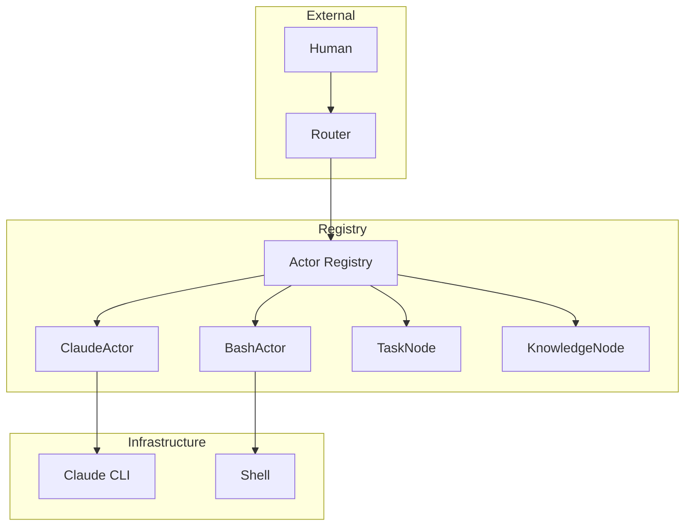
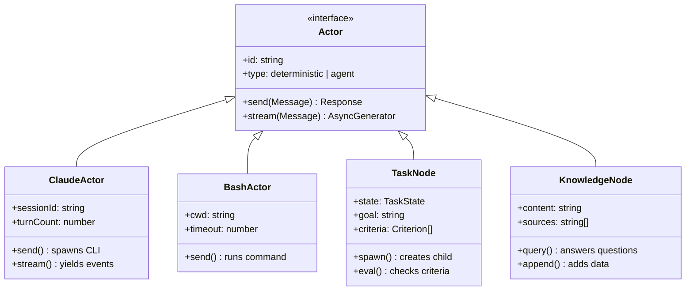
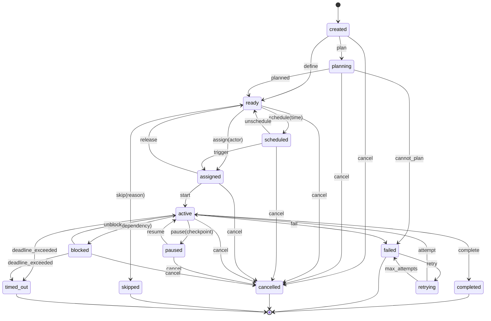
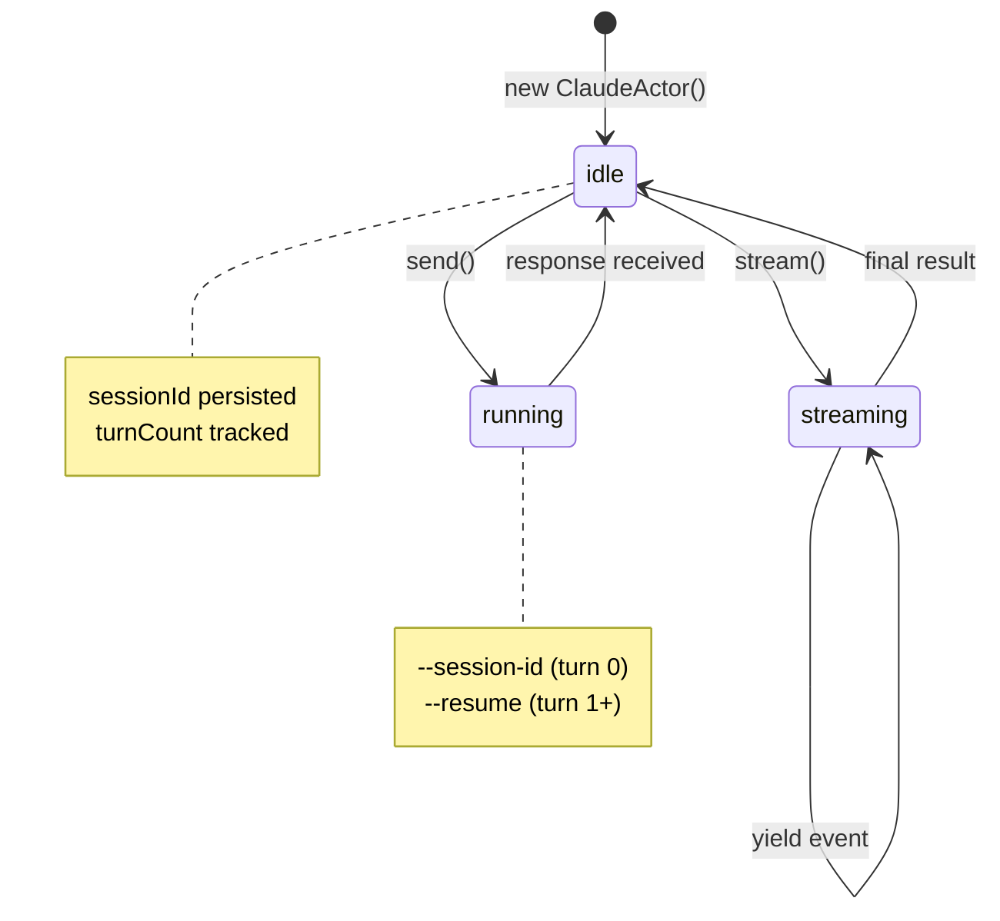
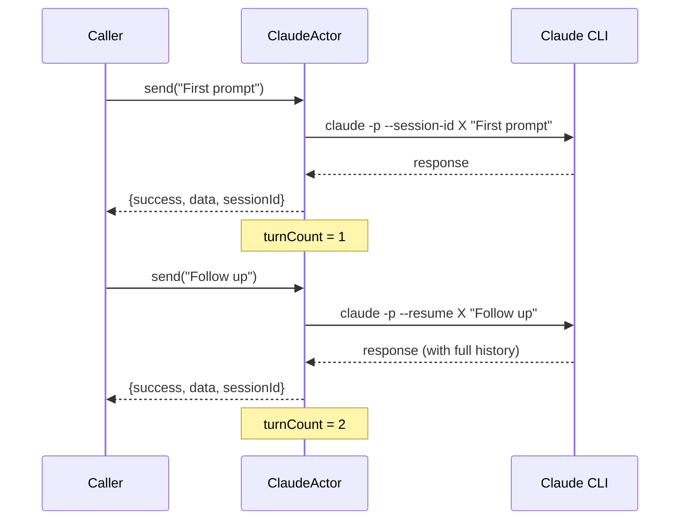
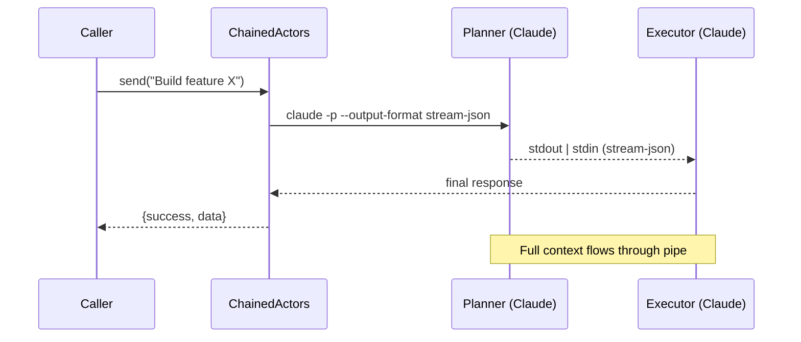
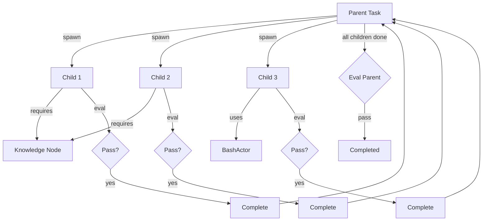

# tk-agents: Design & Architecture

## Overview

A unified actor-based system for task and knowledge management. All interactions happen through message passing (`SEND`). Actors can be deterministic (scripts, recipes) or non-deterministic (LLM agents).


```mermaid
graph TB
    subgraph "External"
        H[Human] --> R[Router]
    end

    subgraph "Registry"
        R --> REG[Actor Registry]
        REG --> A1[ClaudeActor]
        REG --> A2[BashActor]
        REG --> A3[TaskNode]
        REG --> A4[KnowledgeNode]
    end

    subgraph "Infrastructure"
        A1 --> CLI[Claude CLI]
        A2 --> BASH[Shell]
    end
```

---

## Core Concepts

### Everything is an Actor


```mermaid
classDiagram
    class Actor {
        <<interface>>
        +id: string
        +type: deterministic | agent
        +send(Message) Response
        +stream(Message) AsyncGenerator
    }

    class ClaudeActor {
        +sessionId: string
        +turnCount: number
        +send() spawns CLI
        +stream() yields events
    }

    class BashActor {
        +cwd: string
        +timeout: number
        +send() runs command
    }

    class TaskNode {
        +state: TaskState
        +goal: string
        +criteria: Criterion[]
        +spawn() creates child
        +eval() checks criteria
    }

    class KnowledgeNode {
        +content: string
        +sources: string[]
        +query() answers questions
        +append() adds data
    }

    Actor <|-- ClaudeActor
    Actor <|-- BashActor
    Actor <|-- TaskNode
    Actor <|-- KnowledgeNode
```

### Actor Spectrum

```
Deterministic                                              Non-deterministic
     │                                                              │
     ▼                                                              ▼
BashActor ──── RecipeActor ──── TaskNode ──── KnowledgeNode ──── ClaudeActor
     │              │              │               │                  │
  "run it"     "follow it"    "manage it"    "query it"        "figure it out"
```

---

## State Machines

### Task States

```typescript
type TaskState =
  // Lifecycle
  | "created"     // Exists, minimal definition
  | "planning"    // Being decomposed/researched by agent
  | "ready"       // Fully defined, in backlog, waiting for capacity
  | "scheduled"   // Will run at specific time or when condition met
  | "assigned"    // Claimed by an actor, not yet started
  | "active"      // Being worked on
  | "paused"      // Intentionally stopped, can resume with checkpoint
  | "blocked"     // Waiting on dependency/info/human

  // Retry loop
  | "retrying"    // Failed, attempting again (with backoff)

  // Terminal states
  | "completed"   // Finished successfully
  | "failed"      // Errored (after max retries)
  | "cancelled"   // Explicitly aborted by user/system
  | "skipped"     // Intentionally not executed (conditional)
  | "timed_out";  // Deadline exceeded
```

### Task Lifecycle (Complete)


```mermaid
stateDiagram-v2
    [*] --> created

    created --> planning: plan
    created --> ready: define
    created --> cancelled: cancel

    planning --> ready: planned
    planning --> failed: cannot_plan
    planning --> cancelled: cancel

    ready --> scheduled: schedule(time)
    ready --> assigned: assign(actor)
    ready --> skipped: skip(reason)
    ready --> cancelled: cancel

    scheduled --> ready: unschedule
    scheduled --> assigned: trigger
    scheduled --> cancelled: cancel

    assigned --> ready: release
    assigned --> active: start
    assigned --> cancelled: cancel

    active --> paused: pause(checkpoint)
    active --> blocked: block(dependency)
    active --> completed: complete
    active --> failed: fail
    active --> timed_out: deadline_exceeded
    active --> cancelled: cancel

    paused --> active: resume
    paused --> cancelled: cancel

    blocked --> active: unblock
    blocked --> cancelled: cancel
    blocked --> timed_out: deadline_exceeded

    failed --> retrying: retry
    retrying --> active: attempt
    retrying --> failed: max_attempts

    completed --> [*]
    failed --> [*]
    cancelled --> [*]
    skipped --> [*]
    timed_out --> [*]
```

### Task State Descriptions

| State | Entry Condition | Can Transition To | Notes |
|-------|-----------------|-------------------|-------|
| `created` | Task instantiated | planning, ready, cancelled | Minimal definition |
| `planning` | Agent decomposing task | ready, failed, cancelled | WBS, research, criteria |
| `ready` | Fully defined | scheduled, assigned, skipped, cancelled | In backlog |
| `scheduled` | Time/condition set | ready, assigned, cancelled | Triggers automatically |
| `assigned` | Actor claimed it | ready, active, cancelled | Reserved, prevents double-assign |
| `active` | Work started | paused, blocked, completed, failed, timed_out, cancelled | Can spawn children |
| `paused` | Intentionally stopped | active, cancelled | Checkpoint saved |
| `blocked` | Waiting on dependency | active, cancelled, timed_out | Has blockers list |
| `retrying` | Failed, will retry | active, failed | Attempt count tracked |
| `completed` | Success | - | Terminal |
| `failed` | Error/max retries | - | Terminal |
| `cancelled` | Explicit abort | - | Terminal, propagates to children |
| `skipped` | Conditional skip | - | Terminal |
| `timed_out` | Deadline exceeded | - | Terminal |

### Propagation Rules

```
cancel(parent)  → cancel(all children recursively)
timeout(parent) → timeout(active children)
fail(child)     → may block or fail parent (configurable: failFast vs collect)
complete(all children) → unblock parent for eval
```

### Claude Session Lifecycle


```mermaid
stateDiagram-v2
    [*] --> idle: new ClaudeActor()

    idle --> running: send()
    running --> idle: response received

    idle --> streaming: stream()
    streaming --> streaming: yield event
    streaming --> idle: final result

    note right of idle
        sessionId persisted
        turnCount tracked
    end note

    note right of running
        --session-id (turn 0)
        --resume (turn 1+)
    end note
```

---

## Message Protocol

### Standard Messages (All Actors)

| Message | Payload | Response | Description |
|---------|---------|----------|-------------|
| `get` | `{}` | `{id, type, properties, edges}` | Get actor state |
| `observe` | `{}` | `{state, observations, metadata}` | Get observations |
| `update` | `{properties}` | `{success, updatedProperties}` | Update properties |
| `link` | `{toId, edgeType}` | `{edgeId, success}` | Create edge |
| `unlink` | `{edgeId}` | `{success}` | Remove edge |
| `delete` | `{}` | `{success}` | Remove actor |

### Task Messages

#### Lifecycle Messages

| Message | From States | Payload | Response | Description |
|---------|-------------|---------|----------|-------------|
| `plan` | created | `{agent?}` | `{success, state}` | Start planning phase |
| `define` | created, planning | `{criteria, deliverables}` | `{success, state}` | Mark as fully defined |
| `schedule` | ready | `{time?, condition?}` | `{success, state}` | Schedule for later |
| `unschedule` | scheduled | `{}` | `{success, state}` | Remove schedule |
| `assign` | ready, scheduled | `{actorId}` | `{success, state}` | Claim for actor |
| `release` | assigned | `{}` | `{success, state}` | Return to ready |
| `start` | assigned | `{context?}` | `{success, state}` | Begin execution |
| `pause` | active | `{reason?, checkpoint?}` | `{success, state}` | Pause with checkpoint |
| `resume` | paused | `{context?}` | `{success, state}` | Resume from checkpoint |
| `block` | active | `{reason, dependencies?}` | `{success, state}` | Mark blocked |
| `unblock` | blocked | `{resolution?}` | `{success, state}` | Clear blocker |
| `complete` | active | `{result, artifacts?}` | `{success, state}` | Mark success |
| `fail` | active, blocked | `{error, details?}` | `{success, state}` | Mark failed |
| `cancel` | any non-terminal | `{reason?, cancelChildren?}` | `{success, state}` | Abort task |
| `skip` | ready | `{reason}` | `{success, state}` | Skip execution |
| `retry` | failed | `{}` | `{success, state, attempt}` | Retry (if attempts left) |

#### Work Messages

| Message | From States | Payload | Response | Description |
|---------|-------------|---------|----------|-------------|
| `spawn` | active | `{goal, criteria, ...}` | `{childTaskId, success}` | Create child task |
| `eval` | active | `{}` | `{score, passed, criteria}` | Evaluate criteria |
| `checkpoint` | active | `{data}` | `{success, version}` | Save progress |
| `query_status` | any | `{}` | `{state, progress, ...}` | Get full status |

### Task Properties (Extended)

```typescript
interface TaskProperties {
  // Identity
  id: string;
  type: "task";
  state: TaskState;

  // Definition
  goal: string;
  desiredDeliverables: string[];
  objectiveSuccessCriteria: ObjectiveCriterion[];
  subjectiveSuccessCriteria?: SubjectiveCriterion[];

  // Knowledge & Tools
  knownInformation: string[];  // node IDs
  informationGaps: string[];
  toolsAvailable: string[];

  // Hierarchy
  parentTaskId?: string;

  // Scheduling
  scheduledFor?: Date;
  deadline?: Date;
  priority?: number;           // 0-100, higher = more urgent

  // Assignment
  assignedTo?: string;         // actor ID
  assignedAt?: Date;

  // Retry
  attemptCount: number;        // starts at 0
  maxAttempts: number;         // default 1 (no retry)
  retryDelayMs?: number;       // backoff delay

  // Timing
  createdAt: Date;
  startedAt?: Date;
  pausedAt?: Date;
  completedAt?: Date;
  durationMs?: number;         // total active time

  // Checkpointing
  checkpoint?: unknown;        // saved progress for resume

  // Cancellation
  cancelledBy?: string;
  cancelReason?: string;

  // Result
  result?: unknown;
  error?: string;
}
```

### Knowledge Messages

| Message | Payload | Response | Description |
|---------|---------|----------|-------------|
| `append` | `{data, source?}` | `{success, version}` | Add content |
| `query` | `{question, context?}` | `{answer, confidence, sources}` | Ask question |
| `synthesize` | `{fromNodes}` | `{synthesis, sources}` | Combine knowledge |

---

## Scenarios (BDD Style)

### Scenario: Task Delegation

```gherkin
Feature: Task delegation between actors

  Scenario: Coordinator delegates to worker
    Given a "coordinator" ClaudeActor with system prompt "You are a task coordinator"
    And a "worker" BashActor
    And the coordinator is registered in the registry
    And the worker is registered in the registry

    When I send "plan" message to coordinator with payload "deploy the app"
    Then the response should contain action "delegate"
    And the response should contain target actor "worker"

    When I send the delegated task to the worker
    Then the worker should execute the command
    And the response should indicate success
```

### Scenario: Resumable Session

```gherkin
Feature: Multi-turn conversation with session persistence

  Scenario: Claude remembers previous turns
    Given a ClaudeActor with id "tutor" and model "haiku"

    When I send "What is 15 + 27?"
    Then I receive a response containing "42"
    And the session turnCount is 1

    When I send "Double that number"
    Then I receive a response containing "84"
    And the session turnCount is 2
    And the same sessionId is used

    When I send "What was my first question?"
    Then I receive a response mentioning "15" and "27"
```

### Scenario: Chained Pipeline

```gherkin
Feature: Stream-chaining between Claude actors

  Scenario: Planner to Executor pipeline
    Given a ChainedActors with:
      | name     | prompt                    |
      | planner  | Break down the task       |
      | executor | Execute the plan steps    |

    When I send "Build a REST API" to the chain
    Then the planner receives the input
    And the planner's output streams to the executor
    And the executor receives full context from planner
    And I receive the final executor response
```

### Scenario: Task Lifecycle States

```gherkin
Feature: Complete task lifecycle with all states

  Scenario: Task goes through planning to completion
    Given a new task with goal "Implement feature X"
    Then the task state is "created"

    When I send "plan" to the task
    Then the task state is "planning"

    When I send "define" with criteria and deliverables
    Then the task state is "ready"

    When I send "assign" with actorId "agent-1"
    Then the task state is "assigned"
    And the task assignedTo is "agent-1"

    When I send "start"
    Then the task state is "active"
    And the task startedAt is set

    When I send "complete" with result
    Then the task state is "completed"
    And the task completedAt is set

  Scenario: Task with pause and resume
    Given an active task with checkpoint support

    When I send "pause" with checkpoint data {progress: 50}
    Then the task state is "paused"
    And the task checkpoint contains {progress: 50}

    When I send "resume"
    Then the task state is "active"
    And the checkpoint data is available in context

  Scenario: Task retry on failure
    Given a task with maxAttempts = 3

    When the task fails
    Then the task state is "failed"
    And attemptCount is 0

    When I send "retry"
    Then the task state is "retrying"

    When the retry begins
    Then the task state is "active"
    And attemptCount is 1

  Scenario: Task cancellation propagates to children
    Given a parent task in state "active"
    And child task A in state "active"
    And child task B in state "completed"

    When I send "cancel" to the parent with cancelChildren=true
    Then the parent state is "cancelled"
    And child A state is "cancelled"
    And child B state is "completed" (unchanged)

  Scenario: Task times out
    Given a task with deadline = now + 1 second
    And the task is in state "active"

    When the deadline passes
    Then the task state is "timed_out"
```

---

## Test Fixtures

### Actor Fixtures

```typescript
// fixtures/actors.ts

export const fixtures = {
  // Echo actor - returns payload as-is
  echoActor: () => createEchoMock("echo"),

  // Failing actor - always fails
  failingActor: (error: string) => createFailingMock("fail", error),

  // Claude-like actor with canned responses
  claudeActor: (responses: string[]) => createClaudeMock("claude", responses),

  // Bash actor with custom cwd
  bashActor: (cwd: string) => createBashActor({ id: "bash", cwd }),
};
```

### Message Fixtures

```typescript
// fixtures/messages.ts

export const messages = {
  // Standard task messages
  startTask: (context = {}) => createMessage("start", { context }),
  evalTask: () => createMessage("eval", {}),
  completeTask: (result: unknown) => createMessage("complete", { result }),

  // Spawn with criteria
  spawnTask: (goal: string, criteria: Criterion[]) => createMessage("spawn", {
    goal,
    deliverables: [],
    criteria,
  }),

  // Knowledge queries
  query: (question: string) => createMessage("query", { question }),
  append: (data: string, source?: string) => createMessage("append", { data, source }),
};
```

### Scenario Table (FIT-style)

#### Actor Tests

| Scenario | Actor Type | Input | Expected Output | Expected State |
|----------|------------|-------|-----------------|----------------|
| Echo | MockActor | `{x: 1}` | `{x: 1}` | - |
| Bash pwd | BashActor(cwd=/tmp) | `pwd` | `/tmp\n` | - |
| Bash fail | BashActor | `exit 1` | error | - |
| Bash timeout | BashActor(timeout=100) | `sleep 5` | timeout error | - |
| Knowledge query | KnowledgeNode | `query{q}` | answer, confidence | - |

#### Task State Transitions

| Initial State | Message | Payload | Expected State | Notes |
|---------------|---------|---------|----------------|-------|
| created | plan | {} | planning | Agent starts decomposition |
| created | define | {criteria} | ready | Skip planning |
| planning | define | {criteria} | ready | Planning complete |
| ready | schedule | {time} | scheduled | Future execution |
| ready | assign | {actorId} | assigned | Claim task |
| ready | skip | {reason} | skipped | Terminal |
| scheduled | trigger | {} | assigned | Time reached |
| assigned | start | {} | active | Work begins |
| assigned | release | {} | ready | Return to pool |
| active | pause | {checkpoint} | paused | Save progress |
| active | block | {reason} | blocked | Waiting |
| active | complete | {result} | completed | Terminal (if eval passes) |
| active | fail | {error} | failed | Terminal |
| active | cancel | {reason} | cancelled | Terminal |
| paused | resume | {} | active | Continue work |
| blocked | unblock | {} | active | Dependency resolved |
| failed | retry | {} | retrying | If attempts < max |
| retrying | attempt | {} | active | New attempt |
| retrying | fail | {} | failed | Max attempts reached |

#### Task Retry Behavior

| attemptCount | maxAttempts | Action | Result |
|--------------|-------------|--------|--------|
| 0 | 1 | fail | failed (no retry) |
| 0 | 3 | fail → retry | retrying, attemptCount=1 |
| 1 | 3 | fail → retry | retrying, attemptCount=2 |
| 2 | 3 | fail → retry | failed (max reached) |

#### Task Cancellation Propagation

| Scenario | Parent State | Child States | Cancel Parent | Result |
|----------|--------------|--------------|---------------|--------|
| No children | active | - | cancel | parent=cancelled |
| Active child | active | [active] | cancel | parent=cancelled, child=cancelled |
| Mixed children | active | [active, completed] | cancel | active→cancelled, completed unchanged |
| Nested | active | [active→[active]] | cancel | All cancelled recursively |

---

## Architecture Patterns

### Pattern 1: Resumable Session


```mermaid
sequenceDiagram
    participant C as Caller
    participant A as ClaudeActor
    participant CLI as Claude CLI

    C->>A: send("First prompt")
    A->>CLI: claude -p --session-id X "First prompt"
    CLI-->>A: response
    A-->>C: {success, data, sessionId}

    Note over A: turnCount = 1

    C->>A: send("Follow up")
    A->>CLI: claude -p --resume X "Follow up"
    CLI-->>A: response (with full history)
    A-->>C: {success, data, sessionId}

    Note over A: turnCount = 2
```

### Pattern 2: Chained Pipeline


```mermaid
sequenceDiagram
    participant C as Caller
    participant CH as ChainedActors
    participant P as Planner (Claude)
    participant E as Executor (Claude)

    C->>CH: send("Build feature X")
    CH->>P: claude -p --output-format stream-json
    P-->>E: stdout | stdin (stream-json)
    E-->>CH: final response
    CH-->>C: {success, data}

    Note over P,E: Full context flows through pipe
```

### Pattern 3: Task Decomposition


```mermaid
graph TD
    T1[Parent Task] -->|spawn| T2[Child 1]
    T1 -->|spawn| T3[Child 2]
    T1 -->|spawn| T4[Child 3]

    T2 -->|requires| K1[Knowledge Node]
    T3 -->|requires| K1

    T4 -->|uses| B1[BashActor]

    T2 -->|eval| E1{Pass?}
    T3 -->|eval| E2{Pass?}
    T4 -->|eval| E3{Pass?}

    E1 -->|yes| C1[Complete]
    E2 -->|yes| C2[Complete]
    E3 -->|yes| C3[Complete]

    C1 --> T1
    C2 --> T1
    C3 --> T1

    T1 -->|all children done| EVAL{Eval Parent}
    EVAL -->|pass| DONE[Completed]
```

---

## Directory Structure

```
tk-agents/
├── src/
│   ├── actors/
│   │   ├── base.ts           # Actor interface, Message/Response types
│   │   ├── registry.ts       # Actor management, routing
│   │   ├── claude.ts         # ClaudeActor (resumable sessions)
│   │   ├── chain.ts          # ChainedActors (pipeline)
│   │   ├── bash.ts           # BashActor (deterministic)
│   │   ├── mock.ts           # MockActor (testing)
│   │   └── actors.test.ts    # Unit tests
│   ├── graph.ts              # Graph store, SEND routing
│   ├── task.ts               # TaskNode, lifecycle
│   ├── knowledge.ts          # KnowledgeNode
│   ├── types.ts              # Shared types
│   └── index.ts              # Exports
├── integration/
│   ├── test-claude-actor.ts  # Real CLI tests
│   └── test-chain.ts         # Pipeline tests
├── demo.ts                   # Task lifecycle demo
└── DESIGN.md                 # This document
```

---

## Running Tests

```bash
# Unit tests (uses mocks, runs anywhere)
bun test

# Integration tests (requires Claude CLI, run outside Claude)
bun run integration/test-claude-actor.ts
bun run integration/test-chain.ts

# Demo
bun run demo.ts
```

---

## Future Work

- [ ] HTTP/Socket server for external access
- [ ] Persistence layer (SQLite)
- [ ] Pattern extraction from completed tasks
- [ ] RecipeActor for multi-step deterministic workflows
- [ ] Uncertainty/escalation protocol
- [ ] Human-in-the-loop approval flow
- [ ] Deadline monitoring (background timer for timed_out transitions)
- [ ] Scheduled task trigger (cron-like or condition-based)
- [ ] Task queue with priority ordering
- [ ] Distributed actor registry (multi-node)
