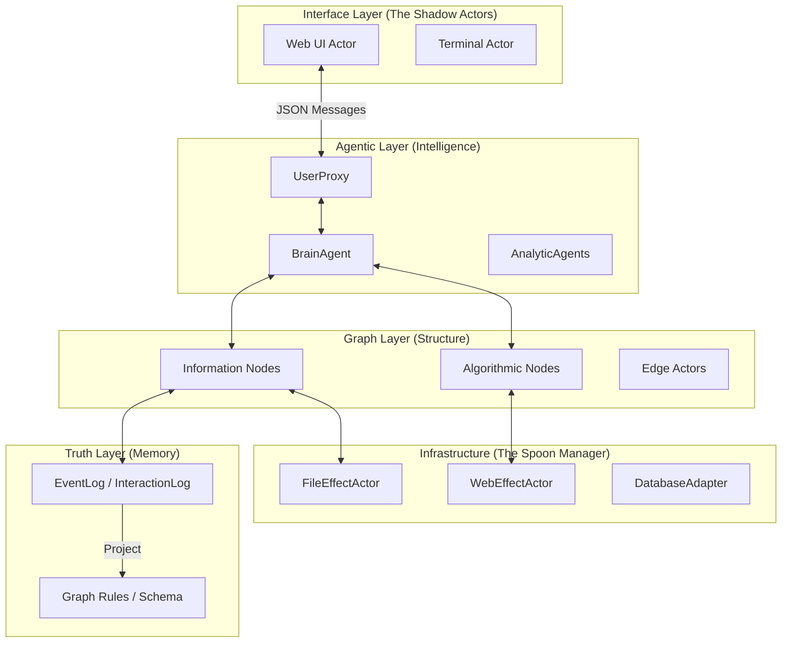
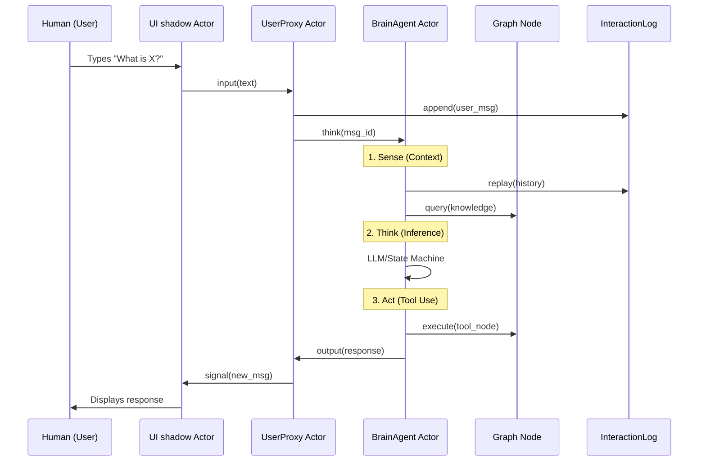
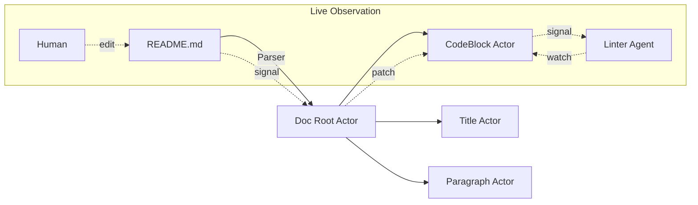

# Visualizing SEAG: The Logical Design

## 1. The SEAG Stack (Layered Architecture)

This diagram shows how the system is layered from the human interface down to the physical reality.



---

## 2. The Interaction Loop (Sense-Think-Act)

How a message flows through the system to fulfill a request.



---

## 3. The "No Spoon" Abstraction

How physical reality is projected into the graph.

```text
PHYSICAL REALITY (The Spoon)         LOGICAL GRAPH (The Reality)
============================         ===========================

[ /src/main.ts ] <──────────────┐    ( Node: main_ts_root )
                                │         │
[ HTTP GET /api ] <─────────────┼────▶ ( Node: api_endpoint )
                                │         │
[ process: bash ] <─────────────┘    ( Node: shell_executor )
                                          │
                                          ▼
                                 [ SEAG ADDRESSING ]
                          seag://logical_system/node_uuid
```

---

## 4. Structural Destructuring (Shredding)

Turning a flat file into a live tree of actors.


