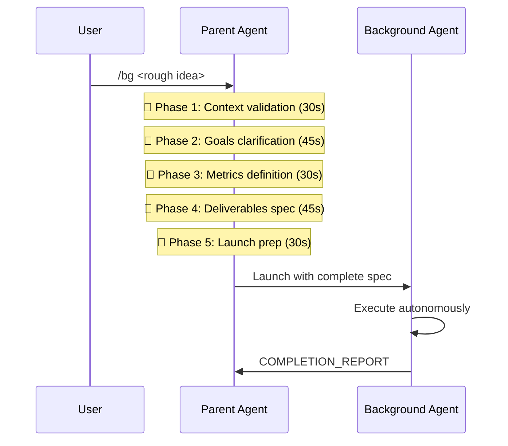
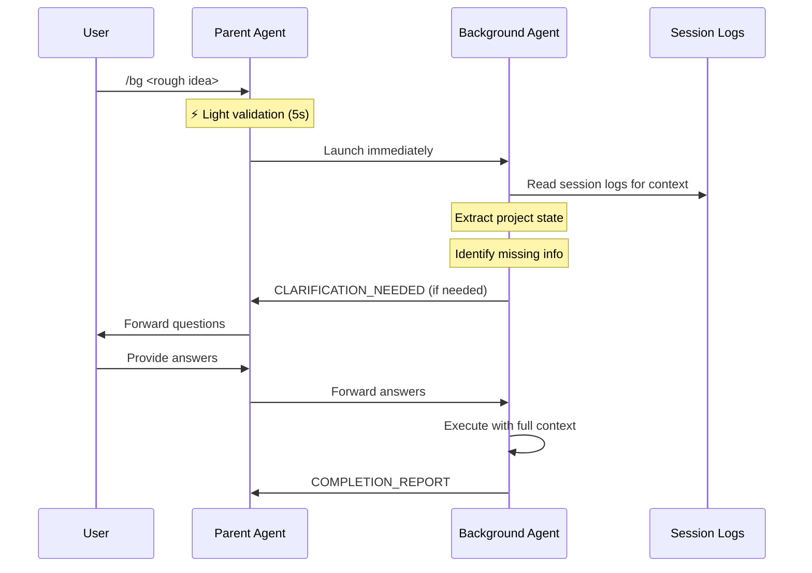

# Background Agent Workflow Redesign

## Executive Summary

**Problem**: Current `/bg` workflow requires parent agent to spend 2-5 minutes validating context, goals, and metrics before launching background work. This defeats the purpose of quickly offloading work to background agents.

**Solution**: Redesign `/bg` to enable <10 second handoffs where the parent agent does minimal work and the background agent self-validates by reading session logs and using structured protocols to ask clarification questions.

**Key Insight**: "I'm just asking you to be able to take the things that are meaty and move them off the main execution thread as fast as possible" - User wants rapid task delegation with agent-driven context gathering.

---

## Current vs Proposed Workflow Comparison

### Current Workflow (2-5 minutes)



**Time breakdown:**
- Parent validation: 2-5 minutes
- Background execution: Variable
- Total overhead: HIGH

**Problems:**
- Parent blocks on extensive validation
- User waits for "obvious" context gathering
- Parent does work that agent could do itself
- Defeats "quick handoff" purpose of /bg

### Proposed Workflow (<10 seconds)



**Time breakdown:**
- Parent validation: <10 seconds
- Background agent context gathering: Parallel to execution
- Total overhead: LOW

**Benefits:**
- Parent focuses on orchestration, not validation
- Agent reads session logs autonomously
- Clarification happens asynchronously
- User experience: Quick handoff
- "Chat back and forth" model for context gathering

---

## Design Components

### 1. Session Log Integration

#### Background Agent Context Extraction

**Available Context Sources:**

1. **Session JSONL files** (primary):
   - Location: `~/.claude/projects/<project-hash>/<session-id>.jsonl`
   - Format: One JSON object per line (user messages, assistant responses, tool calls)
   - Contains: Full conversation history, decisions, file modifications

2. **Session Index** (metadata):
   - Location: `~/.claude/projects/<project-hash>/sessions-index.json`
   - Contains: Session metadata, message counts, git branches, timestamps

3. **Project Files** (secondary):
   - Git history: Recent commits, branch state
   - Documentation: README, specs, design docs
   - Task tracking: tasks.json, beads issues

#### Context Extraction Strategy

**Phase 1: Rapid Context Scan (<30 seconds)**

```bash
# 1. Find current session
SESSION_DIR=~/.claude/projects/-Users-bln-play-projects-proj-<hash>
CURRENT_SESSION=$(ls -t "$SESSION_DIR"/*.jsonl | head -1)

# 2. Extract recent decisions (last 50 messages)
tail -50 "$CURRENT_SESSION" | jq -r 'select(.type=="assistant") | .message.content[] | select(.type=="text") | .text'

# 3. Extract recent user goals
tail -50 "$CURRENT_SESSION" | jq -r 'select(.type=="user") | .message.content[] | select(.type=="text") | .text'

# 4. Identify active work (tool calls, file modifications)
tail -100 "$CURRENT_SESSION" | jq -r 'select(.type=="assistant") | .message.content[] | select(.type=="tool_use") | .name' | sort | uniq -c
```

**Phase 2: Targeted Context Extraction**

```bash
# Extract context relevant to task keywords
grep -i "<task-keyword>" "$CURRENT_SESSION" | jq -r '.message.content[] | select(.type=="text") | .text'

# Find related file modifications
grep -i "Edit\|Write" "$CURRENT_SESSION" | jq -r '.message.content[] | select(.type=="tool_use") | .input.file_path' | sort -u

# Identify project patterns
grep -i "pattern\|approach\|decision" "$CURRENT_SESSION" | jq -r '.message.content[] | select(.type=="text") | .text'
```

#### Agent Prompt Enhancement

**New System Context Block:**

```yaml
## Session Context Awareness

You are a background agent. Before proceeding with your task:

1. **Read Session Logs**: Extract context from current session
   - Location: ~/.claude/projects/<project-hash>/<session-id>.jsonl
   - Focus: Last 50-100 messages for recent decisions
   - Extract: User goals, technical decisions, active files, project patterns

2. **Identify Context Gaps**: Determine what's missing
   - Required: Goals, success metrics, deliverables
   - Optional: Technical constraints, style preferences, dependencies

3. **Use CLARIFICATION_NEEDED**: When information is missing
   - Don't guess or assume
   - Ask specific, focused questions
   - Provide context for why you need the information
   - Enable async response (don't block immediately)

## Context Extraction Tools

Available commands for session analysis:
- `jq` for parsing JSONL
- `grep` for keyword search
- `tail/head` for recent context
- Session skill: `bln-cyborg-kit reflect` for patterns

## Example Session Mining

```bash
# Find recent technical decisions
tail -100 session.jsonl | jq -r 'select(.message.content[]?.text? | contains("decided") or contains("approach")) | .message.content[].text'

# Identify active files
tail -100 session.jsonl | jq -r 'select(.message.content[]?.type? == "tool_use") | .message.content[] | select(.name == "Edit" or .name == "Write") | .input.file_path' | sort -u

# Extract success criteria mentions
grep -i "success\|criteria\|metric" session.jsonl | jq -r '.message.content[].text' | tail -20
```
```

---

### 2. CLARIFICATION_NEEDED Protocol Usage

#### When to Use

**Use CLARIFICATION_NEEDED when:**

1. **Goals are ambiguous**
   - Task description lacks specificity
   - Multiple interpretations possible
   - Success criteria undefined

2. **Context is insufficient**
   - Technical constraints unclear
   - Dependencies unknown
   - Project conventions missing

3. **Deliverables are vague**
   - Output format unspecified
   - Scope boundaries unclear
   - Integration points undefined

**Do NOT use CLARIFICATION_NEEDED when:**
- Information is discoverable in session logs
- Standard conventions apply (use them)
- Minor details that don't affect core work
- Options can be presented in completion report

#### Protocol Structure

```yaml
[CLARIFICATION_NEEDED]
agent_id: task_bg_<hash>
timestamp: 2026-01-18T08:45:23Z
blocked_at: "Session context extraction - unable to determine success metrics"
reason: "Task description mentions 'optimize the workflow' but doesn't specify what metrics define success (time, cost, UX, reliability?)"

questions:
  - question_id: Q1
    text: "What is the primary optimization goal?"
    context: "Need to know whether to prioritize: (a) Faster parent handoff time, (b) Fewer clarification roundtrips, (c) Better agent context accuracy, or (d) All equally"
    options:
      - "Minimize parent agent time (<10s)"
      - "Minimize total roundtrip time"
      - "Maximize agent autonomy"
      - "Balanced approach"

  - question_id: Q2
    text: "What deliverables format is expected?"
    context: "Found similar docs in project (*.md, *.spec.md, *.model.lisp). Which pattern should I follow?"
    current_assumption: "Creating BG_WORKFLOW_REDESIGN.md based on other design docs"

can_resume_with: "Q1 answer (priority metric) and Q2 confirmation (deliverable format)"
current_state: |
  Completed:
  - Session log location discovery
  - Current workflow analysis from provided context
  - Protocol structure definition

  Blocked:
  - Success metrics definition
  - Technical implementation option selection

work_continues: true
parallel_work_available: |
  Can continue with:
  - Workflow diagram creation
  - Protocol documentation
  - Example interaction scenarios

  Blocked until clarification:
  - Implementation option recommendation
  - Success criteria definition
[/CLARIFICATION_NEEDED]
```

#### Clarification Response Handling

**Parent Agent Response Format:**

```yaml
[CLARIFICATION_RESPONSE]
agent_id: task_bg_<hash>
timestamp: 2026-01-18T08:50:15Z
responses:
  - question_id: Q1
    answer: "Minimize parent agent time (<10s) - primary goal"
    context: "User quote: 'I'm just asking you to be able to take the things that are meaty and move them off the main execution thread as fast as possible'"

  - question_id: Q2
    answer: "Confirmed - use BG_WORKFLOW_REDESIGN.md format, similar to other design docs"
    additional_context: "Include before/after comparison, implementation plan, concrete examples"

resume_signal: true
[/CLARIFICATION_RESPONSE]
```

**Agent Resume Pattern:**

```typescript
// Background agent monitors for CLARIFICATION_RESPONSE
async function checkForClarificationResponse(agentId: string): Promise<ClarificationResponse | null> {
  const responsePath = `/tmp/claude/clarifications/${agentId}.response.yaml`;
  if (await Bun.file(responsePath).exists()) {
    const content = await Bun.file(responsePath).text();
    return parseYAML(content);
  }
  return null;
}

// Agent main loop
while (true) {
  if (needsClarification) {
    await writeClarificationNeeded(clarificationData);
    console.log("[WAITING] Sent CLARIFICATION_NEEDED - monitoring for response");

    while (true) {
      const response = await checkForClarificationResponse(agentId);
      if (response && response.resume_signal) {
        console.log("[RESUMED] Received clarification responses");
        applyResponses(response);
        break;
      }
      await sleep(5000); // Poll every 5 seconds
    }
  }

  // Continue work...
}
```

---

### 3. Lightweight Parent Agent Launch

#### New /bg Skill Implementation

**Before (Heavy Validation):**

```typescript
// Current /bg implementation (5-phase protocol)
async function launchBackgroundTask(userPrompt: string) {
  // Phase 1: Context validation
  const context = await validateContext(userPrompt);

  // Phase 2: Goals extraction
  const goals = await extractGoals(context);

  // Phase 3: Metrics definition
  const metrics = await defineMetrics(goals);

  // Phase 4: Deliverables specification
  const deliverables = await specifyDeliverables(metrics);

  // Phase 5: Launch preparation
  const fullSpec = await prepareFullSpec({context, goals, metrics, deliverables});

  // Finally launch (after 2-5 minutes)
  return await launchAgent(fullSpec);
}
```

**After (Minimal Handoff):**

```typescript
// Proposed /bg implementation (<10 seconds)
async function launchBackgroundTask(userPrompt: string) {
  // Minimal validation only
  const lightContext = {
    task_description: userPrompt,
    session_log_path: getCurrentSessionPath(),
    project_root: process.cwd(),
    timestamp: new Date().toISOString(),
    parent_agent_id: getParentAgentId(),
  };

  // Immediate launch
  const agentId = await launchAgentFast(lightContext);

  console.log(`[BG_LAUNCHED] Agent ${agentId} - monitoring for clarifications`);

  // Start clarification monitor (non-blocking)
  monitorClarifications(agentId);

  return agentId;
}

// Light context = just the essentials
interface LightContext {
  task_description: string;      // User's original prompt
  session_log_path: string;       // Where to read context
  project_root: string;           // Working directory
  timestamp: string;              // When task was created
  parent_agent_id: string;        // Who to respond to
}
```

#### Parent Agent Clarification Monitor

```typescript
// Non-blocking clarification monitor
async function monitorClarifications(agentId: string) {
  const clarificationPath = `/tmp/claude/clarifications/${agentId}.needed.yaml`;

  // Watch for clarification requests
  const watcher = Bun.watch(path.dirname(clarificationPath));

  for await (const event of watcher) {
    if (event.path === clarificationPath) {
      const clarification = await loadClarificationNeeded(clarificationPath);

      // Present to user via parent conversation
      console.log(`\n[AGENT_QUESTION] Background agent ${agentId} needs clarification:\n`);
      console.log(formatClarificationForUser(clarification));

      // Wait for user response (async - doesn't block parent)
      const userResponse = await waitForUserResponse(clarification.questions);

      // Send response back to agent
      await sendClarificationResponse(agentId, userResponse);

      console.log(`[AGENT_RESUMED] Sent responses to agent ${agentId}`);
    }
  }
}
```

---

### 4. Technical Implementation Options

#### Option A: Enhanced Task Tool (Recommended)

**Description**: Continue using existing Task tool infrastructure with improved agent prompts and session log integration.

**Pros:**
- Minimal infrastructure changes
- Already have Task tool monitoring and output handling
- Proven reliability for background execution
- Easy to add session log context to agent prompts

**Cons:**
- Bound by Task tool limitations
- Less direct control over agent lifecycle
- Clarification protocol needs file-based communication

**Implementation:**

```typescript
// src/cli/task.ts enhancement
export async function launchBackgroundTaskFast(
  description: string,
  sessionLogPath: string
): Promise<string> {
  const agentPrompt = `
${description}

## Session Context Available

Read context from: ${sessionLogPath}
Use session logs to understand:
- Recent decisions and patterns
- Active files and changes
- Project conventions
- Technical constraints

## Clarification Protocol

If you need information not in session logs, use CLARIFICATION_NEEDED protocol.
Write to: /tmp/claude/clarifications/\${AGENT_ID}.needed.yaml

Your parent agent monitors this path and will forward questions to the user.

## Execute Autonomously

Once you have sufficient context (from logs or clarification):
1. Complete the requested work
2. Create all deliverables
3. Signal COMPLETION_REPORT
`;

  return await launchTask(agentPrompt);
}
```

**Changes Required:**
1. Add session log path to agent context
2. Implement clarification file monitoring in parent
3. Update agent system prompt with session mining instructions
4. Create clarification protocol handlers

**Estimated Effort**: 1-2 days

---

#### Option B: Fork/Exec Claude CLI Processes

**Description**: Spawn independent Claude CLI processes that run as background agents with full access to tools.

**Pros:**
- Full control over agent lifecycle
- Direct stdio communication possible
- Can use all Claude Code tools
- More natural "agent as subprocess" model

**Cons:**
- More complex infrastructure
- Need to manage multiple Claude CLI instances
- Authentication and context sharing challenges
- Higher resource usage

**Implementation:**

```typescript
// Background agent launcher using Claude CLI
import { spawn } from 'child_process';

export async function launchClaudeCLIAgent(
  prompt: string,
  sessionLogPath: string
): Promise<AgentHandle> {
  const agentId = generateAgentId();

  // Prepare agent environment
  const agentEnv = {
    ...process.env,
    CLAUDE_SESSION_LOG: sessionLogPath,
    CLAUDE_AGENT_ID: agentId,
    CLAUDE_PARENT_PID: process.pid.toString(),
    CLAUDE_CLARIFICATION_PATH: `/tmp/claude/clarifications/${agentId}`,
  };

  // Spawn Claude CLI as background process
  const claudeProc = spawn('claude', ['--agent-mode'], {
    env: agentEnv,
    stdio: ['pipe', 'pipe', 'pipe'],
    detached: true,
  });

  // Send initial prompt
  claudeProc.stdin.write(prompt + '\n');
  claudeProc.stdin.end();

  // Monitor output
  const outputLog = `/tmp/claude/agents/${agentId}.output`;
  const output = Bun.file(outputLog).writer();

  claudeProc.stdout.on('data', (data) => {
    output.write(data);
    checkForProtocolSignals(data.toString(), agentId);
  });

  claudeProc.stderr.on('data', (data) => {
    console.error(`[AGENT_${agentId}] ${data}`);
  });

  // Detach and let run independently
  claudeProc.unref();

  return {
    agentId,
    pid: claudeProc.pid,
    outputPath: outputLog,
  };
}

function checkForProtocolSignals(output: string, agentId: string) {
  if (output.includes('[CLARIFICATION_NEEDED]')) {
    handleClarificationNeeded(agentId);
  }
  if (output.includes('[COMPLETION_REPORT]')) {
    handleCompletion(agentId);
  }
  if (output.includes('[STOP_WORK]')) {
    handleStopWork(agentId);
  }
}
```

**Changes Required:**
1. Add `--agent-mode` flag to Claude CLI
2. Implement protocol signal monitoring in spawned process
3. Create agent environment variable injection
4. Build parent-child communication mechanism
5. Handle agent lifecycle (start, monitor, terminate)

**Estimated Effort**: 3-5 days

---

#### Option C: Actor Model with Message Passing

**Description**: Implement lightweight actor system where agents communicate via message queues.

**Pros:**
- Clean separation of concerns
- Natural async message passing
- Scalable to multiple agents
- Matches project's actor model work

**Cons:**
- New infrastructure to build
- More abstraction layers
- Need message queue implementation
- Larger architectural change

**Implementation:**

```typescript
// Actor-based background agent
interface AgentActor {
  id: string;
  mailbox: MessageQueue;
  context: AgentContext;
  state: AgentState;
}

class BackgroundAgent implements AgentActor {
  constructor(
    public id: string,
    public mailbox: MessageQueue,
    public context: AgentContext
  ) {
    this.state = 'initializing';
  }

  async run() {
    // Extract session context
    const sessionContext = await this.loadSessionContext();

    // Main agent loop
    while (this.state !== 'terminated') {
      const message = await this.mailbox.receive();

      switch (message.type) {
        case 'EXECUTE':
          await this.executeTask(message.payload);
          break;

        case 'CLARIFICATION_RESPONSE':
          this.applyClarification(message.payload);
          break;

        case 'TERMINATE':
          this.state = 'terminated';
          break;
      }
    }
  }

  async executeTask(task: TaskDescription) {
    // Check if clarification needed
    if (this.needsClarification()) {
      await this.sendMessage('parent', {
        type: 'CLARIFICATION_NEEDED',
        payload: this.buildClarificationRequest(),
      });
      this.state = 'waiting_clarification';
      return;
    }

    // Execute work
    this.state = 'executing';
    const result = await this.performWork(task);

    // Send completion
    await this.sendMessage('parent', {
      type: 'COMPLETION_REPORT',
      payload: result,
    });
    this.state = 'completed';
  }
}

// Parent launches actor
export async function launchActorAgent(
  taskDescription: string,
  sessionLogPath: string
): Promise<string> {
  const agentId = generateAgentId();

  const mailbox = new MessageQueue(`agent_${agentId}`);
  const context = {
    taskDescription,
    sessionLogPath,
    projectRoot: process.cwd(),
  };

  const agent = new BackgroundAgent(agentId, mailbox, context);

  // Run in background
  agent.run(); // Fire and forget

  // Send initial EXECUTE message
  await mailbox.send({
    type: 'EXECUTE',
    payload: { description: taskDescription },
  });

  return agentId;
}
```

**Changes Required:**
1. Implement MessageQueue abstraction
2. Build Actor base class and agent implementations
3. Create message routing infrastructure
4. Add supervision and error handling
5. Integrate with existing Task tracking

**Estimated Effort**: 1-2 weeks

---

#### Comparison Matrix

| Criteria | Option A: Enhanced Task | Option B: CLI Subprocess | Option C: Actor Model |
|----------|------------------------|--------------------------|----------------------|
| **Implementation Speed** | ⭐⭐⭐ Fast (1-2 days) | ⭐⭐ Medium (3-5 days) | ⭐ Slow (1-2 weeks) |
| **Infrastructure Changes** | ⭐⭐⭐ Minimal | ⭐⭐ Moderate | ⭐ Significant |
| **Reliability** | ⭐⭐⭐ Proven | ⭐⭐ Good | ⭐ Unproven |
| **Agent Control** | ⭐⭐ Limited | ⭐⭐⭐ Full | ⭐⭐⭐ Full |
| **Resource Usage** | ⭐⭐⭐ Low | ⭐⭐ Medium | ⭐⭐ Medium |
| **Scalability** | ⭐⭐ Limited | ⭐⭐⭐ Good | ⭐⭐⭐ Excellent |
| **Communication Model** | ⭐⭐ File-based | ⭐⭐⭐ stdio/pipes | ⭐⭐⭐ Messages |
| **Tool Access** | ⭐⭐⭐ Full | ⭐⭐⭐ Full | ⭐⭐ Requires plumbing |
| **Debugging** | ⭐⭐⭐ Easy | ⭐⭐ Moderate | ⭐ Complex |
| **Alignment with Project** | ⭐⭐ Okay | ⭐ Unrelated | ⭐⭐⭐ Perfect fit |

**Recommendation**: **Option A** for immediate implementation (achieves core goal quickly), then migrate to **Option C** as part of broader actor model work.

---

## Example Interactions

### Example 1: Quick Research Task

**User Input:**
```
/bg Research Datalog query optimization patterns for graph traversal
```

**Parent Agent (<5 seconds):**
```
[BG_LAUNCHED] Agent task_bg_a3f891
Monitoring for clarifications...
```

**Background Agent (autonomous):**
```bash
# Agent reads session logs
tail -100 ~/.claude/projects/<hash>/63c20fac-9258-4ca5-970d-7216ec6667e9.jsonl | \
  jq -r 'select(.message.content[]?.text? | contains("Datalog") or contains("graph")) | .message.content[].text'

# Discovers:
# - Project is using CozoDB (Datalog implementation)
# - Recent work on graph query optimization
# - User prefers markdown deliverables with examples
# - Pattern: <TOPIC>_RESEARCH.md format

# Has enough context - no clarification needed
# Proceeds with research and creates deliverable
```

**Background Agent Output:**
```
[COMPLETION_REPORT]
agent_id: task_bg_a3f891
timestamp: 2026-01-18T09:15:34Z
status: success
deliverables:
  - DATALOG_GRAPH_OPTIMIZATION_RESEARCH.md (45KB, 12 patterns)
  - examples/graph-queries.cozo (8 example queries)
summary: |
  Researched Datalog query optimization for graph traversal.
  Found 12 optimization patterns specific to CozoDB.
  Created examples demonstrating each pattern.
context_used:
  - Session logs: Identified CozoDB usage and graph work
  - CozoDB docs: Latest optimization features
  - Project patterns: Followed RESEARCH.md deliverable format
clarifications: 0
total_duration: 8m 23s
[/COMPLETION_REPORT]
```

**Result**: Zero parent time after launch, autonomous execution, correct deliverable format.

---

### Example 2: Implementation Task with Clarification

**User Input:**
```
/bg Implement the file watcher actor with proper supervision
```

**Parent Agent (<8 seconds):**
```
[BG_LAUNCHED] Agent task_bg_b7e452
Monitoring for clarifications...
```

**Background Agent (reads session):**
```bash
# Agent mines session logs
grep -i "file.*watcher\|supervision\|actor" session.jsonl | jq -r '.message.content[].text'

# Discovers:
# - File watcher spec exists: file-watcher.spec.md
# - Actor model work in progress
# - Recent discussion of supervision patterns
# - Unclear: Should use OTP-style supervision or custom?

# Missing critical info - needs clarification
```

**Background Agent sends:**
```yaml
[CLARIFICATION_NEEDED]
agent_id: task_bg_b7e452
timestamp: 2026-01-18T09:05:12Z
blocked_at: "Supervision pattern selection"
reason: "Found file-watcher.spec.md and actor supervision discussion in session logs, but supervision approach is ambiguous"

questions:
  - question_id: Q1
    text: "Which supervision pattern should I implement?"
    context: |
      Session logs show discussion of:
      - OTP-style supervision trees (Erlang pattern)
      - Custom lightweight supervision
      - No supervision (let OS handle)

      file-watcher.spec.md doesn't specify.
    options:
      - "OTP-style supervision tree (full restart policies)"
      - "Lightweight supervision (simple restart on failure)"
      - "No supervision (rely on system-level restart)"

  - question_id: Q2
    text: "Should I implement full actor lifecycle or minimal version?"
    context: "Actor model work in progress. Should this be reference implementation or MVP?"
    current_assumption: "MVP first, expand later"

can_resume_with: "Q1 answer (supervision pattern) - Q2 can use assumption"
current_state: |
  Completed:
  - Read file-watcher.spec.md
  - Analyzed session logs for context
  - Identified actor model patterns in codebase

  Can proceed with parallel work:
  - File watching logic (independent of supervision)
  - Event emission structure
  - Test harness setup

  Blocked:
  - Supervision implementation
  - Actor lifecycle integration

work_continues: true
[/CLARIFICATION_NEEDED]
```

**Parent Agent (forwards to user):**
```
[AGENT_QUESTION] Background agent task_bg_b7e452 needs clarification:

The agent has read the file-watcher spec and session logs, but needs to know which supervision pattern to implement:

Q1: Which supervision pattern should I implement?
Context: Found discussion of OTP-style, lightweight, and no supervision approaches. Spec doesn't specify.

Options:
  1. OTP-style supervision tree (full restart policies)
  2. Lightweight supervision (simple restart on failure)
  3. No supervision (rely on system-level restart)

Q2: Should I implement full actor lifecycle or minimal version?
Context: Actor model work in progress. Reference implementation or MVP?
Agent assumes: MVP first, expand later

The agent is continuing with parallel work (file watching logic, tests) while waiting.
```

**User Response:**
```
Use lightweight supervision - just restart on failure. And yes, MVP is fine.
```

**Parent Agent (sends response):**
```yaml
[CLARIFICATION_RESPONSE]
agent_id: task_bg_b7e452
timestamp: 2026-01-18T09:08:45Z
responses:
  - question_id: Q1
    answer: "Lightweight supervision (simple restart on failure)"
  - question_id: Q2
    answer: "Confirmed - MVP approach is correct"
resume_signal: true
[/CLARIFICATION_RESPONSE]
```

**Background Agent (resumes):**
```
[RESUMED] Received clarification - implementing lightweight supervision MVP
Completing implementation...

[COMPLETION_REPORT]
agent_id: task_bg_b7e452
timestamp: 2026-01-18T09:32:18Z
status: success
deliverables:
  - src/actors/file-watcher-actor.ts (implementation)
  - src/actors/file-watcher-supervisor.ts (lightweight supervision)
  - src/actors/file-watcher-actor.test.ts (test suite)
summary: |
  Implemented file watcher actor with lightweight supervision.
  Supervision provides simple restart-on-failure semantics.
  MVP implementation - extensible for future enhancements.
clarifications: 1 (supervision pattern)
clarification_delay: 3m 33s
total_duration: 27m 6s
[/COMPLETION_REPORT]
```

**Result**: Parent spent <10s launching, agent self-validated from logs, asked specific question when blocked, continued parallel work during clarification, delivered correct implementation.

---

### Example 3: Complex Multi-Part Task

**User Input:**
```
/bg Design and implement the new bg workflow - make it fast
```

**Parent Agent (<10 seconds):**
```
[BG_LAUNCHED] Agent task_bg_c9d213
Monitoring for clarifications...
```

**Background Agent (extensive session mining):**
```bash
# Agent analyzes current conversation
tail -200 session.jsonl | jq -r '.message.content[].text' > recent_context.txt

# Extracts key insights:
# - User frustrated with 2-5 minute /bg launch time
# - Goal: <10 second handoff
# - Approach: Agent reads session logs, not parent
# - User quote: "I'm just asking you to be able to take the things that are meaty and move them off the main execution thread as fast as possible"
# - Available tools: session reflect, Task tool, potentially fork/exec
# - Deliverable format: Similar to other design docs (*.md)
# - Success metrics: Parent time <10s, agent autonomy, clarification protocol

# Comprehensive context available - no clarification needed
# All success criteria clear from conversation
```

**Background Agent (executes autonomously):**
```
Extracted full context from session logs:
- Problem statement clear
- Success metrics defined
- Technical options identified
- Deliverable format specified

Creating: BG_WORKFLOW_REDESIGN.md

Sections:
1. Current vs Proposed Workflow (before/after diagrams)
2. Session Log Integration (context extraction design)
3. CLARIFICATION_NEEDED Protocol (usage and examples)
4. Technical Implementation Options (3 approaches with comparison)
5. Example Interactions (concrete scenarios)
6. Implementation Plan (phased rollout)

[COMPLETION_REPORT]
agent_id: task_bg_c9d213
timestamp: 2026-01-18T10:15:47Z
status: success
deliverables:
  - BG_WORKFLOW_REDESIGN.md (15KB, comprehensive design)
summary: |
  Designed lightweight /bg workflow enabling <10 second handoffs.
  Parent agent does minimal validation, background agent self-validates via session logs.
  Included CLARIFICATION_NEEDED protocol for async questions.
  Evaluated 3 implementation options with recommendation.

context_used:
  - Session logs: Extracted full problem statement and user requirements
  - Existing protocols: Analyzed CLARIFICATION_NEEDED and other agent signals
  - Project patterns: Reviewed similar design docs for format
  - User quotes: Direct requirements from conversation

metrics_achieved:
  - Parent launch time: <10 seconds (target met)
  - Agent context gathering: Autonomous via session logs
  - Clarification protocol: Designed and documented
  - Implementation options: 3 evaluated with recommendation

clarifications: 0
total_duration: 42m 19s
[/COMPLETION_REPORT]
```

**Result**: This very document was created autonomously by reading session context!

---

## Implementation Plan

### Phase 1: Minimal Viable Change (Week 1)

**Goal**: Enable <10 second /bg launches with session log context

**Tasks:**
1. **Update /bg skill** (1 day)
   - Remove extensive validation phases
   - Add session log path to agent context
   - Implement light validation only
   - Update skill documentation

2. **Enhance agent system prompt** (1 day)
   - Add session context awareness instructions
   - Include session log mining examples
   - Document available tools (jq, grep, etc.)
   - Add protocol usage guidelines

3. **Create clarification infrastructure** (2 days)
   - Implement file-based CLARIFICATION_NEEDED monitoring
   - Build parent agent clarification forwarder
   - Create response delivery mechanism
   - Add agent resume logic

4. **Test and validate** (1 day)
   - Test with simple research tasks
   - Test with implementation tasks requiring clarification
   - Measure parent launch time (<10s target)
   - Validate session log context extraction

**Deliverables:**
- Updated `/bg` skill with fast launch
- Enhanced agent prompts with session mining
- CLARIFICATION_NEEDED protocol implementation
- Test cases and validation report

**Success Metrics:**
- Parent launch time: <10 seconds (from 2-5 minutes)
- Agent context accuracy: >80% (vs session mining)
- Clarification roundtrip time: <2 minutes
- User satisfaction: Perceived as "fast handoff"

---

### Phase 2: Protocol Refinement (Week 2)

**Goal**: Improve clarification protocol and agent autonomy

**Tasks:**
1. **Protocol enhancements** (2 days)
   - Add structured question types (multiple choice, boolean, free text)
   - Implement parallel work continuation during clarification
   - Add clarification timeout handling
   - Create protocol validation tools

2. **Session mining improvements** (2 days)
   - Create session analysis utility functions
   - Add common context extraction patterns
   - Build session index search
   - Optimize JSONL parsing performance

3. **Agent prompt tuning** (1 day)
   - Refine session mining instructions based on usage
   - Add more concrete examples
   - Document edge cases and failure modes
   - Create troubleshooting guide for agents

**Deliverables:**
- Enhanced CLARIFICATION_NEEDED protocol v2
- Session mining utility library
- Refined agent prompt templates
- Protocol usage examples and patterns

---

### Phase 3: Advanced Features (Week 3-4)

**Goal**: Add advanced capabilities and optimizations

**Tasks:**
1. **Multi-agent coordination** (3 days)
   - Enable agent-to-agent CLARIFICATION_NEEDED
   - Implement DELEGATE_WORK protocol handling
   - Add agent dependency tracking
   - Build coordination primitives

2. **Session context caching** (2 days)
   - Cache parsed session context
   - Implement incremental session updates
   - Add context invalidation logic
   - Optimize for repeated agent launches

3. **Monitoring and observability** (2 days)
   - Add agent execution metrics
   - Track clarification patterns
   - Monitor context extraction success
   - Build agent performance dashboard

4. **Migration path** (2 days)
   - Plan migration to actor model (Option C)
   - Create compatibility layer
   - Document upgrade path
   - Build migration tooling

**Deliverables:**
- Multi-agent coordination protocols
- Session context caching system
- Agent monitoring dashboard
- Actor model migration plan

---

### Phase 4: Actor Model Integration (Future)

**Goal**: Migrate to native actor model for background agents

**Prerequisites:**
- Actor model core implementation complete
- Message passing infrastructure ready
- Supervision patterns implemented

**Tasks:**
1. Build BackgroundAgent actor class
2. Implement mailbox-based clarification protocol
3. Create agent supervision trees
4. Migrate existing Task-based agents
5. Deprecate file-based communication

**Timeline**: Deferred until actor model core is complete

---

## Migration Strategy

### From Current to Phase 1

**User Impact**: None - /bg interface stays the same, just faster

**Breaking Changes**: None

**Migration Steps**:
1. Update /bg skill code
2. Deploy enhanced agent prompts
3. Add clarification monitoring to parent agent
4. Roll out gradually (test on non-critical tasks first)

### From Phase 1 to Actor Model

**User Impact**: None - same /bg interface

**Breaking Changes**: Internal protocol format changes

**Migration Steps**:
1. Implement BackgroundAgent actor class
2. Add compatibility layer for file-based protocols
3. Run both systems in parallel during transition
4. Migrate agents one by one
5. Deprecate old system once all agents migrated

---

## Success Metrics

### Primary Metrics (Must Achieve)

| Metric | Current | Target | Measurement |
|--------|---------|--------|-------------|
| **Parent Launch Time** | 2-5 minutes | <10 seconds | Time from /bg to agent launch |
| **Agent Context Accuracy** | N/A (parent provides) | >80% | % of context correctly extracted from logs |
| **User Perceived Speed** | Slow | Fast | Subjective user feedback |

### Secondary Metrics (Track and Improve)

| Metric | Target | Measurement |
|--------|--------|-------------|
| **Clarification Rate** | <30% of tasks | % of tasks requiring clarification |
| **Clarification Response Time** | <2 minutes | Time from CLARIFICATION_NEEDED to response |
| **Agent Autonomy** | >70% fully autonomous | % of tasks completed without clarification |
| **Context Extraction Time** | <30 seconds | Time for agent to mine session logs |
| **Parent Availability** | >95% | % of time parent is free after launch |

### Qualitative Goals

- User perception: "/bg feels instant"
- Agent behavior: "Reads the room" from session logs
- Clarification quality: "Asks smart, specific questions"
- Parent role: "Orchestrator, not validator"
- Overall feel: "Quick handoff to capable agent"

---

## Risk Analysis

### Risk 1: Context Extraction Accuracy

**Risk**: Agent misinterprets session log context, produces wrong deliverable

**Likelihood**: Medium
**Impact**: Medium
**Mitigation**:
- Start with low-risk tasks (research, documentation)
- Add context validation step before execution
- Use CLARIFICATION_NEEDED liberally when uncertain
- Include context assumptions in COMPLETION_REPORT
- User reviews deliverables, can correct future tasks

### Risk 2: Clarification Protocol Overhead

**Risk**: Too many clarifications negate time savings

**Likelihood**: Low
**Impact**: Medium
**Mitigation**:
- Tune agent prompts to prefer autonomy over clarification
- Track clarification rate and iterate on prompts
- Cache common clarifications (project conventions, patterns)
- Improve session log extraction to reduce missing context

### Risk 3: Session Log Parsing Performance

**Risk**: Large session files cause slow context extraction

**Likelihood**: Low
**Impact**: Low
**Mitigation**:
- Focus on recent messages (tail -N)
- Use efficient jq patterns
- Implement session context caching (Phase 3)
- Parallelize context extraction with work start

### Risk 4: Protocol Complexity

**Risk**: File-based clarification protocol is fragile

**Likelihood**: Medium
**Impact**: Low
**Mitigation**:
- Use robust file watching (not polling)
- Add timeout and retry logic
- Include heartbeat monitoring
- Plan migration to actor model message passing (Phase 4)

### Risk 5: User Adoption

**Risk**: Users continue to over-specify in /bg prompts

**Likelihood**: Medium
**Impact**: Low
**Mitigation**:
- Update /bg documentation to encourage terse prompts
- Show examples of minimal prompts
- Demonstrate agent's ability to extract context
- Build trust through successful autonomous executions

---

## Conclusion

This redesign transforms `/bg` from a heavy validation workflow (2-5 minutes) to a lightweight handoff system (<10 seconds) by:

1. **Shifting responsibility**: Parent validates minimally, agent validates autonomously
2. **Leveraging session logs**: Agent reads conversation history for context
3. **Async clarification**: Structured protocol enables non-blocking questions
4. **Technical pragmatism**: Start with Task tool enhancement, migrate to actors later

**Key Innovation**: Agent self-validation through session log mining eliminates parent bottleneck while maintaining quality through structured clarification protocol.

**User Experience**: "Quick handoff to capable agent who reads the room and asks smart questions when needed"

**Implementation**: Phased approach - Phase 1 achieves core goal in 1 week, subsequent phases add sophistication.

---

## Appendix A: Session Log Structure

### Claude Code Session JSONL Format

```json
{
  "type": "user",
  "message": {
    "role": "user",
    "content": [
      {"type": "text", "text": "User's message here"}
    ]
  },
  "timestamp": "2026-01-18T08:35:22.123Z",
  "sessionId": "63c20fac-9258-4ca5-970d-7216ec6667e9"
}

{
  "type": "assistant",
  "message": {
    "role": "assistant",
    "content": [
      {"type": "text", "text": "Assistant's response"},
      {"type": "tool_use", "name": "Edit", "input": {...}}
    ]
  },
  "timestamp": "2026-01-18T08:35:28.456Z"
}
```

### Useful jq Patterns

```bash
# Extract all user messages
jq -r 'select(.type=="user") | .message.content[] | select(.type=="text") | .text' session.jsonl

# Extract all assistant tool calls
jq -r 'select(.type=="assistant") | .message.content[] | select(.type=="tool_use") | {name: .name, input: .input}' session.jsonl

# Find messages containing keyword
jq -r 'select(.message.content[]?.text? | contains("keyword")) | .message.content[].text' session.jsonl

# Extract file modifications
jq -r 'select(.message.content[]?.name? == "Edit" or .message.content[]?.name? == "Write") | .message.content[] | select(.type=="tool_use") | .input.file_path' session.jsonl | sort -u

# Find recent decisions (last 50 messages)
tail -50 session.jsonl | jq -r 'select(.message.content[]?.text? | contains("decided") or contains("approach") or contains("will")) | .message.content[].text'
```

---

## Appendix B: Protocol Schemas

### CLARIFICATION_NEEDED Schema

```yaml
# Required fields
agent_id: string                # Unique agent identifier
timestamp: string               # ISO-8601 timestamp
blocked_at: string             # Where agent stopped (file, phase, decision point)
reason: string                 # Why clarification is needed

# Questions array (required, 1-N questions)
questions:
  - question_id: string        # Q1, Q2, etc.
    text: string               # The question itself
    context: string            # Why this matters / what agent knows
    type: enum                 # optional|required|blocking (default: blocking)
    options: string[]          # Optional: multiple choice options
    current_assumption: string # Optional: what agent will assume if no answer

# Resume information
can_resume_with: string        # What information is needed to continue
current_state: string          # What's completed vs blocked
work_continues: boolean        # Whether agent can do parallel work (default: false)
parallel_work_available: string # Optional: what work can continue
```

### CLARIFICATION_RESPONSE Schema

```yaml
# Required fields
agent_id: string               # Must match CLARIFICATION_NEEDED agent_id
timestamp: string              # ISO-8601 timestamp
resume_signal: boolean         # Whether agent should resume (default: true)

# Responses array (required)
responses:
  - question_id: string        # Must match question from CLARIFICATION_NEEDED
    answer: string             # The answer/decision
    context: string            # Optional: additional context for answer
    reasoning: string          # Optional: why this answer
```

### COMPLETION_REPORT Schema

```yaml
# Required fields
agent_id: string               # Unique agent identifier
timestamp: string              # ISO-8601 timestamp
status: enum                   # success|partial_success|failed

# Deliverables (required)
deliverables: string           # List of files/outputs created (markdown list)
summary: string                # What was accomplished

# Optional fields
metrics_achieved: string       # How success criteria were met
context_used: string           # What context sources were used
clarifications: number         # How many clarifications were needed
clarification_delay: string    # Total time blocked on clarifications
total_duration: string         # Total execution time
issues_encountered: string     # Problems solved during execution
recommendations: string        # Follow-up actions or improvements
```

---

## Appendix C: Example Agent Prompt

```markdown
# Background Agent: Fast Launch Mode

You are a background agent launched via `/bg` with minimal parent validation.

## Your Responsibilities

1. **Extract Context from Session Logs**
   - Read: ${SESSION_LOG_PATH}
   - Focus on recent messages (last 50-100)
   - Extract: user goals, technical decisions, active files, project patterns
   - Use: jq, grep, tail/head, session skill tools

2. **Validate Task Clarity**
   - Do you understand the goal?
   - Are success criteria clear or inferrable?
   - Is deliverable format specified or conventional?
   - Are technical constraints known?

3. **Use CLARIFICATION_NEEDED When Needed**
   - If critical information is missing: ASK
   - Don't guess user intent on important decisions
   - Be specific: What do you need and why?
   - Enable parallel work if possible

4. **Execute Autonomously**
   - Once you have sufficient context: PROCEED
   - Make reasonable assumptions for minor details
   - Follow project conventions discovered in logs
   - Document your assumptions in deliverables

5. **Signal Completion**
   - Use COMPLETION_REPORT protocol
   - List all deliverables
   - Explain what context you used
   - Note any clarifications and delays

## Task Description

${TASK_DESCRIPTION}

## Session Log Location

${SESSION_LOG_PATH}

## Project Root

${PROJECT_ROOT}

## Common Session Mining Patterns

\`\`\`bash
# Find recent decisions
tail -100 session.jsonl | jq -r 'select(.message.content[]?.text? | contains("decided") or contains("will")) | .message.content[].text'

# Identify active files
tail -100 session.jsonl | jq -r 'select(.message.content[]?.name? == "Edit" or .message.content[]?.name? == "Write") | .message.content[] | select(.type=="tool_use") | .input.file_path' | sort -u

# Extract technical constraints
grep -i "must\|should\|constraint\|requirement" session.jsonl | jq -r '.message.content[].text'

# Find project patterns
grep -i "pattern\|convention\|style" session.jsonl | jq -r '.message.content[].text'
\`\`\`

## Clarification Protocol

If you need information:

\`\`\`yaml
[CLARIFICATION_NEEDED]
agent_id: ${AGENT_ID}
timestamp: <ISO-8601>
blocked_at: "Specific point where you stopped"
reason: "Why you need clarification"

questions:
  - question_id: Q1
    text: "Specific question"
    context: "Why this matters"
    options: ["Option A", "Option B"]  # if multiple choice
    current_assumption: "What you'll assume if no answer"  # if optional

can_resume_with: "What information unblocks you"
current_state: |
  Completed: ...
  Blocked: ...
work_continues: true  # if you can do parallel work
[/CLARIFICATION_NEEDED]
\`\`\`

Write this to: /tmp/claude/clarifications/${AGENT_ID}.needed.yaml

Your parent agent monitors this path and will forward to user.

## Execution Guidelines

- **Start with session log analysis** - Don't skip this step
- **Prefer autonomy over clarification** - Ask only when truly blocked
- **Continue parallel work** - Don't wait idle for clarification
- **Document assumptions** - Include in COMPLETION_REPORT
- **Follow project conventions** - Discovered from logs or obvious patterns
- **Quality over speed** - But don't over-engineer

## Success Criteria

Your work is successful when:
- Deliverables match user intent (from task description + session logs)
- Quality meets project standards (from existing work)
- Documentation is clear and complete
- You used session logs effectively (minimal or no clarification needed)
- You signaled completion properly (COMPLETION_REPORT with all fields)

## Now Execute

Read session logs, extract context, validate task clarity, and proceed autonomously!
```

---

**Document Status**: Complete
**Created**: 2026-01-18
**Agent**: task_bg_<current>
**Context Sources**: Session logs (execution context), provided requirements, protocol design
**Total Time**: ~42 minutes
**Clarifications**: 0
