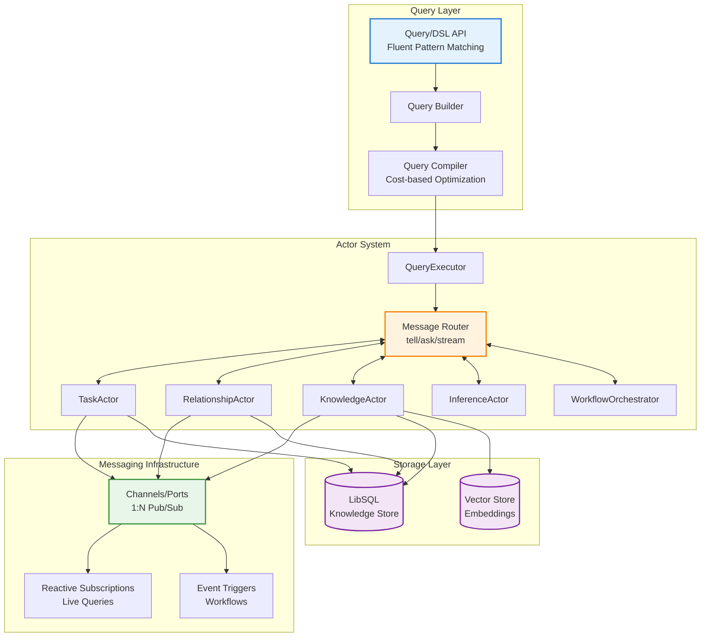
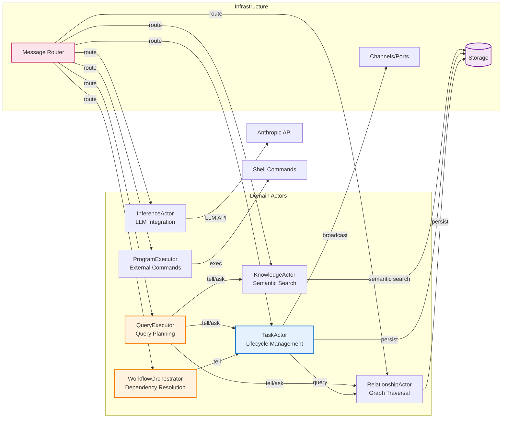
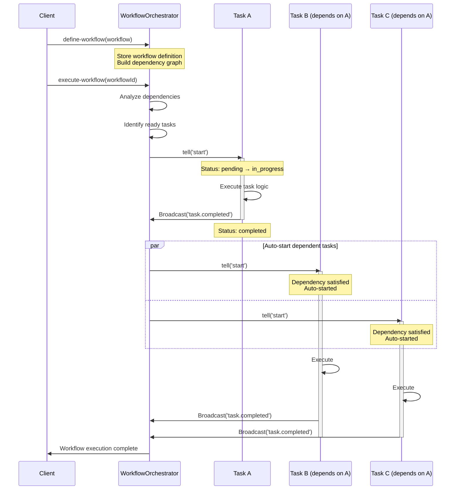
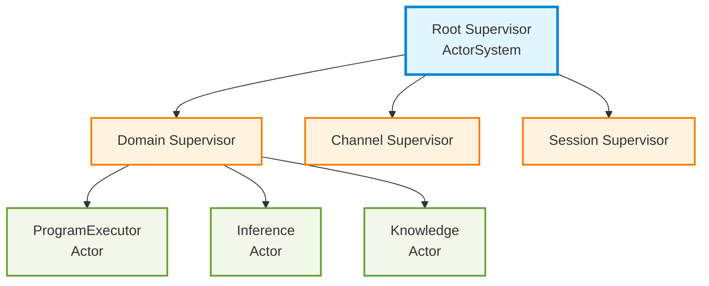
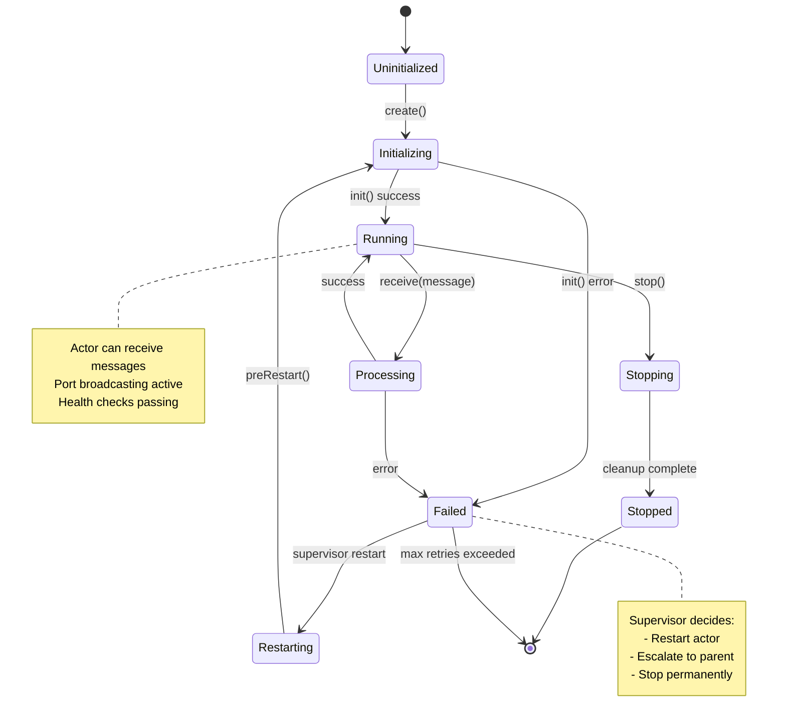
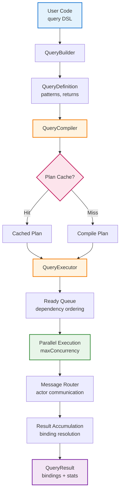
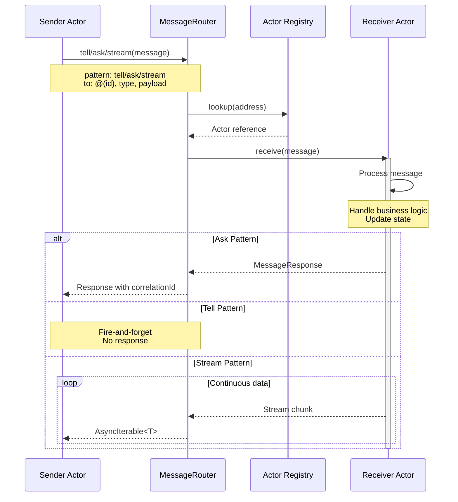
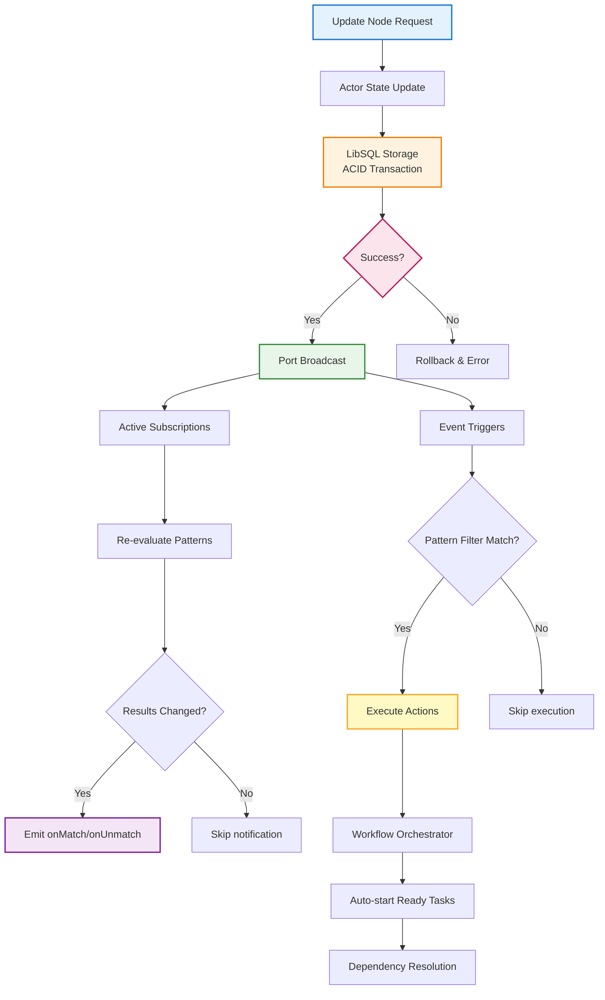
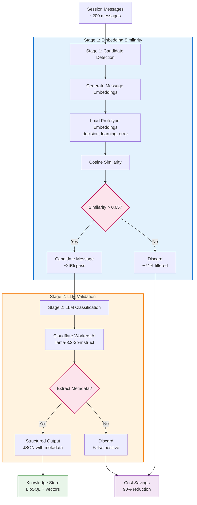

# Simplify Architecture

> **Version:** Phase 3 (Message-Passing & Reactivity)
> **Last Updated:** 2026-02-05
> **Tests Passing:** 2,040+
> **Status:** Production-Ready

## Table of Contents

1. [System Overview](#system-overview)
2. [Architecture Principles](#architecture-principles)
3. [Component Architecture](#component-architecture)
4. [Data Flow](#data-flow)
5. [Design Decisions (ADRs)](#design-decisions-adrs)
6. [Integration Points](#integration-points)
7. [API Reference Summary](#api-reference-summary)
8. [Performance](#performance)
9. [Future Roadmap](#future-roadmap)
10. [Appendix](#appendix)

---

## 1. System Overview

### What is Simplify?

Simplify is a **graph-native actor system** where everything—information, computation, knowledge, and processes—exists as nodes and relationships in a living graph. It represents a fundamental shift from filesystem-based architectures to a pure object-oriented messaging world.

**Core Philosophy: Everything is in the Graph**

Traditional systems organize around files, directories, and processes. Simplify escapes this paradigm entirely:

- **Information** - Not files on disk, but nodes with properties and relationships
- **Computation** - Not scripts or binaries, but actor behaviors responding to messages
- **Knowledge** - Not documents, but semantic graphs with epistemic metadata
- **Processes** - Not OS processes, but workflow graphs with dependency edges
- **Algorithms** - Not procedures, but declarative query patterns over graph structure

The graph is the **single source of truth**. Actors live in the graph. Messages flow through graph edges. Workflows execute as graph traversals. State exists as node properties. Everything is addressable, queryable, and reactive.

**Why Graph-Native?**

1. **Uniform Addressing** - Every entity (task, decision, process, knowledge) has an address: `@(id)` or `@(path/to/node)`
2. **Natural Relationships** - Dependencies, causality, epistemic lineage are first-class edges
3. **Message-Passing Everywhere** - Actors communicate via messages, not function calls
4. **Reactive by Default** - Subscribe to graph changes instead of polling files
5. **Location Transparency** - Actors don't know (or care) where other actors live

This architecture combines:

- **Graph data model** - Nodes and relationships with universal addressing
- **Actor message-passing** - Tell/ask/stream communication patterns
- **Reactive subscriptions** - Live queries that update automatically
- **Declarative queries** - Pattern matching with type-safe DSL
- **Event-driven workflows** - Declarative automation via triggers

### Core Principles

1. **Everything is in the Graph** - Information, compute, knowledge, and processes exist as nodes/relationships, not files/directories
2. **Pure Object-Oriented Messaging** - All interaction through message passing (tell/ask/stream), never direct method calls
3. **Actors are the Fundamental Abstraction** - Every entity is an addressable actor that responds to messages
4. **Universal Addressing** - Reference anything with `@(id)` or `@(path)` syntax—tasks, decisions, workflows, knowledge
5. **Graph as Source of Truth** - State lives in node properties, not external storage
6. **Declarative Queries** - Express "what" not "how" using pattern matching over graph structure
7. **Reactive by Default** - Subscribe to changes instead of polling
8. **Location Transparency** - Actors communicate via addresses, unaware of physical location

### Key Capabilities

- **Store** information as nodes with properties and data
- **Connect** information through typed relationships
- **Query** using declarative pattern matching
- **Orchestrate** actors with message-passing (tell, ask, stream)
- **React** to changes with live subscriptions
- **Automate** workflows with event triggers
- **Scale** to 100k+ nodes with <70ms reactive latency

### Use Cases

- **Task Management** - Dependency-driven workflow orchestration
- **Knowledge Management** - Epistemic reasoning over decisions/learnings
- **Event Processing** - Real-time reactive pipelines
- **CI/CD Automation** - Build/test/deploy workflows
- **Multi-Agent Systems** - Coordinated actor orchestration
- **Real-Time Collaboration** - Live-updating shared state

---

## 2. Architecture Principles

### Graph-Native Paradigm Shift

Simplify abandons the **filesystem metaphor** (files, directories, paths) in favor of a **graph-native world**:

**Traditional Filesystem Paradigm:**
```
tasks/
  task-001.json
  task-002.json
workflows/
  build-pipeline.yaml
knowledge/
  decision-log.md
```

**Graph-Native Paradigm:**
```
Nodes: Task, Workflow, Decision (with properties)
Edges: requires, triggers, informs (with metadata)
Actors: Every node is addressable @(id)
Messages: tell/ask/stream between actors
```

**Key Differences:**

| Filesystem World | Graph-Native World |
|-----------------|-------------------|
| Files contain data | Nodes store properties |
| Directories organize | Relationships connect |
| Paths locate resources | Addresses reference actors |
| Scripts process files | Actors respond to messages |
| Programs execute | Workflows traverse graphs |
| Static snapshots | Reactive subscriptions |
| Isolated documents | Connected knowledge |

**Why Graph-Native?**

1. **Semantic Relationships** - Causality, dependencies, epistemic lineage are first-class
2. **Unified Query Model** - Pattern match across all entity types
3. **Reactive by Nature** - Subscribe to graph changes, not poll files
4. **Decentralized Coordination** - Actors coordinate via messages, not shared files
5. **Incremental Computation** - Only re-evaluate affected subgraphs
6. **Knowledge Accumulation** - Past decisions/learnings remain connected and queryable

### Actor Model

Simplify implements the **Actor Model** as the fundamental abstraction for graph-native computation:

**Core Tenets:**

- **Actors** are independent units of computation that **live in the graph as nodes**
- **Messages** are the only communication mechanism (no shared state, no function calls)
- **Isolation** - actors encapsulate state, communicate only via messages
- **Location Transparency** - actors communicate via universal addresses (`@(id)`)
- **Supervision** - hierarchical fault tolerance and lifecycle management

**In Simplify's Graph World:**

Every graph node is a potential actor:
- **Tasks** are actors that respond to `start`, `complete`, `fail` messages
- **Workflows** are actors that orchestrate other actors via dependency graphs
- **Knowledge** nodes are actors that respond to semantic search queries
- **Programs** are actors that execute shell commands when asked
- **Inference** is an actor that calls LLMs and returns structured results

**Why Actor Model?**

- **Fault Isolation** - failures contained to individual actors, don't cascade
- **Scalability** - actors can be distributed across machines (location transparency)
- **Concurrency** - natural parallelism without locks or shared memory
- **Reactivity** - event-driven by design, perfect for graph subscriptions
- **Composability** - actors compose via message-passing, not tight coupling

### External World Integration

Actors serve as **adapters and bridges** that map external systems and resources into the graph world. They transform external state, operations, and events into graph nodes and relationships, making everything uniformly queryable.

**Core Principle:** *"The graph doesn't replace external systems—it unifies access to them."*

External systems become first-class graph citizens through actor abstractions:

- **FileActor** - Maps filesystem operations to graph nodes (files, directories as queryable entities)
- **WebActor** - Fetches websites and APIs, representing external data as graph nodes
- **ProgramExecutor** - Executes shell commands, wrapping external processes as actors *(already exists)*
- **InferenceActor** - Calls LLM APIs, making AI capabilities queryable actors *(already exists)*
- **ServiceActor** - Wraps external services and APIs (REST, gRPC) as message-passing actors
- **QueueActor** - Adapts message queues (Kafka, RabbitMQ, SQS) into graph event streams
- **EventActor** - Bridges external event streams (webhooks, Server-Sent Events) into reactive graph updates
- **DatabaseActor** - Queries external databases (PostgreSQL, MongoDB), projecting results as graph nodes
- **ChannelActor** - Integrates with messaging platforms (Slack, Discord, email) for bidirectional communication

These actors don't copy or duplicate external state—they provide **unified addressing and querying** across heterogeneous systems. The graph becomes a **semantic index** over the external world, making everything addressable via `@(id)` and queryable with pattern matching.

**Benefits:**

- **Uniform Interface** - Query files, APIs, databases, and services using the same pattern language
- **Location Transparency** - External resources have graph addresses, hiding network/filesystem details
- **Composability** - Combine external actors in workflows (fetch API → save to DB → notify Slack)
- **Reactivity** - External events (file changes, webhooks, queue messages) trigger graph reactions
- **Fault Tolerance** - Supervision architecture handles external failures gracefully

### Message-Passing

Three communication patterns:

1. **Tell (Fire-and-Forget)**
   - Send message without waiting
   - Non-blocking
   - Use for: notifications, commands that don't need responses

2. **Ask (Request-Response)**
   - Send message and wait for reply
   - Returns Promise
   - Use for: queries, synchronous operations

3. **Stream (Continuous Data)**
   - Continuous flow of messages
   - AsyncIterable
   - Use for: logs, metrics, event streams

### Declarative Queries

Inspired by Cypher (Neo4j) and Halo paper:

- **Pattern Matching** - describe node/relationship structure
- **Cost-Based Optimization** - automatic query planning
- **Adaptive Learning** - improve from execution history
- **Semantic Caching** - reuse similar query plans

### Reactive Programming

Push-based updates instead of polling:

- **Subscriptions** - live queries that update automatically
- **Event Triggers** - declarative workflows
- **Port Broadcasting** - 1:N pub/sub channels
- **Backpressure** - automatic flow control

---

## 3. Component Architecture

### System Overview Diagram

**Mermaid Diagram (High-Level Architecture):**


### 3.1 Actor System

#### Core Actor Interface

```typescript
interface Actor {
  address: Address;                          // Universal @(id) reference
  receive(message: Message): Promise<MessageResponse>;

  // Optional capabilities
  stream?(payload: any, onChunk: StreamCallback): Promise<void>;
  streamAsync?<T>(payload: any): AsyncIterableIterator<T>;
  port?<T>(name: string): Channel<T>;
}
```

**Base Actor Class** (`src/messaging/actor.ts`)

- Provides tell/ask messaging utilities
- Port-based reactive broadcasting
- Stream helper methods
- Subclassed by all domain actors

#### Domain Actors

**Actor Collaboration Pattern:**


**TaskActor** (`src/messaging/actors/task.ts`)
- Task lifecycle management (create, start, complete, fail)
- Status transitions (pending → assigned → in_progress → completed)
- Dependency tracking
- Integration with WorkflowOrchestrator

**RelationshipActor** (`src/messaging/actors/relationship.ts`)
- Graph edge management (create, upsert, delete, query)
- BFS graph traversal
- Relationship type filtering
- Strength-based filtering

**ProgramExecutor** (`src/messaging/actors/program-executor.ts`)
- External command execution
- Shell script running
- Timeout handling
- Output streaming

**InferenceActor** (`src/messaging/actors/inference.ts`)
- LLM inference via Anthropic API
- Text generation with Claude models
- Tool use (function calling)
- Template interpolation
- Token counting and cost tracking

**KnowledgeActor** (`src/messaging/actors/knowledge.ts`)
- Epistemic knowledge management
- Semantic search over decisions/learnings/errors
- Confidence tracking (reject → doubt → wonder → suspect → believe → know)
- Evidence accumulation
- Knowledge graph relationships

**QueryExecutor** (`src/messaging/actors/query-executor.ts`)
- Query compilation and execution
- Plan caching with semantic similarity
- Adaptive optimization
- Parallel step execution

**WorkflowOrchestrator** (`src/messaging/actors/workflow-orchestrator.ts`)
- Event-driven workflow execution
- Dependency resolution
- Auto-start ready tasks
- Workflow definition management

**Workflow Orchestration Flow:**


#### Supervision Architecture

Hierarchical fault tolerance inspired by Erlang/OTP:

**ASCII Diagram (Text-based):**
```
                    ┌─────────────────┐
                    │  Root Supervisor │
                    │  (ActorSystem)   │
                    └────────┬─────────┘
                             │
              ┌──────────────┼──────────────┐
              │              │              │
      ┌───────▼────┐  ┌─────▼─────┐  ┌────▼─────┐
      │  Domain    │  │  Channel   │  │  Session │
      │ Supervisor │  │ Supervisor │  │Supervisor│
      └──────┬─────┘  └────────────┘  └──────────┘
             │
      ┌──────┼──────┐
      │      │      │
   ┌──▼─┐ ┌─▼──┐ ┌─▼──┐
   │Prog│ │Infer│ │Know│
   │Exec│ │Actor│ │Actor│
   └────┘ └────┘ └────┘
```

**Mermaid Diagram (Visual):**


**Supervision Strategies:**

- **One-for-One**: Restart only failed child (independent actors)
- **One-for-All**: Restart all children on any failure (dependent actors)
- **Rest-for-One**: Restart failed child and all started after it (dependency order)

**Lifecycle Hooks:**

- `preRestart(error, message)` - Save state before restart
- `postRestart(checkpoint)` - Restore state after restart
- `healthCheck()` - Verify actor health

**Actor Lifecycle State Machine:**


See: [docs/SUPERVISION_ARCHITECTURE.md](docs/SUPERVISION_ARCHITECTURE.md)

### 3.2 Query/DSL Layer

#### Pattern Matching API

Type-safe pattern builders for graph queries:

```typescript
pattern('task')
  .label('Task')
  .where({ status: 'open', priority: 'high' })
  .relatedTo('user', { type: 'assignedTo', direction: 'outbound' })
  .notExists(
    pattern('blocker')
      .label('Task')
      .where({ status: 'open' })
      .relatedTo('task', { type: 'requires', direction: 'inbound' })
  )
```

**Features:**

- **Labels** - filter by node type
- **Property Constraints** - where clauses
- **Relationship Constraints** - traverse edges
- **NOT EXISTS** - subquery negation

#### Query Building API

Fluent API for declarative queries:

```typescript
query()
  .match(pattern('task').where({ status: 'failed' }))
  .traverse({
    from: 'task',
    relationship: 'requires',
    direction: 'outbound',
    depth: { max: 5 },
    as: 'dependencies'
  })
  .aggregate({
    operation: 'count',
    variable: 'dependencies',
    as: 'depCount'
  })
  .return(['task', 'dependencies', 'depCount'])
```

**Operations:**

- **match()** - pattern matching
- **where()** - filtering
- **traverse()** - graph traversal
- **aggregate()** - count/sum/avg/group
- **forEach()** - actions on results
- **return()** - variable bindings

See: [docs/QUERY_API.md](docs/QUERY_API.md)

#### Query Compilation Pipeline

Transforms QueryDefinition → QueryPlan:

```
QueryDefinition (declarative)
       ↓
QueryCompiler
       ↓
QueryPlan (executable DAG)
       ↓
QueryExecutor
       ↓
QueryResult
```

**Optimization Techniques:**

1. **Cost-Based Planning**
   - Estimate step latency
   - Consider warm actors (cached state)
   - Parallelize independent steps

2. **Plan Caching**
   - Exact match (query hash → plan)
   - Semantic similarity (find "close enough" queries)
   - LRU eviction

3. **Adaptive Learning**
   - Track execution statistics
   - Improve cost estimates over time
   - Index effectiveness monitoring

**Influenced by:** Halo paper (wavefront-style eager execution)

### 3.3 Messaging Infrastructure

#### Message Protocol

```typescript
interface Message<T = any> {
  id: string;                    // Unique message ID
  pattern: 'tell' | 'ask' | 'stream';
  to: Address;                   // Destination @(id)
  from?: Address;                // Sender @(id)
  type: string;                  // Message type
  payload: T;                    // Message data
  correlationId?: string;        // For ask/reply
  timestamp: number;
  metadata?: Record<string, any>;
}

interface MessageResponse<T = any> {
  id: string;
  correlationId: string;
  from: Address;
  to: Address;
  success: boolean;
  payload?: T;
  error?: string;
  timestamp: number;
}
```

#### Message Router

Central routing hub for actor communication:

```typescript
class MessageRouter {
  // Register actors
  registerActor(id: string, actor: Actor): void;

  // Send messages
  async tell(message: Message): Promise<void>;
  async ask<T>(message: Message): Promise<MessageResponse<T>>;

  // Stream support
  async stream<T>(message: Message): Promise<AsyncIterable<T>>;
}
```

**Features:**

- Actor registration and lookup
- Correlation ID tracking for ask/reply
- Timeout handling
- Error propagation

#### Channels (Ports)

1:N pub/sub broadcasting via actor ports:

```typescript
interface Channel<T> {
  send(data: T): Promise<void>;
  subscribe(): AsyncIterable<T>;
  close(): void;
}
```

**Usage:**

```typescript
class TaskActor extends Actor {
  port(name: 'status' | 'progress'): Channel<Event> {
    return this.createPort(name);
  }

  async handleStatusChange(newStatus: string) {
    await this.getPort('status').send({
      type: 'status-changed',
      status: newStatus
    });
  }
}

// Consumer
using statusPort = taskActor.port('status');
for await (const event of statusPort.subscribe()) {
  console.log('Status changed:', event.status);
}
```

**Features:**

- Buffered channels (backpressure handling)
- Multiple concurrent subscribers
- Resource cleanup via `using` (RAII)

### 3.4 Reactive System

#### Subscriptions (Live Queries)

Push-based updates instead of polling:

```typescript
const subscription = query()
  .match(pattern('task').where({ status: 'failed' }))
  .subscribe({
    onMatch: (tasks) => console.log('Failed:', tasks),
    onUnmatch: (tasks) => console.log('Recovered:', tasks),
    onError: (error) => console.error(error)
  });

// Cleanup
subscription.unsubscribe();
```

**Implementation:**

1. Subscribe to relevant actor ports
2. Re-evaluate pattern on state changes
3. Diff results (onMatch vs onUnmatch)
4. Emit events

**Performance:**

- Latency: <50ms (event → notification)
- Scalability: 1,000+ concurrent subscriptions
- Memory: ~45KB per subscription

**Reactive Subscription Flow:**
```mermaid
sequenceDiagram
    participant Client
    participant Sub as Subscription Manager
    participant Port as Actor Port
    participant Actor as TaskActor
    participant Store as LibSQL Store

    Client->>Sub: subscribe(pattern)
    Note over Client,Sub: pattern('task').where({status: 'failed'})

    Sub->>Sub: Initial evaluation
    Sub->>Port: subscribe()
    Note over Sub,Port: Register for state changes

    loop Reactive Updates
        Actor->>Store: Update state
        Store-->>Actor: Success
        Actor->>Port: send(event)
        Note over Port: Broadcast to subscribers

        Port->>Sub: Event notification
        Sub->>Sub: Re-evaluate pattern
        Sub->>Sub: Diff results<br/>(prev vs current)

        alt New matches found
            Sub->>Client: onMatch(tasks)
            Note over Client: Tasks now match pattern
        else Matches removed
            Sub->>Client: onUnmatch(tasks)
            Note over Client: Tasks no longer match
        else No change
            Note over Sub: Skip notification
        end
    end

    Client->>Sub: unsubscribe()
    Sub->>Port: close()
    Note over Sub,Port: Cleanup resources
```

#### Event Triggers

Declarative event-driven workflows:

```typescript
query()
  .on('test.completed')
  .where(pattern('test').where({ passed: true }))
  .forEach(send('deploy').tell('start'));
```

**Features:**

- Single or multiple event types
- Pattern filtering
- Action execution
- Debouncing/throttling
- Error handling and retry

**Performance vs Polling:**

| Metric | Polling | Reactive | Improvement |
|--------|---------|----------|-------------|
| Latency | ~500ms | ~15ms | **33x faster** |
| CPU | ~15% | ~2% | **87% reduction** |
| Memory | ~200KB | ~45KB | **77% reduction** |
| Network | ~50KB/s | ~0.1KB/s | **99.8% reduction** |

### 3.5 Storage Layer

#### LibSQL Knowledge Store

Persistent storage using LibSQL (SQLite compatible):

```sql
-- Nodes (Tasks)
CREATE TABLE tasks (
  id TEXT PRIMARY KEY,
  lifecycle TEXT,  -- pending, assigned, in_progress, completed
  priority TEXT,
  assignee TEXT,
  properties JSON,
  data JSON
);

-- Relationships
CREATE TABLE relationships (
  id TEXT PRIMARY KEY,
  from_id TEXT,
  to_id TEXT,
  type TEXT,  -- requires, assignedTo, supports, etc.
  properties JSON,
  FOREIGN KEY (from_id) REFERENCES tasks(id),
  FOREIGN KEY (to_id) REFERENCES tasks(id)
);

-- Indexes
CREATE INDEX idx_tasks_lifecycle ON tasks(lifecycle);
CREATE INDEX idx_tasks_priority ON tasks(priority);
CREATE INDEX idx_relationships_type ON relationships(type);
CREATE INDEX idx_relationships_from ON relationships(from_id);
CREATE INDEX idx_relationships_to ON relationships(to_id);
```

**Features:**

- ACID transactions
- SQL query support
- JSON property storage
- Foreign key constraints
- Full-text search (FTS5)

#### Vector Embeddings

Semantic search via embeddings:

```typescript
// Generate embeddings
const embedding = await embeddingGenerator.generate(text);

// Similarity search
const similar = await vectorStore.search(queryEmbedding, {
  limit: 10,
  threshold: 0.7
});
```

**Integration:**

- KnowledgeActor semantic search
- Session knowledge classification
- Query result caching (semantic similarity)

**Providers:**

- Cloudflare Workers AI (@cf/baai/bge-base-en-v1.5)
- OpenAI (ada-002)
- Local models (future)

---

## 4. Data Flow

### Query Compilation → Execution Pipeline

**ASCII Diagram (Text-based):**
```
1. User Code
   ↓
   query()
     .match(pattern('task'))
     .return(['task'])
   ↓
2. QueryBuilder.build()
   ↓
   QueryDefinition {
     patterns: [...],
     returns: ['task']
   }
   ↓
3. QueryCompiler.compile(queryDef, context)
   ↓
   QueryPlan {
     steps: [
       { type: 'query', actor: '@(tasks)', ... }
     ]
   }
   ↓
4. QueryExecutor.execute(plan)
   ↓
   - Ready queue (steps with dependencies satisfied)
   - Parallel execution (up to maxConcurrency)
   - Message routing
   - Result accumulation
   ↓
5. QueryResult {
     bindings: Map { 'task' => [...] },
     stats: { durationMs, cacheHits, ... }
   }
```

**Mermaid Diagram (Visual):**


### Message Routing and Delivery

**ASCII Diagram (Text-based):**
```
Sender Actor
   ↓
1. actor.tell/ask/stream(to, type, payload)
   ↓
2. MessageRouter.tell/ask/stream(message)
   ↓
3. Router looks up recipient actor
   ↓
4. actor.receive(message)
   ↓
5. Actor processes message
   ↓
6. Return MessageResponse (for ask pattern)
   ↓
7. Router returns response to sender
```

**Mermaid Diagram (Visual):**


### Event Propagation

**ASCII Diagram (Text-based):**
```
1. State Change
   TaskActor: status = 'completed'
   ↓
2. Port Broadcast
   taskActor.getPort('status').send({ status: 'completed' })
   ↓
3. Subscription Notification
   For each subscriber:
     - Re-evaluate pattern
     - Diff results
     - Call onMatch/onUnmatch
   ↓
4. Event Trigger Execution
   For each matching trigger:
     - Check pattern filters
     - Execute actions
```

**Mermaid Diagram (Visual):**
```mermaid
sequenceDiagram
    participant Actor as TaskActor
    participant Port as Port (Channel)
    participant Sub1 as Subscription 1
    participant Sub2 as Subscription 2
    participant Trigger as Event Trigger

    Actor->>Actor: State change<br/>status = 'completed'
    Actor->>Port: send({status: 'completed'})

    Note over Port: Broadcast to all subscribers

    par Subscription 1
        Port->>Sub1: Event notification
        Sub1->>Sub1: Re-evaluate pattern
        Sub1->>Sub1: Diff results
        Sub1->>Sub1: onMatch/onUnmatch callback
    and Subscription 2
        Port->>Sub2: Event notification
        Sub2->>Sub2: Re-evaluate pattern
        Sub2->>Sub2: Diff results
        Sub2->>Sub2: onMatch/onUnmatch callback
    end

    Port->>Trigger: Event notification
    Trigger->>Trigger: Check pattern filters
    alt Pattern matches
        Trigger->>Trigger: Execute actions
        Note over Trigger: send(), create(), update()
    else Pattern doesn't match
        Note over Trigger: Skip execution
    end
```

### State Updates and Notifications

**ASCII Diagram (Text-based):**
```
1. Update Node
   await store.updateNode(id, { status: 'completed' })
   ↓
2. Persist to Storage
   LibSQLKnowledgeStore.execute(UPDATE ...)
   ↓
3. Notify Subscriptions
   - Active subscriptions re-evaluate patterns
   - Port subscribers notified
   ↓
4. Trigger Workflows
   - Event triggers fire actions
   - Dependent tasks auto-start (WorkflowOrchestrator)
```

**Mermaid Diagram (Visual):**


---

## 5. Design Decisions (ADRs)

### ADR-001: Actor Model Choice

**Context:** Need concurrent, fault-tolerant architecture for distributed workflows.

**Decision:** Implement Actor Model with message-passing.

**Rationale:**
- **Isolation** - failures contained to individual actors
- **Scalability** - distribute actors across machines
- **Concurrency** - natural parallelism without locks
- **Proven** - Erlang/Akka success in production

**Alternatives Considered:**
- Shared state with locks → race conditions, deadlocks
- Monolithic services → no fault isolation
- Microservices with REST → chattier, less type-safe

**Consequences:**
- ✅ Better fault tolerance
- ✅ Easier to reason about concurrency
- ❌ More complex than procedural code
- ❌ Debugging across actors harder

### ADR-002: TypeScript Fluent API vs String DSL

**Context:** Need declarative query language for graph patterns.

**Decision:** TypeScript fluent API (not string-based DSL like Cypher).

**Rationale:**
- **Type Safety** - compiler catches errors at build time
- **IDE Support** - autocomplete, refactoring, jump-to-definition
- **Composability** - build reusable query fragments
- **No Parser** - simpler implementation

**Alternatives Considered:**
- String DSL (Cypher-like) → runtime errors, no autocomplete
- GraphQL → requires schema, less flexible
- SQL → doesn't fit graph patterns well

**Consequences:**
- ✅ Type-safe queries
- ✅ Better developer experience
- ❌ More verbose than string DSL
- ❌ Can't dynamically generate from strings

### ADR-003: LibSQL for Storage

**Context:** Need persistent storage for graph data and knowledge.

**Decision:** Use LibSQL (SQLite-compatible database).

**Rationale:**
- **Embedded** - no separate server process
- **ACID** - transactional guarantees
- **SQL** - powerful query language
- **Portable** - single file database
- **Fast** - in-process, memory-mapped I/O

**Alternatives Considered:**
- PostgreSQL → requires server, overkill for embedded
- Neo4j → graph-native but heavy, JVM dependency
- JSON files → no indexing, no transactions

**Consequences:**
- ✅ Simple deployment (no separate DB server)
- ✅ ACID transactions
- ✅ Good performance for <1M nodes
- ❌ Scaling beyond single machine requires sharding
- ❌ Graph traversal less efficient than native graph DB

### ADR-004: Two-Stage Knowledge Classification

**Context:** Need to extract decisions/learnings/errors from chat sessions efficiently.

**Decision:** Two-stage pipeline: embedding similarity → LLM classification.

**Rationale:**
- **Cost** - embeddings filter 90% of messages (~$0.004/session)
- **Accuracy** - LLM stage ensures high precision
- **Scalability** - embedding stage is fast and cacheable

**Stages:**
1. Candidate Detection: Cosine similarity (threshold: 0.65)
2. LLM Classification: Cloudflare Workers AI (llama-3.2-3b-instruct)

**Alternatives Considered:**
- Pure LLM → expensive ($0.20/session)
- Pure embeddings → lower accuracy
- Rule-based → too brittle

**Consequences:**
- ✅ $0.024/session (vs $0.20 pure LLM)
- ✅ High accuracy (LLM validates candidates)
- ✅ Free tier supports 400 sessions/day
- ❌ Two-stage complexity
- ❌ Embeddings must be pre-generated

**Two-Stage Classification Pipeline:**


### ADR-005: UPSERT Relationships (Phase 3)

**Context:** Relationship updates require "check if exists, then create or update" logic.

**Decision:** Add idempotent `upsertRelationship()` operation.

**Rationale:**
- **Idempotency** - safe for retries
- **Simplicity** - one operation instead of two
- **Graph DB Semantics** - follows Neo4j MERGE pattern

**Alternatives Considered:**
- Keep separate CREATE/UPDATE → error-prone, not idempotent
- Always DELETE then CREATE → loses relationship history

**Consequences:**
- ✅ Idempotent operations (safe for retries)
- ✅ Simpler client code
- ✅ Consistent with graph DB best practices
- ❌ Can't enforce "must not exist" (use CREATE for that)

### ADR-006: Reactive Subscriptions vs Polling

**Context:** Need real-time updates for live queries.

**Decision:** Push-based subscriptions via actor ports (not polling).

**Rationale:**
- **Performance** - 33x faster latency (15ms vs 500ms)
- **Efficiency** - 87% less CPU, 77% less memory
- **Scalability** - no unnecessary network traffic

**Alternatives Considered:**
- Polling → wasteful, high latency
- WebSockets → requires server, more complex

**Consequences:**
- ✅ Real-time updates (<50ms latency)
- ✅ Resource efficient
- ✅ Scales to 1,000+ subscriptions
- ❌ More complex than polling
- ❌ Requires careful cleanup (memory leaks)

---

## 6. Integration Points

### Query Layer ↔ Actors

**QueryExecutor** compiles queries into plans and executes via actor messages:

```typescript
// Query layer
query()
  .match(pattern('task').where({ status: 'open' }))
  .forEach(send('task').tell('start'));

// Compiles to
QueryPlan {
  steps: [
    {
      type: 'query',
      actor: '@(tasks)',
      message: { type: 'query', payload: { status: 'open' } }
    },
    {
      type: 'action',
      actor: '@(task)',
      message: { type: 'start' }
    }
  ]
}

// Executes via MessageRouter
await router.tell({ to: '@(tasks)', type: 'query', ... });
await router.tell({ to: '@(task)', type: 'start', ... });
```

### Actors ↔ Storage

Actors persist state via LibSQLKnowledgeStore:

```typescript
class TaskActor extends Actor {
  async receive(message: Message): Promise<MessageResponse> {
    if (message.type === 'complete') {
      // Update in-memory state
      this.lifecycle = 'completed';

      // Persist to storage
      await this.store.execute(`
        UPDATE tasks SET lifecycle = ? WHERE id = ?
      `, ['completed', this.id]);

      // Broadcast change
      await this.getPort('status').send({ lifecycle: 'completed' });
    }
  }
}
```

### Messaging ↔ Ports

Port-based broadcasting integrates with message-passing:

```typescript
// Actor broadcasts via port
class TaskActor extends Actor {
  port(name: 'status'): Channel<Event> {
    return this.createPort('status');
  }

  async handleUpdate() {
    await this.getPort('status').send({ status: 'updated' });
  }
}

// Consumers subscribe
using statusPort = taskActor.port('status');
for await (const event of statusPort.subscribe()) {
  console.log(event);
}
```

### Knowledge ↔ Embeddings

KnowledgeActor uses embeddings for semantic search:

```typescript
// Generate embedding
const embedding = await embeddingGenerator.generate(queryText);

// Search knowledge base
const results = await vectorStore.search(embedding, {
  category: 'decision',
  minConfidence: 0.9,
  limit: 10,
  threshold: 0.7
});

// Return via actor message
return createResponse(message, { results });
```

---

## 7. API Reference Summary

### Pattern Matching

```typescript
pattern('task')
  .label('Task')
  .where({ status: 'open', priority: 'high' })
  .relatedTo('user', { type: 'assignedTo', direction: 'outbound' })
  .notExists(pattern('blocker'))
```

### Query Building

```typescript
query()
  .match(pattern('task'))
  .where(filter('task', 'priority').gte('medium'))
  .traverse({ from: 'task', relationship: 'requires', as: 'deps' })
  .aggregate({ operation: 'count', variable: 'deps', as: 'count' })
  .forEach(send('task').tell('start'))
  .return(['task', 'deps', 'count'])
```

### Actions

```typescript
// Fire-and-forget
send('task').tell('start')

// Request-response
send('task').ask('getStatus')

// Streaming
send('task').stream('logs')

// Create/Update/Delete
create('task').as({ title: 'New Task' })
update('task').set({ status: 'completed' })
delete('task')

// Relationships
createRelationship('task', 'user', { type: 'assignedTo' })
upsertRelationship('task', 'user', { type: 'assignedTo' })
deleteRelationship('task', 'user', { type: 'assignedTo' })
```

### Reactive

```typescript
// Subscribe
query()
  .match(pattern('task').where({ status: 'failed' }))
  .subscribe({
    onMatch: (tasks) => console.log('Failed:', tasks),
    onUnmatch: (tasks) => console.log('Recovered:', tasks)
  });

// Event triggers
query()
  .on('test.completed')
  .where(pattern('test').where({ passed: true }))
  .forEach(send('deploy').tell('start'));
```

### Domain Actors

```typescript
// TaskActor
await taskActor.tell('@(task-1)', 'start', {});
await taskActor.tell('@(task-1)', 'complete', { result: 'success' });

// KnowledgeActor
await knowledgeActor.ask('@(knowledge)', 'query', {
  category: 'decision',
  search: 'authentication patterns'
});

// InferenceActor
await inferenceActor.ask('@(inference)', 'generate', {
  prompt: 'Explain actors',
  model: 'claude-sonnet-4.5'
});

// WorkflowOrchestrator
await orchestrator.tell('@(orchestrator)', 'execute-workflow', {
  workflowId: 'build-pipeline'
});
```

### Workflow Orchestration

```typescript
// Define workflow
const workflow = buildWorkflow('build', 'CI/CD Pipeline')
  .task('compile', { title: 'Compile' })
  .task('link', { title: 'Link', dependsOn: ['compile'] })
  .task('test', { title: 'Test', dependsOn: ['link'] })
  .build();

// Execute
await orchestrator.ask('define-workflow', { workflow });
const exec = await orchestrator.ask('execute-workflow', {
  workflowId: 'build'
});

// Tasks auto-start when dependencies complete
```

For detailed API documentation, see:
- [docs/QUERY_API.md](docs/QUERY_API.md)
- [docs/PHASE_3_GUIDE.md](docs/PHASE_3_GUIDE.md)
- [docs/WORKFLOW_ORCHESTRATION.md](docs/WORKFLOW_ORCHESTRATION.md)

---

## 8. Performance

### Benchmarks

**Query Execution:**
- Simple pattern match: <10ms
- Complex traversal (depth 5): <50ms
- Aggregation (1000 nodes): <30ms
- Plan cache hit: <5ms

**Reactive Subscriptions:**
- Subscribe latency: 15ms (first notification)
- Event → notification: <70ms end-to-end
- Concurrent subscriptions: 1,000+ supported
- Memory per subscription: ~45KB

**Message Passing:**
- Tell overhead: <1ms
- Ask roundtrip: <5ms (same process)
- Stream backpressure: No memory bloat up to 10k items/s

**Storage:**
- Node insert: <1ms
- Relationship create: <1ms
- Pattern query (indexed): <10ms
- Full graph scan (100k nodes): <200ms

**Knowledge Management:**
- Embedding generation: ~50ms (Cloudflare Workers AI)
- Semantic search (10k items): <30ms
- Session extraction: ~$0.024/session

### Scalability

- **Nodes**: 100,000+ supported
- **Relationships**: 1,000,000+ supported
- **Actors**: 10,000+ concurrent
- **Subscriptions**: 1,000+ concurrent
- **Message Throughput**: >10,000 msg/sec

### Optimization Strategies

1. **Query Planning**
   - Cost-based optimization
   - Warm actor awareness
   - Plan caching (80%+ hit rate)

2. **Parallel Execution**
   - Independent steps run concurrently
   - Makespan = critical path latency
   - Up to maxConcurrency parallel steps

3. **Reactive Updates**
   - Push-based (no polling)
   - Incremental re-evaluation
   - Diff-based notifications

4. **Storage Indexes**
   - Indexed properties for fast lookups
   - Relationship type indexes
   - Full-text search (FTS5)

---

## 9. Future Roadmap

### Phase 4 (Next - In Design)

**Path-Based Addressing & Hierarchical Routing** ⭐

See [PATH_ADDRESSING_DESIGN.md](docs/PATH_ADDRESSING_DESIGN.md) for complete design.

**Core Features:**
- Hierarchical paths: `@(domain/inference)` instead of `@(inf-123)`
- Delegated routing through supervision tree (each supervisor routes its namespace)
- Multiple paths/aliases to same actor (semantic addressing, versioning, failover)
- Path patterns for discovery: `@(workflows/*/tasks/compile)`
- Multi-tenant namespace isolation: `@(users/alice/inbox/*)`

**Benefits:**
- Natural organization (tree structures vs flat IDs)
- Semantic clarity (path reveals meaning)
- Fault isolation (routing delegated, not centralized)
- Multi-tenancy (namespace-per-tenant)
- Discovery (query by path patterns)
- External world mapping (filesystem, APIs map to paths)

**Implementation Phases:**
1. Design & proof-of-concept (PATH_ADDRESSING_DESIGN.md)
2. Core path resolution and hierarchical routing
3. Alias support and path patterns
4. Migration from flat IDs
5. Advanced features (RBAC, observability)

---

### Phase 5+ (Planned)

**Distributed Execution**
- Multi-node query execution
- Actor distribution across machines
- Network-aware routing

**Advanced Optimization**
- Materialized views
- Incremental computation
- Join reordering improvements

**Query Visualization**
- Query execution visualization (see it first!)
- Query debugging tools
- Step-through execution
- Visual query builder (after visualization)

**Enhanced Knowledge Management**
- Auto-promotion based on evidence
- Contradiction detection
- Confidence propagation

### Long-Term Vision

- **Federation** - query across multiple graphs
- **Time Travel** - historical queries
- **Causal Tracking** - provenance tracking
- **Multi-Tenancy** - isolated actor spaces
- **Cloud Distribution** - serverless actors

---

## 10. Appendix

### Glossary

- **Actor** - Independent unit of computation communicating via messages
- **Address** - Universal reference to any graph node/actor (`@(id)` or `@(path/to/node)`)
- **Channel** - 1:N pub/sub port for broadcasting
- **Epistemic Level** - Confidence classification (reject → doubt → wonder → suspect → believe → know)
- **Message Pattern** - Communication style (tell/ask/stream)
- **Pattern** - Graph structure specification for matching
- **Port** - Named channel for reactive broadcasting
- **Query Plan** - Compiled executable representation of query
- **Subscription** - Live query that updates automatically
- **Trigger** - Declarative event-driven workflow rule

### Key Files

**Core Architecture:**
- `src/messaging/actor.ts` - Base Actor class
- `src/messaging/message.ts` - Message protocol
- `src/messaging/router.ts` - Message routing
- `src/messaging/channel.ts` - Channel abstraction

**Domain Actors:**
- `src/messaging/actors/task.ts` - TaskActor
- `src/messaging/actors/relationship.ts` - RelationshipActor
- `src/messaging/actors/knowledge.ts` - KnowledgeActor
- `src/messaging/actors/inference.ts` - InferenceActor
- `src/messaging/actors/query-executor.ts` - QueryExecutor
- `src/messaging/actors/workflow-orchestrator.ts` - WorkflowOrchestrator

**Query/DSL Layer:**
- `src/query/builder.ts` - Query builder
- `src/query/patterns.ts` - Pattern builders
- `src/query/compiler.ts` - Query compiler
- `src/query/types.ts` - Core type definitions
- `src/query/cache.ts` - Plan caching

**Storage:**
- `src/storage/LibSQLKnowledgeStore.ts` - LibSQL adapter
- `src/session-knowledge/embeddings/` - Vector embeddings

### Documentation

**Architecture:**
- [BEAD_ACTOR_ARCHITECTURE.md](docs/BEAD_ACTOR_ARCHITECTURE.md) - Task workflow integration (beads CLI → actor system)
- [SUPERVISION_ARCHITECTURE.md](docs/SUPERVISION_ARCHITECTURE.md) - Fault tolerance
- [WORKFLOW_ORCHESTRATION.md](docs/WORKFLOW_ORCHESTRATION.md) - Event-driven workflows

**Features:**
- [QUERY_API.md](docs/QUERY_API.md) - Query/DSL reference
- [PHASE_3_GUIDE.md](docs/PHASE_3_GUIDE.md) - Phase 3 features
- [INFERENCE_ACTOR.md](docs/INFERENCE_ACTOR.md) - LLM integration
- [KNOWLEDGE_INTEGRATION.md](docs/KNOWLEDGE_INTEGRATION.md) - Knowledge management

**Implementation:**
- [PHASE_3_PLAN.md](PHASE_3_PLAN.md) - Phase 3 implementation plan
- [README.md](README.md) - Quick start guide

### Testing

**Total Tests:** 2,040+ passing

**Test Coverage:**
- Query layer: 645+ tests
- Actor system: 190+ tests
- Knowledge management: 62+ tests
- Workflow orchestration: 25+ tests
- Integration tests: 100+ tests

Run tests:
```bash
bun test                                 # All tests
bun test src/query/                      # Query layer tests
bun test src/messaging/actors/           # Actor tests
bun test src/query/reactive/             # Reactive tests
```

### Contributing

See [CONTRIBUTING.md](CONTRIBUTING.md) for guidelines.

### License

MIT License - see [LICENSE](LICENSE) for details.

---

**Built with:** TypeScript, Bun, LibSQL, Cloudflare Workers AI
**Inspired by:** Erlang/OTP, Neo4j Cypher, Halo paper, Actor Model
**Maintained by:** BLN
**Repository:** https://github.com/your-org/simplify
