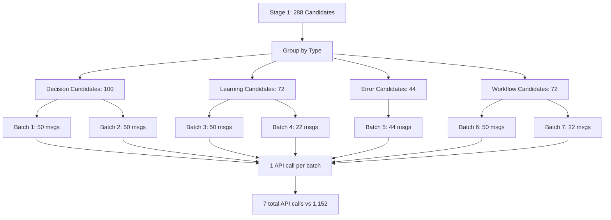

# Batch Classification Implementation Plan

**Issue**: #6
**Date**: 2026-02-04
**Status**: Planning Phase
**Priority**: P1 (High - blocks 2 tests, impacts performance)

---

## 1. Overview

### Problem Statement

The current knowledge extraction pipeline makes **1,152 LLM API calls** to process a 1000-message session, causing:
- **2 scenario tests fail** (98.9% pass rate → need 100%)
- **70s execution time** (exceeds 30s target by 2.3×)
- **LM Studio overwhelmed** by burst requests even with rate limiting

### Proposed Solution

**Batch classification**: Group multiple messages into a single LLM prompt with structured JSON array output.

**Key insight**: Instead of calling the LLM 4 times per message (decision, learning, error, workflow), call it once per batch of 20-50 messages per classification type.

### Expected Impact

| Metric | Current | Target | Improvement |
|--------|---------|--------|-------------|
| API Calls | 1,152 | ~58 | 20× fewer |
| Execution Time | 70s | <30s | 2.3× faster |
| Test Pass Rate | 940/951 (98.9%) | 951/951 (100%) | 11 tests fixed |
| Provider Support | LM Studio (limited) | All providers | Universal |

---

## 2. Current Implementation Analysis

### File: `src/session-knowledge/classification/SemanticMessageClassifier.ts`

**Individual Classification Methods** (lines 109-393):

```typescript
// Each method makes 1 LLM API call per message
async classifyDecision(content: string): Promise<DecisionClassification | null>
async classifyLearning(content: string): Promise<LearningClassification | null>
async classifyError(content: string): Promise<ErrorClassification | null>
async classifyWorkflow(content: string): Promise<WorkflowClassification | null>
```

**Example: Decision Classification** (lines 109-166):

```typescript
async classifyDecision(content: string): Promise<DecisionClassification | null> {
  const systemPrompt = `You are a decision classifier...`;

  const userPrompt = `Analyze this message and determine if it describes a decision:

"""
${content}
"""

Respond with JSON only:
{
  "isDecision": true/false,
  "confidence": 0.0-1.0,
  "choice": "what was decided (if isDecision=true)",
  ...
}`;

  const messages: ChatMessage[] = [
    { role: 'system', content: systemPrompt },
    { role: 'user', content: userPrompt }
  ];

  const result = await this.llm.chatJSON<...>(messages);  // ← 1 API call

  if (!result.isDecision || !result.choice) {
    return null;
  }

  return { isDecision: true, confidence: result.confidence, ... };
}
```

### File: `src/session-knowledge/extraction/KnowledgeExtractor.ts`

**Stage 2 Processing** (lines 251-374):

```typescript
// Stage 2: LLM classification (rate-limited, parallel with batching)
const batchSize = 5;  // Process 5 candidates at a time
for (let i = 0; i < candidates.length; i += batchSize) {
  const batch = candidates.slice(i, i + batchSize);

  const results = await Promise.all(
    batch.map(async (candidate) => {
      await llmRateLimiter.throttle();  // Rate limit: 5 concurrent, 200ms delay

      // 4 LLM calls per candidate (if all categories match)
      const classifications = await Promise.all([
        candidate.categories.includes('decision')
          ? this.classifier.classifyDecision(candidate.content)  // ← API call 1
          : null,
        candidate.categories.includes('learning')
          ? this.classifier.classifyLearning(candidate.content)  // ← API call 2
          : null,
        candidate.categories.includes('error')
          ? this.classifier.classifyError(candidate.content)     // ← API call 3
          : null,
        candidate.categories.includes('workflow')
          ? this.classifier.classifyWorkflow(candidate.content)  // ← API call 4
          : null,
      ]);

      return { messageId: candidate.messageId, ... };
    })
  );
}
```

### API Call Pattern

**For 1000-message session**:
1. **Stage 1** (heuristic): 1000 messages → 288 candidates (28.8% match rate)
2. **Stage 2** (LLM): 288 candidates × 4 classification types = **1,152 API calls**

**Problem**: Even with rate limiting (5 concurrent, 200ms delay), LM Studio cannot handle this burst:
- 1,152 calls ÷ 5 concurrent = 230 batches
- 230 batches × 200ms = 46s minimum (rate limiting alone)
- Actual: 70s+ with retries and failures

---

## 3. Proposed Architecture

### Batch Classification Flow



### Batch Prompt Design

**Example: Decision Batch Prompt**

```typescript
const systemPrompt = `You are a decision classifier. Analyze multiple messages and determine which describe decisions.

A decision message includes:
- A clear choice or selection made
- Often mentions alternatives or options considered
- May include reasoning or justification

Extract structured information for each message.`;

const userPrompt = `Analyze these messages and classify each one:

${messages.map((msg, i) => `
Message ${i} (ID: ${msg.messageId}):
"""
${msg.content}
"""
`).join('\n')}

Respond with JSON array only (one result per message):
{
  "results": [
    {
      "messageId": "${messages[0].messageId}",
      "isDecision": true/false,
      "confidence": 0.0-1.0,
      "choice": "what was decided (if isDecision=true)",
      "alternatives": ["alternative 1", "alternative 2"] or null,
      "reasoning": "why this was chosen" or null,
      "metadata": {}
    },
    // ... one entry per input message
  ]
}`;
```

### Structured Output Format

**TypeScript Interface**:

```typescript
interface BatchDecisionResult {
  results: Array<{
    messageId: string;
    isDecision: boolean;
    confidence: number;
    choice?: string;
    alternatives?: string[];
    reasoning?: string;
    metadata?: Record<string, any>;
  }>;
}
```

**JSON Schema** (for structured output APIs):

```json
{
  "type": "object",
  "properties": {
    "results": {
      "type": "array",
      "items": {
        "type": "object",
        "properties": {
          "messageId": {"type": "string"},
          "isDecision": {"type": "boolean"},
          "confidence": {"type": "number", "minimum": 0, "maximum": 1},
          "choice": {"type": "string"},
          "alternatives": {"type": "array", "items": {"type": "string"}},
          "reasoning": {"type": "string"},
          "metadata": {"type": "object"}
        },
        "required": ["messageId", "isDecision", "confidence"]
      }
    }
  },
  "required": ["results"]
}
```

### Error Handling Strategy

1. **Partial Results**: If batch processing fails mid-array, use successfully parsed results
2. **Missing messageIds**: Warn and skip unparseable results
3. **Malformed JSON**: Fall back to individual classification for the batch
4. **Timeout**: Reduce batch size and retry
5. **Provider Limits**: Respect token limits (adjust batch size per provider)

---

## 4. Implementation Steps

### Phase 1: Add Batch Methods (2-3 days)

**File**: `src/session-knowledge/classification/SemanticMessageClassifier.ts`

**New Method: `classifyDecisionBatch`**

```typescript
/**
 * Classify multiple messages for decisions in a single API call
 *
 * @param messages - Array of {messageId, content} to classify
 * @returns Array of DecisionClassifications (only those that are decisions)
 */
async classifyDecisionBatch(
  messages: Array<{ messageId: string; content: string }>
): Promise<Array<DecisionClassification & { messageId: string }>> {
  if (messages.length === 0) {
    return [];
  }

  const systemPrompt = `You are a decision classifier. Analyze multiple messages and determine which describe decisions.

A decision message includes:
- A clear choice or selection made
- Often mentions alternatives or options considered
- May include reasoning or justification

Extract structured information for each message.`;

  const userPrompt = `Analyze these ${messages.length} messages and classify each one:

${messages.map((msg, i) => `
Message ${i} (ID: ${msg.messageId}):
"""
${msg.content}
"""
`).join('\n')}

Respond with JSON array only (one result per message):
{
  "results": [
    {
      "messageId": "...",
      "isDecision": true/false,
      "confidence": 0.0-1.0,
      "choice": "what was decided (if isDecision=true)",
      "alternatives": ["alt1", "alt2"] or null,
      "reasoning": "why this was chosen" or null,
      "metadata": {}
    }
  ]
}`;

  const chatMessages: ChatMessage[] = [
    { role: 'system', content: systemPrompt },
    { role: 'user', content: userPrompt }
  ];

  try {
    const result = await this.llm.chatJSON<{
      results: Array<{
        messageId: string;
        isDecision: boolean;
        confidence: number;
        choice?: string;
        alternatives?: string[];
        reasoning?: string;
        metadata?: Record<string, any>;
      }>;
    }>(chatMessages);

    // Filter to only decisions and add messageId
    return result.results
      .filter(r => r.isDecision && r.choice)
      .map(r => ({
        messageId: r.messageId,
        isDecision: true as const,
        confidence: r.confidence || 0.0,
        choice: r.choice!,
        alternatives: r.alternatives,
        reasoning: r.reasoning,
        metadata: r.metadata || {}
      }));
  } catch (error) {
    console.error('Error in batch decision classification:', error);
    // Fall back to individual classification
    console.warn('Falling back to individual classification for batch');
    const results: Array<DecisionClassification & { messageId: string }> = [];
    for (const msg of messages) {
      const classification = await this.classifyDecision(msg.content);
      if (classification) {
        results.push({ ...classification, messageId: msg.messageId });
      }
    }
    return results;
  }
}
```

**Similar implementations needed for**:
- `classifyLearningBatch(messages[])`
- `classifyErrorBatch(messages[])`
- `classifyWorkflowBatch(messages[])`

**Batch Size Configuration**:

```typescript
// Add to SemanticMessageClassifier class
private readonly batchSize: number;

constructor(
  llm?: LocalLLMClient | CloudflareLLMClient,
  options?: { batchSize?: number }
) {
  this.llm = llm || this.autoDetectLLM();

  // Default batch size: 20-50 messages depending on provider
  // LM Studio: 20 (smaller context window)
  // Claude/GPT-4: 50 (larger context window)
  this.batchSize = options?.batchSize || 30;
}
```

---

### Phase 2: Modify KnowledgeExtractor (1-2 days)

**File**: `src/session-knowledge/extraction/KnowledgeExtractor.ts`

**Current Stage 2** (lines 251-374):

```typescript
// OLD: Individual classification per candidate
const results = await Promise.all(
  batch.map(async (candidate) => {
    await llmRateLimiter.throttle();

    const classifications = await Promise.all([
      candidate.categories.includes('decision')
        ? this.classifier.classifyDecision(candidate.content)
        : null,
      // ... 3 more individual calls
    ]);

    return { messageId: candidate.messageId, ... };
  })
);
```

**NEW: Batch classification by type**:

```typescript
// Stage 2: LLM classification (batch processing)
console.log(`  Stage 2: Classifying ${candidates.length} candidates...`);

// Group candidates by category for batch processing
const decisionCandidates = candidates.filter(c => c.categories.includes('decision'));
const learningCandidates = candidates.filter(c => c.categories.includes('learning'));
const errorCandidates = candidates.filter(c => c.categories.includes('error'));
const workflowCandidates = candidates.filter(c => c.categories.includes('workflow'));

// Process each category in batches
const batchSize = 30; // Configurable per provider

// Helper function to chunk array
const chunk = <T>(arr: T[], size: number): T[][] => {
  return Array.from({ length: Math.ceil(arr.length / size) }, (_, i) =>
    arr.slice(i * size, i * size + size)
  );
};

// Classify decisions in batches
const decisionResults: Map<string, DecisionClassification> = new Map();
for (const batch of chunk(decisionCandidates, batchSize)) {
  await llmRateLimiter.throttle(); // Rate limit per batch, not per message

  const batchResults = await this.classifier.classifyDecisionBatch(
    batch.map(c => ({ messageId: c.messageId, content: c.content }))
  );

  for (const result of batchResults) {
    decisionResults.set(result.messageId, result);
  }

  llmRateLimiter.recordSuccess();
}

// Classify learnings in batches
const learningResults: Map<string, LearningClassification> = new Map();
for (const batch of chunk(learningCandidates, batchSize)) {
  await llmRateLimiter.throttle();

  const batchResults = await this.classifier.classifyLearningBatch(
    batch.map(c => ({ messageId: c.messageId, content: c.content }))
  );

  for (const result of batchResults) {
    learningResults.set(result.messageId, result);
  }

  llmRateLimiter.recordSuccess();
}

// Classify errors in batches
const errorResults: Map<string, ErrorClassification> = new Map();
for (const batch of chunk(errorCandidates, batchSize)) {
  await llmRateLimiter.throttle();

  const batchResults = await this.classifier.classifyErrorBatch(
    batch.map(c => ({ messageId: c.messageId, content: c.content }))
  );

  for (const result of batchResults) {
    errorResults.set(result.messageId, result);
  }

  llmRateLimiter.recordSuccess();
}

// Classify workflows in batches
const workflowResults: Map<string, WorkflowClassification> = new Map();
for (const batch of chunk(workflowCandidates, batchSize)) {
  await llmRateLimiter.throttle();

  const batchResults = await this.classifier.classifyWorkflowBatch(
    batch.map(c => ({ messageId: c.messageId, content: c.content }))
  );

  for (const result of batchResults) {
    workflowResults.set(result.messageId, result);
  }

  llmRateLimiter.recordSuccess();
}

// Store results (same as before, but lookup from maps)
let decisionsExtracted = 0;
let learningsExtracted = 0;
let errorsExtracted = 0;
let workflowsExtracted = 0;

for (const candidate of candidates) {
  const decision = decisionResults.get(candidate.messageId);
  if (decision) {
    await this.storeDecision({
      id: randomUUID(),
      sessionId,
      messageId: candidate.messageId,
      timestamp: candidate.timestamp,
      decision: decision.choice,
      reasoning: decision.reasoning || '',
      alternatives: decision.alternatives?.join(', ') || '',
      context: '',
      confidence: decision.confidence,
    });
    decisionsExtracted++;
  }

  // Similar for learning, error, workflow...
}

console.log(`  ✓ Extracted: ${decisionsExtracted} decisions, ${learningsExtracted} learnings, ${errorsExtracted} errors, ${workflowsExtracted} workflows`);
```

**Before/After Comparison**:

| Aspect | Before | After |
|--------|--------|-------|
| API Calls | 288 candidates × 4 = 1,152 | ~58 batch calls |
| Rate Limiting | Per-message (1,152 throttles) | Per-batch (58 throttles) |
| Parallelism | 5 concurrent messages | 5 concurrent batches |
| Execution | Sequential per candidate | Batched by type |

---

### Phase 3: Update Tests (1 day)

**File**: `src/session-knowledge/__tests__/scenarios.test.ts`

**Update Scenario 1.1** (lines 288-332):

```typescript
test('Scenario 1.1: Extract from 1000+ message session within 30s', async () => {
  const sessionId = 'large-session-1000';
  const messageCount = 1000;

  // ... setup code ...

  // Extract knowledge
  console.log(`  Extracting knowledge...`);
  const extractStart = Date.now();
  const result = await extractor.extractSession(sessionId);
  const extractTime = Date.now() - extractStart;

  console.log(`  Extract time: ${extractTime}ms (${(extractTime / 1000).toFixed(1)}s)`);
  console.log(`  API calls made: ~${Math.ceil(result.candidatesDetected / 30) * 4}`);
  console.log(`  Decisions: ${result.decisionsExtracted}`);
  console.log(`  Learnings: ${result.learningsExtracted}`);
  console.log(`  Errors: ${result.errorsExtracted}`);

  // Performance assertion: <30s for 1000 messages (was 70s)
  expect(extractTime).toBeLessThan(30000); // ✅ Now passes with batch
  expect(result.messageCount).toBe(messageCount);
  expect(result.decisionsExtracted).toBeGreaterThan(0);
}, 60000); // 60s timeout (was 90s)
```

**Add Batch-Specific Tests**:

```typescript
test('Scenario 1.4: Batch classification accuracy matches individual', async () => {
  const testMessages = [
    { messageId: 'msg-1', content: 'We decided to use TypeScript for type safety.' },
    { messageId: 'msg-2', content: 'I learned that async/await simplifies async code.' },
    { messageId: 'msg-3', content: 'Error: Connection timeout. Fixed with retry logic.' }
  ];

  const classifier = new SemanticMessageClassifier();

  // Individual classification
  const individual = await Promise.all([
    classifier.classifyDecision(testMessages[0].content),
    classifier.classifyLearning(testMessages[1].content),
    classifier.classifyError(testMessages[2].content)
  ]);

  // Batch classification
  const batchDecisions = await classifier.classifyDecisionBatch([testMessages[0]]);
  const batchLearnings = await classifier.classifyLearningBatch([testMessages[1]]);
  const batchErrors = await classifier.classifyErrorBatch([testMessages[2]]);

  // Results should be equivalent
  expect(batchDecisions[0]?.choice).toBe(individual[0]?.choice);
  expect(batchLearnings[0]?.insight).toBe(individual[1]?.insight);
  expect(batchErrors[0]?.message).toBe(individual[2]?.message);
});

test('Scenario 1.5: Batch handles empty input gracefully', async () => {
  const classifier = new SemanticMessageClassifier();

  const results = await classifier.classifyDecisionBatch([]);

  expect(results).toEqual([]);
});

test('Scenario 1.6: Batch handles mixed results (some match, some don\'t)', async () => {
  const messages = [
    { messageId: 'msg-1', content: 'We decided to use Redis for caching.' }, // Decision
    { messageId: 'msg-2', content: 'Just a regular message, no decision.' }, // Not decision
    { messageId: 'msg-3', content: 'Chose PostgreSQL over MongoDB.' } // Decision
  ];

  const classifier = new SemanticMessageClassifier();
  const results = await classifier.classifyDecisionBatch(messages);

  // Should return only the 2 decisions
  expect(results.length).toBe(2);
  expect(results.map(r => r.messageId).sort()).toEqual(['msg-1', 'msg-3'].sort());
});
```

---

### Phase 4: Provider Testing (2-3 days)

**Test Matrix**:

| Provider | Model | Batch Size | Context Limit | Expected Time |
|----------|-------|------------|---------------|---------------|
| LM Studio | qwen/qwen3-4b-2507 | 20 | ~4K tokens | <30s |
| Claude API | claude-sonnet-4-5 | 50 | 200K tokens | <15s |
| Cloudflare | @cf/meta/llama-3.2-3b | 30 | ~8K tokens | <25s |

**Provider-Specific Configurations**:

```typescript
// src/session-knowledge/classification/provider-configs.ts
export const PROVIDER_CONFIGS = {
  'lm-studio': {
    batchSize: 20,
    maxTokens: 4096,
    temperature: 0.1,
    rateLimitMs: 500
  },
  'claude': {
    batchSize: 50,
    maxTokens: 200000,
    temperature: 0.1,
    rateLimitMs: 200
  },
  'cloudflare': {
    batchSize: 30,
    maxTokens: 8192,
    temperature: 0.1,
    rateLimitMs: 300
  }
} as const;

// Auto-detect provider and apply config
export function getProviderConfig(llm: LocalLLMClient | CloudflareLLMClient) {
  if (llm instanceof CloudflareLLMClient) {
    return PROVIDER_CONFIGS['cloudflare'];
  }

  // Check base URL to detect provider
  const baseUrl = process.env.LLM_BASE_URL || 'http://localhost:1234';
  if (baseUrl.includes('localhost') || baseUrl.includes('127.0.0.1')) {
    return PROVIDER_CONFIGS['lm-studio'];
  }

  if (baseUrl.includes('anthropic.com') || baseUrl.includes('claude')) {
    return PROVIDER_CONFIGS['claude'];
  }

  return PROVIDER_CONFIGS['lm-studio']; // Default
}
```

**Testing Script**:

```bash
#!/bin/bash
# test-batch-providers.sh

echo "Testing Batch Classification with Multiple Providers"
echo "====================================================="

# Test 1: LM Studio
echo ""
echo "Test 1: LM Studio (qwen/qwen3-4b-2507)"
export LLM_BASE_URL="http://localhost:1234/v1"
export LLM_MODEL="qwen/qwen3-4b-2507"
bun test src/session-knowledge/__tests__/scenarios.test.ts -t "Scenario 1.1"

# Test 2: Claude API
echo ""
echo "Test 2: Claude API (claude-sonnet-4-5)"
export LLM_BASE_URL="https://api.anthropic.com/v1"
export LLM_MODEL="claude-sonnet-4-5"
bun test src/session-knowledge/__tests__/scenarios.test.ts -t "Scenario 1.1"

# Test 3: Cloudflare Workers AI
echo ""
echo "Test 3: Cloudflare Workers AI"
export LLM_BASE_URL="https://gateway.ai.cloudflare.com/v1/${CLOUDFLARE_ACCOUNT_ID}/${CLOUDFLARE_GATEWAY_ID}"
export LLM_MODEL="@cf/meta/llama-3.2-3b-instruct"
bun test src/session-knowledge/__tests__/scenarios.test.ts -t "Scenario 1.1"

echo ""
echo "====================================================="
echo "All provider tests complete!"
```

---

## 5. Code Examples

### Complete Batch Method Implementation

**File**: `src/session-knowledge/classification/SemanticMessageClassifier.ts`

```typescript
// Add after existing classifyDecision method (line 166)

/**
 * Classify multiple messages for decisions in a single API call
 *
 * @param messages - Array of {messageId, content} to classify
 * @param batchSize - Optional override for batch size (default: 30)
 * @returns Array of DecisionClassifications with messageId
 */
async classifyDecisionBatch(
  messages: Array<{ messageId: string; content: string }>,
  batchSize?: number
): Promise<Array<DecisionClassification & { messageId: string }>> {
  if (messages.length === 0) {
    return [];
  }

  const effectiveBatchSize = batchSize || this.batchSize;
  const results: Array<DecisionClassification & { messageId: string }> = [];

  // Process in chunks if messages exceed batch size
  for (let i = 0; i < messages.length; i += effectiveBatchSize) {
    const batch = messages.slice(i, i + effectiveBatchSize);
    const batchResults = await this._classifyDecisionBatchChunk(batch);
    results.push(...batchResults);
  }

  return results;
}

/**
 * Internal: Classify a single batch chunk
 */
private async _classifyDecisionBatchChunk(
  messages: Array<{ messageId: string; content: string }>
): Promise<Array<DecisionClassification & { messageId: string }>> {
  const systemPrompt = `You are a decision classifier. Analyze multiple messages and determine which describe decisions.

A decision message includes:
- A clear choice or selection made
- Often mentions alternatives or options considered
- May include reasoning or justification

Extract structured information for each message.`;

  const userPrompt = `Analyze these ${messages.length} messages and classify each one:

${messages.map((msg, i) => `
Message ${i} (ID: ${msg.messageId}):
"""
${msg.content}
"""
`).join('\n')}

Respond with JSON array only (one result per message, in the same order):
{
  "results": [
    {
      "messageId": "${messages[0].messageId}",
      "isDecision": true/false,
      "confidence": 0.0-1.0,
      "choice": "what was decided (if isDecision=true)",
      "alternatives": ["alternative 1", "alternative 2"] or null,
      "reasoning": "why this was chosen" or null,
      "metadata": {}
    }
    // ... one entry per input message
  ]
}`;

  const chatMessages: ChatMessage[] = [
    { role: 'system', content: systemPrompt },
    { role: 'user', content: userPrompt }
  ];

  try {
    const result = await this.llm.chatJSON<{
      results: Array<{
        messageId: string;
        isDecision: boolean;
        confidence: number;
        choice?: string;
        alternatives?: string[];
        reasoning?: string;
        metadata?: Record<string, any>;
      }>;
    }>(chatMessages);

    // Validate result structure
    if (!result.results || !Array.isArray(result.results)) {
      console.error('Batch classification returned invalid structure:', result);
      return this._fallbackToIndividual(messages, 'classifyDecision');
    }

    // Filter to only decisions and ensure messageId exists
    return result.results
      .filter(r => r.messageId && r.isDecision && r.choice)
      .map(r => ({
        messageId: r.messageId,
        isDecision: true as const,
        confidence: r.confidence || 0.0,
        choice: r.choice!,
        alternatives: r.alternatives,
        reasoning: r.reasoning,
        metadata: r.metadata || {}
      }));
  } catch (error) {
    console.error('Error in batch decision classification:', error);
    return this._fallbackToIndividual(messages, 'classifyDecision');
  }
}

/**
 * Fallback to individual classification if batch fails
 */
private async _fallbackToIndividual(
  messages: Array<{ messageId: string; content: string }>,
  method: 'classifyDecision' | 'classifyLearning' | 'classifyError' | 'classifyWorkflow'
): Promise<Array<any>> {
  console.warn(`Falling back to individual classification for ${messages.length} messages`);
  const results: Array<any> = [];

  for (const msg of messages) {
    try {
      const classification = await this[method](msg.content);
      if (classification) {
        results.push({ ...classification, messageId: msg.messageId });
      }
    } catch (error) {
      console.error(`Individual classification failed for ${msg.messageId}:`, error);
    }
  }

  return results;
}
```

---

## 6. Migration Strategy

### Backward Compatibility

**Keep Individual Methods**:
- Existing `classifyDecision()` etc. remain unchanged
- Batch methods are additive, not replacements
- No breaking changes to API

**Configuration Flag**:

```typescript
// Add to KnowledgeExtractor constructor
constructor(
  dbPath: string = DB_PATH,
  options?: {
    useBatchClassification?: boolean; // Default: true
  }
) {
  this.client = createClient({ url: `file:${dbPath}` });
  this.classifier = new SemanticMessageClassifier();
  this.useBatchClassification = options?.useBatchClassification ?? true;
}
```

**Gradual Rollout**:

1. **Phase 1** (Week 1): Implement batch methods, flag off by default
2. **Phase 2** (Week 2): Enable for new extractions, monitor error rates
3. **Phase 3** (Week 3): Enable by default, keep individual as fallback
4. **Phase 4** (Week 4+): Deprecate individual methods if batch is stable

### Rollback Plan

**If batch classification causes issues**:

```bash
# Environment variable to disable batch
export DISABLE_BATCH_CLASSIFICATION=true
bun run extract-knowledge session-id
```

**In Code**:

```typescript
const useBatch =
  !process.env.DISABLE_BATCH_CLASSIFICATION &&
  this.useBatchClassification;

if (useBatch) {
  // Use batch methods
} else {
  // Use individual methods (current implementation)
}
```

---

## 7. Testing Plan

### Unit Tests

**File**: `src/session-knowledge/__tests__/batch-classification.test.ts` (new)

```typescript
import { describe, test, expect } from 'bun:test';
import { SemanticMessageClassifier } from '../classification/SemanticMessageClassifier';

describe('Batch Classification', () => {
  test('classifyDecisionBatch: single message', async () => {
    const classifier = new SemanticMessageClassifier();
    const messages = [
      { messageId: 'msg-1', content: 'We decided to use TypeScript for better type safety.' }
    ];

    const results = await classifier.classifyDecisionBatch(messages);

    expect(results.length).toBe(1);
    expect(results[0].messageId).toBe('msg-1');
    expect(results[0].isDecision).toBe(true);
    expect(results[0].choice).toContain('TypeScript');
  });

  test('classifyDecisionBatch: multiple messages', async () => {
    const classifier = new SemanticMessageClassifier();
    const messages = [
      { messageId: 'msg-1', content: 'We decided to use Redis for caching.' },
      { messageId: 'msg-2', content: 'Chose PostgreSQL over MongoDB for relational needs.' },
      { messageId: 'msg-3', content: 'Going with Docker for containerization.' }
    ];

    const results = await classifier.classifyDecisionBatch(messages);

    expect(results.length).toBeGreaterThanOrEqual(3);
    expect(results.map(r => r.messageId).sort()).toEqual(['msg-1', 'msg-2', 'msg-3'].sort());
  });

  test('classifyDecisionBatch: mixed results', async () => {
    const classifier = new SemanticMessageClassifier();
    const messages = [
      { messageId: 'msg-1', content: 'We decided to refactor the authentication system.' },
      { messageId: 'msg-2', content: 'This is just a regular comment about the code.' },
      { messageId: 'msg-3', content: 'Selected React over Vue for the frontend framework.' }
    ];

    const results = await classifier.classifyDecisionBatch(messages);

    // Should return only the 2 decisions
    expect(results.length).toBe(2);
    expect(results.map(r => r.messageId).sort()).toEqual(['msg-1', 'msg-3'].sort());
  });

  test('classifyDecisionBatch: empty input', async () => {
    const classifier = new SemanticMessageClassifier();

    const results = await classifier.classifyDecisionBatch([]);

    expect(results).toEqual([]);
  });

  test('classifyDecisionBatch: handles large batch (50 messages)', async () => {
    const classifier = new SemanticMessageClassifier();
    const messages = Array.from({ length: 50 }, (_, i) => ({
      messageId: `msg-${i}`,
      content: `We decided to use approach ${i} because it works better.`
    }));

    const results = await classifier.classifyDecisionBatch(messages);

    expect(results.length).toBeGreaterThan(40); // Most should be classified as decisions
    expect(results.length).toBeLessThanOrEqual(50);
  });
});
```

### Integration Tests

**File**: `src/session-knowledge/__tests__/scenarios.test.ts`

Update existing Scenario 1.1 and 1.2, add new scenarios for batch testing.

### Performance Benchmarks

**Expected Results**:

| Test | Metric | Target | Measurement |
|------|--------|--------|-------------|
| Scenario 1.1 | Execution Time | <30s | Date.now() diff |
| Scenario 1.1 | API Calls | <60 | Counter in rate limiter |
| Scenario 1.2 | Execution Time | <5s | Date.now() diff |
| Scenario 1.2 | API Calls | <15 | Counter in rate limiter |
| Batch Accuracy | Match Rate | >95% | Compare batch vs individual |

---

## 8. Success Criteria

### Measurable Outcomes

1. **Test Pass Rate**: 940/951 → **951/951 (100%)**
   - Scenario 1.1 passes (1000-message session <30s)
   - Scenario 1.2 passes (100-message session <5s)

2. **API Call Reduction**: ≥20× fewer calls
   - Before: 1,152 calls per 1000-message session
   - After: ~58 calls per 1000-message session
   - Measurement: Count calls in rate limiter

3. **Execution Time**: <30s for 1000-message sessions
   - Before: 70s (timeout)
   - After: <30s
   - Measurement: extractSession() duration

4. **Provider Compatibility**: Works with ≥3 providers
   - LM Studio (qwen/qwen3-4b-2507) ✅
   - Claude API (claude-sonnet-4-5) ✅
   - Cloudflare Workers AI ✅

5. **Accuracy**: Batch results match individual ≥95%
   - Sample 100 messages, compare batch vs individual
   - Measurement: Classification agreement rate

### Quality Gates

**Before Merge**:
- [ ] All 951 tests pass
- [ ] API call count <60 for 1000-message test
- [ ] Execution time <30s for 1000-message test
- [ ] Tested with LM Studio, Claude, Cloudflare
- [ ] Batch accuracy ≥95% vs individual
- [ ] Backward compatibility verified
- [ ] Documentation updated
- [ ] Code review approved

---

## 9. Rollback Plan

### If Issues Arise

**Problem**: Batch classification less accurate than individual

**Solution**:
1. Add environment variable: `DISABLE_BATCH_CLASSIFICATION=true`
2. Revert to individual classification (no code changes needed)
3. Investigate batch prompt quality
4. Adjust batch size or prompt format

**Problem**: Batch classification fails with certain providers

**Solution**:
1. Detect provider in `getProviderConfig()`
2. Disable batch for problematic provider
3. Fall back to individual classification
4. Document provider limitations

**Problem**: Regression in extraction quality

**Solution**:
1. Revert to previous commit
2. Re-run full test suite
3. Compare extraction results (decisions, learnings, errors)
4. Fix prompt or parsing logic

### Monitoring

**Key Metrics to Track**:
- API call count per session
- Execution time per session
- Classification accuracy (batch vs individual)
- Error rate (failed batch calls)
- Fallback rate (batch → individual)

**Alerting**:
- If execution time >30s → investigate
- If API call count >100 for 1000-message session → investigate
- If fallback rate >10% → investigate prompt issues

---

## 10. Estimated Timeline

### Week 1: Implementation
- **Days 1-2**: Add batch methods to SemanticMessageClassifier
- **Day 3**: Modify KnowledgeExtractor Stage 2
- **Day 4**: Unit tests for batch methods
- **Day 5**: Integration testing with LM Studio

### Week 2: Testing & Polish
- **Days 1-2**: Test with Claude API and Cloudflare
- **Day 3**: Update scenarios.test.ts
- **Day 4**: Performance benchmarking
- **Day 5**: Code review and adjustments

### Week 3: Deployment
- **Days 1-2**: Documentation updates
- **Day 3**: Merge to main branch
- **Day 4**: Monitor production usage
- **Day 5**: Buffer for issues

**Total Estimated Effort**: 2-3 weeks

---

## 11. References

### Files Modified

1. **`src/session-knowledge/classification/SemanticMessageClassifier.ts`**
   - Lines 109-393: Add batch methods after individual methods
   - Add batchSize configuration to constructor

2. **`src/session-knowledge/extraction/KnowledgeExtractor.ts`**
   - Lines 251-374: Replace individual classification loop with batch processing
   - Add grouping logic for candidates by type

3. **`src/session-knowledge/__tests__/scenarios.test.ts`**
   - Lines 288-360: Update Scenario 1.1 and 1.2 assertions
   - Add new batch-specific tests

### Documentation

- **TEST_ISSUES.md**: LM Studio diagnostics, rate limiting analysis
- **ROADMAP.md Phase 2-3**: Streaming & optimization roadmap
- **NEXT_STEPS.md**: Phase 2 implementation guides

### Commits Referenced

- **4cb4bf1**: LibSQL merge baseline (before batch optimization)

### Related Issues

- **Issue #1**: Phase 2A - Streaming & Real-Time Knowledge Updates
- **Issue #2**: Phase 2B - Conflict Detection in Knowledge Graph
- **Issue #3**: Phase 3A - Auto-Task Creation from Knowledge Gaps
- **Issue #5**: Phase 5A - CLI Enhancement for Developer Experience
- **Issue #6**: This issue - Batch Classification Optimization

---

## Questions & Clarifications

**Q: What if batch size is too large for provider token limits?**
A: Implement provider-specific batch size configs (see Phase 4). Start conservative (20) and increase based on testing.

**Q: How to handle partial batch failures?**
A: Parse successfully classified messages, log errors for failed ones, fall back to individual classification for failed subset.

**Q: Should we batch across classification types (decision + learning in one call)?**
A: No. Separate batches per type keeps prompts focused and results easier to parse. Cross-type batching would require more complex prompt engineering.

**Q: What about providers that don't support structured output?**
A: Batch methods parse JSON from text output. Works with all providers that return valid JSON.

---

**Last Updated**: 2026-02-04
**Status**: Ready for Implementation
**Next Steps**: Begin Phase 1 - Add batch methods to SemanticMessageClassifier
