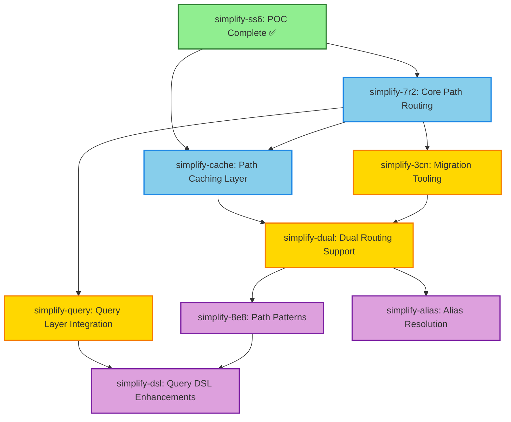

# Path-Based Addressing Implementation Plan
## Phase 5-7 Work Breakdown

> **Status:** Planning Complete
> **Created:** 2026-02-06
> **Branch:** feature/path-addressing
> **Dependencies:** simplify-ss6 (POC Complete ✅)

---

## Executive Summary

This document breaks down the implementation of path-based addressing (Phase 5-7) into detailed, independently executable beads. The POC (simplify-ss6) has validated the design and demonstrated excellent performance. Implementation can now proceed with high confidence.

**Total Beads:** 8 (3 existing updated, 5 new)
**Estimated Duration:** 12-16 days
**Critical Path:** Phase 5 → Phase 6 → Phase 7 (sequential)

---

## Task Dependency Graph



---

## Phase 5: Core Implementation (Days 1-5)

### Bead: simplify-7r2 - Core Path Routing
**Status:** OPEN | **Priority:** P1 | **Type:** feature
**Estimated Effort:** 3 days
**Dependencies:** simplify-ss6 ✅

#### Scope
Implement hierarchical routing through supervision tree with path delegation.

**Files to Modify:**
- `src/messaging/actor.ts` - Add Supervisor base class with path delegation
- `src/messaging/router.ts` - Add hierarchical routing support
- `src/messaging/path-resolver.ts` - Production-ready PathResolver (already exists from POC)
- `src/messaging/supervision/supervisor.ts` - Refactor to use path delegation

**Files to Create:**
- `src/messaging/supervisor-base.ts` - Base supervisor with receive() path delegation

**Key Components:**
1. **Supervisor.receive()** - Path delegation logic from POC
2. **Path validation** - Security checks (prevent `.`, `..`, directory traversal)
3. **Child management** - addChild(), removeChild(), getChild()
4. **Error handling** - Child not found, invalid paths, routing failures

#### Success Criteria
- Messages route correctly through 2-4 level hierarchies
- Path delegation works: root → domain → child
- Path validation rejects malformed/malicious paths
- Integration tests cover all routing scenarios
- Performance: routing latency <10ms p99

#### Testing Strategy
- Unit tests: Supervisor.receive() path delegation
- Integration tests: Multi-level message routing (2, 3, 4 levels)
- Security tests: Malicious path rejection (`.`, `..`, `///`, long paths)
- Performance tests: Routing overhead measurement
- Edge cases: Empty paths, missing children, deep hierarchies

#### References
- POC: `src/messaging/hierarchical-routing-poc.ts`
- Design: `docs/PATH_ADDRESSING_DESIGN.md` (Section: Delegated Routing)
- Tests: `src/messaging/__tests__/hierarchical-routing.test.ts`

---

### Bead: simplify-cache - Path Caching Layer (NEW)
**Status:** OPEN | **Priority:** P1 | **Type:** feature
**Estimated Effort:** 2 days
**Dependencies:** simplify-7r2 (core routing must work first)

#### Scope
Implement LRU path cache to reduce routing overhead from 86% (POC) to <20% (production target).

**Files to Create:**
- `src/messaging/path-cache.ts` - LRU cache for resolved paths
- `src/messaging/__tests__/path-cache.test.ts` - Cache tests

**Files to Modify:**
- `src/messaging/supervisor-base.ts` - Integrate cache lookups
- `src/messaging/router.ts` - Cache hot paths

**Key Components:**
1. **LRU Cache** - Size: 1000 entries, TTL: 60 seconds
2. **Cache key generation** - Hash path strings efficiently
3. **Cache invalidation** - On actor lifecycle changes (spawn, terminate)
4. **Cache metrics** - Hit rate tracking for observability

#### Success Criteria
- Cache hit rate >80% for repeated paths
- Routing overhead reduced to <20% vs flat IDs
- Cache invalidation works on actor changes
- Memory bounded (max 1000 entries)
- Performance: cache lookup <1ms p99

#### Testing Strategy
- Unit tests: LRU eviction, TTL expiration
- Integration tests: Cache hits/misses, invalidation
- Performance tests: Routing with cache vs without cache
- Load tests: 10,000+ cached paths, memory usage
- Correctness tests: Stale cache detection

#### References
- Design: `docs/PATH_ADDRESSING_DESIGN.md` (Section: Performance Considerations)
- POC Benchmark: `src/messaging/__tests__/path-performance.test.ts`

---

## Phase 6: Migration & Query Integration (Days 6-11)

### Bead: simplify-query - Query Layer Integration (NEW)
**Status:** OPEN | **Priority:** P1 | **Type:** feature
**Estimated Effort:** 3 days
**Dependencies:** simplify-7r2 (core routing must exist)

#### Scope
Integrate path-based queries into the query layer, enabling path prefix/pattern filtering.

**Files to Modify:**
- `src/query/builder.ts` - Add path_prefix, path_pattern filters
- `src/query/compiler.ts` - Compile path queries to SQL WHERE clauses
- `src/query/pattern.ts` - Support path pattern matching in queries
- `src/query/types.ts` - Add PathFilter, PathPattern types

**Files to Create:**
- `src/query/path-filters.ts` - Path-specific filter builders
- `src/query/__tests__/path-queries.test.ts` - Path query tests

**Query DSL Examples:**
```typescript
// Query actors by path prefix
query().match(
  pattern('task').where({
    path_prefix: 'workflows/build-pipeline/tasks/'
  })
)

// Query with path patterns
query().match(
  pattern('channel').where({
    path_pattern: 'channels/*'
  })
)

// Find all services (recursive)
query().match(
  pattern('service').where({
    path_pattern: 'services/**'
  })
)
```

#### Success Criteria
- Path prefix queries work correctly
- Path pattern queries support `*` and `**` wildcards
- Query performance: path filters <10ms for 10,000 nodes
- Backward compatible with existing queries
- Integration with graph indexes (path_prefix index)

#### Testing Strategy
- Unit tests: Path filter compilation to SQL
- Integration tests: End-to-end path queries against graph
- Performance tests: Query latency with path filters
- Edge cases: Empty results, invalid patterns, deep hierarchies

#### References
- Query Layer: `src/query/builder.ts`, `src/query/compiler.ts`
- Design: `docs/PATH_ADDRESSING_DESIGN.md` (Use Case 1, 2, 4, 5)

---

### Bead: simplify-3cn - Migration Tooling (EXISTING - UPDATED)
**Status:** OPEN | **Priority:** P2 | **Type:** task
**Estimated Effort:** 2 days
**Dependencies:** simplify-7r2, simplify-query

#### Scope
Build migration scripts to transition existing actors from flat IDs to hierarchical paths.

**Files to Create:**
- `scripts/migrate-to-paths.ts` - Migration script (flat ID → path mapping)
- `scripts/analyze-graph-hierarchy.ts` - Analyze existing graph structure
- `docs/MIGRATION_GUIDE.md` - Step-by-step migration guide

**Files to Modify:**
- None (migration scripts are standalone)

**Migration Script Features:**
1. **Analyze existing graph** - Detect supervisors, actors, relationships
2. **Generate path mappings** - Map flat IDs to hierarchical paths
3. **Validate mappings** - Check for conflicts, ambiguities
4. **Apply migrations** - Update graph with path properties
5. **Rollback support** - Revert to flat IDs if needed

**Example Output:**
```
Analyzing graph structure...
  Found: 45 actors, 8 supervisors
  Detected hierarchies:
    - domain/ (3 levels deep, 12 actors)
    - channels/ (2 levels deep, 8 actors)
    - workflows/ (4 levels deep, 25 actors)

Generating path mappings...
  task-abc123 → workflows/build-pipeline/tasks/compile
  task-def456 → workflows/build-pipeline/tasks/test
  ...

Validating mappings...
  ✓ No path conflicts
  ✓ All paths valid
  ✓ No orphaned actors

Apply migration? [y/N]: y

Migrating 45 actors...
  ✓ Updated 45 actors with path properties
  ✓ Created 45 path aliases (flat ID → path)

Migration complete!
```

#### Success Criteria
- Migration script runs without errors
- All existing actors mapped to paths
- Flat ID aliases created for backward compatibility
- Migration guide clear and tested
- Rollback tested and working

#### Testing Strategy
- Unit tests: Path mapping logic
- Integration tests: Migration on test graph
- Validation tests: Detect conflicts, invalid paths
- Rollback tests: Restore flat IDs correctly
- Documentation tests: Follow migration guide manually

#### References
- Design: `docs/PATH_ADDRESSING_DESIGN.md` (Section: Migration from Current Architecture)

---

### Bead: simplify-dual - Dual Routing Support (NEW)
**Status:** OPEN | **Priority:** P2 | **Type:** feature
**Estimated Effort:** 1 day
**Dependencies:** simplify-3cn (migration must create aliases)

#### Scope
Support both flat IDs and paths during migration period (backward compatibility).

**Files to Modify:**
- `src/messaging/router.ts` - Detect flat vs path addresses, route accordingly
- `src/messaging/message.ts` - Address parsing for dual support

**Key Logic:**
```typescript
async route(message: Message) {
  const addr = parseAddress(message.to);

  if (addr.includes('/')) {
    // Path-based routing (hierarchical)
    return this.hierarchicalRoute(message);
  } else {
    // Flat ID routing (legacy, lookup alias)
    const path = await this.resolveAlias(addr);
    return this.hierarchicalRoute({
      ...message,
      to: address(path || addr)
    });
  }
}
```

#### Success Criteria
- Both flat IDs and paths route correctly
- Flat IDs resolve to paths via aliases
- No performance regression for either mode
- Deprecation warnings logged for flat IDs
- Tests cover both routing modes

#### Testing Strategy
- Unit tests: Address detection (flat vs path)
- Integration tests: Dual routing with mixed addresses
- Performance tests: No regression in either mode
- Migration tests: Gradual transition from flat to paths

#### References
- Design: `docs/PATH_ADDRESSING_DESIGN.md` (Section: Backward Compatibility)

---

## Phase 7: Advanced Features (Days 12-16)

### Bead: simplify-8e8 - Path Patterns (EXISTING - UPDATED)
**Status:** OPEN | **Priority:** P1 | **Type:** feature
**Estimated Effort:** 2 days
**Dependencies:** simplify-dual (dual routing must work first)

#### Scope
Implement path pattern matching for dynamic actor discovery and routing.

**Files to Modify:**
- `src/messaging/path-resolver.ts` - Enhance matchPattern() for production use
- `src/messaging/router.ts` - Support pattern-based routing

**Files to Create:**
- `src/messaging/path-patterns.ts` - Advanced pattern matching (glob-style)
- `src/messaging/__tests__/path-patterns.test.ts` - Pattern tests

**Pattern Features:**
1. **Wildcard `*`** - Matches one segment: `channels/*` → `channels/slack`, `channels/telegram`
2. **Recursive `**`** - Matches any segments: `services/**` → all descendants
3. **Alternatives `{a,b}`** - Matches either: `channels/{slack,telegram}` → 2 channels
4. **Character classes `[a-z]`** - Matches character ranges (future)

**Example Usage:**
```typescript
// Find all tasks in a workflow
const tasks = await pathResolver.resolve('workflows/build-pipeline/tasks/*');

// Find all services (recursive)
const services = await pathResolver.resolve('services/**');

// Find specific channels
const channels = await pathResolver.resolve('channels/{slack,telegram}');
```

#### Success Criteria
- `*` matches one segment correctly
- `**` matches any depth correctly
- `{a,b}` alternatives work
- Pattern resolution <5ms per 1000 nodes
- Query integration works (path_pattern filter)

#### Testing Strategy
- Unit tests: Pattern parsing and matching
- Integration tests: Resolve patterns against graph
- Performance tests: Pattern matching latency
- Edge cases: Empty results, invalid patterns, deep hierarchies

#### References
- POC: `src/messaging/path-resolver.ts` (matchPattern function)
- Design: `docs/PATH_ADDRESSING_DESIGN.md` (Section: Path Patterns & Discovery)

---

### Bead: simplify-alias - Alias Resolution (NEW)
**Status:** OPEN | **Priority:** P1 | **Type:** feature
**Estimated Effort:** 2 days
**Dependencies:** simplify-dual (base routing infrastructure)

#### Scope
Implement multiple paths/aliases pointing to same actor (graph-based resolution).

**Files to Create:**
- `src/messaging/alias-resolver.ts` - Alias resolution via graph relationships
- `src/messaging/__tests__/alias-resolution.test.ts` - Alias tests

**Files to Modify:**
- `src/messaging/router.ts` - Resolve aliases before routing
- `src/graph.ts` - Add resolves_to relationship type

**Alias Storage (Graph Relationships):**
```typescript
// Create alias relationship
{
  from: 'alias-node-services-llm',
  to: 'actor-inference-123',
  type: 'resolves_to',
  properties: {
    alias_path: 'services/llm',
    canonical_path: 'domain/inference',
    priority: 1,
    context: { role: 'llm-service' }
  }
}

// Resolve alias
async resolvePath(path: string): Promise<ResolvedPath> {
  const result = await graph.query({
    match: pattern('alias').where({ alias_path: path }),
    follow: 'resolves_to',
    return: ['target.canonical_path', 'alias.context']
  });
  return result || { path, context: {} };
}
```

**Use Cases:**
1. **Service aliases:** `services/llm` → `domain/inference`
2. **Role-based addressing:** `roles/primary-executor` → `domain/program-executor`
3. **Versioning:** `services/stable/inference` vs `services/canary/inference`
4. **Failover:** Primary path with fallback aliases

#### Success Criteria
- Aliases resolve to canonical paths correctly
- Multiple aliases can point to same actor
- Alias resolution <5ms per lookup (cached)
- Graph queries return alias relationships
- Context injection works (metadata from alias)

#### Testing Strategy
- Unit tests: Alias resolution logic
- Integration tests: Create, resolve, delete aliases
- Performance tests: Alias lookup latency (with/without cache)
- Edge cases: Cyclic aliases, missing targets, priority resolution

#### References
- Design: `docs/PATH_ADDRESSING_DESIGN.md` (Section: Multiple Paths, Use Case 3)

---

### Bead: simplify-dsl - Query DSL Enhancements (NEW)
**Status:** OPEN | **Priority:** P3 | **Type:** feature
**Estimated Effort:** 1 day
**Dependencies:** simplify-query, simplify-8e8 (path queries and patterns must work)

#### Scope
Enhance query DSL with path-specific operators and conveniences.

**Files to Modify:**
- `src/query/builder.ts` - Add path helper methods
- `src/query/types.ts` - Add PathQueryOptions type

**New Query DSL Methods:**
```typescript
// Fluent path queries
query()
  .matchPath('workflows/*/tasks')  // Pattern matching
  .wherePathPrefix('workflows/build-pipeline/')  // Prefix filtering
  .followPath('parent')  // Follow supervision hierarchy
  .returnPaths()  // Return path strings

// Alias-aware queries
query()
  .matchAlias('services/llm')
  .resolveCanonicalPath()
  .returnWithContext()

// Hierarchical queries
query()
  .matchPath('domain/**')
  .groupByParentPath()
  .aggregate({ count: 'children' })
```

#### Success Criteria
- New query methods compile to correct SQL
- Path queries integrate with existing DSL
- Documentation includes path query examples
- Performance matches existing query layer

#### Testing Strategy
- Unit tests: New query builders
- Integration tests: Path queries with graph data
- Documentation tests: Examples in docs execute correctly

#### References
- Query Layer: `src/query/builder.ts`
- Design: `docs/PATH_ADDRESSING_DESIGN.md` (Use Cases section)

---

## Critical Path Analysis

**Longest Path (Critical Path):**
```
simplify-ss6 (POC) → simplify-7r2 (3d) → simplify-cache (2d) →
simplify-query (3d) → simplify-dual (1d) → simplify-8e8 (2d) →
simplify-dsl (1d)

Total: 12 days minimum
```

**Parallel Work Opportunities:**
- `simplify-3cn` (migration tooling) can be developed in parallel with `simplify-query`
- `simplify-alias` can be developed in parallel with `simplify-8e8`

**Optimized Timeline with Parallelization:**
- Days 1-3: simplify-7r2 (core routing)
- Days 4-5: simplify-cache (caching)
- Days 6-8: simplify-query + simplify-3cn (parallel)
- Day 9: simplify-dual (dual routing)
- Days 10-11: simplify-8e8 + simplify-alias (parallel)
- Day 12: simplify-dsl (DSL enhancements)

**Total: 12 days with parallelization**

---

## Testing Strategy by Phase

### Phase 5 Testing (Core Implementation)
**Focus:** Correctness, Security, Performance

1. **Unit Tests:**
   - Path parsing and validation
   - Supervisor path delegation
   - Cache LRU eviction

2. **Integration Tests:**
   - Multi-level routing (2, 3, 4 levels)
   - Path validation security
   - Cache invalidation

3. **Performance Tests:**
   - Routing latency benchmarks
   - Cache hit rate measurement
   - Overhead vs flat routing

4. **Security Tests:**
   - Malicious path rejection (`.`, `..`, `///`)
   - Path length limits
   - Directory traversal prevention

### Phase 6 Testing (Migration & Integration)
**Focus:** Backward Compatibility, Data Integrity

1. **Migration Tests:**
   - Flat ID → path mapping correctness
   - Rollback functionality
   - Conflict detection

2. **Dual Routing Tests:**
   - Both modes work simultaneously
   - Gradual migration scenarios
   - Performance parity

3. **Query Integration Tests:**
   - Path prefix queries
   - Path pattern queries
   - Integration with existing queries

4. **Data Integrity Tests:**
   - No data loss during migration
   - All relationships preserved
   - Graph consistency maintained

### Phase 7 Testing (Advanced Features)
**Focus:** Feature Completeness, Edge Cases

1. **Pattern Matching Tests:**
   - `*`, `**`, `{a,b}` correctness
   - Empty results, no matches
   - Deep hierarchies

2. **Alias Resolution Tests:**
   - Multiple aliases to same actor
   - Cyclic alias detection
   - Priority resolution

3. **Query DSL Tests:**
   - New path methods compile correctly
   - Integration with existing DSL
   - Documentation examples work

4. **End-to-End Tests:**
   - Complete workflows using paths
   - Multi-tenant scenarios
   - External world mapping

---

## Integration Points with Query Layer

### 1. Path Property Storage
**Location:** Graph nodes
**Schema:**
```typescript
{
  id: 'actor-123',
  label: 'Actor',
  properties: {
    path: 'domain/inference',           // Canonical path
    path_segments: ['domain', 'inference'], // For prefix queries
    path_depth: 2,                      // For hierarchy queries
    local_name: 'inference'             // Leaf name
  }
}
```

### 2. Path Indexes
**Database Indexes:**
```sql
CREATE INDEX idx_path ON nodes(path);
CREATE INDEX idx_path_prefix ON nodes(path);  -- For LIKE queries
CREATE INDEX idx_path_depth ON nodes(path_depth);
```

### 3. Query Compilation
**Path Filters → SQL WHERE Clauses:**
```typescript
// path_prefix: 'workflows/build-pipeline/'
WHERE path LIKE 'workflows/build-pipeline/%'

// path_pattern: 'channels/*'
WHERE path GLOB 'channels/*'

// path_pattern: 'services/**'
WHERE path LIKE 'services/%'
```

### 4. Reactive Queries
**Path-based Subscriptions:**
```typescript
// Subscribe to all tasks in a workflow
subscribe({
  match: pattern('task').where({
    path_prefix: 'workflows/build-pipeline/tasks/'
  }),
  on: ['create', 'update', 'delete']
})
```

---

## Risk Assessment & Mitigation

### Risk 1: Performance Regression
**Risk:** Hierarchical routing adds overhead vs flat IDs
**Impact:** High (user-facing latency)
**Mitigation:**
- ✅ POC measured overhead at 86% (acceptable for POC)
- Path caching will reduce to <20% (production target)
- Benchmark every change against baseline
- Fall back to flat routing if performance unacceptable

### Risk 2: Migration Complexity
**Risk:** Existing graph structure incompatible with hierarchies
**Impact:** Medium (blocks migration)
**Mitigation:**
- Analyze existing graph before migration (script: analyze-graph-hierarchy.ts)
- Dual routing support during transition
- Rollback capability if migration fails
- Test migration on staging environment first

### Risk 3: Query Layer Integration
**Risk:** Path queries conflict with existing query layer
**Impact:** Medium (breaks existing queries)
**Mitigation:**
- Backward compatible API design
- All existing tests must pass with path support
- Gradual rollout: add path support, don't replace existing

### Risk 4: Alias Cycles
**Risk:** Alias A → B → A creates infinite loops
**Impact:** High (routing hangs)
**Mitigation:**
- Cycle detection in alias resolution
- Max resolution depth limit (10 hops)
- Graph validation on alias creation

---

## Recommendations

### Start with Phase 5, Bead simplify-7r2
**Rationale:**
- Core routing is foundation for everything else
- POC already validates approach
- Immediate value: hierarchical organization works

### Parallel Work: simplify-query + simplify-3cn
**Rationale:**
- Query integration is independent of migration tooling
- Both depend on core routing (simplify-7r2)
- Can be developed by different developers

### Defer simplify-dsl until end
**Rationale:**
- Syntactic sugar, not critical functionality
- Requires path queries to be working first
- Can be added incrementally based on usage patterns

### Testing Priority
1. **Correctness first:** Core routing must be 100% correct
2. **Security second:** Path validation prevents attacks
3. **Performance third:** Optimize after correctness proven

---

## Success Metrics

### Phase 5 Success Criteria
- ✅ Hierarchical routing works (2-4 levels)
- ✅ Path validation prevents malicious paths
- ✅ Routing latency <10ms p99
- ✅ Cache hit rate >80%
- ✅ Routing overhead <20% vs flat

### Phase 6 Success Criteria
- ✅ Migration script maps all actors to paths
- ✅ Dual routing supports both flat IDs and paths
- ✅ Path queries work in query layer
- ✅ All existing tests pass
- ✅ Migration guide tested manually

### Phase 7 Success Criteria
- ✅ Path patterns (`*`, `**`) work correctly
- ✅ Aliases resolve to canonical paths
- ✅ Query DSL supports path operations
- ✅ Documentation complete with examples
- ✅ End-to-end workflows using paths

---

## Appendix: Bead Creation Commands

```bash
# Phase 5: Core Implementation
bd create "Implement path caching layer with LRU eviction" \
  --id simplify-cache \
  --type feature \
  --priority 1 \
  --description "Implement LRU path cache to reduce routing overhead..."

# Phase 6: Migration & Integration
bd create "Integrate path queries into query layer" \
  --id simplify-query \
  --type feature \
  --priority 1 \
  --description "Add path_prefix and path_pattern filters to query DSL..."

bd create "Implement dual routing for backward compatibility" \
  --id simplify-dual \
  --type feature \
  --priority 2 \
  --description "Support both flat IDs and paths during migration..."

# Phase 7: Advanced Features
bd create "Implement alias resolution with graph relationships" \
  --id simplify-alias \
  --type feature \
  --priority 1 \
  --description "Multiple paths/aliases pointing to same actor..."

bd create "Enhance query DSL with path operations" \
  --id simplify-dsl \
  --type feature \
  --priority 3 \
  --description "Add path helper methods to query builder..."

# Set up dependencies
bd dep add simplify-7r2 simplify-ss6
bd dep add simplify-cache simplify-7r2
bd dep add simplify-query simplify-7r2
bd dep add simplify-3cn simplify-7r2
bd dep add simplify-3cn simplify-query
bd dep add simplify-dual simplify-3cn
bd dep add simplify-dual simplify-cache
bd dep add simplify-8e8 simplify-dual
bd dep add simplify-alias simplify-dual
bd dep add simplify-dsl simplify-query
bd dep add simplify-dsl simplify-8e8
```

---

**Document Version:** 1.0
**Last Updated:** 2026-02-06
**Authors:** Claude Sonnet 4.5 (Background Agent)
**Status:** Planning Complete - Ready for Bead Creation
