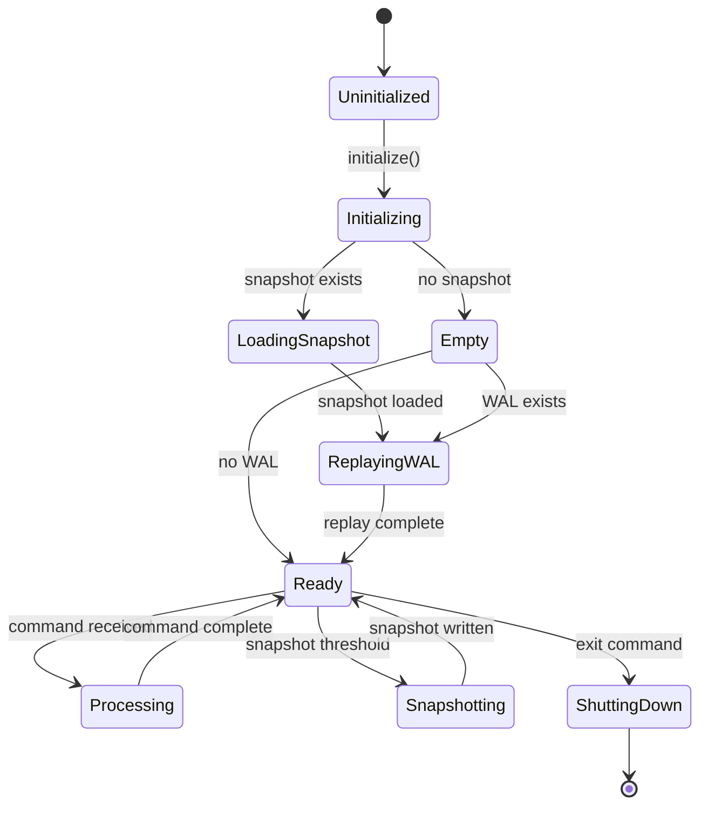
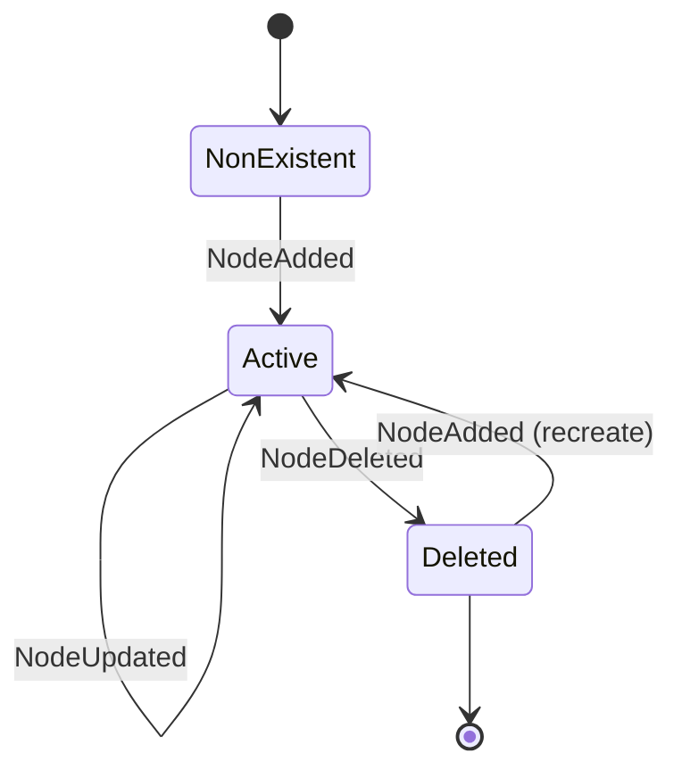
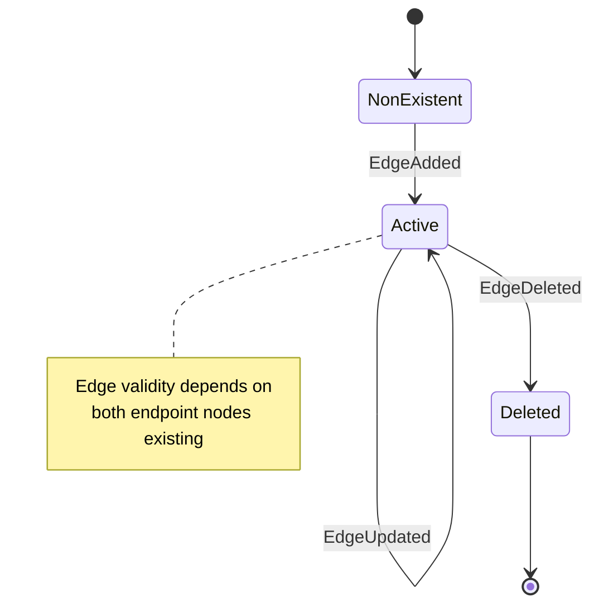
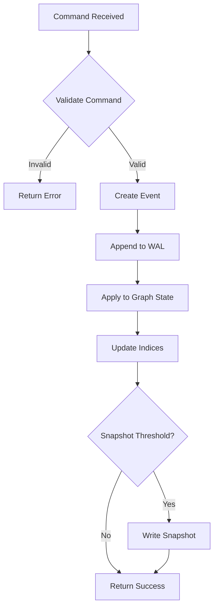

# Universal Graph System (UGS) — Technology-Agnostic Specification

> **Version**: 1.0.0  
> **Status**: Canonical Reference  
> **Audience**: AI Assistants, Agents, and Human Implementers  
> **Purpose**: Define UGS completely, independent of language/runtime/storage technology

---

## Table of Contents

1. [System Overview](#1-system-overview)
2. [Core Primitives](#2-core-primitives)
3. [Data Schemas](#3-data-schemas)
4. [State Machines](#4-state-machines)
5. [Event System](#5-event-system)
6. [Operations Catalog](#6-operations-catalog)
7. [Query Semantics](#7-query-semantics)
8. [Constraint Rules](#8-constraint-rules)
9. [Index Specifications](#9-index-specifications)
10. [Persistence Model](#10-persistence-model)
11. [Actor Model (Output Modes)](#11-actor-model-output-modes)
12. [Scope System](#12-scope-system)
13. [Test Fixtures](#13-test-fixtures)
14. [Conformance Checklist](#14-conformance-checklist)

---

## 1. System Overview

### 1.1 Purpose

UGS is a **Universal Graph System** — a persistent, event-sourced graph database accessible via CLI. It stores interconnected nodes and edges with these properties:

| Property | Description |
|----------|-------------|
| **Agent-First** | Optimized for AI agents; structured output by default |
| **Event-Sourced** | All mutations captured as immutable events |
| **File-Based** | No external database; uses WAL + snapshots |
| **Self-Configuring** | Configuration stored in the graph itself |
| **Scope-Aware** | Namespace isolation (user/project/scratch) |

### 1.2 Core Innovation: Address Primitive

The `@(id)` syntax creates **universal references** — any value can reference any graph element. This enables:

- Self-referential configuration
- Cross-entity relationships without foreign keys
- Lazy resolution (addresses remain symbolic until needed)

### 1.3 Architectural Invariants

```
INV-1: All state changes occur through events
INV-2: Events are immutable once written
INV-3: Replaying events from genesis reproduces identical state
INV-4: Addresses are opaque until resolved
INV-5: The graph is the single source of truth (including config)
```

---

## 2. Core Primitives

### 2.1 Address

An **Address** is a reference to a graph element.

```
GRAMMAR:
  Address    := "@(" Identifier OptVersion ")"
  Identifier := ScopePrefix? IdString
  ScopePrefix := ("user" | "project" | "scratch") ":"
  IdString   := [a-zA-Z_][a-zA-Z0-9_-]*
  OptVersion := (":" Version)?
  Version    := PositiveInteger
```

| Example | Meaning |
|---------|---------|
| `@(alice)` | Reference to node "alice" |
| `@(user:profile)` | Reference to user-scoped node "profile" |
| `@(task_1:3)` | Reference to node "task_1" at version 3 |
| `@(e_123)` | Reference to edge "e_123" |

**Properties:**
- Addresses are **first-class values** (can appear anywhere a value can)
- Resolution is **lazy** (address remains symbolic until explicitly resolved)
- Unresolvable addresses **do not error** — they remain as addresses (graceful degradation)

### 2.2 Node

A **Node** is a vertex in the graph.

```
Node := (id, type, properties, data, created, modified)

Where:
  id         : Identifier        — Unique within system
  type       : String | Null     — Optional type annotation
  properties : Map<String, Value> — Key-value metadata
  data       : JSON | Null       — Arbitrary payload
  created    : Timestamp         — Immutable creation time
  modified   : Timestamp         — Last modification time
```

### 2.3 Edge

An **Edge** is a directed relationship between nodes.

```
Edge := (id, from, to, type, weight, properties, created)

Where:
  id         : Identifier        — Unique within system
  from       : Identifier        — Source node ID
  to         : Identifier        — Target node ID
  type       : String | Null     — Relationship type
  weight     : Number            — Numeric weight (default: 1)
  properties : Map<String, Value> — Key-value metadata
  created    : Timestamp         — Immutable creation time
```

### 2.4 Value

A **Value** is any storable datum.

```
Value := Primitive | Composite | Address

Primitive := String | Number | Boolean | Null
Composite := Array<Value> | Map<String, Value>
Address   := "@(" Identifier ")"
```

### 2.5 Graph

A **Graph** is the complete system state.

```
Graph := (N, E, resolve)

Where:
  N       : Set<Node>                    — All nodes
  E       : Set<Edge>                    — All edges
  resolve : Address → Node | Edge | Null — Resolution function
```

---

## 3. Data Schemas

### 3.1 Node Schema

| Field | Type | Required | Default | Description |
|-------|------|----------|---------|-------------|
| `id` | String | ✓ | — | Unique identifier |
| `type` | String | ✗ | `null` | Type annotation |
| `properties` | Object | ✗ | `{}` | Key-value pairs |
| `data` | Any | ✗ | `null` | Arbitrary JSON |
| `created` | Integer | Auto | Now | Unix timestamp (ms) |
| `modified` | Integer | Auto | Now | Unix timestamp (ms) |

**JSON Example:**
```json
{
  "id": "alice",
  "type": "person",
  "properties": {
    "name": "Alice Johnson",
    "email": "alice@example.com",
    "manager": "@(bob)"
  },
  "data": null,
  "created": 1769020454093,
  "modified": 1769020454093
}
```

### 3.2 Edge Schema

| Field | Type | Required | Default | Description |
|-------|------|----------|---------|-------------|
| `id` | String | ✓ | — | Unique identifier |
| `from` | String | ✓ | — | Source node ID |
| `to` | String | ✓ | — | Target node ID |
| `type` | String | ✗ | `null` | Relationship type |
| `weight` | Number | ✗ | `1` | Numeric weight |
| `properties` | Object | ✗ | `{}` | Key-value pairs |
| `created` | Integer | Auto | Now | Unix timestamp (ms) |

**JSON Example:**
```json
{
  "id": "e_alice_task1",
  "from": "alice",
  "to": "task_1",
  "type": "assigned_to",
  "weight": 1,
  "properties": {
    "assigned_date": "2026-01-15"
  },
  "created": 1769020454100
}
```

### 3.3 Event Schema

| Field | Type | Required | Description |
|-------|------|----------|-------------|
| `id` | String | ✓ | Unique event ID (`evt_{timestamp}_{counter}`) |
| `timestamp` | Integer | ✓ | Unix timestamp (ms) |
| `type` | EventType | ✓ | One of the defined event types |
| `data` | Object | ✓ | Event-specific payload |

**JSON Example:**
```json
{
  "id": "evt_1769020454093_1",
  "timestamp": 1769020454093,
  "type": "NodeAdded",
  "data": {
    "id": "alice",
    "type": "person",
    "properties": { "name": "Alice" }
  }
}
```

### 3.4 Snapshot Schema

| Field | Type | Description |
|-------|------|-------------|
| `timestamp` | Integer | Snapshot creation time |
| `eventCount` | Integer | Number of events at snapshot |
| `nodes` | Array<Node> | All nodes |
| `edges` | Array<Edge> | All edges |
| `stats` | Object | Graph statistics |

---

## 4. State Machines

### 4.1 System Lifecycle



### 4.2 Node Lifecycle



### 4.3 Edge Lifecycle



### 4.4 Event Processing Pipeline



---

## 5. Event System

### 5.1 Event Types

| Event Type | Trigger | Data Payload |
|------------|---------|--------------|
| `NodeAdded` | `add-node` | Complete node object |
| `NodeUpdated` | `update` | Node ID + changed fields |
| `NodeDeleted` | `delete` (node) | Node ID |
| `EdgeAdded` | `add-edge` | Complete edge object |
| `EdgeUpdated` | `update` (edge) | Edge ID + changed fields |
| `EdgeDeleted` | `delete` (edge) | Edge ID |

### 5.2 Event Invariants

```
EVT-1: Events are append-only (never modified or deleted)
EVT-2: Event IDs are globally unique and monotonically increasing
EVT-3: Timestamp ordering matches event ID ordering
EVT-4: Each event is self-contained (no external references)
EVT-5: Replaying events in order reproduces identical state
```

### 5.3 Event Application Rules

**NodeAdded:**
```
PRE:  Node with id does not exist in graph
POST: Node exists in graph with all specified fields
      Indices updated (type, properties, text)
      Adjacency lists initialized (empty)
```

**NodeUpdated:**
```
PRE:  Node with id exists in graph
POST: Specified fields updated
      modified timestamp updated
      Indices updated for changed fields
```

**NodeDeleted:**
```
PRE:  Node with id exists in graph
POST: Node removed from graph
      All connected edges removed (cascade)
      Indices updated
```

**EdgeAdded:**
```
PRE:  Edge with id does not exist
      (Soft) from node exists
      (Soft) to node exists
POST: Edge exists in graph
      Adjacency lists updated
```

**EdgeDeleted:**
```
PRE:  Edge with id exists
POST: Edge removed from graph
      Adjacency lists updated
```

### 5.4 WAL Format

**File:** `{data_dir}/events.wal`  
**Format:** Newline-Delimited JSON (NDJSON)  
**Encoding:** UTF-8  

```
{event1_json}\n
{event2_json}\n
{event3_json}\n
```

Each line is a complete, valid JSON event object.

---

## 6. Operations Catalog

### 6.1 Node Operations

| Operation | Syntax | Semantics |
|-----------|--------|-----------|
| **add-node** | `add-node <id> [type] [props...]` | Create node; error if exists |
| **get** | `get <id>` | Return node by ID; null if not found |
| **delete** | `delete <id>` | Remove node and connected edges |
| **update** | `update <id> [props...]` | Merge properties into node |

**add-node Semantics:**
```
INPUT:  id: String, type?: String, props?: Map<String, Value>
OUTPUT: Node
EFFECT: NodeAdded event emitted
ERROR:  If node with id already exists
```

**Property Syntax:**
```
key=value           → String value
key:=json           → JSON-parsed value
key=@(ref)          → Address reference
+key=value          → Append to array property
-key                → Remove property
```

### 6.2 Edge Operations

| Operation | Syntax | Semantics |
|-----------|--------|-----------|
| **add-edge** | `add-edge <id> <from> <to> [type] [weight]` | Create edge |
| **get** | `get <id>` | Return edge by ID |
| **delete** | `delete <id>` | Remove edge |

### 6.3 Query Operations

| Operation | Syntax | Semantics |
|-----------|--------|-----------|
| **search** | `search <query>` | Full-text search across all nodes |
| **list** | `list <type>` | Return all nodes of given type |
| **find-by-property** | `find-by-property <key> <value>` | Find nodes with property match |
| **neighbors** | `neighbors <id> [direction]` | Return adjacent nodes |
| **traverse** | `traverse <id> [--depth N] [--direction D]` | BFS/DFS traversal |
| **path** | `path <from> <to>` | Shortest path (Dijkstra) |

### 6.4 Introspection Operations

| Operation | Syntax | Semantics |
|-----------|--------|-----------|
| **stats** | `stats` | Return graph statistics |
| **hubs** | `hubs [N]` | Return top N highest-degree nodes |
| **roots** | `roots` | Return nodes with no incoming edges |
| **properties** | `properties` | List all indexed property keys |
| **history** | `history [N]` | Return last N events |
| **scopes** | `scopes` | List all scopes in use |

### 6.5 System Operations

| Operation | Syntax | Semantics |
|-----------|--------|-----------|
| **snapshot** | `snapshot` | Force snapshot creation |
| **load-demo** | `load-demo` | Load demonstration data |
| **help** | `help [topic]` | Show help |
| **exit/quit** | `exit` | Exit interactive mode |

---

## 7. Query Semantics

### 7.1 Search Algorithm

```
FUNCTION search(query: String) -> Array<Node>:
    tokens = tokenize(lowercase(query))
    results = empty set
    
    FOR EACH token IN tokens:
        matches = text_index.lookup(token)
        IF results is empty:
            results = matches
        ELSE:
            results = results ∩ matches  // intersection
    
    RETURN sort_by_relevance(results)
```

### 7.2 Traversal Algorithm

```
FUNCTION traverse(start: ID, depth: Int, direction: Direction) -> Array<Node>:
    visited = empty set
    queue = [(start, 0)]
    result = []
    
    WHILE queue not empty:
        (current, level) = queue.dequeue()
        
        IF current IN visited OR level > depth:
            CONTINUE
        
        visited.add(current)
        result.append(get(current))
        
        FOR EACH neighbor IN get_neighbors(current, direction):
            queue.enqueue((neighbor, level + 1))
    
    RETURN result
```

### 7.3 Shortest Path Algorithm (Dijkstra)

```
FUNCTION path(from: ID, to: ID) -> Array<Node> | Null:
    dist = {from: 0}
    prev = {}
    unvisited = all_node_ids()
    
    WHILE unvisited not empty:
        current = node in unvisited with minimum dist
        
        IF current == to:
            RETURN reconstruct_path(prev, to)
        
        IF dist[current] == INFINITY:
            RETURN null  // No path exists
        
        unvisited.remove(current)
        
        FOR EACH (neighbor, weight) IN edges_from(current):
            alt = dist[current] + weight
            IF alt < dist.get(neighbor, INFINITY):
                dist[neighbor] = alt
                prev[neighbor] = current
    
    RETURN null
```

### 7.4 Address Resolution

```
FUNCTION resolve(address: Address) -> Value | Address:
    id = extract_id(address)
    version = extract_version(address)  // may be null
    
    element = graph.get(id)
    
    IF element is null:
        RETURN address  // Graceful degradation
    
    IF version is not null:
        element = get_version(element, version)  // Future feature
    
    RETURN element
```

---

## 8. Constraint Rules

### 8.1 Hard Constraints (Must Enforce)

| ID | Rule | Enforcement |
|----|------|-------------|
| `HC-1` | Node IDs must be unique | Reject duplicate on add-node |
| `HC-2` | Edge IDs must be unique | Reject duplicate on add-edge |
| `HC-3` | Events must have unique IDs | Generate sequential IDs |
| `HC-4` | Timestamps must be monotonic | Use system clock, never backdate |
| `HC-5` | WAL must be append-only | No file truncation or modification |

### 8.2 Soft Constraints (Warn but Allow)

| ID | Rule | Behavior |
|----|------|----------|
| `SC-1` | Edge endpoints should exist | Warn but create edge |
| `SC-2` | Addresses should resolve | Return address if unresolvable |
| `SC-3` | Types should be consistent | No enforcement, user responsibility |

### 8.3 Referential Integrity

```
ON NodeDeleted(id):
    FOR EACH edge WHERE edge.from == id OR edge.to == id:
        emit EdgeDeleted(edge.id)
```

Cascade delete ensures no dangling edge references.

---

## 9. Index Specifications

### 9.1 Index Types

| Index | Structure | Purpose |
|-------|-----------|---------|
| **Type Index** | `Map<Type, Set<NodeID>>` | Fast lookup by type |
| **Property Index** | `Map<Key, Map<Value, Set<NodeID>>>` | Fast lookup by property |
| **Text Index** | `Map<Token, Set<NodeID>>` | Full-text search |
| **Outgoing Adjacency** | `Map<NodeID, Set<EdgeID>>` | Edges from node |
| **Incoming Adjacency** | `Map<NodeID, Set<EdgeID>>` | Edges to node |

### 9.2 Index Maintenance

```
ON NodeAdded(node):
    type_index[node.type].add(node.id)
    FOR EACH (key, value) IN node.properties:
        property_index[key][value].add(node.id)
    FOR EACH token IN tokenize(node):
        text_index[token].add(node.id)

ON NodeUpdated(node, changes):
    // Remove old index entries
    // Add new index entries for changed fields

ON NodeDeleted(id):
    // Remove all index entries for node

ON EdgeAdded(edge):
    outgoing[edge.from].add(edge.id)
    incoming[edge.to].add(edge.id)

ON EdgeDeleted(edge):
    outgoing[edge.from].remove(edge.id)
    incoming[edge.to].remove(edge.id)
```

### 9.3 Tokenization Rules

```
FUNCTION tokenize(node: Node) -> Set<String>:
    tokens = empty set
    
    // Tokenize ID
    tokens.add(lowercase(node.id))
    
    // Tokenize type
    IF node.type:
        tokens.add(lowercase(node.type))
    
    // Tokenize string properties
    FOR EACH (key, value) IN node.properties:
        IF value is String:
            FOR EACH word IN split_words(value):
                tokens.add(lowercase(word))
    
    // Tokenize data (recursive)
    tokens.union(tokenize_json(node.data))
    
    RETURN tokens
```

---

## 10. Persistence Model

### 10.1 File Layout

```
{data_dir}/
├── events.wal      # Write-ahead log (NDJSON)
└── snapshot.json   # Latest state snapshot
```

### 10.2 Write Path

```
FUNCTION persist_event(event: Event):
    // 1. Append to WAL (atomic write)
    append_line(wal_file, json_encode(event))
    fsync(wal_file)
    
    // 2. Apply to in-memory state
    apply_event(event)
    
    // 3. Check snapshot threshold
    IF event_count % SNAPSHOT_INTERVAL == 0:
        write_snapshot()
```

### 10.3 Read Path (Recovery)

```
FUNCTION recover():
    // 1. Load snapshot if exists
    IF exists(snapshot_file):
        snapshot = json_decode(read(snapshot_file))
        load_state(snapshot)
        last_event_time = snapshot.timestamp
    ELSE:
        last_event_time = 0
    
    // 2. Replay WAL events after snapshot
    IF exists(wal_file):
        FOR EACH line IN read_lines(wal_file):
            event = json_decode(line)
            IF event.timestamp > last_event_time:
                apply_event(event)
    
    // 3. Rebuild indices
    rebuild_indices()
```

### 10.4 Snapshot Strategy

```
SNAPSHOT_INTERVAL = 1000  // events

FUNCTION write_snapshot():
    snapshot = {
        timestamp: now(),
        eventCount: total_events,
        nodes: serialize_all_nodes(),
        edges: serialize_all_edges(),
        stats: compute_stats()
    }
    
    // Atomic write (write to temp, then rename)
    write(temp_file, json_encode(snapshot))
    rename(temp_file, snapshot_file)
```

---

## 11. Actor Model (Output Modes)

### 11.1 Overview

UGS supports two output personalities:

| Mode | Audience | Characteristics |
|------|----------|-----------------|
| **Agent** | AI/Scripts | Compact JSON, no decoration, machine-parseable |
| **Human** | Users | Verbose, emojis, contextual help |

### 11.2 Mode Selection (Priority Order)

1. Command-line flag: `--agent` or `--human`
2. Graph-stored user preference: `_user_prefs.actor`
3. Graph-stored system default: `_system_config.default_actor`
4. Environment variable: `UGS_ACTOR`
5. Hard-coded default: `agent`

### 11.3 Output Examples

**stats command:**

Agent mode:
```json
{"nodes":68,"edges":45,"types":5,"properties":12}
```

Human mode:
```
📊 Graph Statistics
━━━━━━━━━━━━━━━━━━
  Nodes: 68
  Edges: 45
  Types: 5
  Properties: 12
```

### 11.4 Actor Interface

```
INTERFACE Actor:
    format_success(data: Any) -> String
    format_error(error: Error) -> String
    format_node(node: Node) -> String
    format_edge(edge: Edge) -> String
    format_list(items: Array) -> String
    format_stats(stats: Object) -> String
    format_help(topic: String) -> String
```

---

## 12. Scope System

### 12.1 Scope Definitions

| Scope | Prefix | Lifecycle | Use Case |
|-------|--------|-----------|----------|
| **user** | `user:` | Permanent, cross-project | Personal data, preferences |
| **project** | `project:` | Project duration | Shared project data |
| **scratch** | `scratch:` | Temporary | Experiments, drafts |
| **default** | (none) | Permanent | Backwards compatibility |

### 12.2 Scope Syntax

```
SCOPED_ID := SCOPE ":" ID
SCOPE     := "user" | "project" | "scratch"
ID        := [a-zA-Z_][a-zA-Z0-9_-]*
```

### 12.3 Scope Operations

```
# Create scoped nodes
add-node user:profile person name="Alice"
add-node project:task_1 task status=active
add-node scratch:experiment test value=123

# Cross-scope edges allowed
add-edge e1 project:task_1 user:alice assigned_to

# List by scope
list user:*
list project:*
```

### 12.4 Scope Isolation Rules

```
RULE-1: Scoped nodes are independent namespaces
RULE-2: Cross-scope edges are allowed
RULE-3: Scope cleanup only affects that scope
RULE-4: Default scope has no prefix
```

---

## 13. Test Fixtures

### 13.1 Minimal Fixture (Bootstrap Verification)

```json
{
  "name": "minimal",
  "description": "Minimum viable graph for testing",
  "nodes": [
    {"id": "a", "type": "test", "properties": {"value": 1}}
  ],
  "edges": [],
  "expected": {
    "node_count": 1,
    "edge_count": 0,
    "types": ["test"]
  }
}
```

### 13.2 Reference Fixture (Address Testing)

```json
{
  "name": "references",
  "description": "Tests address resolution",
  "nodes": [
    {"id": "n1", "type": "source", "properties": {"ref": "@(n2)"}},
    {"id": "n2", "type": "target", "properties": {"name": "Target"}},
    {"id": "n3", "type": "dangling", "properties": {"ref": "@(nonexistent)"}}
  ],
  "edges": [],
  "assertions": [
    {"resolve": "@(n2)", "equals": {"id": "n2", "type": "target"}},
    {"resolve": "@(nonexistent)", "equals": "@(nonexistent)"}
  ]
}
```

### 13.3 Standard Fixture (Demo Data)

```json
{
  "name": "demo",
  "description": "Standard demonstration dataset",
  "nodes": [
    {"id": "alice", "type": "person", "properties": {"name": "Alice Johnson", "role": "engineer"}},
    {"id": "bob", "type": "person", "properties": {"name": "Bob Smith", "role": "manager"}},
    {"id": "charlie", "type": "person", "properties": {"name": "Charlie Brown", "role": "designer"}},
    {"id": "auth_proj", "type": "project", "properties": {"name": "Auth System", "status": "active"}},
    {"id": "api_proj", "type": "project", "properties": {"name": "API Gateway", "status": "planning"}},
    {"id": "task_1", "type": "task", "properties": {"title": "Implement login", "status": "in_progress", "priority": "high"}},
    {"id": "task_2", "type": "task", "properties": {"title": "Design API schema", "status": "pending", "priority": "medium"}},
    {"id": "task_3", "type": "task", "properties": {"title": "Review security", "status": "pending", "priority": "high"}}
  ],
  "edges": [
    {"id": "e1", "from": "alice", "to": "task_1", "type": "assigned_to"},
    {"id": "e2", "from": "bob", "to": "task_2", "type": "assigned_to"},
    {"id": "e3", "from": "task_1", "to": "auth_proj", "type": "belongs_to"},
    {"id": "e4", "from": "task_2", "to": "api_proj", "type": "belongs_to"},
    {"id": "e5", "from": "alice", "to": "bob", "type": "reports_to"},
    {"id": "e6", "from": "charlie", "to": "bob", "type": "reports_to"},
    {"id": "e7", "from": "task_2", "to": "task_1", "type": "blocks"}
  ],
  "expected": {
    "node_count": 8,
    "edge_count": 7,
    "types": ["person", "project", "task"],
    "hubs": ["bob", "task_1"]
  }
}
```

### 13.4 Event Replay Fixture

```json
{
  "name": "event_replay",
  "description": "Tests event sourcing correctness",
  "events": [
    {"type": "NodeAdded", "data": {"id": "x", "type": "test", "properties": {"v": 1}}},
    {"type": "NodeUpdated", "data": {"id": "x", "properties": {"v": 2}}},
    {"type": "NodeAdded", "data": {"id": "y", "type": "test", "properties": {"v": 3}}},
    {"type": "EdgeAdded", "data": {"id": "e1", "from": "x", "to": "y", "type": "links"}},
    {"type": "NodeDeleted", "data": {"id": "y"}}
  ],
  "final_state": {
    "nodes": [{"id": "x", "type": "test", "properties": {"v": 2}}],
    "edges": []
  }
}
```

### 13.5 Scope Fixture

```json
{
  "name": "scopes",
  "description": "Tests scope system",
  "nodes": [
    {"id": "user:profile", "type": "config", "properties": {"theme": "dark"}},
    {"id": "project:task_1", "type": "task", "properties": {"status": "active"}},
    {"id": "scratch:temp", "type": "temp", "properties": {"data": "test"}},
    {"id": "global_node", "type": "shared", "properties": {}}
  ],
  "assertions": [
    {"scope": "user", "count": 1},
    {"scope": "project", "count": 1},
    {"scope": "scratch", "count": 1},
    {"scope": "default", "count": 1}
  ]
}
```

---

## 14. Conformance Checklist

### 14.1 Phase 0: Primitives

- [ ] Address type can be parsed and serialized
- [ ] Node type contains all required fields
- [ ] Edge type contains all required fields
- [ ] Values support all primitive types
- [ ] Values support nested composites
- [ ] Values support Address references

### 14.2 Phase 1: In-Memory Graph

- [ ] add-node creates nodes correctly
- [ ] add-edge creates edges correctly
- [ ] get retrieves nodes by ID
- [ ] get retrieves edges by ID
- [ ] delete removes nodes
- [ ] delete cascades to connected edges
- [ ] update modifies node properties

### 14.3 Phase 2: Event Sourcing

- [ ] All mutations emit events
- [ ] Events have unique IDs
- [ ] Events have monotonic timestamps
- [ ] WAL file is append-only
- [ ] Replay produces identical state

### 14.4 Phase 3: Persistence

- [ ] State survives process restart
- [ ] Snapshot captures complete state
- [ ] Recovery loads snapshot then replays WAL
- [ ] Atomic snapshot writes (no corruption)

### 14.5 Phase 4: Indexing

- [ ] Type index enables fast type lookups
- [ ] Property index enables property queries
- [ ] Text index enables search
- [ ] Adjacency lists enable traversal
- [ ] Indices stay synchronized with state

### 14.6 Phase 5: Queries

- [ ] search returns relevant results
- [ ] list returns all nodes of type
- [ ] find-by-property finds matching nodes
- [ ] neighbors returns adjacent nodes
- [ ] traverse respects depth limits
- [ ] path finds shortest route

### 14.7 Phase 6: CLI & Actor

- [ ] CLI parses all command syntaxes
- [ ] Agent mode outputs valid JSON
- [ ] Human mode outputs readable text
- [ ] Mode selection follows priority order
- [ ] Interactive mode works

### 14.8 Phase 7: Scopes

- [ ] Scoped IDs parse correctly
- [ ] Cross-scope edges work
- [ ] Scope listing works
- [ ] Scope-filtered queries work

---

## Appendix A: Grammar Reference

```ebnf
(* Commands *)
command     = add_node | add_edge | get | delete | update
            | search | list | find_by_prop | neighbors
            | traverse | path | stats | hubs | roots
            | properties | history | scopes | snapshot
            | help | exit ;

add_node    = "add-node" id [type] {property} ;
add_edge    = "add-edge" id from_id to_id [type] [weight] ;
get         = "get" id ;
delete      = "delete" id ;
update      = "update" id {property} ;
search      = "search" query_string ;
list        = "list" type ;
find_by_prop= "find-by-property" key value ;
neighbors   = "neighbors" id [direction] ;
traverse    = "traverse" id ["--depth" number] ["--direction" direction] ;
path        = "path" from_id to_id ;

(* Primitives *)
id          = [scope ":"] identifier ;
scope       = "user" | "project" | "scratch" ;
identifier  = letter {letter | digit | "_" | "-"} ;
property    = key "=" value | key ":=" json_value | "+" key "=" value | "-" key ;
direction   = "outgoing" | "incoming" | "both" ;
address     = "@(" id [":" version] ")" ;
```

## Appendix B: Error Codes

| Code | Name | Description |
|------|------|-------------|
| `E001` | NodeExists | Node with ID already exists |
| `E002` | NodeNotFound | Node with ID not found |
| `E003` | EdgeExists | Edge with ID already exists |
| `E004` | EdgeNotFound | Edge with ID not found |
| `E005` | InvalidSyntax | Command syntax error |
| `E006` | InvalidJSON | JSON parsing error |
| `E007` | IOError | File system error |
| `E008` | SnapshotCorrupt | Snapshot file corrupted |
| `E009` | WALCorrupt | WAL file corrupted |

---

*End of Specification*
