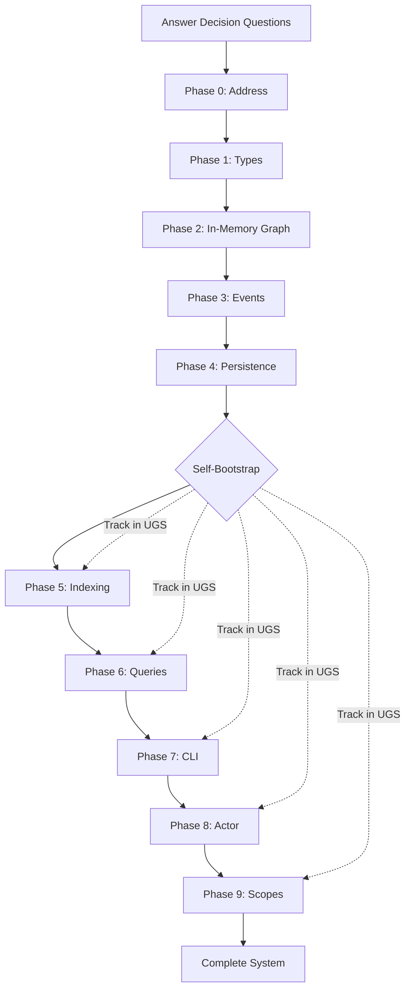
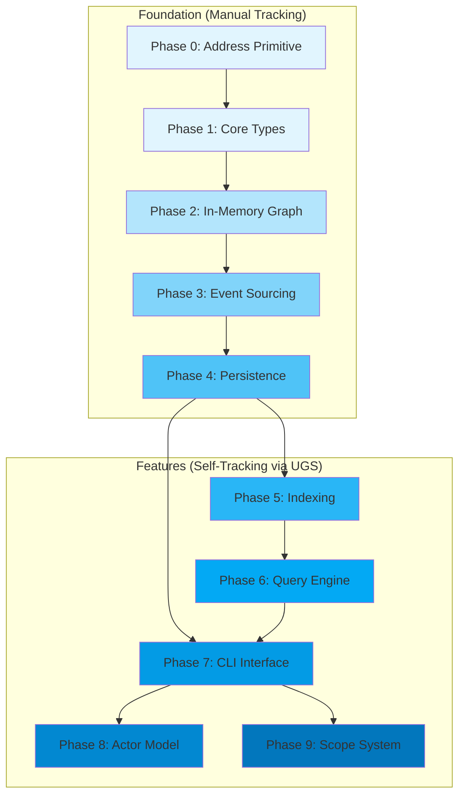
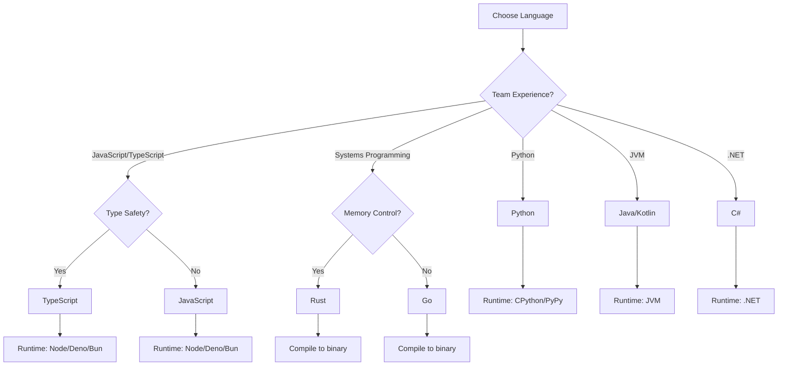

# UGS Bootstrap Plan & AI Implementation Harness

> **Version**: 1.0.0  
> **Purpose**: Phased build plan enabling AI assistants to implement UGS from scratch  
> **Key Feature**: Self-bootstrapping — use the system to track building the system

---

## Table of Contents

1. [Overview](#1-overview)
2. [Decision Questionnaire](#2-decision-questionnaire)
3. [Phase Dependency Graph](#3-phase-dependency-graph)
4. [Phase 0: Address Primitive](#4-phase-0-address-primitive)
5. [Phase 1: Core Types](#5-phase-1-core-types)
6. [Phase 2: In-Memory Graph](#6-phase-2-in-memory-graph)
7. [Phase 3: Event Sourcing](#7-phase-3-event-sourcing)
8. [Phase 4: Persistence](#8-phase-4-persistence)
9. [Phase 5: Indexing](#9-phase-5-indexing)
10. [Phase 6: Query Engine](#10-phase-6-query-engine)
11. [Phase 7: CLI Interface](#11-phase-7-cli-interface)
12. [Phase 8: Actor Model](#12-phase-8-actor-model)
13. [Phase 9: Scope System](#13-phase-9-scope-system)
14. [Self-Bootstrap Protocol](#14-self-bootstrap-protocol)
15. [Verification Harness](#15-verification-harness)
16. [Technology Decision Trees](#16-technology-decision-trees)

---

## 1. Overview

### 1.1 Bootstrap Philosophy

This plan enables **incremental, verifiable implementation** of UGS. Each phase:

1. Has clear **entry criteria** (what must exist before starting)
2. Produces **concrete deliverables** with test fixtures
3. Enables **self-tracking** once Phase 4 completes (the system can store its own build state)

### 1.2 Self-Bootstrap Timeline

```
Phase 0-3: Manual tracking (files, notes)
Phase 4+:  UGS tracks its own implementation
           - Tasks as nodes
           - Dependencies as edges  
           - Progress via property updates
```

### 1.3 Implementation Workflow



---

## 2. Decision Questionnaire

Before implementation, the human must answer these questions. AI assistants should ask these if not provided.

### 2.1 Required Decisions

#### Q1: Primary Language
```
QUESTION: What programming language will be used?
OPTIONS:  Any language with: strings, maps/dicts, arrays, file I/O, JSON support
EXAMPLES: TypeScript, Python, Rust, Go, Java, C#, Ruby, Elixir
IMPACT:   Affects syntax, package management, type system approach
DEFAULT:  TypeScript (if no preference stated)
```

#### Q2: Runtime Environment
```
QUESTION: What runtime will execute the code?
OPTIONS:  Depends on language choice
EXAMPLES: 
  - TypeScript: Node.js, Deno, Bun
  - Python: CPython, PyPy
  - Rust: Native binary
  - Go: Native binary
IMPACT:   Affects file I/O APIs, async patterns, packaging
DEFAULT:  Match language ecosystem default
```

#### Q3: Type System Approach
```
QUESTION: How strict should type checking be?
OPTIONS:
  - STRICT: Full static types, no 'any', compile-time guarantees
  - MODERATE: Types for APIs, flexibility for internals
  - DYNAMIC: Runtime type checking only
IMPACT:   Affects code verbosity, error detection timing
DEFAULT:  MODERATE
```

#### Q4: Data Directory Location
```
QUESTION: Where should UGS store data files?
OPTIONS:
  - PROJECT: ./data/ (relative to project)
  - USER_HOME: ~/.ugs/ (user's home directory)
  - CONFIGURABLE: Environment variable + default
IMPACT:   Affects portability, multi-project support
DEFAULT:  CONFIGURABLE with PROJECT fallback
```

#### Q5: CLI Framework
```
QUESTION: Use a CLI framework or build from scratch?
OPTIONS:
  - FRAMEWORK: Use established library (Commander, Click, Clap, etc.)
  - MINIMAL: Simple argument parsing, custom implementation
IMPACT:   Affects dependency count, help generation, completion support
DEFAULT:  FRAMEWORK (reduces implementation time)
```

### 2.2 Optional Decisions

#### Q6: Async Model
```
QUESTION: How should async operations be handled?
OPTIONS:
  - ASYNC_AWAIT: Native async/await (if language supports)
  - CALLBACKS: Callback-based (legacy compatibility)
  - SYNC: Synchronous only (simpler, sufficient for single-user)
IMPACT:   Affects code complexity, future scalability
DEFAULT:  SYNC for initial implementation, refactor to ASYNC later
```

#### Q7: Error Handling Style
```
QUESTION: How should errors be communicated?
OPTIONS:
  - EXCEPTIONS: Throw/catch exceptions
  - RESULT_TYPE: Return Result<T, Error> / Either types
  - ERROR_CODES: Return error codes with data
IMPACT:   Affects API design, error recovery patterns
DEFAULT:  Match language idioms
```

#### Q8: Test Framework
```
QUESTION: What test framework should be used?
OPTIONS:  Language-specific (Jest, pytest, cargo test, go test, etc.)
IMPACT:   Affects test file structure, assertions, mocking
DEFAULT:  Language ecosystem standard
```

### 2.3 Decision Template

Copy and fill this template before starting implementation:

```yaml
# UGS Implementation Decisions
# Fill in before Phase 0

required:
  language: _______________        # e.g., "TypeScript"
  runtime: _______________         # e.g., "Bun"
  type_strictness: ___________     # STRICT | MODERATE | DYNAMIC
  data_directory: ____________     # PROJECT | USER_HOME | CONFIGURABLE
  cli_framework: _____________     # FRAMEWORK | MINIMAL

optional:
  async_model: _______________     # ASYNC_AWAIT | CALLBACKS | SYNC
  error_handling: ____________     # EXCEPTIONS | RESULT_TYPE | ERROR_CODES
  test_framework: ____________     # e.g., "bun:test"

notes: |
  (Any additional context or constraints)
```

---

## 3. Phase Dependency Graph



### Dependency Summary

| Phase | Depends On | Enables |
|-------|------------|---------|
| 0: Address | — | 1, 2 |
| 1: Types | 0 | 2 |
| 2: In-Memory | 0, 1 | 3, 5 |
| 3: Events | 2 | 4 |
| 4: Persistence | 3 | 5, 6, 7 (Self-Bootstrap) |
| 5: Indexing | 2, 4 | 6 |
| 6: Queries | 5 | 7 |
| 7: CLI | 4, 6 | 8, 9 |
| 8: Actor | 7 | — |
| 9: Scopes | 7 | — |

---

## 4. Phase 0: Address Primitive

### 4.1 Objective

Implement the `@(id)` address syntax as a first-class primitive.

### 4.2 Entry Criteria

- Decision questionnaire completed
- Development environment configured

### 4.3 Deliverables

| Deliverable | Description |
|-------------|-------------|
| `Address` type | Data structure representing an address |
| `parseAddress()` | Parse string to Address |
| `serializeAddress()` | Convert Address to string |
| `isAddress()` | Type predicate/check function |
| Unit tests | Cover all parsing edge cases |

### 4.4 Specification

```
Address := {
    id: String,          // The referenced identifier
    scope: String?,      // Optional scope prefix
    version: Integer?    // Optional version number
}

VALID ADDRESSES:
    @(alice)           → {id: "alice", scope: null, version: null}
    @(user:profile)    → {id: "profile", scope: "user", version: null}
    @(task_1:3)        → {id: "task_1", scope: null, version: 3}
    @(project:x:5)     → {id: "x", scope: "project", version: 5}

INVALID ADDRESSES:
    @()                → Empty ID
    @(123start)        → ID starts with number
    @(has space)       → Contains space
    alice              → Missing @() wrapper
```

### 4.5 Test Fixture

```json
{
    "phase": 0,
    "name": "address_parsing",
    "tests": [
        {"input": "@(alice)", "expected": {"id": "alice", "scope": null, "version": null}},
        {"input": "@(user:profile)", "expected": {"id": "profile", "scope": "user", "version": null}},
        {"input": "@(task_1:3)", "expected": {"id": "task_1", "scope": null, "version": 3}},
        {"input": "@(project:item:7)", "expected": {"id": "item", "scope": "project", "version": 7}},
        {"input": "@()", "expected": "ERROR"},
        {"input": "not_an_address", "expected": "NOT_ADDRESS"},
        {"input": "@(has space)", "expected": "ERROR"}
    ]
}
```

### 4.6 Verification Commands

```bash
# Run address parsing tests
$TEST_COMMAND address_test

# Expected: All tests pass
```

### 4.7 Exit Criteria

- [ ] `parseAddress()` handles all valid formats
- [ ] `parseAddress()` rejects all invalid formats
- [ ] `serializeAddress()` round-trips correctly
- [ ] `isAddress()` correctly identifies address values
- [ ] All fixture tests pass

---

## 5. Phase 1: Core Types

### 5.1 Objective

Implement Node, Edge, and Value types with proper construction and validation.

### 5.2 Entry Criteria

- Phase 0 complete (Address primitive works)

### 5.3 Deliverables

| Deliverable | Description |
|-------------|-------------|
| `Node` type | Data structure for graph vertices |
| `Edge` type | Data structure for graph edges |
| `Value` type | Union type for all storable values |
| `createNode()` | Constructor with defaults |
| `createEdge()` | Constructor with defaults |
| Unit tests | Type validation and construction |

### 5.4 Specification

```
Node := {
    id: String,               // Required, unique
    type: String | null,      // Optional type annotation
    properties: Map<String, Value>,  // Key-value pairs
    data: JSON | null,        // Arbitrary payload
    created: Timestamp,       // Auto-set on creation
    modified: Timestamp       // Auto-updated on change
}

Edge := {
    id: String,               // Required, unique
    from: String,             // Source node ID
    to: String,               // Target node ID
    type: String | null,      // Optional relationship type
    weight: Number,           // Default: 1
    properties: Map<String, Value>,  // Key-value pairs
    created: Timestamp        // Auto-set on creation
}

Value := String | Number | Boolean | Null | Array<Value> | Map<String, Value> | Address
```

### 5.5 Test Fixture

```json
{
    "phase": 1,
    "name": "type_construction",
    "tests": [
        {
            "operation": "createNode",
            "input": {"id": "test1", "type": "task", "properties": {"name": "Test"}},
            "expected": {
                "id": "test1",
                "type": "task",
                "properties": {"name": "Test"},
                "data": null,
                "created": "TIMESTAMP",
                "modified": "TIMESTAMP"
            }
        },
        {
            "operation": "createEdge",
            "input": {"id": "e1", "from": "a", "to": "b", "type": "links"},
            "expected": {
                "id": "e1",
                "from": "a",
                "to": "b",
                "type": "links",
                "weight": 1,
                "properties": {},
                "created": "TIMESTAMP"
            }
        },
        {
            "operation": "createNode",
            "input": {"id": "", "type": "test"},
            "expected": "ERROR:EMPTY_ID"
        }
    ]
}
```

### 5.6 Exit Criteria

- [ ] Node type includes all required fields
- [ ] Edge type includes all required fields
- [ ] Timestamps auto-populate on creation
- [ ] Default values applied correctly
- [ ] Validation rejects invalid inputs
- [ ] All fixture tests pass

---

## 6. Phase 2: In-Memory Graph

### 6.1 Objective

Implement the core graph operations (CRUD) in memory.

### 6.2 Entry Criteria

- Phase 0 complete (Address)
- Phase 1 complete (Node, Edge types)

### 6.3 Deliverables

| Deliverable | Description |
|-------------|-------------|
| `Graph` class/module | Container for nodes and edges |
| `addNode()` | Insert node, error if exists |
| `addEdge()` | Insert edge |
| `getNode()` | Retrieve node by ID |
| `getEdge()` | Retrieve edge by ID |
| `deleteNode()` | Remove node + cascade edges |
| `deleteEdge()` | Remove edge |
| `updateNode()` | Modify node properties |
| `resolve()` | Resolve address to element |
| Unit tests | Full CRUD coverage |

### 6.4 Specification

```
INTERFACE Graph:
    // State
    nodes: Map<String, Node>
    edges: Map<String, Edge>
    
    // Node Operations
    addNode(id, type?, properties?, data?) → Node | Error
    getNode(id) → Node | null
    updateNode(id, changes) → Node | Error
    deleteNode(id) → boolean
    
    // Edge Operations
    addEdge(id, from, to, type?, weight?, properties?) → Edge | Error
    getEdge(id) → Edge | null
    deleteEdge(id) → boolean
    
    // Resolution
    resolve(address) → Node | Edge | Address
    
    // Queries (basic)
    allNodes() → Array<Node>
    allEdges() → Array<Edge>
```

### 6.5 Cascade Delete Rule

```
ON deleteNode(id):
    FOR EACH edge IN edges:
        IF edge.from == id OR edge.to == id:
            deleteEdge(edge.id)
    REMOVE nodes[id]
```

### 6.6 Test Fixture

```json
{
    "phase": 2,
    "name": "graph_crud",
    "setup": [],
    "tests": [
        {
            "operation": "addNode",
            "input": {"id": "n1", "type": "test", "properties": {"v": 1}},
            "expected": "SUCCESS"
        },
        {
            "operation": "addNode",
            "input": {"id": "n1", "type": "test"},
            "expected": "ERROR:NODE_EXISTS"
        },
        {
            "operation": "getNode",
            "input": {"id": "n1"},
            "expected": {"id": "n1", "type": "test", "properties": {"v": 1}}
        },
        {
            "operation": "addNode",
            "input": {"id": "n2", "type": "test"},
            "expected": "SUCCESS"
        },
        {
            "operation": "addEdge",
            "input": {"id": "e1", "from": "n1", "to": "n2", "type": "links"},
            "expected": "SUCCESS"
        },
        {
            "operation": "deleteNode",
            "input": {"id": "n1"},
            "expected": "SUCCESS"
        },
        {
            "operation": "getEdge",
            "input": {"id": "e1"},
            "expected": null,
            "note": "Edge should be cascade-deleted"
        }
    ]
}
```

### 6.7 Exit Criteria

- [ ] addNode creates nodes correctly
- [ ] addNode rejects duplicates
- [ ] getNode retrieves existing nodes
- [ ] getNode returns null for missing
- [ ] addEdge creates edges correctly
- [ ] deleteNode removes node
- [ ] deleteNode cascades to edges
- [ ] updateNode modifies properties
- [ ] resolve handles addresses
- [ ] All fixture tests pass

---

## 7. Phase 3: Event Sourcing

### 7.1 Objective

Wrap all mutations in events, enabling replay and audit.

### 7.2 Entry Criteria

- Phase 2 complete (In-Memory Graph works)

### 7.3 Deliverables

| Deliverable | Description |
|-------------|-------------|
| `Event` type | Structure for all events |
| `EventType` enum | NodeAdded, NodeUpdated, etc. |
| `emitEvent()` | Create and store event |
| `applyEvent()` | Apply event to graph state |
| `replayEvents()` | Rebuild state from event list |
| Event log storage | In-memory array (persistence in Phase 4) |
| Unit tests | Event emission and replay |

### 7.4 Specification

```
EventType := 
    | "NodeAdded"
    | "NodeUpdated"  
    | "NodeDeleted"
    | "EdgeAdded"
    | "EdgeUpdated"
    | "EdgeDeleted"

Event := {
    id: String,           // "evt_{timestamp}_{counter}"
    timestamp: Integer,   // Unix milliseconds
    type: EventType,
    data: Object          // Event-specific payload
}

FUNCTION applyEvent(graph, event):
    MATCH event.type:
        "NodeAdded"   → graph.nodes[event.data.id] = event.data
        "NodeUpdated" → merge(graph.nodes[event.data.id], event.data.changes)
        "NodeDeleted" → delete graph.nodes[event.data.id]
        "EdgeAdded"   → graph.edges[event.data.id] = event.data
        "EdgeUpdated" → merge(graph.edges[event.data.id], event.data.changes)
        "EdgeDeleted" → delete graph.edges[event.data.id]

FUNCTION replayEvents(events):
    graph = emptyGraph()
    FOR EACH event IN events:
        applyEvent(graph, event)
    RETURN graph
```

### 7.5 Test Fixture

```json
{
    "phase": 3,
    "name": "event_sourcing",
    "events": [
        {"type": "NodeAdded", "data": {"id": "a", "type": "test", "properties": {"v": 1}}},
        {"type": "NodeAdded", "data": {"id": "b", "type": "test", "properties": {"v": 2}}},
        {"type": "EdgeAdded", "data": {"id": "e1", "from": "a", "to": "b", "type": "links"}},
        {"type": "NodeUpdated", "data": {"id": "a", "changes": {"properties": {"v": 10}}}},
        {"type": "NodeDeleted", "data": {"id": "b"}}
    ],
    "expected_state": {
        "nodes": [
            {"id": "a", "type": "test", "properties": {"v": 10}}
        ],
        "edges": []
    },
    "invariants": [
        "Event count matches expected",
        "Replay produces identical state",
        "No orphan edges after node delete"
    ]
}
```

### 7.6 Exit Criteria

- [ ] All graph mutations emit events
- [ ] Events have unique IDs
- [ ] Events have correct timestamps
- [ ] applyEvent correctly modifies state
- [ ] replayEvents rebuilds identical state
- [ ] Cascade deletes emit EdgeDeleted events
- [ ] All fixture tests pass

---

## 8. Phase 4: Persistence

### 8.1 Objective

Persist events to WAL file, snapshots for recovery.

**This phase enables self-bootstrapping** — after completion, UGS can track its own implementation progress.

### 8.2 Entry Criteria

- Phase 3 complete (Event Sourcing works in memory)

### 8.3 Deliverables

| Deliverable | Description |
|-------------|-------------|
| WAL writer | Append events to file |
| WAL reader | Read events from file |
| Snapshot writer | Write complete state to file |
| Snapshot reader | Load state from file |
| Recovery logic | Load snapshot + replay WAL |
| File format | NDJSON for WAL, JSON for snapshot |
| Unit tests | Persistence and recovery |

### 8.4 Specification

```
FILE LAYOUT:
    {data_dir}/
    ├── events.wal      // Newline-delimited JSON
    └── snapshot.json   // Complete state JSON

WAL FORMAT (events.wal):
    {"id":"evt_1","timestamp":1000,"type":"NodeAdded","data":{...}}\n
    {"id":"evt_2","timestamp":1001,"type":"EdgeAdded","data":{...}}\n

SNAPSHOT FORMAT (snapshot.json):
    {
        "timestamp": 1001,
        "eventCount": 2,
        "nodes": [...],
        "edges": [...],
        "stats": {...}
    }

RECOVERY ALGORITHM:
    1. IF snapshot exists:
           Load snapshot
           lastTimestamp = snapshot.timestamp
       ELSE:
           Initialize empty graph
           lastTimestamp = 0
    
    2. IF WAL exists:
           FOR EACH event IN WAL:
               IF event.timestamp > lastTimestamp:
                   applyEvent(event)
    
    3. Rebuild indices (Phase 5)
    4. Ready for operations

SNAPSHOT TRIGGER:
    After every SNAPSHOT_INTERVAL events (default: 1000)
```

### 8.5 Test Fixture

```json
{
    "phase": 4,
    "name": "persistence",
    "tests": [
        {
            "name": "wal_write_read",
            "setup": [
                {"type": "NodeAdded", "data": {"id": "a"}},
                {"type": "NodeAdded", "data": {"id": "b"}},
                {"type": "EdgeAdded", "data": {"id": "e1", "from": "a", "to": "b"}}
            ],
            "actions": [
                "shutdown",
                "restart"
            ],
            "expected_state": {
                "node_count": 2,
                "edge_count": 1
            }
        },
        {
            "name": "snapshot_recovery",
            "setup": "create 1001 nodes to trigger snapshot",
            "actions": [
                "force_snapshot",
                "add 5 more nodes",
                "shutdown",
                "restart"
            ],
            "expected_state": {
                "node_count": 1006,
                "loaded_from_snapshot": true,
                "replayed_events": 5
            }
        }
    ]
}
```

### 8.6 Exit Criteria

- [ ] Events persist to WAL file
- [ ] WAL survives process restart
- [ ] Snapshot captures complete state
- [ ] Recovery loads snapshot first
- [ ] Recovery replays post-snapshot events
- [ ] Atomic snapshot writes (no corruption on crash)
- [ ] All fixture tests pass

### 8.7 🎯 Self-Bootstrap Checkpoint

After Phase 4 completes:

```bash
# Initialize UGS to track itself
./ugs add-node phase_5 task title="Indexing" status=not_started
./ugs add-node phase_6 task title="Query Engine" status=not_started
./ugs add-node phase_7 task title="CLI Interface" status=not_started
./ugs add-node phase_8 task title="Actor Model" status=not_started
./ugs add-node phase_9 task title="Scope System" status=not_started

./ugs add-edge dep_5_4 phase_5 phase_4 depends_on
./ugs add-edge dep_6_5 phase_6 phase_5 depends_on
./ugs add-edge dep_7_6 phase_7 phase_6 depends_on
./ugs add-edge dep_8_7 phase_8 phase_7 depends_on
./ugs add-edge dep_9_7 phase_9 phase_7 depends_on

# Track progress by updating status
./ugs update phase_5 status=in_progress
```

---

## 9. Phase 5: Indexing

### 9.1 Objective

Add indices for fast lookups by type, property, and text.

### 9.2 Entry Criteria

- Phase 4 complete (Persistence works)
- Self-bootstrap: Update `phase_5` status to `in_progress`

### 9.3 Deliverables

| Deliverable | Description |
|-------------|-------------|
| Type index | Map<Type, Set<NodeID>> |
| Property index | Map<Key, Map<Value, Set<NodeID>>> |
| Text index | Map<Token, Set<NodeID>> |
| Adjacency index | Outgoing and incoming edge maps |
| Index maintenance | Update on all mutations |
| Index rebuild | From scratch on recovery |
| Unit tests | Index accuracy and performance |

### 9.4 Specification

```
INDICES:
    typeIndex: Map<String, Set<String>>
        // typeIndex["person"] = {"alice", "bob"}
    
    propertyIndex: Map<String, Map<Any, Set<String>>>
        // propertyIndex["status"]["active"] = {"task_1", "task_2"}
    
    textIndex: Map<String, Set<String>>
        // textIndex["alice"] = {"alice", "task_about_alice"}
    
    outgoingEdges: Map<String, Set<String>>
        // outgoingEdges["alice"] = {"e1", "e2"}
    
    incomingEdges: Map<String, Set<String>>
        // incomingEdges["task_1"] = {"e1"}

ON NodeAdded(node):
    IF node.type:
        typeIndex[node.type].add(node.id)
    FOR (key, value) IN node.properties:
        propertyIndex[key][value].add(node.id)
    FOR token IN tokenize(node):
        textIndex[token].add(node.id)

ON EdgeAdded(edge):
    outgoingEdges[edge.from].add(edge.id)
    incomingEdges[edge.to].add(edge.id)

// Similar for Update and Delete (remove old entries, add new)
```

### 9.5 Test Fixture

```json
{
    "phase": 5,
    "name": "indexing",
    "setup": {
        "nodes": [
            {"id": "alice", "type": "person", "properties": {"name": "Alice", "role": "engineer"}},
            {"id": "bob", "type": "person", "properties": {"name": "Bob", "role": "manager"}},
            {"id": "task_1", "type": "task", "properties": {"status": "active"}}
        ],
        "edges": [
            {"id": "e1", "from": "alice", "to": "task_1", "type": "assigned"}
        ]
    },
    "tests": [
        {"query": "type_index['person']", "expected": ["alice", "bob"]},
        {"query": "property_index['role']['engineer']", "expected": ["alice"]},
        {"query": "text_index['alice']", "expected": ["alice"]},
        {"query": "outgoing_edges['alice']", "expected": ["e1"]},
        {"query": "incoming_edges['task_1']", "expected": ["e1"]}
    ]
}
```

### 9.6 Exit Criteria

- [ ] Type index populated correctly
- [ ] Property index populated correctly
- [ ] Text index tokenizes all string content
- [ ] Adjacency indices track edges
- [ ] Indices update on mutations
- [ ] Indices rebuild on recovery
- [ ] All fixture tests pass
- [ ] Self-bootstrap: Update `phase_5` status to `complete`

---

## 10. Phase 6: Query Engine

### 10.1 Objective

Implement search, traversal, and pathfinding queries.

### 10.2 Entry Criteria

- Phase 5 complete (Indexing works)
- Self-bootstrap: Update `phase_6` status to `in_progress`

### 10.3 Deliverables

| Deliverable | Description |
|-------------|-------------|
| `search(query)` | Full-text search |
| `list(type)` | List all nodes of type |
| `findByProperty(key, value)` | Find nodes by property |
| `neighbors(id, direction)` | Get adjacent nodes |
| `traverse(id, depth, direction)` | BFS/DFS traversal |
| `path(from, to)` | Shortest path (Dijkstra) |
| Unit tests | Query correctness |

### 10.4 Specification

See [UGS_AGNOSTIC_SPEC.md Section 7](./UGS_AGNOSTIC_SPEC.md#7-query-semantics) for detailed algorithms.

### 10.5 Test Fixture

```json
{
    "phase": 6,
    "name": "queries",
    "setup": {
        "fixture": "demo",
        "note": "Use standard demo fixture from spec"
    },
    "tests": [
        {
            "operation": "search",
            "input": "alice",
            "expected": ["alice"],
            "note": "Should find alice node"
        },
        {
            "operation": "list",
            "input": "person",
            "expected": ["alice", "bob", "charlie"]
        },
        {
            "operation": "findByProperty",
            "input": {"key": "status", "value": "in_progress"},
            "expected": ["task_1"]
        },
        {
            "operation": "neighbors",
            "input": {"id": "bob", "direction": "incoming"},
            "expected": ["alice", "charlie"]
        },
        {
            "operation": "traverse",
            "input": {"id": "alice", "depth": 2},
            "expected_count": 4,
            "note": "alice -> task_1 -> auth_proj, alice -> bob"
        },
        {
            "operation": "path",
            "input": {"from": "alice", "to": "api_proj"},
            "expected_length": 3,
            "note": "alice -> bob -> task_2 -> api_proj or similar"
        }
    ]
}
```

### 10.6 Exit Criteria

- [ ] search returns relevant results
- [ ] list returns all nodes of type
- [ ] findByProperty finds matching nodes
- [ ] neighbors returns correct adjacent nodes
- [ ] traverse respects depth limits
- [ ] path finds shortest route
- [ ] path returns null when no path exists
- [ ] All fixture tests pass
- [ ] Self-bootstrap: Update `phase_6` status to `complete`

---

## 11. Phase 7: CLI Interface

### 11.1 Objective

Create command-line interface for all operations.

### 11.2 Entry Criteria

- Phase 4 complete (Persistence — for basic CLI)
- Phase 6 complete (Queries — for full CLI)
- Self-bootstrap: Update `phase_7` status to `in_progress`

### 11.3 Deliverables

| Deliverable | Description |
|-------------|-------------|
| CLI executable | Single entry point (`ugs`) |
| Command parser | Parse all command syntaxes |
| Property parser | Parse `key=value`, `key:=json` |
| Interactive mode | REPL for multiple commands |
| Help system | `help [topic]` |
| Global flags | `--data-dir`, `--agent`, `--human` |
| Unit tests | Command parsing |

### 11.4 Command Syntax Reference

```
GLOBAL FLAGS:
    --data-dir <path>    Override data directory
    --agent              Force agent output mode
    --human              Force human output mode

COMMANDS:
    add-node <id> [type] [key=value ...]
    add-edge <id> <from> <to> [type] [weight]
    get <id>
    delete <id>
    update <id> [key=value ...]
    
    search <query>
    list <type>
    find-by-property <key> <value>
    neighbors <id> [--direction outgoing|incoming|both]
    traverse <id> [--depth N] [--direction D]
    path <from> <to>
    
    stats
    hubs [N]
    roots
    properties
    history [N]
    scopes
    
    snapshot
    load-demo
    help [topic]
    exit | quit

PROPERTY SYNTAX:
    key=value        String value
    key:={"a":1}     JSON value
    key=@(ref)       Address reference
    +key=value       Append to array
    -key             Remove property
```

### 11.5 Test Fixture

```json
{
    "phase": 7,
    "name": "cli",
    "tests": [
        {
            "command": "add-node alice person name=\"Alice Johnson\" role=engineer",
            "expected_output": {"id": "alice", "type": "person"},
            "expected_side_effect": "Node created"
        },
        {
            "command": "add-edge e1 alice task_1 assigned_to",
            "expected_output": {"id": "e1", "from": "alice", "to": "task_1"},
            "expected_side_effect": "Edge created"
        },
        {
            "command": "get alice",
            "expected_output": {"id": "alice", "type": "person"}
        },
        {
            "command": "search Alice",
            "expected_output": [{"id": "alice"}]
        },
        {
            "command": "stats",
            "expected_output": {"nodes": 1, "edges": 0}
        },
        {
            "command": "update alice status=active",
            "expected_side_effect": "Property updated"
        },
        {
            "command": "delete alice",
            "expected_side_effect": "Node deleted"
        }
    ]
}
```

### 11.6 Exit Criteria

- [ ] CLI parses all command syntaxes
- [ ] Property syntax fully supported
- [ ] Global flags work correctly
- [ ] Interactive mode works
- [ ] Help shows useful information
- [ ] Errors reported clearly
- [ ] All fixture tests pass
- [ ] Self-bootstrap: Update `phase_7` status to `complete`

---

## 12. Phase 8: Actor Model

### 12.1 Objective

Implement agent and human output modes.

### 12.2 Entry Criteria

- Phase 7 complete (CLI works)
- Self-bootstrap: Update `phase_8` status to `in_progress`

### 12.3 Deliverables

| Deliverable | Description |
|-------------|-------------|
| `AgentActor` | Compact JSON output |
| `HumanActor` | Verbose, decorated output |
| Mode selection | Priority-based selection |
| Config nodes | `_user_prefs`, `_system_config` |
| Unit tests | Output format verification |

### 12.4 Specification

```
MODE SELECTION PRIORITY:
    1. --agent or --human flag
    2. _user_prefs node (properties.actor)
    3. _system_config node (properties.default_actor)
    4. UGS_ACTOR environment variable
    5. Default: "agent"

AGENT OUTPUT:
    {"id":"alice","type":"person","properties":{"name":"Alice"}}

HUMAN OUTPUT:
    📦 Node: alice
    ━━━━━━━━━━━━━━━
    Type: person
    Properties:
      • name: Alice
    Created: 2026-01-24 10:30:00
```

### 12.5 Test Fixture

```json
{
    "phase": 8,
    "name": "actor_model",
    "tests": [
        {
            "mode": "agent",
            "command": "get alice",
            "expected_output_format": "json",
            "expected_contains": "\"id\":\"alice\""
        },
        {
            "mode": "human",
            "command": "get alice",
            "expected_output_format": "text",
            "expected_contains": "📦 Node: alice"
        },
        {
            "mode": "agent",
            "command": "stats",
            "expected_output_format": "json",
            "expected_keys": ["nodes", "edges"]
        },
        {
            "mode": "human",
            "command": "stats",
            "expected_output_format": "text",
            "expected_contains": "📊 Graph Statistics"
        }
    ]
}
```

### 12.6 Exit Criteria

- [ ] Agent mode outputs valid JSON
- [ ] Human mode outputs readable text
- [ ] Mode selection follows priority order
- [ ] Config nodes work correctly
- [ ] Environment variable respected
- [ ] All fixture tests pass
- [ ] Self-bootstrap: Update `phase_8` status to `complete`

---

## 13. Phase 9: Scope System

### 13.1 Objective

Implement namespace isolation with user/project/scratch scopes.

### 13.2 Entry Criteria

- Phase 7 complete (CLI works)
- Self-bootstrap: Update `phase_9` status to `in_progress`

### 13.3 Deliverables

| Deliverable | Description |
|-------------|-------------|
| Scoped ID parsing | Parse `scope:id` format |
| Cross-scope edges | Allow edges between scopes |
| Scope listing | `scopes` command |
| Scope filtering | Filter queries by scope |
| Unit tests | Scope isolation |

### 13.4 Specification

```
SCOPES:
    user:       Long-term personal data
    project:    Project-specific shared data
    scratch:    Temporary experiments
    (default):  No prefix, backwards compatible

SCOPED ID:
    "user:profile"     → scope="user", id="profile"
    "project:task_1"   → scope="project", id="task_1"
    "scratch:test"     → scope="scratch", id="test"
    "global_node"      → scope=null, id="global_node"

CROSS-SCOPE EDGES:
    Allowed. Edge from project:task to user:alice is valid.

SCOPE OPERATIONS:
    scopes              → List all scopes with counts
    list user:*         → List all user-scoped nodes (future)
```

### 13.5 Test Fixture

```json
{
    "phase": 9,
    "name": "scopes",
    "tests": [
        {
            "command": "add-node user:profile person name=Alice",
            "expected": {"id": "user:profile", "type": "person"}
        },
        {
            "command": "add-node project:task_1 task status=active",
            "expected": {"id": "project:task_1", "type": "task"}
        },
        {
            "command": "add-edge e1 project:task_1 user:profile assigned_to",
            "expected": {"from": "project:task_1", "to": "user:profile"},
            "note": "Cross-scope edge"
        },
        {
            "command": "scopes",
            "expected": {
                "user": 1,
                "project": 1,
                "default": 0
            }
        },
        {
            "command": "get user:profile",
            "expected": {"id": "user:profile"}
        }
    ]
}
```

### 13.6 Exit Criteria

- [ ] Scoped IDs parse correctly
- [ ] Nodes created with correct scope
- [ ] Cross-scope edges work
- [ ] `scopes` command lists all scopes
- [ ] Scope data isolated correctly
- [ ] All fixture tests pass
- [ ] Self-bootstrap: Update `phase_9` status to `complete`

---

## 14. Self-Bootstrap Protocol

### 14.1 Overview

Once Phase 4 (Persistence) is complete, UGS can track its own implementation. This section provides the exact commands to set up self-tracking.

### 14.2 Bootstrap Script

Run these commands after Phase 4 completes:

```bash
#!/bin/bash
# bootstrap_tracking.sh
# Run after Phase 4 is complete

UGS="./ugs"  # Adjust path as needed

# Create phase nodes
$UGS add-node phase_0 phase title="Address Primitive" status=complete
$UGS add-node phase_1 phase title="Core Types" status=complete
$UGS add-node phase_2 phase title="In-Memory Graph" status=complete
$UGS add-node phase_3 phase title="Event Sourcing" status=complete
$UGS add-node phase_4 phase title="Persistence" status=complete
$UGS add-node phase_5 phase title="Indexing" status=not_started
$UGS add-node phase_6 phase title="Query Engine" status=not_started
$UGS add-node phase_7 phase title="CLI Interface" status=not_started
$UGS add-node phase_8 phase title="Actor Model" status=not_started
$UGS add-node phase_9 phase title="Scope System" status=not_started

# Create dependency edges
$UGS add-edge dep_1_0 phase_1 phase_0 depends_on
$UGS add-edge dep_2_0 phase_2 phase_0 depends_on
$UGS add-edge dep_2_1 phase_2 phase_1 depends_on
$UGS add-edge dep_3_2 phase_3 phase_2 depends_on
$UGS add-edge dep_4_3 phase_4 phase_3 depends_on
$UGS add-edge dep_5_2 phase_5 phase_2 depends_on
$UGS add-edge dep_5_4 phase_5 phase_4 depends_on
$UGS add-edge dep_6_5 phase_6 phase_5 depends_on
$UGS add-edge dep_7_4 phase_7 phase_4 depends_on
$UGS add-edge dep_7_6 phase_7 phase_6 depends_on
$UGS add-edge dep_8_7 phase_8 phase_7 depends_on
$UGS add-edge dep_9_7 phase_9 phase_7 depends_on

# Create project node
$UGS add-node ugs_impl project \
    name="UGS Implementation" \
    started="$(date -Iseconds)" \
    language="__FILL_IN__" \
    runtime="__FILL_IN__"

# Link phases to project
for i in {0..9}; do
    $UGS add-edge "proj_phase_$i" "phase_$i" ugs_impl belongs_to
done

echo "✅ Self-bootstrap complete. Use '$UGS stats' to verify."
```

### 14.3 Progress Tracking Commands

```bash
# Start a phase
./ugs update phase_5 status=in_progress started="$(date -Iseconds)"

# Complete a phase
./ugs update phase_5 status=complete completed="$(date -Iseconds)"

# Check overall progress
./ugs list phase
./ugs search "status=not_started"

# View dependencies
./ugs neighbors phase_6 --direction outgoing
./ugs traverse phase_7 --depth 3 --direction outgoing
```

### 14.4 Progress Dashboard Query

```bash
# Get implementation status summary
./ugs list phase | jq '[.[] | {id, status: .properties.status}]'

# Find blockers (incomplete dependencies)
./ugs search "status=not_started"
```

---

## 15. Verification Harness

### 15.1 Test Runner Specification

Each implementation should include a test runner that:

1. Loads fixture files
2. Executes test cases
3. Compares actual vs expected results
4. Reports pass/fail with details

### 15.2 Fixture File Format

```json
{
    "phase": <number>,
    "name": "<fixture_name>",
    "description": "<what this tests>",
    "setup": {
        "nodes": [...],
        "edges": [...],
        "events": [...]
    },
    "tests": [
        {
            "name": "<test_name>",
            "operation": "<operation>",
            "input": <input_data>,
            "expected": <expected_output>,
            "note": "<optional explanation>"
        }
    ],
    "invariants": [
        "<invariant description>",
        ...
    ]
}
```

### 15.3 Verification Commands

```bash
# Run all tests for a phase
$TEST_RUNNER --phase 0

# Run specific fixture
$TEST_RUNNER --fixture address_parsing

# Run all tests
$TEST_RUNNER --all

# Verify against specification
$TEST_RUNNER --conformance
```

### 15.4 Conformance Report Format

```
UGS Conformance Report
======================
Implementation: TypeScript/Bun
Date: 2026-01-24

Phase 0: Address Primitive
  ✓ parse_basic_address
  ✓ parse_scoped_address
  ✓ parse_versioned_address
  ✓ reject_invalid_address
  ✓ serialize_roundtrip
  PASS: 5/5

Phase 1: Core Types
  ✓ create_node_defaults
  ✓ create_edge_defaults
  ✓ reject_empty_id
  PASS: 3/3

...

OVERALL: 45/47 tests passed (95.7%)
MISSING: Phase 9 not implemented
```

---

## 16. Technology Decision Trees

### 16.1 Language Selection



### 16.2 Tradeoff Matrix

| Factor | TypeScript | Python | Rust | Go |
|--------|------------|--------|------|-----|
| **Learning Curve** | Low | Low | High | Medium |
| **Type Safety** | Good | Optional | Excellent | Good |
| **Performance** | Medium | Low | High | High |
| **Ecosystem** | Large | Large | Growing | Medium |
| **AI Agent Tooling** | Excellent | Excellent | Limited | Limited |
| **Async Support** | Native | Native | Native | Native |
| **JSON Handling** | Native | Good | Good | Good |

### 16.3 CLI Framework Options

| Language | Framework | Pros | Cons |
|----------|-----------|------|------|
| TypeScript | Commander | Popular, well-documented | |
| TypeScript | Yargs | Feature-rich | Complex |
| Python | Click | Elegant, decorators | |
| Python | Typer | Type hints, modern | Newer |
| Rust | Clap | Derive macros | Compile time |
| Go | Cobra | Industry standard | Verbose |

### 16.4 Recommended Stacks

**For AI Agent Development:**
```
TypeScript + Bun + Commander
- Fast iteration
- Native JSON
- AI tooling support
```

**For Production Deployment:**
```
Rust + Clap
- Single binary
- No runtime deps
- Maximum performance
```

**For Rapid Prototyping:**
```
Python + Typer
- Minimal boilerplate
- Quick iteration
- Rich ecosystem
```

---

## Appendix A: Quick Reference Card

```
┌─────────────────────────────────────────────────────────────────┐
│                    UGS IMPLEMENTATION PHASES                     │
├─────────────────────────────────────────────────────────────────┤
│  Phase 0: Address      @(id), @(scope:id), @(id:version)        │
│  Phase 1: Types        Node, Edge, Value                         │
│  Phase 2: Graph        CRUD operations                           │
│  Phase 3: Events       NodeAdded, EdgeAdded, etc.                │
│  Phase 4: Persist      WAL + Snapshots  ← SELF-BOOTSTRAP HERE   │
│  Phase 5: Index        Type, Property, Text, Adjacency           │
│  Phase 6: Query        search, traverse, path                    │
│  Phase 7: CLI          Command parsing, interactive mode         │
│  Phase 8: Actor        Agent JSON / Human text                   │
│  Phase 9: Scope        user: / project: / scratch:               │
├─────────────────────────────────────────────────────────────────┤
│                      CRITICAL INVARIANTS                         │
├─────────────────────────────────────────────────────────────────┤
│  • All mutations through events                                  │
│  • Events are immutable                                          │
│  • Replay = identical state                                      │
│  • Addresses gracefully degrade                                  │
│  • Graph is single source of truth                               │
└─────────────────────────────────────────────────────────────────┘
```

---

## Appendix B: Glossary

| Term | Definition |
|------|------------|
| **Address** | Reference to graph element: `@(id)` |
| **Actor** | Output personality (agent/human) |
| **Edge** | Directed relationship between nodes |
| **Event** | Immutable record of a mutation |
| **Node** | Vertex in the graph with properties |
| **Scope** | Namespace prefix (user/project/scratch) |
| **Snapshot** | Complete state at a point in time |
| **WAL** | Write-Ahead Log; append-only event file |

---

*End of Bootstrap Plan*
